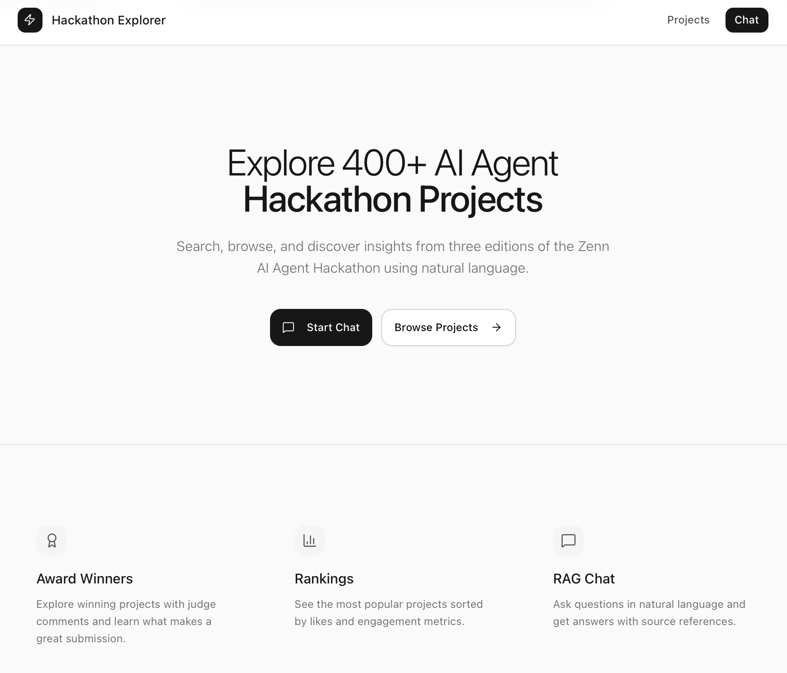
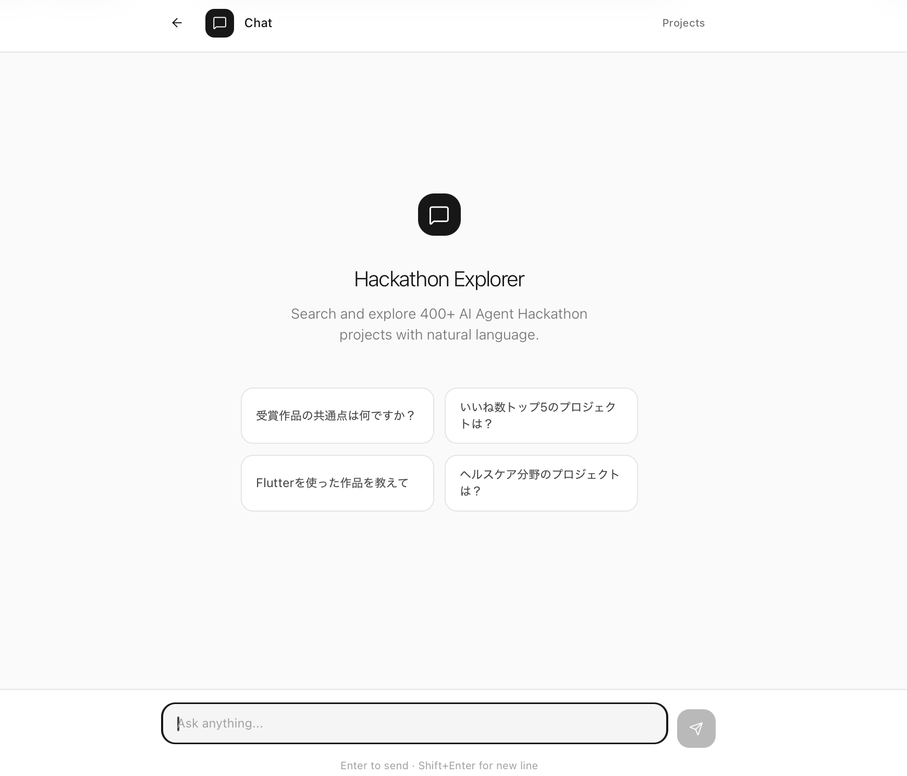

# Zenn AI Agent Hackathon (1〜3) 作品の検索システム

<div align="center">



**MCP Server + Agentic RAG Chat Web UI**


</div>

## これは何？

過去3回の Zenn AI Agent Hackathon（[第1回](https://zenn.dev/hackathons/2024-google-cloud-japan-ai-hackathon) / [第2回](https://zenn.dev/hackathons/google-cloud-japan-ai-hackathon-vol2) / [第3回](https://zenn.dev/hackathons/google-cloud-japan-ai-hackathon-vol3)）に投稿された **393作品** を横断検索・分析できるシステムです。

> ※ 非公式の学習・研究用プロジェクトです

<div align="center">

</div>

**こんな質問に答えられます：**

- 「RAG を使った受賞作品を教えて」
- 「Flutter × Gemini の組み合わせで作られたプロジェクトは？」
- 「いいね数トップ10は？」
- 「ヘルスケア分野の作品を探して」

**2つの使い方：**

| 使い方 | 説明 |
|--------|------|
| **Web UI** | ブラウザから RAG Chat で自然言語で質問 |
| **MCP Server** | Claude Desktop 等から直接検索・分析 |

| 機能 | 説明 |
|------|------|
| **Agentic RAG チャット** | LangGraph ベースのマルチターン検索で回答を生成 |
| **MCP サーバー** | Claude Desktop 等から直接アクセス可能 |
| **プロジェクト検索** | キーワード・届次でフィルタリング |
| **全文検索** | 記事本文から技術名などを検索 |
| **ランキング表示** | いいね数・ブックマーク数順のリーダーボード |
| **受賞作品閲覧** | 審査員コメント付きの受賞作品一覧 |

## 技術スタック

| カテゴリ | 技術 |
|---------|------|
| Backend | FastAPI, SQLite, ChromaDB, LangChain, LangGraph |
| Frontend | Next.js 15, shadcn/ui, Tailwind CSS |
| AI | OpenAI / Azure OpenAI |
| MCP | FastMCP 2.x |

## クイックスタート

### 1. 環境設定

```bash
git clone https://github.com/yh00722/zenn-hackathon-search
cd zenn-hackathon-search

cp .env.example .env
# .env に OpenAI または Azure OpenAI の認証情報を設定
```

### 2. 初回セットアップ（データベース構築）

> **Note:** 初回のみ必要です。ベクトルインデックス構築には OpenAI API が必要です。

```bash
cd backend
uv sync

# 1. CSV データを SQLite にインポート
uv run python -m services.importer

# 2. ChromaDB にベクトルインデックスを構築
uv run python -c "
from services.rag import get_rag_service
rag = get_rag_service()
rag.index_summaries()   # 要約インデックス（プロジェクト探索用）
rag.index_projects()    # 本文チャンクインデックス（詳細検索用）
"
```

### 3. サーバー起動

```bash
# バックエンド（ターミナル1）
cd backend
uv run uvicorn main:app --reload

# フロントエンド（ターミナル2）
cd frontend
npm install
npm run dev
```

**http://localhost:3000** にアクセス

---

## MCP Server

Claude Desktop 等から利用可能な MCP サーバーを提供しています。

### 設定ファイルの場所

- **macOS**: `~/Library/Application Support/Claude/claude_desktop_config.json`
- **Windows**: `%APPDATA%\Claude\claude_desktop_config.json`

### OpenAI を使用する場合

```json
{
  "mcpServers": {
    "zenn-hackathon": {
      "command": "/opt/homebrew/bin/uv",
      "args": [
        "run",
        "--directory", "/path/to/zenn-hackathon-search/backend",
        "python", "-m", "mcp_server.server"
      ],
      "env": {
        "OPENAI_PROVIDER": "openai",
        "OPENAI_API_KEY": "sk-your-openai-api-key",
        "OPENAI_CHAT_MODEL": "gpt-5",
        "OPENAI_EMBEDDING_MODEL": "text-embedding-3-large"
      }
    }
  }
}
```

### Azure OpenAI を使用する場合

```json
{
  "mcpServers": {
    "zenn-hackathon": {
      "command": "/opt/homebrew/bin/uv",
      "args": [
        "run",
        "--directory", "/path/to/zenn-hackathon-search/backend",
        "python", "-m", "mcp_server.server"
      ],
      "env": {
        "OPENAI_PROVIDER": "azure",
        "AZURE_OPENAI_API_KEY": "your-api-key",
        "AZURE_OPENAI_ENDPOINT": "https://your-resource.openai.azure.com/",
        "AZURE_OPENAI_API_VERSION": "2024-12-01-preview",
        "AZURE_CHAT_DEPLOYMENT": "gpt-5",
        "AZURE_EMBEDDING_DEPLOYMENT": "text-embedding-3-large"
      }
    }
  }
}
```

### 設定のカスタマイズ

1. `command`: uv のフルパスに変更（`which uv` で確認）
2. `--directory`: 実際のプロジェクトパスに変更
3. `env`: API 認証情報を設定
4. Claude Desktop を再起動


### 利用可能なツール（15種類）

#### 基本ツール（11種類）

| ツール | 説明 |
|--------|------|
| `search_projects` | キーワード検索 |
| `search_content` | 記事全文検索 |
| `get_winners` | 受賞作品一覧 |
| `get_leaderboard` | いいねランキング |
| `get_bookmarks_ranking` | ブックマークランキング |
| `get_project` | プロジェクト詳細（ID指定） |
| `get_project_by_name` | プロジェクト詳細（名前検索） |
| `get_statistics` | 統計情報 |
| `get_award_comments` | 審査員コメント一覧 |
| `get_all_tags` | 全タグ一覧（728種類） |
| `analyze_tech_stacks` | 技術トレンド分析 |

#### 高度なツール（4種類・API 設定が必要）

| ツール | 説明 |
|--------|------|
| `agentic_query` | マルチターン Agentic RAG |
| `semantic_search_summary` | 要約ベクトル検索 |
| `semantic_search_content` | 本文チャンク検索 |
| `text_to_sql` | 自然言語 → SQL 生成・実行 |

---

## API エンドポイント

| メソッド | パス | 説明 |
|---------|------|------|
| POST | `/api/chat` | Agentic RAG 問答 |
| POST | `/api/chat/stream` | ストリーミング応答 |
| GET | `/api/projects` | プロジェクト一覧 |
| GET | `/api/search?q=` | 検索 |
| GET | `/api/stats` | 統計情報 |

---

## データ情報

| 項目 | 件数 |
|------|------|
| **総プロジェクト数** | 393件 |
| 第1回 | 128件 |
| 第2回 | 158件 |
| 第3回 | 107件 |
| 受賞作品 | 23件 |

---

## ライセンス

MIT
