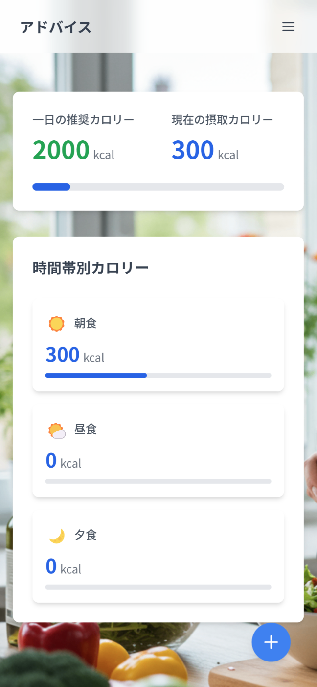
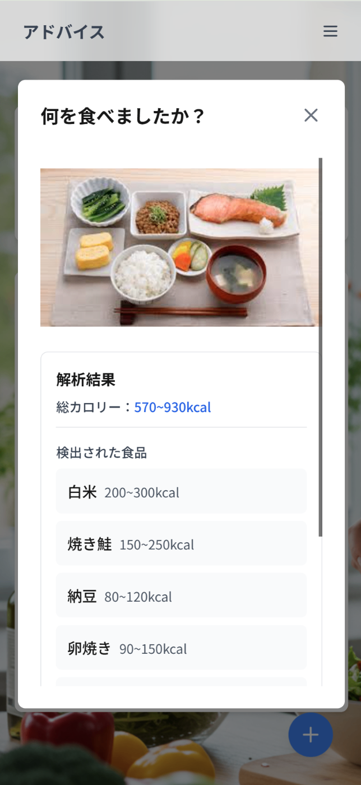
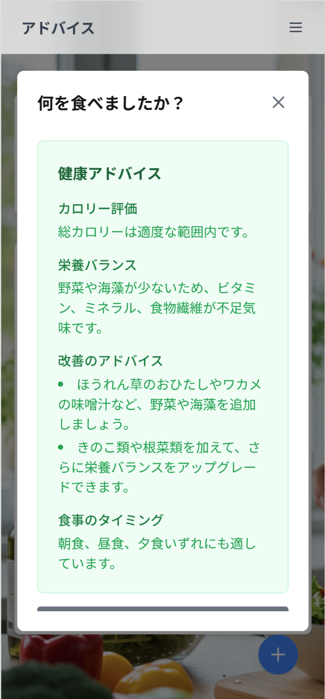
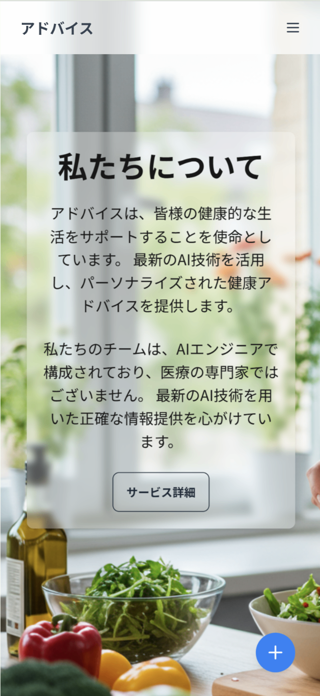
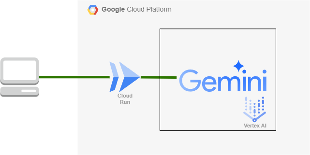

#  食事アドバイスAI「アドバイス」

##  はじめに

!

既製品のカロリーアプリや食事管理アプリを続けることができなかった、そんな過去の自分へこのアプリケーションを送ります。  
そして、一緒にハッカソンに参加して開発を行ってくれたチームのみんなに特大のリスペクトを送ります。

* * *

##  「アドバイス」とは？

  * 食事の写真からおおよそのカロリーを推定して食事のアドバイスを提供するAIアプリです

###  主な機能

  * 食事画像のアップロード
  * カロリー推定
  * 食事アドバイス

###  機能ごとの画面

TOP | Calorie | Advice | About  
---|---|---|---  
 |  |  |   
  
##  ターゲットユーザーと課題

###  ターゲットユーザー

  * 毎日の食事管理を始めたい初心者の方
  * 正確なカロリーと向き合いたくない方
  * 詳細なカロリー計算に時間をかけたくない忙しい方
  * 栄養バランスについて簡単なアドバイスが欲しい方

###  解決したい課題

  * 偏った食生活による生活習慣病
  * 既存のアプリが複雑すぎて使いこなせない
  * 詳細なカロリー計算が面倒で続かない

###  課題へのソリューション

  1. 簡単な入力方法

     * 写真を撮るだけの直感的な操作
     * 手動でのデータ入力を最小限に
  2. 手軽なカロリー管理

     * 高精度よりも使いやすさを重視
     * おおよその数値で十分な方向け
  3. わかりやすいアドバイス

     * AIによる個別化された食事アドバイス
     * 専門的すぎない、実践的なアドバイス
  4. シンプルかつ直感的なUI

     * 簡単にいつでも利用できるようにスマートフォンライクな直感的UI

###  既存のカロリー計算サービスとの差別化

項目 | 既存のカロリー計算アプリ | 「アドバイス」  
---|---|---  
カロリー計算の精度 | 高精度（手動入力が必要） | 低精度（手軽さ重視）  
入力方法 | 料理名の手動入力、詳細なデータ入力、料理の選択、バーコードの読み取り | 写真をアップロードするだけ  
利用対象 | 健康管理にこだわる人、詳細なデータがほしい人 | 大まかにカロリーを知りたい人、手軽に管理したい人  
ユースケース | ダイエット、栄養管理が重要な場面 | 毎日の食事管理を簡単に行いたい  
  
* * *

##  技術構成

###  使用技術

  * フロントエンド: Next.js 15（App Router）
  * ホスティング: Cloud Run

###  （予定）使用したい技術

  * ユーザー認証：Firebase（Google認証）
  * データ管理: Firebase Firestore（ユーザーの食事履歴）

###  GoogleのAIサービス

サービス | 役割  
---|---  
Gemini API in Vertex AI | 画像とプロンプトを組み合わせたカロリー推定  
Gemini API in Vertex AI | 食事アドバイスの生成  
  
###  Googleのコンピューティングサービス

サービス | 役割  
---|---  
Cloud Run | アプリケーションのホスト  
  
* * *

##  使い方

1.右下の「＋」ボタンをタップ（またはクリック）  
2\. 食事の写真をアップロード  
3\. おおよそのカロリーを取得  
4\. 栄養バランスのアドバイスを受け取る

* * *

##  システム アーキテクチャ図

  * 本アプリケーションは、コンピューティングサービスにCloud Run、AIサービスにVertex AIのGemini APIを使用し、シンプルながら拡張性の高いアーキテクチャを採用しています

* * *

##  デモ動画

<https://www.youtube.com/watch?v=MHg2L8E7QVQ>

* * *

##  今後のアップデートでやっていきたいこと

  * 画像解析をVisionAIで行うことにより食事の解析精度を向上する
  * アドバイスを音声出力する
  * SNS連携 
    * ソーシャルログイン
    * InstagramやXの投稿時に合わせてカロリーが計算できる
    * 食事記録のシェア
  * レシピ提案機能の追加

##  Thanks

AI Agent Hackathon with Google Cloud の開催に携わるすべての皆様に感謝申し上げます。  
初めてGCPに触れる良いきっかけになりました。  
今後は、今回触れなかったサービスも積極的に活用していきます。

前々から参加したかったハッカソンという取り組みに参加して一つアプリケーションをホストできたことで1エンジニアとして自信をもつことができました。  
改めて貴重な場をご提供くださりありがとうございました！

<https://zenn.dev/hackathons/2024-google-cloud-japan-ai-hackathon>
