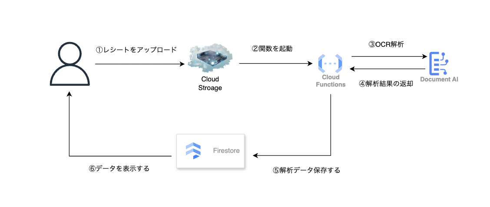
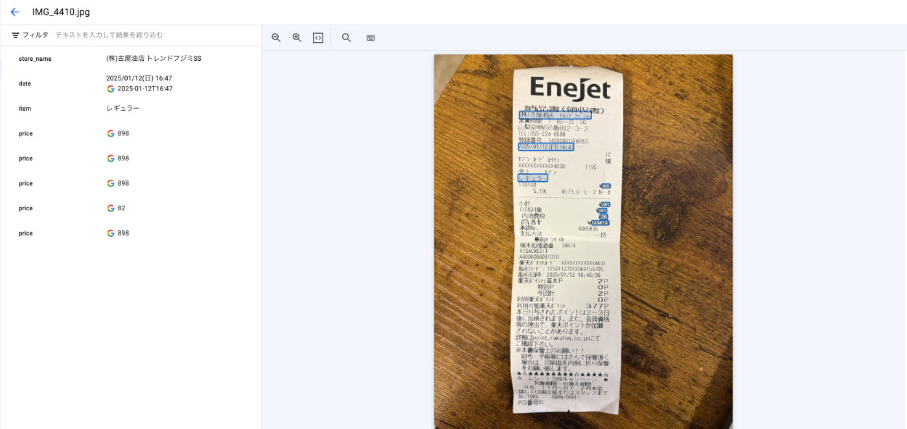

##  はじめに

これは [AI Agent Hackathon with Google Cloud](https://zenn.dev/hackathons/2024-google-cloud-japan-ai-hackathon) の応募記事です。  
今回、私と友人で **AIがレシートレシート仕分けしてくれるサービス** を作成しました。

本ツールは、**Google CloudのDocument AIを活用してレシートを解析し、私費と経費を分類できる機能** を提供します。

##  開発に至った経緯（解決したい課題）

私の妻は個人で活動しており、月末には経費管理を行っています。  
しかし、その作業には毎月多くの時間が取られている様子を見ていました。

特に時間がかかるのが、**日々の買い物の中で、私費と経費を手動で仕分けする作業** です。  
この作業では以下のような課題を抱えていました。

###  課題点

  1. **レシートを一枚ずつ見ながら、私費と経費を仕分けるのが面倒**
  2. **手入力のため、時間がかかる上に、ヒューマンエラーが発生しやすい**
  3. **領収書をアナログ管理していると、紛失のリスクがある**
  4. **データがデジタル化されていないため、家計管理ツールと連携しづらい**

このような課題を解決するために、**レシートを自動解析し、私費と経費を分類するツール** を開発しました。  
AIを活用することで、**手間を減らし、作業時間を短縮** できる仕組みを作ることが目標です。

##  本サービスの対象ユーザー

  * **妻（経費管理をする個人事業主）**
  * **個人事業主やフリーランスで経費管理が面倒な方**

##  作成したツールの概要

本サービスは、**Google Cloud Document AI を活用してレシートを解析** し、**ユーザーが経費と私費を分類できるUI** を提供します。

###  主な機能

  1. **レシートの画像をアップロード（スマホ・PC対応）**
     * サポートフォーマット：PDF, JPEG, JPG, PNG, BMP, TIFF, TIF, GIF
  2. **Google Cloud Document AI を使ったレシート情報の自動読み取り**
  3. **商品ごとに経費 or 私費を分類（手動チェック）**
  4. **過去の分類データを学習し、次回以降の分類を最適化**
  5. **経費と私費の合計を計算**
  6. **履歴管理**
  7. **クラウド上でデータ管理し、レシートの紛失リスクを軽減**

##  システムアーキテクチャ

###  技術スタック

技術 | 用途  
---|---  
**Google Cloud Storage** | レシート画像の保存  
**Google Cloud Document AI** | レシートのOCR解析  
**Cloud Functions (Node.js)** | Document AI との連携 & データ処理  
**Firestore** | 解析結果の管理 & フロントエンド連携  
**React + TypeScript** | フロントエンド開発  
  
##  各使用技術の説明

###  1\. フロントエンド（React + TypeScript）

  * ユーザーがレシートをアップロードし、分類を行うUIを提供
  * Firestore からリアルタイムで分類結果を取得

###  2\. バックエンド（Cloud Functions + Node.js）

  * Cloud Storage にレシート画像がアップロードされたらトリガー発火
  * Document AI へレシート画像を送信し、解析結果を取得
  * Firestore に解析結果を保存

トリガー設定

文字数制限の兼ね合いで一部省略しております。

node.js
    
    
    // 〜省略〜
    
    const storage = new Storage();
    const documentAIClient = new DocumentProcessorServiceClient();
    const firestore = new Firestore();
    
    functions.cloudEvent('helloGCS', async (cloudEvent) => {
      console.log(`Event ID: ${cloudEvent.id}`);
      console.log(`Event Type: ${cloudEvent.type}`);
    
      const file = cloudEvent.data;
      console.log(`Bucket: ${file.bucket}`);
      console.log(`File: ${file.name}`);
    
      // 〜省略〜
    
      const filePath = `gs://${file.bucket}/${file.name}`;
      console.log(`Processing file from ${filePath}`);
    
      try {
        // Document AI処理
        const request = {
          name: 'projects/YOUR_PROJECT_ID/locations/us/processors/YOUR_PROCESSOR_ID',
          rawDocument: {
            content: await storage
              .bucket(file.bucket)
              .file(file.name)
              .download()
              .then(data => data[0].toString('base64')),
            mimeType: SUPPORTED_FORMATS[extension]
          }
        };
        const [result] = await documentAIClient.processDocument(request);
        const document = result.document;
    
        // OCR結果の解析と整形
        const analysisResult = {
          fullText: document.text,
          entities: document.entities?.map(entity => ({
            type: entity.type,
            value: entity.mentionText,
            confidence: entity.confidence
          })) || [],
          metadata: {
            processedAt: new Date().toISOString(),
            originalFile: {
              name: file.name,
              bucket: file.bucket,
              path: filePath
            }
          }
        };
    
        // レシートデータの構造化
        const receiptData = {
          rawText: document.text,
          store: document.entities?.find(e => e.type === 'merchant')?.mentionText || '不明',
          amount: parseFloat(document.entities?.find(e => e.type === 'amount')?.mentionText || '0'),
          date: new Date(),
          items: document.entities
            ?.filter(e => e.type === 'line_item')
            .map(item => ({
              name: item.mentionText,
              price: 0,
              quantity: 1
            })) || [],
          status: 'processed',
          createdAt: new Date(),
          updatedAt: new Date(),
          originalFile: {
            name: file.name,
            bucket: file.bucket,
            path: filePath
          },
          ocrResult: analysisResult
        };
    
        // Firestoreにデータを保存
        try {
          const receiptRef = firestore.collection('YOUR_COLLECTION_NAME').doc();
          await receiptRef.set(receiptData);
          console.log(`Receipt data saved to Firestore with ID: ${receiptRef.id}`);
    
          // 〜省略〜
    
    
        } catch (firestoreError) {
          console.error('Error saving to Firestore:', firestoreError);
          // Firestoreへの保存に失敗しても、OCR結果は返す
          return {
            success: false,
            error: 'Failed to save to database',
            data: analysisResult
          };
        }
    });
    

###  3\. Google Cloud Document AI

  * レシート内の商品情報・金額・日付などを抽出
  * 文字認識の精度が高く、手書き文字の解析も可能

下記画像は、Document AIを使用してレシートをOCR解析した結果を示しています。  
  
特定の項目（例えば購入金額や日付）を自動で抽出する精度は高く、手作業での入力作業を大幅に削減できます。一部誤認識の改善は必要ですが、現段階でも十分に実用レベルといえます。

###  4\. Firestore

  * 解析結果をリアルタイム管理
  * フロントエンドがデータを即時取得し、表示できる

##  使い方（UIフロー）

  1. **レシート画像をアップロード**
     * スマホやPCで撮影したレシートをアップロード
  2. **OCR解析**
     * AIが商品名・金額・日付を抽出
  3. **分類**
     * AIが過去のデータをもとに私費・経費を分類（ユーザーが手動修正可能）
  4. **合計計算**
     * 経費の合計と私費の合計を自動計算
  5. **履歴管理**
     * 分類結果を保存する。

##  実際に触ってみる

<https://youtu.be/YAwM18_N0z0>

##  今後の課題と改善点

###  1\. 自動分類の精度向上

商品名の曖昧さやコンテキスト理解が課題。  
→ 追加データを学習させ、さらなる精度向上を目指す。

###  2\. 他ツールとの連携

データのエクスポート機能を追加し、クラウド会計ソフト（freee・マネーフォワード）との連携を実現したい。

##  まとめ

人生初のハッカソンということもあり、最初は何も分からない状態からのスタートでしたが、無事に完走することができました。

今後は、

  * **自動分類の精度向上**
  * **データのパーソナライズ化**
  * **他ツールとの連携**

などを進め、さらに実用的なサービスへ進化させていきたいと思います。

→ **家族時間を捻出するために、このサービスを運用していきます！**

##  参考文献

  * [Cloud Functions ドキュメント](https://cloud.google.com/functions/docs?hl=ja)
  * [Cloud Storage ドキュメント](https://cloud.google.com/storage?hl=ja)
  * [Document AI ドキュメント](https://cloud.google.com/document-ai?hl=ja)
  * [Cloud Firestore ドキュメント](https://cloud.google.com/firestore?hl=ja)

