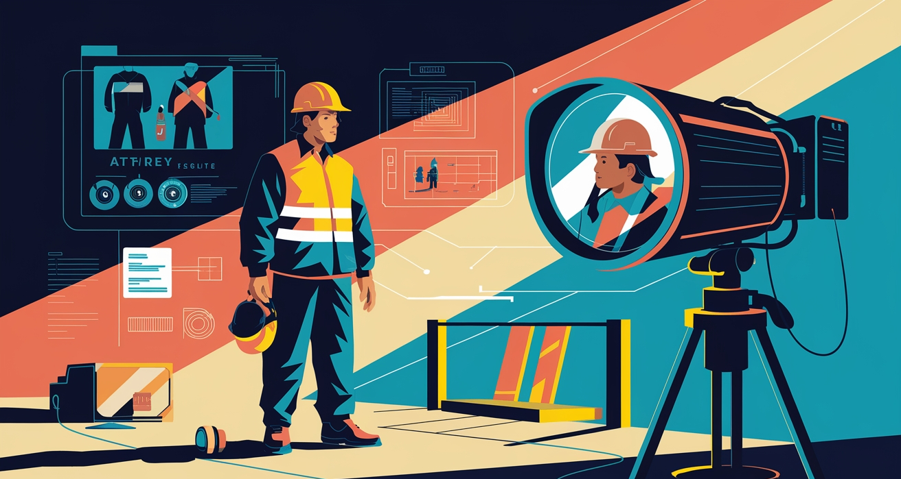
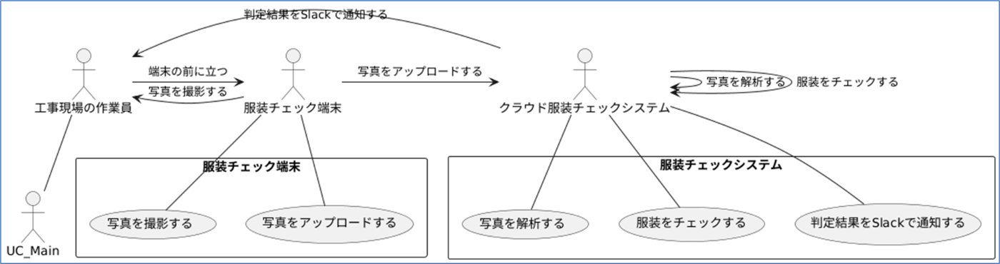
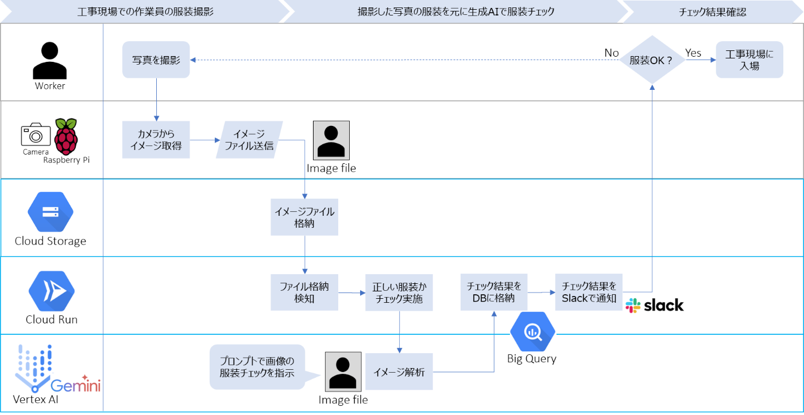
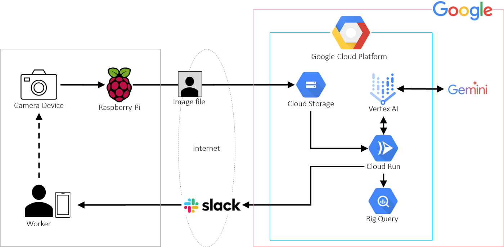
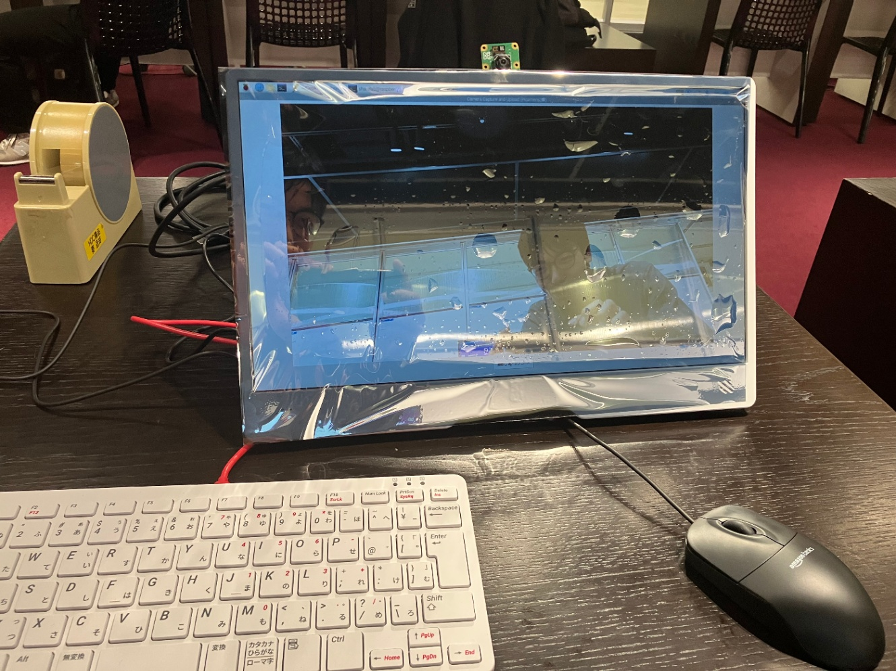

##  1\. はじめに

建設現場における労働災害は、墜落・転落や資材落下など、長年にわたる社会問題です。厚生労働省の統計でも**建設業の死亡・負傷事故は他業種に比べて依然として高い** 状況であり、少子高齢化による労働力不足の中で「安全管理の徹底」はますます重要度を増しています。  
<https://www.mhlw.go.jp/bunya/roudoukijun/anzeneisei11/rousai-hassei/index.html>  
一方、AI技術はここ数年で**画像や動画などのマルチモーダル分析** にまで進化を遂げ、最新の研究や実用事例からは、従来の目視や事後対応による安全管理を大幅に超える事故低減効果が報告されています。たとえば、マッキンゼーがまとめたデータによると、AIを導入することで建設現場の事故発生率を最大30%削減できた事例が確認されています。また、同時にAI導入によるコスト削減や生産性向上といった経済的メリットがあることも明らかとなっています。  
<https://hyscaler.com/insights/impact-of-ai-on-construction-safety/>  
本記事では、こうしたAI技術の新潮流と建設現場安全管理の課題解決を結びつけるために取り組んだ成果を紹介します。実装の中心は生成AI（Geminiモデル）による作業員の服装チェックですが、これは単なる事例の一つに過ぎず、今後は広範な安全管理・点検分野に応用できる可能性を秘めていると考えています。

##  2\. 課題・背景・ユーザ像

建設現場ではヘルメットや安全帯未装着が重大事故の要因になります。しかし、従来の目視チェックには漏れやヒューマンエラーが多いです。そこでGeminiモデルを用いたリアルタイム画像解析で装着状態を自動判定し、Slack連携で即通知する仕組みを構築し現場担当者の負担を軽減を検討しました。一方で米国Smartvid.io事例では50%事故削減を実現していることを調査で把握しています。この施策では、Raspberry Piで手軽に小規模導入し、鏡型カメラなどの工夫で漏れを最小化する試みを進めていきます。

なお、安全管理の徹底により下記ユーザ像に対してメリットがあると考えています。

  * 労働者: 作業現場の安全性が高まることで、ケガや事故のリスクが低減し、安心して働ける環境が整う。これにより、作業員の定着率が向上し、長期的なキャリア形成が可能となる。
  * 経営者：労働災害の減少は、事故対応や補償にかかるコストの低減につながり、経営リスクの軽減にも寄与する。また、安全管理の強化は企業のブランド力向上にも結びつき、優秀な人材の確保にもプラスの影響を与える。

さらに、医療費や補償費用といった社会的コストが削減され、公共資源の有効活用が促進される社会的メリットもあります。また、安全な労働環境が確保されることで、建築業界全体の信頼性やイメージ向上にも寄与するといったメリットもあると考えています。

##  3\. 課題へのソリューションと特徴

建設現場での安全管理の一環として、作業員の服装を撮影し、AIを使用してリアルタイムで服装チェックを行う仕組みを検討しました。  
名付けて**Safety Eye** ！✨

###  3.1. ユースケース

作業員が現場に入る前に服装の適合性を証明するため、以下のような流れでシステムを構築します。この取り組みは、以下の5つの主要なステップで構成されています。

  * 写真撮影  
作業員が現場入場前に、規定に適した服装であるかを証明するための写真撮影
  * 画像送信  
撮影された画像を、ネット越しにクラウドストレージへ送信
  * 服装チェック  
保存された画像に対して、生成AIが画像解析を行い、服装が基準に沿っているかを判定
  * 結果通知  
チェック結果をデータベースに保存し、Slackなどのコミュニケーションツールを使って担当者に通知
  * 入場許可  
チェック結果に応じて、作業員の現場入場が許可される  
  
_ユースケース図_

##  4\. システム全体の流れ

各ステップをシステムでどのように実現するかを示します。

###  4.1 写真撮影

作業員は、現場に入る前に自身の服装が安全規定に沿っているかどうかを記録するために、専用のカメラで写真を撮影します。

  * 使用機材  
Raspberry Piに接続されたカメラが使用されます。

###  4.2 画像送信

撮影された画像は、Raspberry Piから直接、Google Cloud PlatformのCloud Storageへと送信されます。

###  4.3 服装チェック

Cloud Storageに格納された画像ファイルは、Cloud Run上でトリガーされるPythonプログラムによって処理され、服装のチェックが行われます。この工程は、以下のような詳細な流れで進行します。

####  4.3.1. CloudEventの受信とファイルのダウンロード

  * Cloud Storageへの画像アップロードをトリガーとして、Cloud FunctionsがCloudEventオブジェクトを受信します。
  * そのオブジェクトから、バケット名やファイル名を取得し、画像ファイルを一時ディレクトリにダウンロードします。

####  4.3.2. Vertex AIの初期化とGeminiモデルのロード

  * プロジェクトIDやリージョンを指定してVertex AIを初期化し、Gemini 2.0 Flashモデルをロードします。

####  4.3.3. 画像ファイルの読み込みとプロンプトの作成

  * ダウンロードした画像を読み込み、Geminiモデルへ渡すためのPartオブジェクトを生成。
  * 服装チェックに必要な指示を盛り込んだプロンプトを作成します。  
チェック項目は、ヘルメット、髪型、作業着、安全ベストで、出力フォーマットはYES/NO/UNCERTAINです。

####  4.3.4. Geminiモデルによる分析と結果のパース

  * 作成したプロンプトと画像をGeminiモデルに渡し、解析を実行。
  * 返ってくるテキスト形式の出力をパースし、各項目の結果をJSON形式でまとめます。

###  4.4. 結果通知

####  4.4.1. BigQueryへの書き込み

  * 解析結果は、ファイル名と各チェック項目の結果とともに、BigQueryのテーブルに書き込まれます。

####  4.4.2. Slack通知の送信

  * すべてのチェック項目がOKの場合は、作業員の服装が規定に適合していると判断し、その旨をSlackへ通知します。
  * ひとつでもNOの項目がある場合は、再チェックが必要な旨をSlackへ通知します。

###  4.5 入場許可

Slackを通じて通知された服装チェックの結果がOKであれば、作業員は安心して工事現場に入場することが可能です。逆に、基準に達していない場合は、入場が許可されず、必要な対策が講じられます。  
  
_システムフロー図_

##  5\. 利用技術とそのポイント

このシステムは、以下の各種技術やサービスを組み合わせることで実現しています。  
  
_システムアーキテクチャ図_

###  5.1 Raspberry Piとカメラ

  * 概要  
小型ながら柔軟性の高いRaspberry Piは、現場での撮影に最適なハードウェアです。  
カメラとの連携により、手軽に画像を取得できるのが特徴です。

###  5.2 Google Cloud Platform上の各種サービス

GCPの各サービスは、本システムのバックエンド処理を支える重要な要素です。  
以下のサービスが連携して動作しています。

  * Cloud Storage  
撮影された画像データをRaspberry Piからアップロードして、保管するために利用。
  * Cloud Run  
サーバーレス環境で、Pythonプログラムをトリガーし、画像解析処理を実行。画像をどう解析してどう回答するかはプロンプトで制御しており、個別の要件に合わせて柔軟に対応が可能。
  * Vertex AI  
Gemini 2.0 Flashモデルをはじめとする生成AIの実行基盤として利用。Cloud RunのソースコードとVertex AIで使う言語モデルを疎結合にしており、業務の特性や最新の言語モデルの動向に合わせて柔軟に切り替えることができる。
  * BigQuery  
解析結果やチェック情報を大規模に保存・管理し、後続の処理や分析に活用。
  * Slack  
リアルタイムな通知システムとして、現場担当者とのコミュニケーションを円滑にするために使用。

これらのサービスがうまく活用し、シームレスに連携させることで、今回の仕組みが短期間に構築できました。

##  6\. 施策の有効性

当施策の費用対効果を現時点で正確に算出することが難しいですが、調査から見えた事例ベースで考えていきます。

###  6.1 事故削減効果

  * マッキンゼーの調査によれば、予測モデルを活用することで事故発生率を最大30%削減可能
  * 同様に、デロイトの分析ではAIによる予測分析で事故件数が最大25%低減
  * さらにSmartvid.io等の導入事例で最大50%の事故削減報告

###  6.2 本施策の初期費用、ランニング費用

実際の建設業に導入する場合、システムの保守性や拡張性、完全性など考慮するべきポイントがあり当施策の初期費用、ランニング費用がそのままとはならないことは重々承知しています。ただ、今回の試作では2万円程度のRaspberry Pi と数千円のWebカメラ、月額多く見込んでも数万円のGoogle Cloud Platformで実現できている点、かなりリーズナブルな導入と運用が可能ではと考えています。

###  6.3 費用対効果（ROI）の高さ

全米安全協議会（NSC）は、労災1件あたりの負傷コストは平均4万2千ドル（約600万円）と試算。AI活用で労災を減らせば大幅なコストカットと初期費用、ランニング費用の回収が十分可能ではと考えています。

##  7\. デモ動画

<https://youtu.be/QaxAvXhWHso>

###  作成物

##  8\. 今後の展望や応用例

本システムの中心となるのは、生成AIによる画像解析です。  
Geminiモデルは、与えられたプロンプトに従い、画像内の各チェック項目を素早く解析します。  
この特徴を踏まえた今後の展望や応用例を示します。

###  8.1. 今後の展望

  * Google AI Studioで試せるStream Realtimeを使ったよりリアルタイムでシームレスなやり取りをAIとできる仕組み
  * 服装に関する安全基準の遵守状況のチェック
  * 画像から読み取るべき項目の抽出とJSON形式での結果出力  
応用可能性としては、以下のようなシナリオが考えられます。

###  8.2. 安全教育のシミュレーション

現場映像を基にAIが危険箇所を自動抽出し、リアルな教育コンテンツを生成。**より具体的なヒヤリハット事例** の学習が可能。

###  8.3. 設備点検の自動化

建設機材や足場などの劣化を画像解析で早期発見し、**予防保全** を強化。生産性向上と稼働停止リスクの低減に貢献。

###  8.4. 作業効率の最適化

ドローンや360度カメラ映像を活用して、**作業動線や動きの無駄** を可視化。安全＋効率両面の最適化が期待できる。

これらはいずれも、調査結果でも強調されている**AI導入の事故削減効果・コストメリット** と親和性が高い分野です。服装チェックを入り口に、建設現場全体の高度化を進めることで、**安全と生産性を両立させる次世代の管理モデル** を目指せると考えています。

##  9\. 体制

下記4名のメンバーで推進しました。  
Masaki Kudo <https://zenn.dev/masaki910>  
マッサン <https://zenn.dev/myoshida2>  
Yasunari Ichimura <https://zenn.dev/ichimura_tochan>  
Yukita Hiroki <https://zenn.dev/hiroki_yukita>

##  10\. まとめ

今回の取り組みでは、建設現場での安全管理という社会的に重要な課題に対して、生成AI（Geminiモデル）による画像解析技術とクラウド基盤を組み合わせたソリューションを検討・試作しました。Raspberry Piとカメラを用いた手軽な実装から、Google Cloud Platform上でのサーバーレスアーキテクチャ、そしてSlack連携までを短期間で構築し、リアルタイムに近い形で服装のチェックが行える仕組みをめざしています。  
また、近未来的なミラー型カメラ設置のアイデアにチャレンジしようとするなど、チーム全員で発想を広げながら短期間で試行錯誤を重ねました。今後は安全管理以外のユースケース（設備点検や安全教育コンテンツの自動生成、さらには作業効率化など）にも応用可能と考えています。

最後に、「**Done is better than perfect** 」を合言葉に、チーム全員でアイデアを広げながら短期集中で仕上げられた点も本取り組みの大きな成果と考えています。  
私含めたメンバーの皆さん、本当にお疲れ様でした！！！
