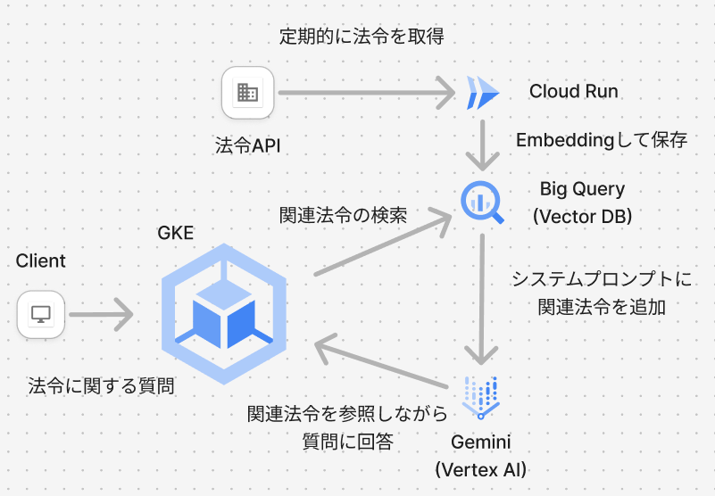

#  はじめに

今回は、AI Agent Hackathon with Google Cloudにおける成果物について紹介します。  
時間の都合上、全ての法令をEmbeddingしてDBに保存することが難しかったため以前から興味のあった個人情報保護法関連の法令だけデモとして実装しています。🙇‍♂️

  * ❌ 今回作成したRAGの信頼性は高くないため、LLMの回答はあくまでも参考程度にお願いします。
  * ❌ また、本アプリ上で行われるチャットに関しては全て平文でログが残るため、個人情報等の入力はお控えください。

#  概要

デジタル庁が管理している[法令API](https://laws.e-gov.go.jp/apitop/)というAPIが面白そうだったので、それに絡めたプロダクトとして法務に関する疑問に答えてくれるRAGシステムを開発しました。  
見た目は、OpenWebUIというOSSを利用しLLMにはGemini 1.5 Pro (VertexAI)、ベクトルデータベースにはBig Queryを使用しました。  
それに加えて前々から使ってみたかったGKEを利用してアプリケーションのデプロイ及び公開を行いました。  
開発中は、GSA, KSAの権限周りに苦戦してしまい、エントリーできないかと思いましたがギリギリ間に合わせられてよかったです。  
普段は自宅でインフラを管理しているため、故障などもつきものなのですが全く故障せずに動くGKEのkubernetesの素晴らしさを体感しました。  
特に、通信周りのエラーは全くなかったのは本当に快適でした！

#  対象ユーザー

  * 業務上個人情報に触れる機会がある人 (役所や多くの顧客を抱えるSaaS企業など)
  * 個人情報保護法について他者を指導する立場にある人
  * 自分が扱っている情報が個人情報に該当しないか不安な人

#  解決する課題

##  膨大な法令のどこに自分が知りたい情報があるのかわからないという課題

今回の成果物を信頼性の高いRAGとして活用することは難しいですが、自分の知りたい情報が法令のどこにあるのかあたりをつけることはできます。  
個人情報保護法関連だけでも下記のような複数の法令が存在します。

  * 情報公開・個人情報保護審査会設置法（平成十五年法律第六十号）
  * 個人情報の保護に関する法律（平成十五年法律第五十七号）
  * 情報公開・個人情報保護審査会設置法施行令（平成十五年政令第五百五十号）
  * 情報公開・個人情報保護審査会事務局組織規則（平成十七年内閣府令第二十七号）
  * 個人情報の保護に関する法律施行令（平成十五年政令第五百七号）
  * etc... (他596件)

その中のどの法令が自分に関係ありそうかあたりがつくというだけでもこの成果物に一定の価値があるのではないかと思います。  
実際、法律を調べようと思ってもまずどこから調べればいいのかわからないということも多いのではないでしょうか。  
このプロダクトは、開発初期段階ですがそのような課題の一部を解決することができます。  
さらに、今後の開発により信頼性の向上を目指すことは十分に可能であり、誰もが手軽に法律に触れられる社会の実現に貢献することが可能です。

#  成果物

##  エレベーターピッチ

「LegalPilot」は、最新のGoogle Cloud技術を駆使して、複雑で膨大な法令情報―特に個人情報保護法関連―を迅速に検索・要約する新感覚の法務支援ツールです。

本システムは、デジタル庁の法令APIから取得したデータをBigQueryのベクトル検索で精査し、Vertex AIのGemini 1.5 Proがユーザーの質問に対して適切な法令の参照や要点を提示。OpenWebUIを用いた直感的なチャットインターフェースと、GKEによる安定したデプロイ環境を実現し、法令の海から必要な情報を瞬時にピックアップすることで、法務担当者や個人情報取扱者の意思決定を強力にサポートします。

短期間でのプロトタイプ開発ながら、RAGの新たな可能性を実感させる本プロジェクトは、今後さらなる信頼性向上と実用化に向けた発展が期待される次世代法務ツールです。

##  法務RAG with Vertex AI

<https://github.com/AobaIwaki123/zenn-ai-hackason>

##  デモページ

<https://zenn-ai-hackason.shaoba.tech/>

#  技術スタック

  * フロント: [OpenWebUI](https://github.com/open-webui/open-webui)
  * LLMパイプライン: [OpenWebUI Pipeline](https://github.com/open-webui/pipelines)
  * ベクトルDB: Big Query
  * LLM: Gemini 1.5 Pro (VertexAI)
  * インフラ: GKE

フロントは、OpenWebUIを利用することで直感的な操作でRAGを利用することができるようにしました。  
そして、OpenWebUIにRAG用のパイプラインを統合するために、独自のPipelineを[実装](https://github.com/AobaIwaki123/zenn-ai-hackason)し、誰でも簡単にRAGをセルフホストできるようにしました。  
* 但し、Pipelineは任意のコードが実行可能なため、信頼できないPipelineを手元で実行しないように注意してください。  
独自Pipelineの実装は楽しかったですが、初見殺しや権限周りのエラーが多発し提出できないのではないかと肝を冷やしました。

#  アーキテクチャ

全体的なアーキテクチャは、以下のようになっております。

  1. Clientが質問を送信
  2. 質問に関連する法令をBig Queryからベクトル検索 (cos類似度)でいくつか取得する
  3. 取得した法令をシステムプロンプトに統合し、GeminiにClientからの質問を送信
  4. 出典を明記しながらClientの質問に回答

開発段階では、最新の法令を自動的に取得するためのCloud Runを別途用意する予定でした。  
しかし、法令APIを叩いて、Big Queryに流し込むという処理が想像以上に長い (単純計算で数日かかる)ことが判明したため、一旦手元のnotebookで個人情報保護法関連の法令だけをBig Queryに流し込むという対応をとり、Cloud Runの実装は見送りました。  
とはいえ実装としては、同様の処理をCloud Runに載せ替えるだけであり、処理にそれなりの時間とお金がかかるだけなため本質的には今回の成果物に関係ありません。

#  アピールポイント

  * 長大で難解な法令を適切に検索、要約しながら出典を明記して回答してくれる
  * 定期的にCloud Runを実行することにより、最新法令にも対応
  * ユーザーが知りたい情報がどの法令に含まれているのかあたりをつける手助けをしてくれる

#  デモ

デモの中で質問したことは、以下の3点です。

  1. 個人情報保護法について
  2. 改正点について
  3. マイナンバー制度の施行に伴う改正について

<https://youtu.be/ZzIcwhIf0nc?feature=shared>

デモにおいて、最初の方の条項ついては正しい出典が明記されており、RAGによるメリットが確認できました。

  * 個人情報の定義の明確化（個人情報保護法第2条関係）
  * 要配慮個人情報の定義の新設（個人情報保護法第2条第3項）

一方で、改正年と改正項目に関する情報や他の法令については、明らかな誤りあるいは出典が不確かなものが確認されました。

  * 個人番号を記録した電磁的記録媒体の盗難等の事態が発生した場合の報告義務（個人情報保護法第22条の2）
  * 苦情処理の実施（個人情報保護法第76条）
  * 個人情報保護委員会の設置（個人情報保護法第89条）

後ろの方の条項は総じて誤っていることから、法令全文をシステムプロンプトに入れたことによって長文の構造把握に失敗し、ハルシネーションが起きていると推察されます。  
このような問題を解決するためには、構造化した法令データをシステムプロンプトに入れたり、適度なサイズになるように要約したものをさらにシステムプロンプトに入れることが有効だと考えられます。

#  反省点

今回はアーキテクチャの構成やGKEの使い方、LLMの基本的な使い方などツールを使いこなすだけで精一杯でRAGの信頼性向上に時間を割けませんでした。  
特に文書取得周りはまだまだ改善の余地があり、今は法令全文をシステムプロンプトに入力しているため、LLMが文書の構造を捉えるのが難しくなっています。  
JSONのような構造化データに変換してLLMに渡したり、長い法令は別途要約するなどの工夫をすることができればより信頼性の高いRAGを構築できたのではないかと思います。

アーキテクチャ関連の反省は、今回DBにBig Queryを採用しベクトル検索を利用していますが、全文検索との差分があまり出せていないため、ベクトル検索のメリットを活かしきれていないと感じています。  
また、使用しているLLMもGeminiのみでアーキテクチャもシンプルなため通常のチャットbotとの差分があまり出せていない点もまだまだ改善の余地があると感じています。

#  より良いRAGを作るために

今回の開発を通じてRAG開発の基本やGKEやBig Query, Google Service AccountとKubernetes Service Accountによる権限管理など基本的なことを学ぶことができました。  
RAG開発周りで色々と調べ物をしていた際にGraphQLを用いたり、Web検索など複数のリソースを参照するアーキテクチャがあったり、最後の出力をValidateする層があったりと信頼性の高いRAGを構築するためのアイデアを多く見ることができました。  
今回は、基本実装だけで精一杯でしたが今後またRAGを開発する機会があれば最新手法を取り入れて実用に耐えるシステムにしたいと思います。

#  参考

  * [Ollama + Open WebUI でローカルLLMを手軽に楽しむ](https://zenn.dev/karaage0703/articles/c271ca65b91bdb)
  * [[Python] e-GOV法令APIから法令本文を取得する](https://qiita.com/Lisphilar/items/39ad23ac7ade21313911)
  * [BigQuery における、ベクトル検索とベクトルインデックス機能](https://zenn.dev/cloud_ace/articles/79cd78dcacfac5)
  * [OpenWeb UI Pipelineのサンプル実装](https://github.com/open-webui/pipelines/blob/main/examples/pipelines/providers/google_vertexai_manifold_pipeline.py)

