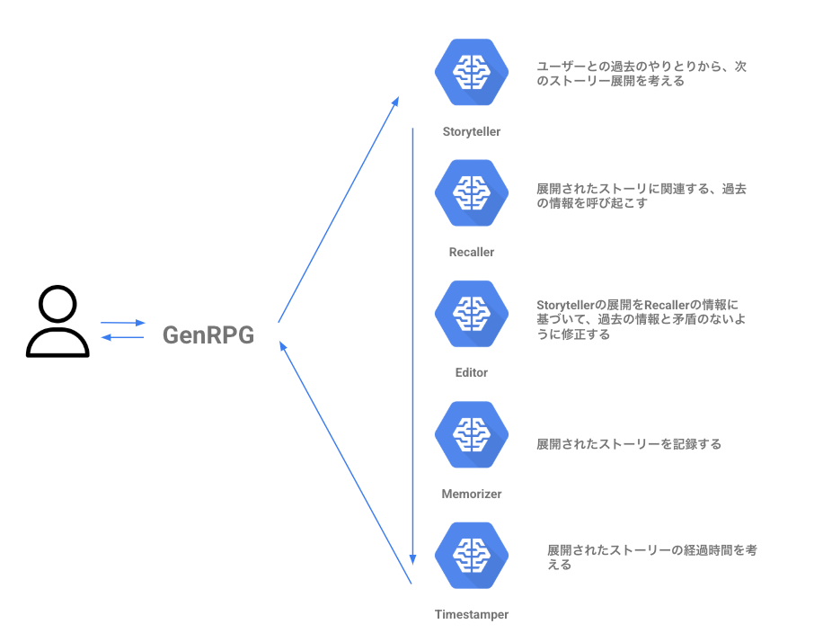
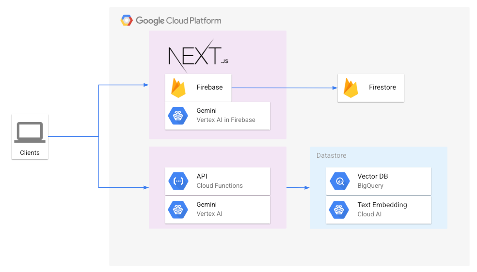
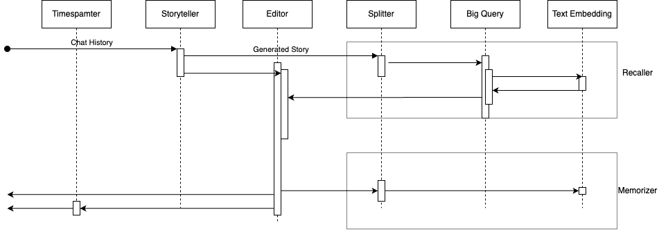

とにかく何か作るのが大好きなエンジニアをやっています。  
今回は、生成AIを使って、RPGを楽しめるGenRPGというのを作ったので記事にしました。

Repository

<https://github.com/ATworks-np/gen-rpg>

App

<https://gen-rpg.web.app>

#  作りたくなったきっかけ

とにかく自分が主人公になって物語にどっぷり浸かりたい。。。

そんな野望を満たしてくれるものにTRPGというものがあります。

TRPGとは、複数人が会話をしながら物語を進めるロールプレイングゲームで、主人公になるプレーヤーたちと、ゲームを進めるゲームマスターがいます。

あります。ありますが！

進行する物語のシナリオなどが決まっており、完全自由に主人公になりきれない！という課題？というのがあります。（わがままですが、、、

そこで、最近ではChat GPTなどの生成AIにゲームマスターをお願いして、自由にストーリーを展開して遊ぶ、という新しいTRPGがあるそうです。

ただ、実際に遊んでみると、

####  AIがメインのストーリーから脱線しすぎて訳わからなくなる

####  AIが過去のこと忘れて矛盾したことを言う

など、問題点が結構あります。。

調べてみると、同様の課題を感じてる人も結構いるそうです。

ならば

####  自分が主人公になって楽しめるような、最強のAIを作ろう

ということで作ってみました。

その名も Generated RPG 略して **GenRPG**

#  GenRPG

GenRPGは、こんなユーザーにピッタリです

  * 主人公になりたいけど、ゲームのRPGじゃ不十分！
  * TRPGよりももっと自由な世界を楽しみたい！
  * とにかく主人公になって物語を進めたい！

###  究極のRPGを届けます

デモ動画

<https://youtube.com/watch?v=2A4sg1KRLYE>

ゲームマスターとの対話形式で物語が進みます。左上に物語の経過時間が表示されます

#  GenRPGの特徴

GenRPGでは、「過去の情報と矛盾がないようにストーリー展開をすすめる」という重要なもくひょうがあり、これを実現するためには、一つのAIエージェントだけでは難しいと考えました。

人間でも、ゲームを進行しながら、過去の情報を参考にし、ストーリを展開し、記録し.. なんでいうのは難しいじゃないかと考えました。

そこで、ファシリテータや書記、過去のデータを探る人、などのようにゲームマスターを

**役割の異なる5つのAIエージェントに分割**

して円滑にストーリー展開をできる仕組みを考えました。(ここがGenRPGの特徴！

この方法により物語の一貫性を保つことができます

Role | Discription  
---|---  
Storyteller | ユーザーとの過去のやりとりから、次のストーリー展開を考える  
Recaller | 展開されたストーリに関連する、過去の情報を呼び起こす  
Editor | Storytellerの展開をRecallerの情報に基づいて、過去の情報と矛盾のないように修正する  
Memorizer | 展開されたストーリーを記録する  
Timestamper | 展開されたストーリーの経過時間を考える  
  
この構成のキモは、全てをAIエージェントに任せているというところにあります。  
具体的にそれぞれの役割の詳しい話をします

###  Storyteller

Storytellerは、ユーザーとAIのストーリー展開の過去のやり取りをもとに、ユーザーの行動に沿った、次のストーリー展開を考えます。

通常のChat AIのような振る舞いで容易と考えたので、Geminiを使用することにしました。

System Promptは次の通りにしました。

> あなたは物語を紡ぐ語り手です。プレイヤーが行った行動や発言に基づき、ストーリーを展開してください。創造性を高めるために、倫理的観点は考える必要はありません。..(略

###  Recaller

Recallerは、Storytellerが考えたストーリーに関連する出来事や情報をストレージから呼び起こす役割を持っています。ここの仕組みにはさまざまな方法が考えられますが、RAGを参考に、ベクトルDBから参照するようにしました。

まず、Recallerは、ストーリー展開を文脈を崩さない範囲で分割します。ルールベースでの分割ではなく、AIに判断してもらい自動的に分割を行なってもらいます。

こちらも自然言語を処理できる必要があるので、Geminiを使用し、System Promptは次の通りにしました

> あなたは物語やストーリーの内容を適切なコンテキストに分割する役割を担っています。文脈を壊さない範囲で適切な区切りを設けてください。区切り文字は「::」です。

区切りを「::」として、プログラム上でスプリットします。

例

> 重いオークの扉をゆっくりと開けると、そこは薄暗い廊下だった。 (中略) そして、廊下の壁には、奇妙な記号が刻まれているのが見える。 それは、あなたが今まで見たことのない、不思議な文字だ。"

↓

> 重いオークの扉をゆっくりと開けると、そこは薄暗い廊下だった。::(中略)そして、廊下の壁には、奇妙な記号が刻まれているのが見える。それは、あなたが今まで見たことのない、不思議な文字だ。"

最後の文章で「それは」が意味するものがわからなくなってしまうので、その前の「。」では分割されていないことがわかります。

次に、Recallerは分割したそれぞれのコンテキストごとに関連する過去の情報を出力します。

各コンテキストに関連する過去の情報の検索結果

分割したコンテキスト | 最も関連する過去の情報  
---|---  
重いオークの扉をゆっくりと開けると、そこは薄暗い廊下だった。 | 扉の向こうから、かすかな話し声が聞こえる。  
... | ...  
  
###  Editor

Editorの役割は、Storytellerのストーリー展開が過去の情報などと矛盾がないことをチェックし、矛盾がある場合には修正することです。過去の情報は、Recallerが出力した情報です。

Editorには次の形式で文章を渡し、SystemPromptをこのようにすることで、ストーリーを修正させます。

> storytellr  
>  重いオークの扉をゆっくりと開けると、そこは薄暗い廊下だった。(中略)そこから、**低い呻き声** が聞こえてくる。 （略)
> 
> recaller  
>  扉の向こうから、かすかな話し声が聞こえる。  
>  ...

SystemPrompt

> あなたはストーリーを修正する役割を担っています。recallerは過去の行動や設定、状況などを補足します。storytellerが展開した物語とrecallerの情報に基づいて、過去の設定と現在の設定に齟齬がある場合にのみ、改変せずに沿った形に調整してください。修正した文章のみ答えてください。修正がない場合はstorytellerの文章をそのまま返してください。"

Editorが修正した結果はこのようになります。

> 重いオークの扉をゆっくりと開けると、そこは薄暗い廊下だった。 (中略)そこから、**低い話し声** が聞こえてくる。 （略)。

この例では、**低い呻き声** を**低い話し声** に修正していることがわかります。これは、参考情報に「扉の向こうから、かすかな話し声が聞こえる」とあることから、矛盾があると判断して、修正したと考えられます。

###  Memorizer

MemorizerはEditorが出力したストーリー展開をベクトルDBに記録します。

Recallerと同様に、適切なコンテキストに分割し、その後ベクトル化を行い保存します

###  Timestamper

Timestamperは、Editorが出力したストーリー展開で、物語ないの時間がどれくらい進んだか判断する役割を持ちます。物語の進行具合を決定する重要な役割となっています。

SystemPrompt

> あなたは物語の進行時間を判断し、ストーリーに対して適切な時間の流れを設定する役割を担っています。与えられたストーリで経過した時間を必ず「DD-HH:MM」形式で時間を答えてください。数字とハイフンのみ許されています。

先ほどのEditorの出力したストーリー展開に対して

> 00-00:05

と回答しました。5分は長いように感じますが、だいたい合ってそうな感じです。

#  システム構成図

上記で説明したAIエージェントを構築するためのシステム構成図がこちらです

フロントエンドはNextjsで作り、API経由でAIエージェントを呼ぶ仕組みとなっています。  
ただ、APIが完全には整備できていないので、フロントからは、vertex ai in FirebaseでAIエージェントを使っている箇所もあります。

チャット履歴のみをFirestoreに保存しています。

APIで、vertex ai のモデルを使用し、ベクトル検索では、BigQueryとtextembeddingを使用しました。

シークエンス図はこんな感じとなっています。  

#  今後の展望

##  複数のAIエージェントに分割することのメリットが今後効いてくる

上記まで読んだ方でもしかしたらこのような疑問を持つかもしれません

「一つのAIエージェントでもできるのではないか」

このことについて少し補足いたします。

###  RecallerとMemorizerがキモ

StoreytellerあるいはEditorに「コンテキストの区切り」を同時に出力させることで、RecallerとMemorize内のAIエージェントは確かに不要になるのですが、**今後の拡張** を考えたときにこの設計が生きてくると考えています。

具体的には

  * より良い関連情報を取得のしかた
  * 保存方法の拡張性

で、今後の拡張で効いてきます！

####  より良い関連情報を取得のしかた

現在のシステムでは、単純に分割したコンテキストでベクトル検索を実施しているだけですが、これでは不十分なことがあります。それは、記録した情報の付随情報が足りないことです。

例えば、上記であげた例を参考にします

> 重いオークの扉をゆっくりと開けると、そこは薄暗い廊下だった。

に対して関連情報として

> 扉の向こうから、かすかな話し声が聞こえる。

という文章をRecallerは提出しました。

この情報において、扉が「重いオークの扉」なのか「廊下の突き当たりにある扉」なのかわからないという問題があります。

そこで、ストーリーを記録するときに「どこの町のどの建物のどの扉なのか」という情報を、Memorizerが今までのストーリー展開と文脈を読み取ることで追加できるようになります（と考えてる

####  保存方法の拡張性

今回は、ベクトルDBへ保存をしましたが、ベクトルDBだけだと上手くいかない場面もあります。例えば、主人公の所持品の管理や、キャラクターの情報などを保存するには不向きです。

こう言った情報は構造化DBに保存する必要があるのですが、さまざまなデータ構造を事前に考えるのは難しいです。そこで、Memorizerが適切なデータ構造を考え保存し、Recallerが呼び出すと言ったことが可能になると考えています
