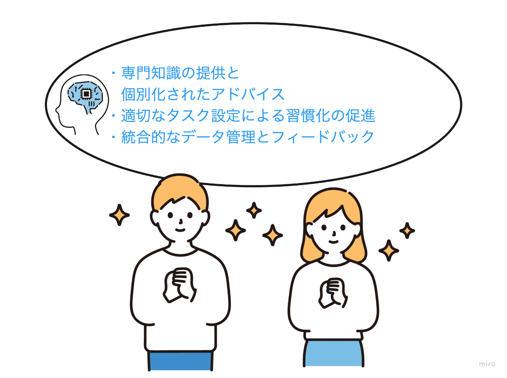
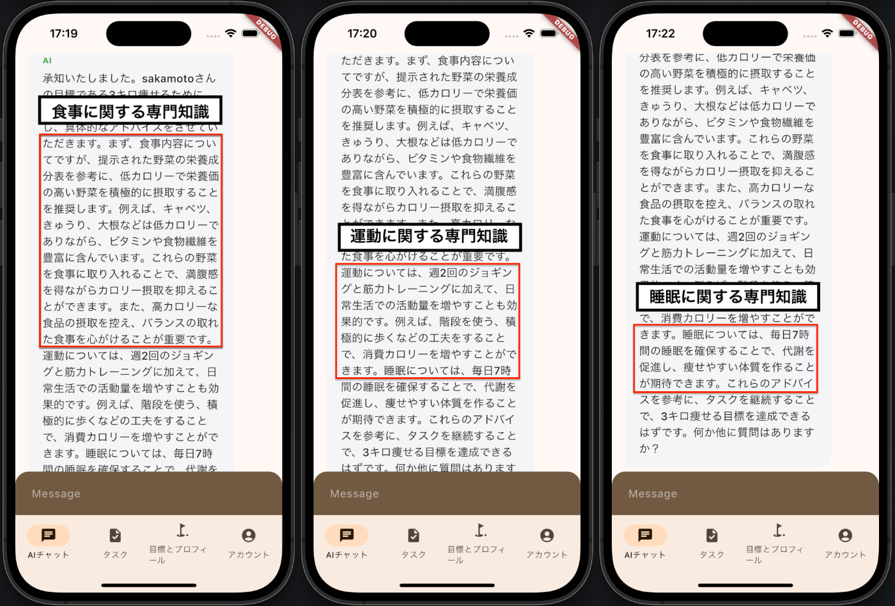
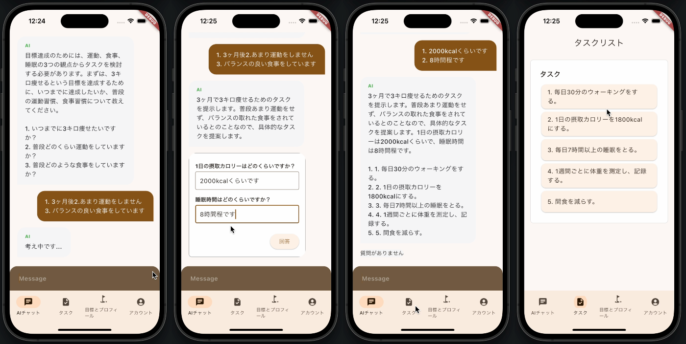
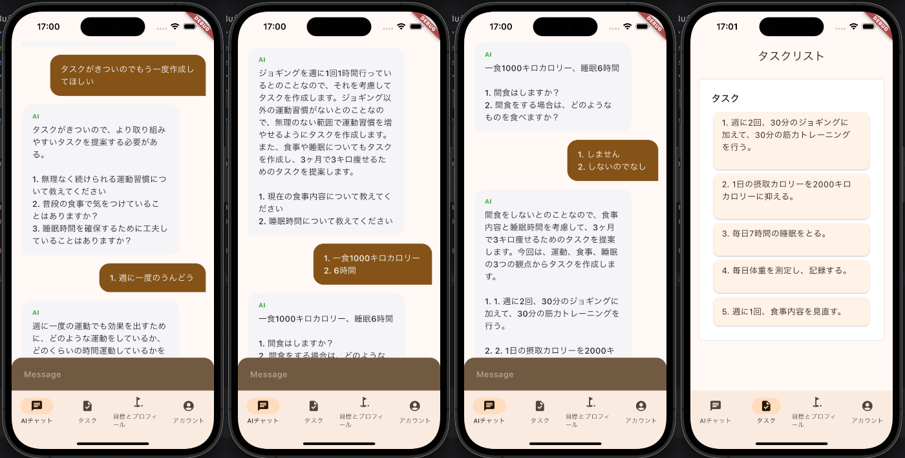
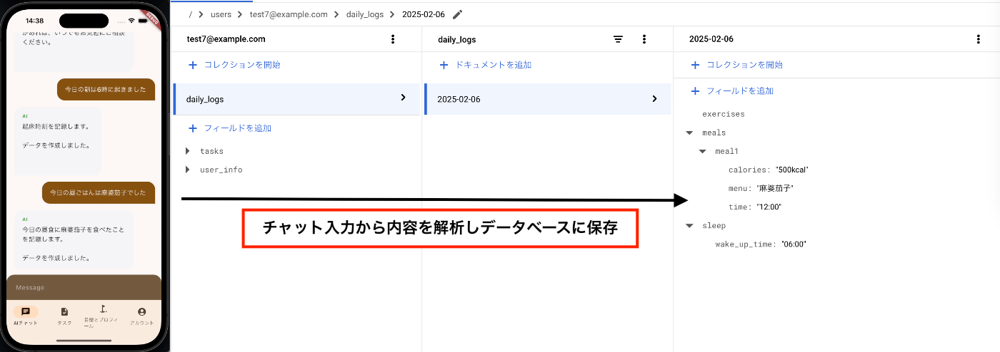
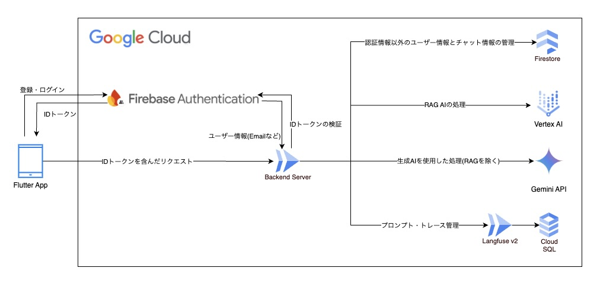
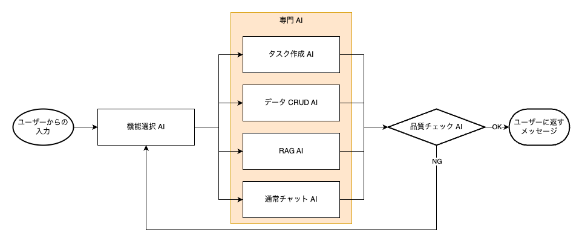
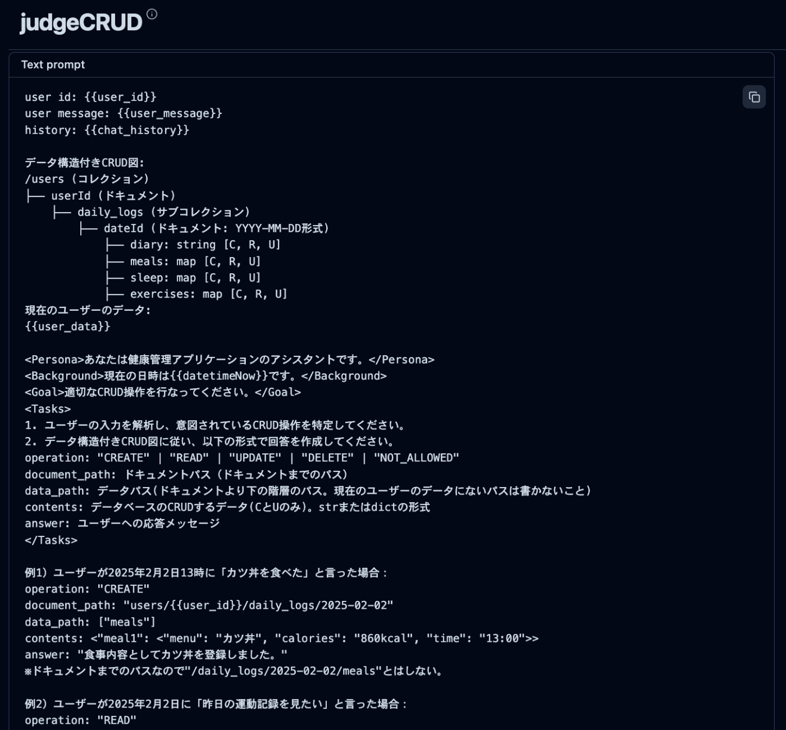

##  はじめに

この記事は AI Agent Hackathon with Google Cloud に参加するために作成した、健康管理アプリ「Perfect Health'n Man」の紹介記事です。

本アプリはユーザーが設定した健康面のゴールをもとに、AI エージェントが食事・運動・睡眠を統合的に管理することを目的としています。

本記事では、まず本アプリのターゲット層と彼らが抱える課題について説明します。  
続いて、これらの課題を解決するために採用した技術と特徴について解説し、最後にまとめと今後の展望について述べます。

##  ユーザーターゲットと課題

昨今の健康ブームに伴い、筋トレや腸活などの健康ワードが日常会話に頻繁に登場するようになりました。  
しかし、健康への意識が高まる一方で、実際に何から手をつけてよいか分からず、具体的な行動に移せない人も多いのが現状です。

本アプリは、そんな悩みを抱える方々に焦点を当て、特に以下のターゲット層を想定しています。

**主要なターゲット像**

  * 「何から始めればいいかわからない」といった理由で、実際の行動に移せない人
  * 忙しさや手間のかかるプロセスが壁となり、健康的な生活が習慣化できず、挫折してしまう人
  * 自分では健康に気を遣っていると感じながらも、包括的な評価ができておらず、真に健康であるとはいえない人

  
上記ターゲット層が直面する課題は大きく分けて以下の三点あると考えられます。

**ターゲットが抱える課題**

  * **健康に関する知識の不足**  
健康について調べる際、インターネットを利用し情報収集する方が多いと思います。  
しかしネット上には膨大な健康情報が溢れており、信頼できる情報源を探す必要があります。  
また、個々にとって有用な情報とは、身体的なデータだけでなく、体調や気分などの感覚的な面も含まれるため、適切な情報を選別するのは容易ではありません。

  * **習慣化の壁**  
健康的な生活を実現するためには、まず食事、睡眠、運動といった基本的な生活習慣の見直しから始めることが重要です。  
しかし、この 3 つの活動を記録するとなると、写真アプリ、カレンダーアプリ、フィットネスアプリなどのアプリをいくつか組み合わせて使う必要があり、入力に膨大な手間と時間がかかります。  
このような時間と手間は、多くの人にとって習慣化の大きなハードルとなっており、モチベーションの維持や日常生活への取り入れ方に工夫が求められます。

  * **包括的な評価ができていない**  
例えば、サプリメントで適切な栄養をとっていたとしても、全く運動をしない場合、健康とは言えません。  
真に健康な体を得るためには、食事、睡眠、運動をバランスよく評価する必要があります。  
そのため、普段生活する中で自身の生活習慣を振り返る機会が少ない場合、包括的な評価が難しくなります。

すべての人が真に健康な生活を実現するためには、これらの課題を確実に解決することが不可欠です。

##  課題へのソリューション

本アプリは、先述の課題に対して、生成 AI の特性を最大限に活用した解決策を提供します。  
  
以下、各課題に対する具体的なソリューションを説明します。

###  1\. 専門知識の提供と個別化されたアドバイス

**「健康に関する知識の不足」** という課題に対して、RAG（Retrieval Augmented Generation）技術を活用した専門的なアドバイス機能を実装しています。  
栄養学、運動生理学、睡眠科学などの信頼できる情報源から得られたデータを基に、ユーザーの状況に応じた適切なアドバイスを提供します。

具体的には：

  * 食材の栄養価や効能に関する正確な情報提供
  * 運動による身体への影響の科学的な説明
  * 睡眠の質を向上させるための根拠に基づいたアドバイス

これらの情報は、単なる知識の提供に留まらず、ユーザーの生活習慣や目標に合わせてカスタマイズされます。  

###  2\. 適切なタスク設定による習慣化の促進

**「習慣化の壁」** を乗り越えるため、本アプリでは、ユーザーの入力した情報から、そのユーザーが継続できるように最適化されたタスクを自動で作成します。  
これによって、ユーザーの習慣化へのハードルを大きく下げることができます。

例えば、ユーザーが「3 ヶ月で 3 キロ痩せる」という目標を設定したとします。  
このとき AI エージェントは、入力されたユーザーの身体的なデータ（年齢、身長、体重など）とゴールから、タスクを生成します。  

ここで生成されたタスクを継続することが困難である場合は、その旨をAIに伝えることで、タスクの再生成が行われます。  

###  3\. 統合的なデータ管理とフィードバック

**「包括的な評価ができていない」** という課題に対しては、チャットベースのインターフェースを活用し、ユーザーが記録したデータに基づいたアドバイスを提供することで、包括的な健康評価を実現します。  
この評価システムには次の特徴があります。

  * 自然な会話を通じた食事、運動、睡眠データの記録
  * 高度な CRUD 操作による複雑なデータ構造の管理
  * 蓄積されたデータに基づく、パーソナライズされたフィードバック

特筆すべきは、日々の操作が全てチャットで完結する点です。  
これにより、いつでも手軽にデータを記録し、有用なアドバイスを受けることができます。  

##  システム構成

本アプリは、以下のような構成で実装しました。  

##  特徴と機能

以下の技術的特徴と機能によりユーザーが効率的に健康管理を行うことができます。

###  1.生成 AI のワークフロー

生成 AI は、プロンプトが長くなるにつれて、精度が悪くなるという弱点があります。  
そこで、生成 AI がこなすべきタスクを細かく分けて、別のプロンプトにすることで、精度の向上を図ることができます。

プロンプトを細分化した場合、それをどうやって繋げばいいのでしょうか。  
それを解決するのが LangGraph です。  
LangGraph とは、LangChain のツール群に含まれる一つで、各 LLM エージェントのステップなどをグラフ化して状態管理を行うためのツールです。

LangGraph を用いた独自のワークフローは、以下のフローチャートで動作します。  

  1. ユーザーから入力を受け取り、機能選択 AI がどの専門 AI に回答させるか判断し振り分けます。
  2. 振り分けられた専門 AI が回答を生成します。
  3. 得られた回答がユーザーの入力に適切に答えたものになっているかを、品質チェック AI が判断します。(LLM as a Judge)
  4. 回答の品質が悪かった場合、機能選択 AI まで戻り、回答の生成をやり直します。

ユーザーに送信する直前に、品質チェック AI による判定を通すことによって、さらに精度の向上が見込まれます。

###  2\. データ CRUD AI による動的なクエリ生成

前述のソリューションの一つである統合的なデータ管理は、 データ CRUD AI による、Firestore のクエリを動的に生成する機能を実装することによって実現しています。

データ CRUD AI には事前に Firestore のスキーマと、どのデータを操作可能かという情報を読み込ませてあります。  
以下がそのデータの、日々の記録の部分の抜粋です。
    
    
    /users (コレクション)
    ├── {userId} (ドキュメント)
        ├── daily_logs (サブコレクション)
            ├── {dateId} (ドキュメント: YYYY-MM-DD形式)
                ├── diary: string [C, R, U]
                ├── meals: map [C, R, U]
                ├── sleep: map [C, R, U]
                ├── exercises: map [C, R, U]
    

フィールド名の後ろにある、`[C,R,U]`というのが、このフィールドでは、どの CRUD 操作をすることができるのかを表しています。

例えばユーザーが、「昨日は 23 時に就寝した」というメッセージを送ったとします。  
これに対し AI は、メッセージや、ユーザー情報などから以下の情報を生成します。

  * ドキュメントパス(例: `/users/test@example.com/daily_logs/2025-02-06/`)
  * データパス(例: `sleep`)
  * 作成・更新するデータ (例: `{bedtime: "23:00"}`)

プログラム上で上記の情報を使用することで、直接ドキュメントパスや、データパスを指定することなくデータの操作をすることができます。

  
_データ CRUD AI のプロンプト_

###  3\. RAG の実装

Vertex AI Agent Builder を利用した RAG では、以下のような専門文書を効率的に検索・参照します。

  * 栄養学データベース
  * 運動生理学の研究データ
  * 睡眠科学の調査結果

検索精度の向上のため、文書のチャンク化やエンベッディングの最適化を実施しています。

###  4\. プロンプトの管理と工夫

AI の応答品質を高めるためのプロンプトの管理と工夫をしています。

  * Few-shot プロンプトによる具体例からの学習
  * Chain of Thought プロンプティングによる思考過程の出力
  * Langfuse によるプロンプトのバージョン管理

##  デモ動画

以下がタスク生成までの流れを示したデモ動画です。  
<https://www.youtube.com/watch?v=wCPCHXYi0j8>

##  今後の展望

本ハッカソンでは、AIエージェントの基本機能を実装しましたが、今後は以下の機能拡張を通じて、よりユーザー体験を向上させていきたいと考えています。

###  1\. 記録の可視化とモチベーション向上

現状の記録機能に加え、日々の記録をアプリ上で確認できる機能を追加したいと考えています。  
努力の過程を可視化することで、ユーザーのモチベーション向上に繋がると考えられます。

  * **具体的な可視化例:**  
摂取・消費カロリー、睡眠時間の推移グラフ

さらに、可視化する情報を限定するのではなく、ユーザーが見たい情報をもとに自動でグラフを生成できたりしたら面白いのではないかと考えています。

###  2\. 初期設定機能を チャット UI への統合

初期設定がチャットUIと別画面になっている現状を改善し、全ての操作をチャットに統合します。  
これにより、目標設定からタスク生成まで、AIとのコミュニケーションを通じて完結できるようになり、より自然なユーザー体験を提供できると考えています。

###  3\. その他

詳細な説明は割愛しますが、以下の機能実装も視野に入れています。

  * 記録分析とフィードバック:  
ユーザーの日々の記録を定期的に分析し、フィードバックを行う機能
  * マルチモーダル入力:  
テキストだけでなく、画像や音声など、多様な形式での記録入力を可能にする機能
  * プロンプト精度向上:  
全体的なプロンプトの精度向上による、AIエージェントの性能向上

これらの機能拡張を通じて、AIエージェントがよりユーザーに寄り添い、目標達成をサポートできる存在となるよう開発を進めていきます。

##  ソースコード

<https://github.com/Perfect-Health-n-Man/>

##  終わりに

Perfect Health'n Man の紹介記事をお読みいただき、ありがとうございました。

私たちは、クラウドエース株式会社に所属する新卒 1 年目の若手エンジニアです。  
本プロジェクトに参加したメンバーのほとんどが、アプリケーション開発の経験がない状態からのスタートでした。  
しかし、お互いの強みを活かし、足りない部分を補い合いながら、一つの形あるプロダクトとして完成させることができました。

この開発過程で得た経験は、私たちにとって大きな財産となりました。  
技術的なスキルはもちろんのこと、チームでの協働や問題解決の方法など、エンジニアとして成長するための多くの学びがありました。  
この経験を糧に、今後も技術研鑽に励み、より良いサービスを提供できるエンジニアを目指していきたいと思います。

プロジェクトメンバー

  * **坂本** : フロントエンド・インフラ担当  
ユーザーインターフェースとインフラの設計・実装を担当
  * **中村** : バックエンド担当  
サーバーサイドの処理とデータベース設計を担当
  * **髙木** : 生成 AI 担当  
AI エージェントの開発とプロンプトエンジニアリングを担当

最後までお読みいただき、重ねて御礼申し上げます。  
今回の経験を活かし、これからもエンジニアとして精進してまいります。
