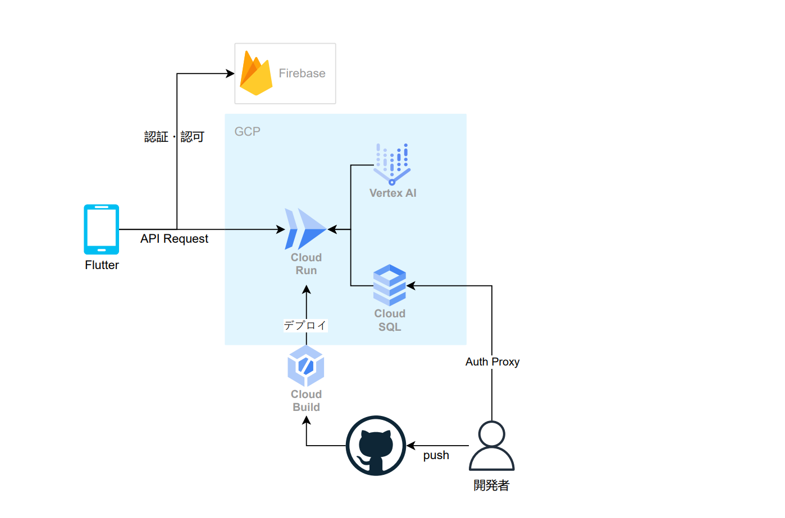

#  プロジェクト紹介：10年後のあなたとチャットができる次世代AIエージェント「Show Your AI」

本記事は、[AI Agent Hackathon with Google Cloud](https://zenn.dev/hackathons/2024-google-cloud-japan-ai-hackathon) に向けて開発した、**複数のLLMを組み合わせて「10年後のあなたとチャット」ができる次世代チャットボット** である「**Show Your AI** 」の紹介記事です。  
Flutterを用いてモバイルアプリとしての利用も想定しており、より身近に体験できるAIエージェントの実装方法や特徴についてご紹介します。

##  プロダクトの紹介・デモ動画

<https://www.youtube.com/shorts/FwqL0r6fQYw>

##  リポジトリ

  * バックエンド 
    * <https://github.com/Go-yahinaichita/ditto-back>
  * フロントエンド 
    * <https://github.com/Go-yahinaichita/ditto-front-mobile>

##  1\. プロジェクト概要

「**Show Your AI** 」は、複数の大規模言語モデル（LLM）を組み合わせ、従来のチャットボットよりもユーザー固有の情報を的確に反映させられるように設計したチャットエージェントです。  
通常のチャットボットは、主に大規模に学習した一般知識にもとづき、ユーザーの入力に対応する形で情報を返すのみでした。しかし、「**Show Your AI** 」では、ユーザーのバックグラウンドや日常の変化を踏まえた上で、**個々人が抱える将来のビジョンや必要な経験** に合わせたアドバイスを行うことが可能になることを目指しています。

さらに、UI/UXにもこだわっており、**Flutter** で構築することによりモバイル端末でもスムーズに利用できる操作性とデザインを実現したいと考えています。

##  2\. ユーザー像

想定している主なユーザーは、以下のようなニーズを持つ方々です。

  * 友人や身近な存在のように、**より親しみやすいボット** と会話をしたい
  * 自分が置かれている状況（職種、スキル、価値観など）をしっかり理解した上で、**的確なアドバイスや情報提供** を行ってほしい
  * 遠い未来や理想像に向けて頑張る「**未来の自分** 」と対話し、モチベーションを維持したい
  * 自分の将来について迷っており、さまざまな「**夢を実現した自分** 」と会話をすることでキャリアプランを考えるサポートをしてほしい

このように、ユーザーの背景情報を考慮することで、従来のチャットボットを超えた人間らしいインタラクションを提供することが目標です。

##  3\. 課題

従来型のチャットボットであっても、「ユーザーの情報を元に回答を生成する」ことは原理的には可能です。ただ、以下のような課題によってその精度や使い勝手に問題が残る場合が多いです。

###  3.1 ユーザー情報の渡し方がユーザー依存になっている

  * ボットがユーザー情報を持続的に把握する仕組みが十分でないため、**ユーザー側が毎回バックグラウンド情報を手動で入力** しなければならない
  * 質問内容が曖昧だったり情報が不足していると、ボットが的確に応答できずに**回答の精度が下がる**

###  3.2 個人データや背景情報のリアルタイムなアップデートが難しい

  * ユーザーの属性や状況は日々変化する可能性があるが、**それを自動・継続的にチャットボットに反映する仕組み** を構築するのは容易ではない
  * 手動でプロフィールを更新する場合、**更新し忘れ** や**運用コスト** が高まるといった問題が発生しやすい

また、通常のチャットボットと同様に、ユーザーが直感的に利用できるUIを整えることも欠かせない要素です。

##  4\. ソリューション概要

「**Show Your AI** 」では、上記の課題を解決するために、以下の2つの大きなアプローチを行っています。

  1. **エージェントを用いたユーザー情報の体系的な管理**
  2. **ストリーミング技術を用いたリアルタイムチャットの実装**

###  4.1 エージェントを用いたユーザー情報の管理

本プロジェクトでは、**LangChain** を活用し、複数のLLMを制御することでユーザー情報を効率的に扱う仕組みを試みています。  
ユーザーから提供されたプロフィール（年齢、職業、価値観、将来やりたいことなど）を正規化し、必要に応じて**適切なモデルへ渡す** プロンプトを自動生成したり、**ユーザーの背景を踏まえた自然な回答** を合成したりすることが可能です。

たとえば、以下のようなフローを想定しています。

  1. ユーザーがプロフィール情報をアプリ上で入力
  2. サーバー側では、入力された情報をデータベースに記録しつつ、LangChainのエージェントに対して「どのモデルを使うか」「どういった文脈を付与するか」を指示
  3. それらを踏まえた最適な回答が生成され、ユーザーに返却

こうしたエージェント構成により、ユーザーは一度の設定で**継続的かつ高度にカスタマイズされた対話** を実現できます。

###  4.2 ストリーミング技術を用いたリアルタイムチャット

一般的なチャットボットでは、ユーザーからの問いに対して**全文が生成されるまで待ってからまとめて表示** する場合が多く、応答が長いとユーザー体感での待ち時間が長くなりがちです。  
今回は、以下のストリーミング技術を用いることで、よりインタラクティブなチャット体験を提供します。

  1. **LangChainとVertex AIの`astream` 機能**
     * モデルが生成した出力をリアルタイムで受け取り、即座にクライアントへ送信できるようにする
  2. **FastAPIの`StreamingResponse`**
     * サーバーからクライアントへと、生成途中のテキストを都度返し、ユーザーに早期フィードバックを提供する

これにより、**長文の応答であっても部分的にテキストが表示されるため、ユーザーが待ち時間をあまり感じない** スムーズなやり取りを実現できます。

##  5\. 機能概要

###  5.1 認証・認可

ユーザーの認証には、**Firebase Authentication** を利用しています。Googleアカウントや他のSNSアカウントとの連携を想定し、**余計なサインアップステップを省き、スムーズに利用開始ができる** よう設計しています。

###  5.2 ユーザー情報の入力

以下のような情報をチャット作成時に入力してもらいます。  
これらをもとに「**10年後のユーザー像** 」をエージェントのアバターとして生成します。

  1. 将来の夢
  2. 年齢
  3. 現在の立場・職業
  4. 経験
  5. スキル・資格
  6. 目標を達成する上での制約（経済面、環境面）
  7. 大切にしている価値観

将来の自分と対話をしているかのようなリアリティを演出することで、キャリア形成やモチベーション維持に活用できるサービスを目指しています。

###  5.3 10年後のあなたを作成

チャット作成時に入力した情報を元に、以下の情報を生成します。

  1. 10年後の立場や職業
  2. 未来において持つと想定されるスキルのリスト
  3. 10年後のあなたを想像させるアイコン

10年後パイロットになっていると言う場合に生成されたアイコンが以下になります。  

###  5.4 チャット機能

設定された「未来のユーザー像」のアバターが、現在のユーザーに対して回答を行います。  
具体的には、プロフィールに合わせた口調や言い回し、過去のトピックとの整合性を保ったコンテキストを考慮し、**自然かつ一貫性のあるやり取り** を実現します。

##  6\. システム構成

下図は全体のシステム構成イメージです。

###  6.1 Firebase

  * Googleが提供するクラウドベースのバックエンドサービス
  * **Authentication** （認証）、**Firestore** などを利用することで、ユーザー管理やデータの保存が容易
  * 本プロジェクトでは主に認証・認可部分を担当し、ユーザーアカウントとデータを保護

###  6.2 Cloud Run

  * GCPのサーバーレスコンテナ実行環境
  * コンテナ化したアプリをデプロイすると、必要に応じて自動スケーリングでリクエストを処理
  * 本プロジェクトでは**FastAPI** をコンテナ化し、APIサーバーとして運用
  * Pythonのコード（LangChain、Vertex AI接続など）を動かしやすい環境を整備

###  6.3 Cloud Build

  * GCPのCI/CDサービスで、ソースコードの変更をトリガーとして自動ビルド・テスト・デプロイが可能
  * GitHubリポジトリと連携して、Pull Request や mainブランチへのpushを契機にCloud Runへ即座にデプロイ
  * 本プロジェクトでは、**ビルドとデプロイの自動化** を実現するために採用し、開発効率を高める狙い

###  6.4 Cloud SQL

  * GCP上のフルマネージド型RDBサービス（PostgreSQL/MySQL/SQL Serverに対応）
  * 自動バックアップやスケーリング、フェイルオーバー機能が備わっており、運用負荷を軽減
  * 今回はユーザーのプロファイルや会話履歴を**安全に永続化** するために採用
  * **VPC接続** を通してCloud Runとプライベート接続することで、セキュアな通信を実現

###  6.5 Vertex AI

  * Google Cloudの包括的なAI/MLプラットフォーム
  * **大規模言語モデル（gemini 等）のエンドポイント** を利用し、カスタム推論やAutoMLを組み合わせることが可能
  * 本プロジェクトでは、FastAPIサーバーからVertex AIを呼び出して自然言語生成を行い、**LangChain** の一部として制御
  * チャット機能のアイコンとして用いる画像をImagen3で画像生成

###  6.6 Auth Proxy

  * 認証プロキシとして動作し、クライアントからのリクエストを**認証・認可** したうえでAPIサーバーに転送
  * ローカルから安全にCloud SQLや他のGCPリソースへ接続する際にも利用
  * 本プロジェクトでは、Dev Container（Dockerベースの開発環境）などと組み合わせ、**開発環境と本番環境をシームレスに切り替え** できるよう工夫

##  7\. AIエージェント構成

本プロジェクトは、主に **SimulationWorkflow** と **ChatWorkflow** の2つのワークフローで構成されます。

####  **1\. SimulationWorkflow（未来のユーザー像の生成）**

ユーザーのプロフィール情報をもとに、未来のユーザー像を生成し、それに基づいてチャット用のデータを生成します。

####  **主な流れ**

  1. **情報の確認**

     * 受け取ったユーザー情報が未来像の生成に十分かを判断
     * 不足している場合は、ツールを用いて追加情報を収集
  2. **情報収集ツール**

     * 現在のプロフィールをもとに、具体的なキャリアパスを提案
  3. **未来像の作成**

     * 必要な情報が揃ったら、未来のユーザー像を生成
  4. **チャット用データの生成**

     * 生成した未来像をもとに、チャットタイトルとアイコンを生成
     * **タイトル生成:** **Gemini** を使用して、未来像の要約を生成
     * **アイコン生成:** **Imagen3** を使用して、未来像に沿った動物のアイコンを生成

####  **2\. ChatWorkflow（未来のアバターによるチャット）**

ユーザーのプロフィール情報と **SimulationWorkflow** で作成された未来のユーザー像をもとに、エージェントが未来のアバターになりきってチャットを行います。

###  工夫した点

  1. **システムの拡張性向上**

     * LangChain, LangGraph を活用することで、ツールの追加などワークフローの拡張性を向上
  2. **未来像の生成精度の向上**

     * エージェントに判断を任せることで、より柔軟な入力に対応
     * ツールを活用することで、より適切で現実的な未来のユーザー像を生成
  3. **アイコン生成時の安全対策**

     * アイコン生成時に人間の顔を生成すると規定に違反する可能性や安全フィルタにかかる可能性があるため、動物のアイコンを生成するようにプロンプトを設計
  4. **チャットの高速化と応答性の向上**

     * チャット部分の構成をシンプルにすることで、応答速度を向上
  5. **チャットの正確性と信頼性、UXの向上**

     * エージェントが憶測で発言しないように、プロンプトに以下の指示を追加：  
「必要な情報があれば、勝手に憶測せずにユーザに確認してください。」
     * ユーザーが不快に感じる可能性のあるトピックを避けるため、プロンプトに以下の指示を追加：  
「ユーザが不快に感じる可能性のあるトピックについて避けてください。」

##  8\. 今後の方向性

本プロジェクトでは、ユーザー固有の情報を深く活用して「未来の自分と対話する」というユニークな体験を提供することを目指していますが、まだ改善・拡張の余地が多く残されています。今後の方針としては、以下を想定しています。

  1. **情報収集経路の拡充**

     * ユーザーのカレンダー情報やToDoリストとの連携など、実際の行動データを加味した高度な応答
     * インターネット検索や他のAPI連携を通じた最新情報のリアルタイム反映
  2. **モデルのパーソナライズ**

     * 基礎モデルのfine-tuningやプロンプトエンジニアリングをより最適化し、ユーザーごとの個性をより強く反映
     * 長期間の利用時にユーザーの嗜好や成長が反映されるよう、継続学習の仕組みを検討
  3. **UI/UXの強化**

     * Flutterを使ったモバイルアプリとしての操作性をさらに高め、音声入力などの要素を導入
     * より親しみやすく、ゲーム感覚で自己実現に取り組めるインタラクションを模索
  4. **多言語対応**

     * 日本語のみならず英語・その他の言語にも対応し、幅広いユーザー層の利用を実現

