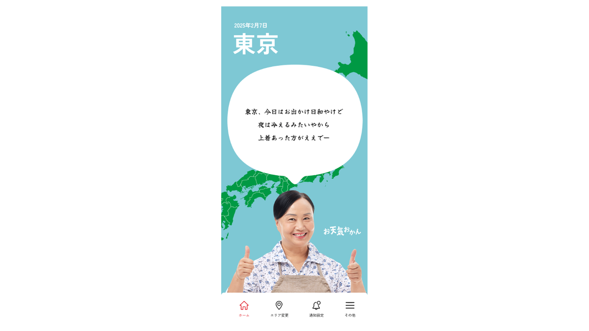
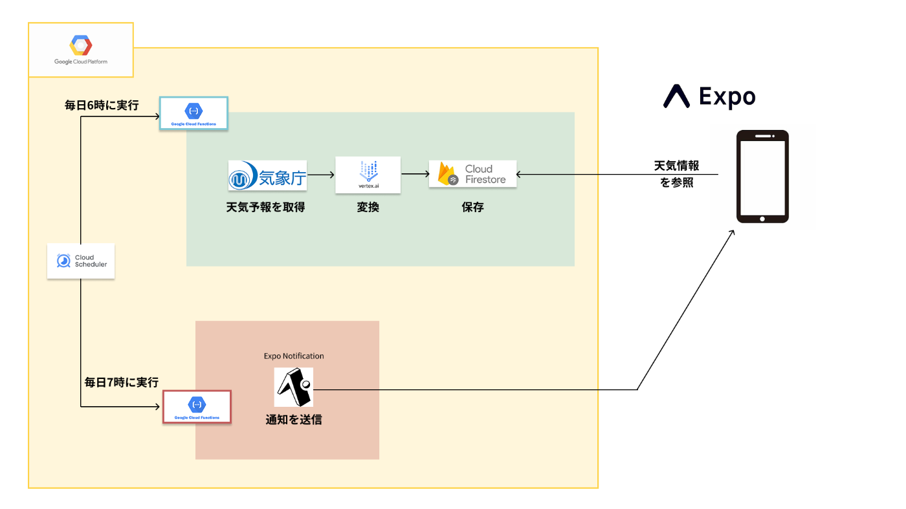
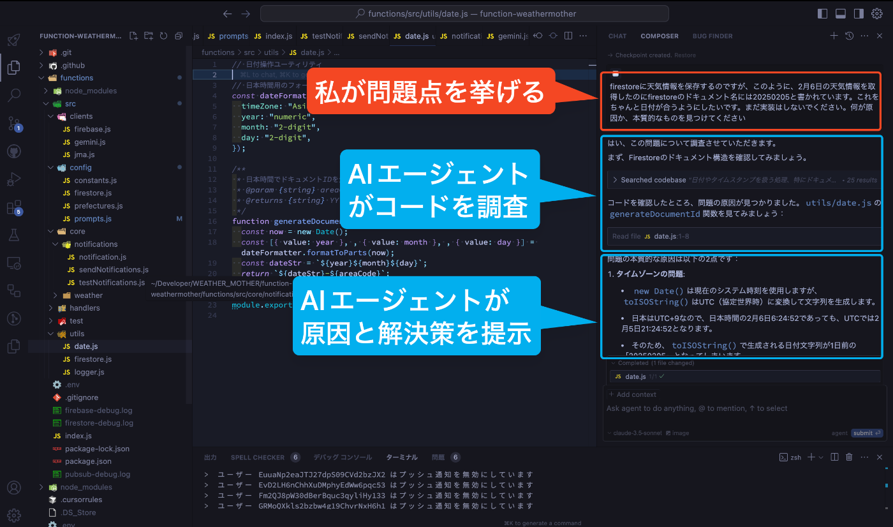
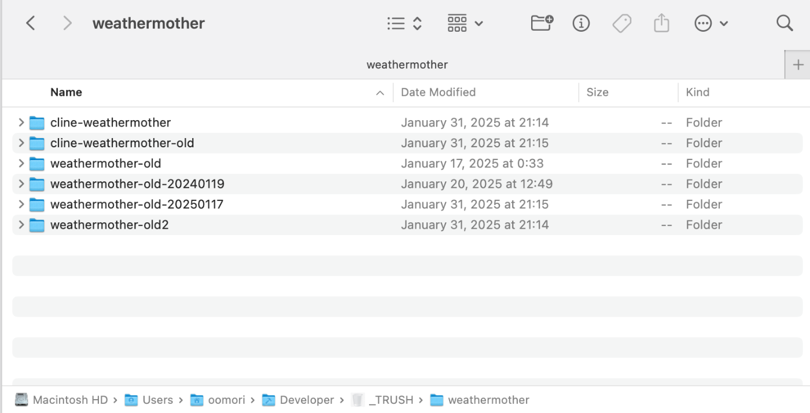

##  1\. はじめに

今回、Zennが主催する[AI Agent Hackathon with Google Cloud](https://zenn.dev/hackathons/2024-google-cloud-japan-ai-hackathon)に参加させていただきました。

本ハッカソンのテーマは「生成AI」です。 従来よりも高度な作業を行う「**AIエージェント** 」が話題となっており、幅広い業界から注目されています。  
私も今回、AIエージェントを使った開発に挑戦してみました（後述）。

そんな生成AIですが、ふとエンジニア界隈から離れてまわりの人と話してみると、

＿人人人人人人人人人人人人人人人人人人人＿  
＞ **意外とAI知らないし、使ってない！** ＜  
＿人人人人人人人人人人人人人人人人人人人＿

なので今回は、馴染みのない方にも「**AIっておもしろいね** 」と自然に興味を持ってもらえるような、誰でも日常的にAIを使えるプロダクトを作りました。

本記事では、2章で**プロダクトの紹介** と、3章で**実際にAIエージェントを使って行った開発** についてお話しさせていただきます。

##  2\. プロダクト紹介

今回作ったのは、「お天気おかん」というモバイルアプリです。  
**毎朝7時に、「お母さん口調」で重要な天気情報をプッシュ通知で知らせます。**

  
_「今日の服どうするか」や「傘を持っていくかどうか」の話をします_

###  2.1. 課題とソリューション

####  🧐 AIが一般の人に浸透していない問題

エンジニア界隈で「生成AI」は、普段から活用する機会が多くある身近な存在になりました。

その一方で、周りの人と話してみると「どうやって使えばいいか分からない」「目的がないと起動しない」という話をよく聞きます。

**「...確かに、エンジニアは調べ物やプロダクト開発で生成AIを使うけど、一般の人ってAI使う機会あまりない...!?」**

そこで、「誰でも」「日常で」使えるプロダクトを作り、AIをあまり知らない人に向けた「**日常に溶け込むAI体験** 」を作りたいなと思いました。

####  💡 だれでも抵抗なくAIに触れられるものを

みなさん、子供のころ朝学校に行く直前に「**今日夜雨降るらしいから傘もっとき！** 」と母親から言われる、みたいなことってありましたか？

僕はありました。（意外とみんなが体験している"あるあるシチュエーション"らしいです。）

これが今回のモチーフです。

  * 誰でも日常的に使える
  * AIをあまり知らなくても使える受動的なもの

として「天気予報」というトピックは最適でした。

また、「**ユーザーがすでに知っている体験** 」を提供することで、突っ掛かりがなく自然に使い始められるのではないかと思いました。それが「母親が朝天気教えてくれるあるある」です。

そう考えて、「朝のお母さんのように天気を教えてくれるモバイルアプリ」を作ることにしました。

###  2.2. デモ動画

サービスの実際の動作をご覧いただくために、デモ動画を用意しました。以下のリンクからご覧ください。

<https://youtu.be/vxdwsawhZKc>

  1. 毎朝7時、スマホに「おかんからの天気メッセージ」がプッシュ通知で届く
  2. アプリを開くと、その日の天気情報が“お母さん言葉”で表示される
  3. 都道府県単位で地域設定ができる

シンプルに「通知を受け取る→アプリで詳細を見る」という流れで、**特別な操作をほとんど必要としない** 設計を目指しました。

###  2.3. システムアーキテクチャ

本アプリの実装は、バックエンド（Cloud Functions）とフロントエンド（Expo）に分かれています。

####  バックエンド

Cloud Functionsで行われるバックエンド処理は2種類あります。それぞれ関数を分けてデプロイをしています。  
**A. 天気データに関する処理**  
以下の一連の処理をバッチ処理として、毎朝6時に実行します。

  1. 気象庁の天気予報APIから最新の天気情報を取得
  2. 取得した天気情報を、Vertex AI Studio（Gemini API）で母親風の口調に変換
  3. 変換されたメッセージはFirestoreに保存する

**B. 通知機能**  
以下の処理を、毎朝7時に実行します。

  1. Expo Notificationsを通じて、通知設定がONになっているユーザーに対しプッシュ通知で天気データを送信します

####  フロントエンド

本アプリはExpo（React Native）で開発しました。  
**A. 天気表示機能**  
ユーザーの地域の天気情報をアプリのメイン画面に表示します。Firestoreからユーザーの地域と対応した天気情報を取得します。

AIを使うプロダクトだからこそ、デザインにはなるべく「**人間味** 」が感じられるように意識しました。  
（この女性の画像はフリー画像サイトから、ライセンスを確認した上で取得し使用しています。）

**B. 地域選択機能**  
初回インストール時に、ユーザーに住んでいる地域を都道府県単位で選択してもらいます。その地域の天気情報を表示するようにします。

!

API使用料の問題で、天気情報の区分を「都道府県」単位にしました。  
そうすると、スマホの位置データを使った正確な位置情報は必要ではないので、「ユーザーが自身の地域を選択する」シンプルな形式にしました。

**C. 通知機能設定**  
毎朝7時にユーザー端末にプッシュ通知を送るかどうかの設定を切り替えられます。

##  3\. AIエージェントを用いた開発

今回は、**「AIエージェント」を使用した開発** にも挑戦しました。  
そのおかげで、初めて使うGCPやExpoにもどうにか対応することができました。

###  3.1. AIエージェントを用いた開発とは

今回は、**Cursor** というIDEを使用し、その中の「**Agent** 」という機能を活用して開発しました。

Agent機能では、従来のコード生成だけではなく、**コードの確認、コードの修正・削除、ターミナルの操作** まで、AIが自律的に開発をしてくれます。

例えば、AIエージェントを用いた開発フローは以下の様になります。

  1. 🙋‍♂️**人間がAIエージェントに実装指示を与える**
  2. 🤖AIエージェントが自律的に開発をする 
     1. 実装戦略を練り、コードを生成・修正・削除を行う
     2. AIがコマンドを操作してローカルでデバッグを行う
     3. ターミナル出力を確認し、エラー表示がある場合はそのままAIが修正を行う
     4. 指示内容が実装できたことを確認する
  3. 🤖AIエージェントが実装完了の応答をする
  4. 🙋‍♂️**人間がフィードバックを行う** （1に戻る）

まさに「エージェント」として、**自律的に** 行動してくれます。

###  3.2. AIエージェントを用いた開発の難しさ

AIエージェントは強力な力を持っていますが、それを**十分に活用するためには、「事前準備」が必要になる** と感じました。  
たとえAIエージェントの能力が高くても、人間が与える実装指示が不正確・不明瞭であると、スムーズに実装が進みません。

!

今回、実際に今回の開発では、プロジェクトが**6回ボツ** になっています。  
  
これらは、**要件定義が甘かったり、実装戦略が整っていなかった** ため、途中で収拾がつかなくなり行き詰まった結果、没にしました。

###  3.3. AIエージェントを用いた開発フロー

AIエージェントとの開発を試行錯誤をした結果、実装を始める前に、**以下の内容を定めておく必要がある** とわかりました。

####  ① 丁寧な開発ドキュメントの作成

自分の頭の中にあるプロダクト像を精密にAIエージェントに伝えるために、**「ウォーターフォール開発」のような、丁寧な開発ドキュメントの作成** が必須でした。
    
    
    # 開発ドキュメントとして必要だと感じたもの
    - プロジェクト概要（何が目的で何が重要か Ex:ハッカソン提出が目的で、迅速な開発が重要
    - プロダクト概要（アプリ特有の用語があればその説明も
    - 技術アーキテクチャ（何のライブラリを使うのかも決めれるとGood
    - 機能詳細（機能ごとの処理フローと、理想のユーザー体験
    - 画面構成（テキストベースで説明
    - 画面フロー（処理フローを正常系と異常系で説明
    - データベース構造（データベースの理想的な構造
    - ディレクトリ構造（どのようなアーキテクチャを採用するのか
    

####  ② 実装戦略をすり合わせる

その開発ドキュメントをもとに「**どのように実装を進めていくのか** 」をAIエージェントと擦り合わせておくことも効果的でした。

AIエージェントがいくら自律的に開発をしてくれるといっても、自分自身がコードを把握できていないと、必ずどこかで行き詰まり「詰み」の状態になってしまいます。  
そのため、「**AIエージェントと開発をする** 」ことを最大限念頭に置いた上で、今までとは異なる意識をする必要がありました。

!

例えば、今回の開発ではCloud Functions部分の実装で大きく行き詰りました。  
最終的に、以下の項目を意識することで詰みの解消につながりました。
    
    
    - まずは最小の構成で動かす（サンプルコードでCloud Functionsを実行する
    - 「まだ実装しないで」と言って事前に実装戦略をAIから聞く
    - 伝えられた実装戦略を他のAIに投げて、セカンドオピニオンをする
    - 一つのファイルの責務を小さくする
    - 小さな変更でも細かくGitにコミットする
    - AIエージェントの実装単位ごとに、コードが正しく動作するか確認する
    

AIエージェントの手綱を握る

AIエージェントは「ガンガンいこうぜ」という気持ちが強く、すぐ勝手に実装しはじめてしまう。なので人間側で手綱をきちんと握っておかないと、いつの間にか要件とずれた実装がガンガン進み、いつの間にか詰むという状態になりました。

開発ドキュメントをいくら丁寧に用意しても、実装途中で変わってきたりもします。なので、実装途中も常に全容を把握しながら、**AIエージェントの手綱を握って進める** ことが重要だと思いました。

!

**手綱を握るとは？**

  * AIからの実装提案をすぐにGOサインを出さずに一度自分で考える
  * 自分で考えなくても、「その実装戦略を別のAIになったつもりで冷静に評価してください」などと言い、AIに考えさせる

「超短期ウォーターフォール」×「超高速スクラップアンドビルド」の意識

丁寧な開発ドキュメントが必要とはいえ、事前に全てを想定してドキュメントを作ることも難しいです。  
ですので、どうしても初回の開発はうまくいかないこともありますが、「**それすら込みでいいんじゃないか？** 」と思っています。

私は今回、6回没にしましたが、没にするたび自分の中のプロダクト像が定まり、どんどん開発ドキュメントが精密になっていきます。

要件定義から開発までの「ウォーターフォール開発」を超短期で行う。  
行き詰まったら没にして、再度要件定義から作り直す。

このような **「超高速にスクラップアンドビルドを行う開発スタイル」** が、AIエージェントとの開発では重要になってくるのではないかと思いました。

!

AIエージェント駆動での開発では、下地さえ整っていれば、AIエージェントはほぼノンストップで開発でき、**「ビルド」にかかる期間はごくわずか** で済みます。  
ですので、プールの飛び込み台の様に、一度覚悟決めて飛び込んでみる（スクラップしてビルドしてみる）ことをオススメします...!!!

###  3.4. AIエージェントを用いた開発で重要なこと

AIエージェントを用いた開発では、このように特有のノウハウが必要になってきます。  
ですが、同じくらい「**自分自身の開発力** 」が重要だと強く感じました。  
そして特に、「**システム全体がどうなっているかを把握する力** 」が重要だと思います。

!

私はもともとWEBデザイナーでしたが、2023年末からAIを使った開発にチャレンジしはじめました。  
最初の頃は「開発力」なんてものはないので、コードの良し悪しやアーキテクチャの良し悪しもわかりませんでした。そして、「システム全体がどこまで実装されているのか？」「どのように連携しているのか？」のようなメンタルモデルがなかったため、**事態を把握しきれず収拾がつかなくなり、不具合が修正できず詰む** 、みたいなことが頻繁に起こりました。

ですが、そのようなトライアンドエラーを繰り返し、その度必要になった知識を学んでいった結果、自分自身の開発力が伸び、そのおかげで開発をスムーズに進めることができるようになりました。

たとえ、今後AIエージェントを駆使して開発するようになるとしても、「**自身の開発力** 」の部分は重要になってくるはずなので、これからも日々研鑽をする必要があると感じました。

##  4\. 開発で得た知見

  * Vertex AIでGeminiを使う際、Gemini 1.5 Flash, Gemini 1.5 Proのモデルは、初期状態だと「1分間に5回」というレート制限があります。これは、GCP上から申請を出すことでレート制限が緩和されます。（今回は申請から5時間後に承認の連絡が来ました）

##  5\. まとめ

ここまで読んでいただきありがとうございました。

今回のハッカソンでは、「生成AI」についてプロダクトと開発の二つの側面で触れることができました。  
プロダクトに生成AIを使うと、今までにない新しい価値が生まれ、作れるプロダクトの幅が広くなりワクワクしています。  
開発に生成AIを使うと、従来とはまた異なるワークフローの構築が必要になるのだなと強く感じました。

今回作った「お天気おかん」は個人的にとても気に入っているので、このまま開発を進めてリリースを目指したいと思います。
