#  はじめに

こんにちは、TOPPANデジタル株式会社で クラウド技術を活用した開発に取り組んでるエンジニア集団です！  
このたび、チームで「AI Agent Hackathon with Google Cloud」に初参加しました！  
このイベントでは、Google CloudのAI技術を活用して、 実際に役立つAIエージェントを開発することが求められます。  
今回のハッカソンに参加した理由は、クラウド×AIの可能性をより深く学び、実際のアプリケーション開発に活かすため です。Google CloudのGemini API in Vertex AIやVision APIなどを使いこなすことで、どのような課題を解決できるのかを体感したいと考えました。  
YouTube公開動画では、実際に作成し提出したアプリケーションを紹介します！  
AIを活用した 食品の鮮度判定アプリ の開発プロセスや、技術的なチャレンジ、得られた知見などをお伝えできればと思います。ぜひ最後までご覧ください！

#  背景

昨今の物価高によって自炊を始める方は多いのではないでしょうか。「おいしそう」や「オシャレ / 映える」料理を作りたく食材を買い出しに行くのですが、ここで課題になるのが、

**どの食材が一番状態が良いのかわからない**

という点です。同じ値段を出して買うなら、なるべく鮮度がいいものを買いたいものです。どこかで見た、「この野菜はここを見るべし！」といった項目を思い出そうとするのですが、結局初めに手に取ったものを買いがちになります。  
そこで、「カメラをかざすだけで、陳列された食材の中から、一番新鮮なものを選択してくれる」ソリューションがあれば迷いなく買えるのではないかと思ったため、今回はこれを開発します。  
また、人が食材を選ぶ基準は鮮度だけではないと思います。色、形、大きさ、基準は様々です。今回のソリューションでは、鮮度を基準に選定しますが、プロンプトをうまく調整すれば、「一番鮮やかなモノ」「一番形がきれいなもの」「一番大きいもの」等も選別できるのではないかと思います。ユーザーのニーズに合った食材選定ができれば一番いいですよね。

###  想定したユーザー像

私たちのサービスは、スーパーで食材を購入するすべての人々を対象としていますが、特に、食材を使いきれずに余らせてしまう人、最近自炊を始めたばかりで食材に関する知識が浅い人々をターゲットにしています。具体的には、20代の独身社会人を主な対象としています。

**主なターゲットユーザーの詳細**

  * 食材を使いきれずに余らせてしまう人

多くの人が、スーパーで食材を購入したものの、使いきれずに冷蔵庫の中で腐らせてしまうという経験を持っています。特に一人暮らしの人々は、食材を適切な量で購入することが難しく、余った食材が冷蔵庫の中で眠っていることが多いのではないでしょうか。なるべく新鮮なモノを選んでいれば、保存期間も延び無駄を減らすことができます。

  * 20代・30代の独身社会人

20代・30代の独身社会人は、仕事の忙しさから外食やコンビニ食に頼りがちの生活で、スーパーに行く機会も少ない人が多いのではないでしょうか。そんな人々が誤って腐りかけの食材を選んでしまう失敗を減らせます。

###  課題

「スーパーで陳列された食材の見分けがつかないこと」を課題としています。特に、以下のような問題が頻繁に遭遇する内容ではないでしょうか。

  * 痛んでいる食材を選んでしまう

スーパーで陳列されている食材の中には、見た目は良くても実際には痛んでいるものがあります。見た目だけで判断した結果、購入後すぐに腐ってしまう、食べられなくなってしまう、ということはよくあります。これは、特に果物や野菜などの生鮮食品でよく見られる問題です。

  * 安いからと買ったはいいが使わずに腐らせてしまう

特売やセールで安くなっている食材を見つけると、つい買ってしまいがちです。しかし、計画的に使うことができず、冷蔵庫の中で腐らせてしまうことが多いです。また、安さに目がくらみ食材の痛みに気づけないことも多いです。

#  システム構成

今回、我々が開発したシステムは、以下の構成図のように成り立っています。クラウドネイティブなAIアプリケーション を GoogleCloud上で構築しました。デプロイしたアプリケーションを、エンドユーザーがWebやモバイルデバイスから利用できるようになっています！  
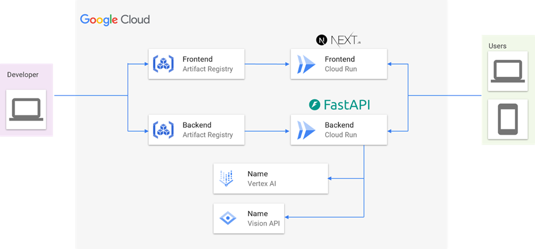

###  主な構成要素と流れ

開発はアプリケーションのフロントエンド（Next.js）とバックエンド（FastAPI）で開発。

  1. フロントエンド (Frontend)

  * Next.js（Reactベース） で構築。ユーザーインターフェースを提供。
  * Cloud Run にデプロイされ、サーバーレス環境で動作。
  * ユーザーからのリクエストを受け取り、バックエンドに送信。

  2. バックエンド (Backend)

  * FastAPI（Python製の軽量Webフレームワーク） を使用し、APIを提供。
  * Cloud Run にデプロイされ、スケーラブルなバックエンド環境を実現。
  * フロントエンドからのリクエストを処理し、AIサービスに連携。

  3. AIサービス

  * Gemini API in Vertex AI: Google Cloud の機械学習プラットフォーム。モデルのデプロイや推論に活用。
  * Vision API: 画像認識API。食材の鮮度判定や物体検出に利用。

  4. ユーザー (利用者)

  * PCやスマホ からアプリにアクセスし、画像をアップロードして鮮度判定などの機能を利用可能。
  * フロントエンド（Next.js）を通じてバックエンド（FastAPI）にデータが送信され、AIサービスで処理。

###  特徴とポイント

  * サーバーレス構成 → Cloud Run によりスケールしやすい構成
  * コンテナベースのデプロイ → Artifact Registry で管理し、開発・運用を効率化
  * 機械学習API活用 → Vertex AI & Vision API でAI処理をクラウド上で実行
  * モダンなWeb技術 → Next.js + FastAPI の組み合わせで、パフォーマンスと開発効率を両立

###  フロントエンド

フロントエンドは、以下の流れで実行されます。

  1. アプリスタート
  2. アプリ内からカメラ起動（ & 陳列商品の撮影）
  3. 撮影した画像と情報の入力  
※情報の対象となるのは、「対象商品が何か（野菜 or 肉）」と「取得したい特徴」
  4. バックエンドに撮影画像と情報を送付  
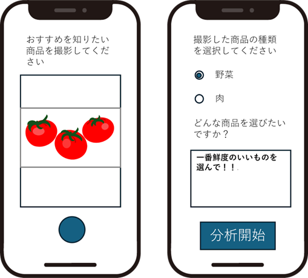

###  バックエンド

バックエンドは以下の流れで実行されます。

  1. エンドポイントに対して、「画像」と「カテゴリー情報（肉 or 野菜）」と「ユーザーの希望」が送られてくる。  
例）  
画像：撮影商品  
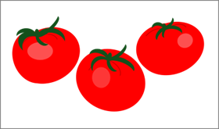  
カテゴリー情報：野菜  
ユーザーの希望：一番鮮度のいいものを選んで！！

  2. 受け取ったイメージを「visionAPI（object locarizations）」にかけて、全商品の位置情報を検出する。  
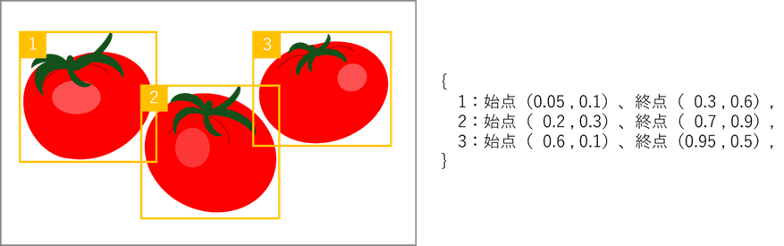

  3. visionAPIのレスポンスである座標情報を元に、入力画像を分割する。

  4. 分割した個体画像のすべてと、プロンプトを入力として「Vertex API for gemini」に投げる。 ここで、プロンプトには、  
「あなたは農産物の優れたバイヤーです。それぞれの画像について、"ユーザーの希望"という観点でランク付けしてください。出力はJSON形式に従ってください。」  
をいう文言を渡す。  
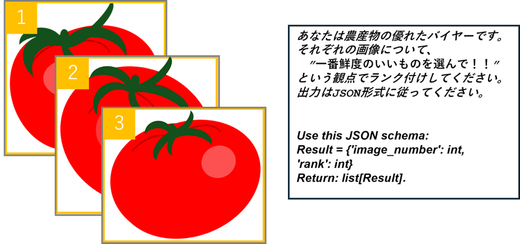

  5. 入力画像のランク付け結果が、json形式で返ってくる。

  6. 各個体にバウンディングボックスと、ランクを追加して、画像化する。フロントに最終結果としてレスポンスする。  

#  検証１

以下の野菜・果物に対して本システムで鮮度検出させてみました。

  * オレンジ
  * ネギ/大根
  * キウイ

  1. オレンジ  
以下はオレンジの検出結果です。色鮮やかなもの、表面に傷の少ないモノが選択されているように感じました。表面に商品管理用のシールが貼ってあっても検出されているのが正しく読み取れているのではと感じるポイントでした。  
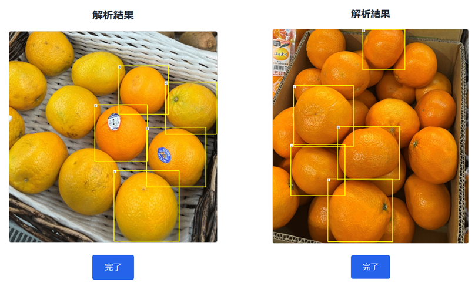

  2. ネギ/大根  
以下はネギや大根の検出結果です。何も検出されませんでした。このような「長細い形状」のパターンは正しく検出できないことが多かったです。  
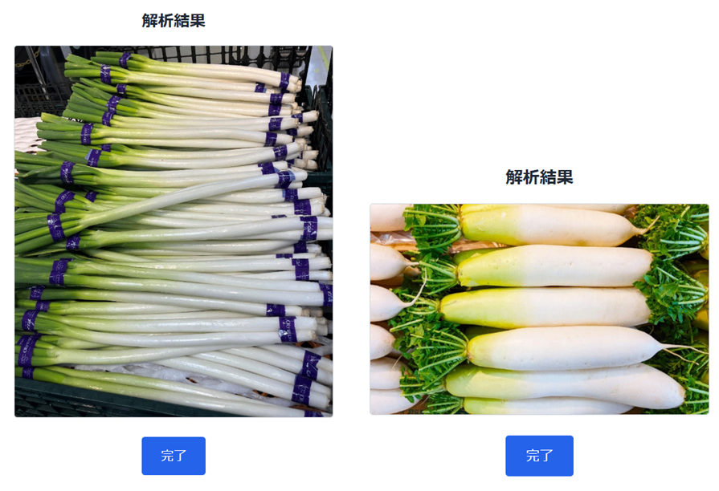

  3. キウイ  
以下はキウイの検出結果です。こちらも何も検出されませんでした。このような「検出対象が多すぎる」パターンも正しく検出できないことが多かったです。  
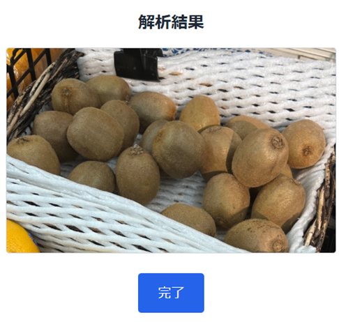

#  検証２

「物体検出」フローと「鮮度評価」フローの2段階に分かれていますが、検証１では「物体検出」フローでは以下の課題がありました。

  * 「陳列量が多い」「形状が細長い」場合、検出できないことが多い

この課題を改善するため、**「Vision AI」を利用した物体検出から、「Gemini 2.0」を利用した物体検出を試用してみることにしました。**  
Gemini2.0は2025/02/06にすべてのユーザーに提供が開始された、Googleの新しい生成AIモデルです。

[Gemini 2.0 をすべてのユーザーに提供](https://blog.google/intl/ja-jp/company-news/technology/gemini-20/)

このGemini2.0は、Gemini1.5から様々な点で性能が向上しましたが、その機能の一つとして「オブジェクト境界を検知」する機能が追加されています。

サンプルコード：cookbook/gemini-2/spatial_understanding.ipynb at main · google-gemini/cookbook

「物体検出」フローをGemini2.0の「オブジェクト境界を検知」機能で置き換えた結果、Gemini 2.0では ほぼすべての物体を正しく検出 できるようになりました。  
検証１の「ネギ」「大根」「キウイ」に対して、再度物体検出を実行した結果が下記です。  
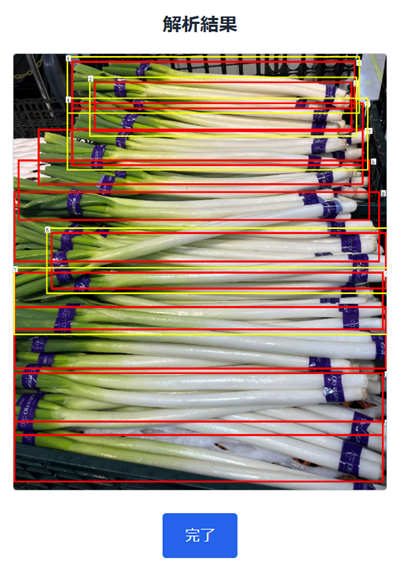  
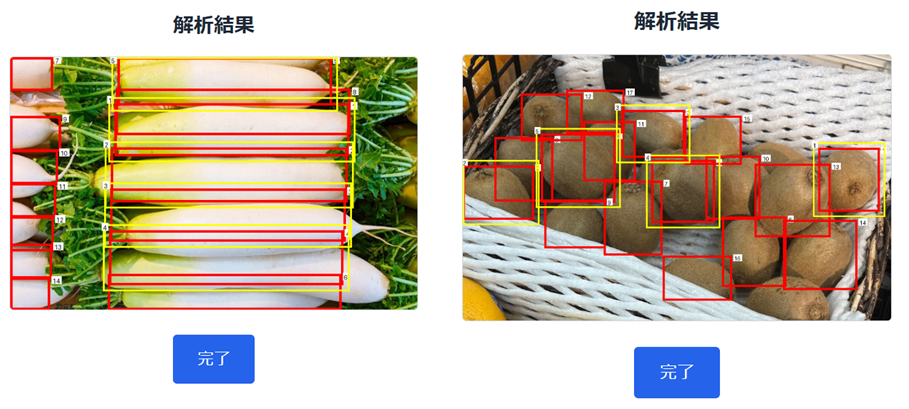

検証１（VisionAI）では検出することができていなかった「ネギ」「大根」「キウイ」について、Gemini2.0を利用した場合はほぼすべての食物の検出ができていることが見てとれます。  
上記結果を踏まえ、再度鮮度比較を行った結果が以下になります。

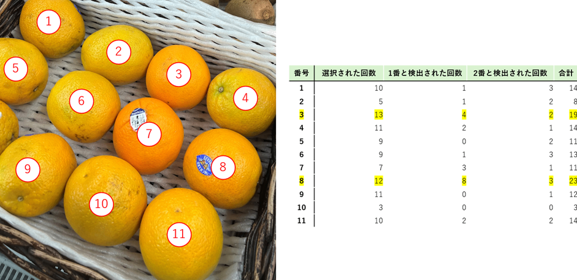

最も鮮度が高いと検出されたものは、8番のオレンジで、次点で3番となりました。  
「鮮度が高い」というプロンプトを入力した場合、人間の目から見て、他のオレンジと比べて傷や汚れが少なく、色鮮やかなオレンジが選ばれる傾向があることがわかりました。

#  今後の展望

  * 今回の検証では 鮮度評価 を中心に行いましたが、 実際の食材選びの基準は「大きさ」「艶」「形状」など多岐にわたる ため、さらなる改善の余地があります。  
今後は、ユーザーが より直感的に食材の鮮度を判別 できるようにし、さらに多様なニーズに対応できる仕組みを目指します。 
    * 「大きさ」の判定精度向上 
      * カメラの画角、被写体の位置、フレーム内での映り方など、外的要因の影響を受けやすい
      * これらを補正する仕組みを導入し、ユーザーの目的に応じた柔軟なプロンプト対応を目指す
    * 撮影時の角度補正 
      * 被写体が平行でない場合、バウンディングボックスに不要な要素が含まれることがある
      * これにより 視認性が低下 し、鮮度評価にも影響が出る可能性
      * 画像の前処理を強化し、より正確な判定を行えるように改善

今後は、より直感的で精度の高い鮮度評価を実現し、「**食材選びをよりスマートに、より便利に** 」を実現し、ユーザーの多様なニーズに対応できる食材判定アプリへ進化させていきます！

#  YouTubeにてデモ動画を公開！

YouTubeにて、実際の利用シーンを想定したデモ動画を公開しております！  
今回開発したアプリがどのように動作するのか、どんな場面で活用できるのかをわかりやすく紹介しています。スーパーでの買い物中に食品の鮮度を判定する様子や、どのようにAIが食材を分析するのかを想定したデモをご覧いただけます！  
アプリの使い勝手や機能がより具体的にイメージできる内容になっていますので、ぜひ本記事とあわせてチェックしてみてください！  
<https://www.youtube.com/watch?v=rMYcy0Zk1M0>

#  その他情報発信！

###  DXNote

クラウドとWebアプリケーション開発に関する取り組み内容を中心に、実践的なガイドや実地検証に基づく情報を幅広く発信します。今回初参加したHackathon以外に、アプリケーション開発手法の改善、セキュリティ対策、コスト効率の向上などに試行錯誤を繰り返し、失敗から学び改善を重ねています。この過程で得られたリアルな経験や教訓も皆様にお届けします！  
初心者から上級者まで、どのレベルの方にも役立つ内容を毎月お届けしますので、こちらもぜひ合わせてご覧ください！  
<https://note.erhoeht-x.jp/m/mc24ae1f42660>

###  X（旧Twitter）

Xでは、開発の進捗や技術的な内容だけではなく、TOPPANデジタル株式会社の取り組みも発信していますので、こちらもぜひ合わせてご覧ください！  
<https://twitter.com/toppan_dxd_ict>
