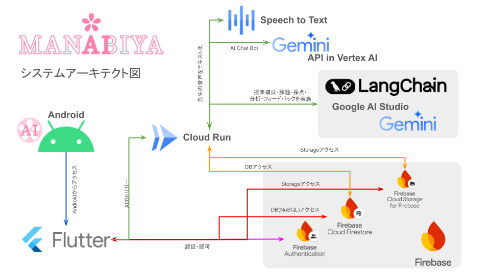
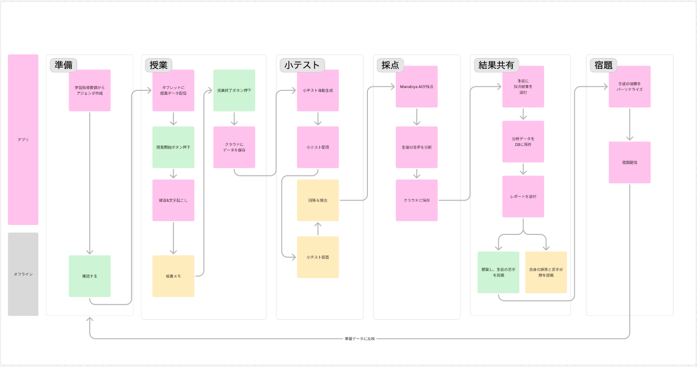
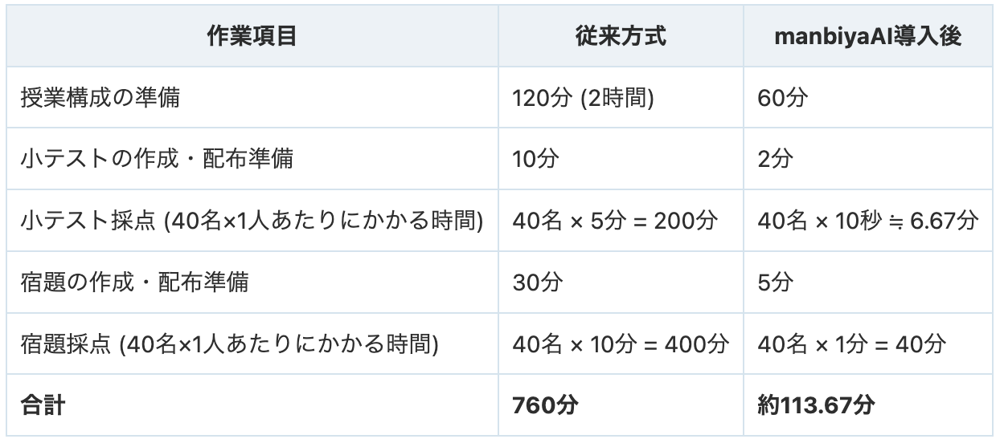
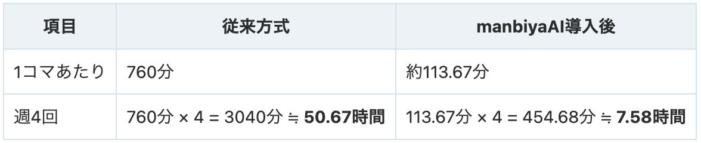
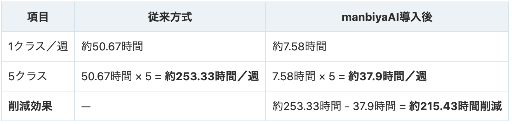

##  はじめに

昨今の教育現場では、授業準備・進行・評価は非常に大きな負担となっており、日本の教師は授業や授業準備に費やす時間自体は週26.5時間程度となっている。  
<https://www.newsweekjapan.jp/stories/world/2022/12/post-100283_2.php>

テクノロジーの進化による授業のデジタル化が急務だ。しかし、実際の教育現場では、IT化が、促進されておらず、現行方式から変化を嫌う教師が多数存在する。  
また、授業支援AIが登場するが、教師の個性や経験が反映されず、教師が嫌悪感を抱かれ、導入に至らない問題がある。

今回、そんな、問題を解決する「**ManabiyaAI** 」を提案する。  
ManabiyaAIは、デジタル端末が完備された対面授業環境下で、新人教師でも、自分らしい授業を実現できるよう、授業準備から授業運営、採点・フィードバックまでを包括的にサポートするシステムです。

##  プロジェクト概要

###  対象ユーザーと課題

**対象ユーザー** :

  * 私立の中学校で勤務する新人の英語教員
  * タブレットやスマートフォンが全校に配布され、教員・生徒が積極的に活用する環境

**抱える課題** :

  * 授業準備にかかるコストの大きさ
  * 授業の情報の可視化
  * 授業進行度と関連のないテスト作成
  * テストの採点のコスト
  * 一律の評価基準では、生徒個々の理解の深さや苦手分野の可視化不可
  * 新人教員が独自の授業スタイルを確立するのに時間を要する

###  ソリューションと特徴

ManabiyaAIは、上記の課題に対して以下のソリューションを提供します。

  1. **授業準備の効率化**

     * 学習指導要領に基づいた自動アジェンダ作成機能
  2. **授業中のリアルタイム支援**

     * 教師と生徒のタブレットに授業テキストを表示し、同じ情報を共有
     * 授業中の音声データを収録し、リアルタイムに文字データとして保存
  3. **小テストの自動生成と評価**

     * 授業内容に基づいた小テストの自動生成
     * 4択問題、穴埋め問題、自由記述に対応した自動採点と誤答傾向分析
  4. **結果共有とパーソナライズされたフィードバック**

     * 生徒への解答結果と解説、個別補足の提供
     * 教師への、生徒ごとの理解度レポートと次回授業へのアドバイス提示
     * 間違えた問題に基づくパーソナライズ宿題の自動配信と、問い合わせに対応するチャットボット機能

さらに、ManabiyaAIは教師の過去の授業データを学習し、各教員の指導スタイル（教師らしさ）を反映したフィードバックを実現。これにより、新人教員であっても、自身の個性を失うことなく、質の高い授業運営が可能となります。

##  主要な機能詳細

###  1\. 授業準備

  * **アジェンダ作成** : 学習指導要領と授業数に基づき、授業で行う、授業範囲アジェンダを作成。

###  2\. 授業支援

  * **教科書表示** : 授業中、教師と生徒のタブレットに授業テキストを表示し、内容確認を板書なしで実現。
  * **音声収録** : 授業開始とともに音声データを収録。

###  3\. 小テスト機能

  * **テスト自動生成** : 授業内容に合わせた問題をAIが自動生成し、生徒に即座に配信。
  * **テスト対象インプット** : 授業の音声データからも重要用語をピックアップし、反映。

###  4\. 採点・集計機能

  * **自動採点** : 4択、穴埋め、自由記述の各形式に対応。特に自由記述はAIによる自然言語解析で補助採点を実現。
  * **誤答傾向の集計** : 生徒全体および個々の生徒の誤答パターンを集計。

###  5\. 結果共有とフィードバック

  * **解答結果の共有** : 採点結果と解説を生徒にフィードバック。
  * **パーソナライズ宿題の配信** : 間違えた問題に基づき、個別最適化された宿題を自動生成。
  * **教師へのフィードバック** : 生徒ごとの理解度や誤答傾向を分析し、次回授業への改善点を提示。
  * **チャットボット機能** : 宿題に関する問い合わせに対応し、24h365d問い合わせに対応。

##  システムアーキテクチャ

ManabiyaAIは、最新のクラウド技術とAI技術を融合し、シームレスな授業支援を実現しています。以下はその全体像です。

**主要コンポーネント** :

  * **フロントエンド** : Flutter (Dart)
  * **バックエンド** : Firebase（Firestore, Auth, Storage）
  * **AI連携** : Cloud Run（Python, Go）
  * **AIモデル** : Gemini 2.0 FlashEXP
  * **オープンソースフレームワーク** : LangChainを利用  

##  実装の詳細

###  開発工程の効率化

  * NotionとGitHub Flowのブランチ戦略を用いたタスク管理ベースの開発。 
    * 開発者はNotionにより管理された各ブランチに分けて開発作業の実施。
    * stg/mainへのマージ前に、プルリクエストを作成し他の開発者からレビューを実施。
    * CI/CDの実装により、mainにマージ完了後自動デプロイ。

###  Flutterを利用した高機能なアプリ開発

  * 状態管理を用いたStreamによるFirestoreとのリアルタイム通信実現。 
    * 書き込み時は状態管理によりキャンセルや一時保存が可能。
  * リアルタイム通信を応用し、先生ユーザー側から生徒ユーザーの画面を強制的にテスト画面を表示する機能を実装 
    * クラス単位で管理しテストの一括制御が可能
    * 生徒側の解答の後、すぐにAIの採点を行うことで、迅速なフィードバックとAI処理の分散を実現

###  AI Agent

  * 授業の内容とリンクした小テストの自動作成機能 
    * 授業の内容を音声データをリアルタイムで取得し、Speech to Textで取り込みテストに反映
  * 生徒自身が直ぐに苦手箇所を把握できる小テストAI採点 
    * 記述の採点は、問題趣旨の理解を促すプロンプトを組むことで実現。
    * 各問題に解説と教科書のどの範囲からの問題なのかを示す出題箇所を自動生成(RAG)
    * 採点結果は決められたスキーマで固定、また意図しない出力を補正するための補正関数を用意している。
  * クラス毎の理解度を把握できるAI分析機能 
    * 小テストの採点結果を読み込み、AIが理解度の傾向を分析
    * 具体的な計算が必要な処理はプログラムで行うことで、正確に値を算出
    * AIの自動生成とプログラムを適宜使い分けることで、グラフの作成を容易にしている。

##  利用シナリオ

  1. **授業準備段階**

     * 教師は、学習指導要領に基づき自動生成された授業アジェンダを確認・編集。
  2. **授業中の支援**

     * 授業開始とともに、音声収録が自動で実施され、授業内容が記録。
     * 教師と生徒のタブレットに授業テキストが表示。
  3. **小テストの実施と採点**

     * 授業内容に合わせた自動生成小テストが生徒に配信され、終了後すぐに採点。
     * 採点結果は、4択や穴埋め問題は即座に、自由記述はAIによる解析で評価され、全体および個別の誤答傾向が明示。
  4. **結果共有とフィードバック**

     * 採点結果と解説が生徒にフィードバック。
     * 各生徒に合わせたパーソナライズ宿題が自動配信。
     * 教師には、クラス全体および個々の生徒の理解度レポートと、次回授業改善のためのアドバイス。

利用シナリオ画像（Figma-Figjam）  

##  デモ動画

<https://youtu.be/kF9nuw77AOo>

##  効果

###  前提条件

  * 授業1コマ： 45分
  * 1クラスあたり: 40名の生徒
  * 1クラスの授業頻度: 週4回
  * 1学年あたりのクラス数: 5クラス
  * 科目: 中学英語
  * 従来方式の場合: 
    * 小テストの出題・配布準備: 10分
    * 小テストの採点: 1人あたり2分
    * 宿題の採点: 1人あたり5分

###  1回の授業（1クラス）あたりの作業時間

###  1クラス／週の作業時間（週4回の場合）

###  1学年／週の作業時間（5クラスの場合）

###  効果のまとめ

  * 従来方式の場合:  
1コマは760分（約12時間40分）、1クラス／週約50.67時間、1学年（5クラス）で週約253.33時間の工数が必要です。
  * manbiyaAI 導入後の場合:  
1コマは約113.67分（約1時間54分）に短縮、1クラス／週約7.58時間、1学年で週約37.9時間の工数です。
  * 削減効果:  
1コマで約85%削減、1学年で週約215.43時間（約84.9%）と推定されます。  
生徒1人採点は従来小テスト5分＋宿題10分で15分／人でしたが、AI導入後は10秒＋1分で約1.17分／人に低減。  
生徒ごとにパーソナライズ宿題や解説が提供され、従来方式比で工数・時間削減と教育質向上に寄与します。

##  今後の実装

###  教師らしさの実現

ManabiyaAIは、単なる機械的支援に留まらず、**教師の個性** や**指導スタイル** を損なわずに授業運営を実現します.

  * **過去の授業データ学習** : 各教師が過去に実施した授業のデータを取り込み、好まれる説明方法や例え話を学習。
  * **個別最適化** : 教師自身がフィードバックを通してシステムに情報を蓄積することで、次回以降の授業でその個性がより反映されます。
  * **新人教師のサポート** : 経験が浅い教師でも、AIのサポートにより自信を持って授業を進めることができ、早期に指導力を向上させることが可能です。

###  学生の思考プロセスの可視化による学びの深化

ManabiyaAIは生徒の解答過程で、AI対話で「**思考プロセスの可視化** 」機能を提供。従来の採点・評価は正誤だけ重視でしたが、生徒の推論過程把握は、指導に有益です。例えば数学問題に挑む際、AIが生徒と対話し計算・論理展開を記録し、後、教師が過程分析し、どの段階で理解課題があるか、どの部分を重点指導すべきか明確に。こうした「思考の見える化」で、生徒も思考過程を振り返り、自己修正・改善につなげ可能です。

##  期待する成果

ManabiyaAIの導入により、以下の成果が期待されます。

  * **授業準備の時間短縮** :  
AIによる自動アジェンダ作成と授業データの一元管理により、従来の手作業に比べ大幅な時間削減が実現。教師は授業の質向上や生徒への個別指導に専念できます。

  * **生徒の理解度向上** :  
リアルタイム文字起こしと自動採点、個別フィードバックにより、生徒ごとの理解度が正確に把握でき、苦手分野の補強が可能となります。

  * **新人教師の負担軽減** :  
授業準備から運営、評価・フィードバックまでの各プロセスが自動化されるため、経験の浅い教師でも安心して授業に臨めます。結果として、教師自身のストレス軽減と早期の指導力向上に寄与します。

##  まとめ

ManabiyaAIは、私立英語中学校の新人教員向けに、授業準備、授業運営、評価、フィードバックを一元管理する革新的なAIエージェントです。クラウド技術（Firebase、Cloud Run）と、先進の大規模言語モデル（Gemini 2.0 FlashEXP）、オープンソースフレームワーク（LangChain）を組み合わせることで、教師の個性や指導スタイルを最大限に反映した、質の高い教育支援を実現します。

従来の教育支援システムが抱えていた「画一的な指導」という問題に対し、ManabiyaAIは教師自身の経験と個性を活かしながら、効率的かつ効果的な授業運営をサポートします。授業準備の時間短縮、生徒の理解度向上、そして新人教員の負担軽減といった多大な成果が期待できるこのシステムで、未来の教育現場に新たな価値を提供します。

ぜひ、ManabiyaAIを活用し、教師と生徒がともに成長する新しい学びのスタイルを実現してください。

* * *
