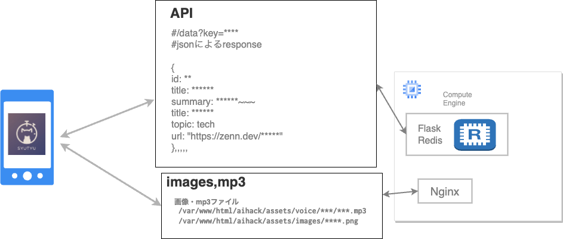
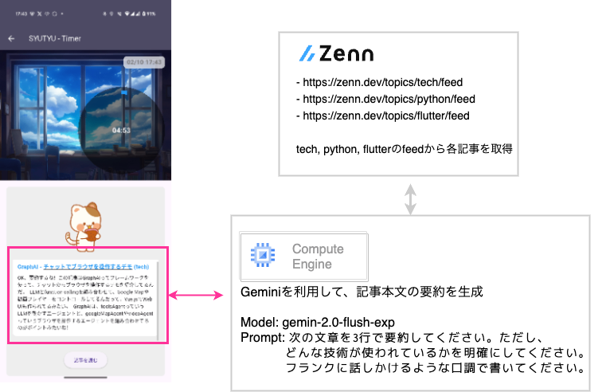
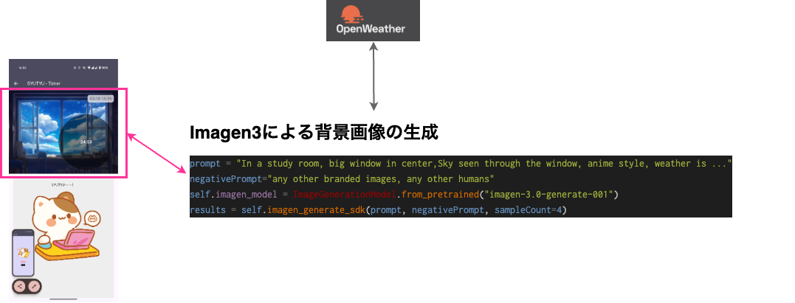

#  Pomodoro✖︎GenAI アプリ SYUTYU TIMER

AIagentHackathon提出用の記事です

<https://zenn.dev/hackathons/2024-google-cloud-japan-ai-hackathon>

##  アプリの説明

Pomodoro✖︎GenAI によるポモドーロアプリです  
ポモドーロテクニックを使ったパフォーマンス改善をお手伝いします！

##  デモ動画

<https://www.youtube.com/watch?v=A9GFYHBZthM>

##  ユーザー像

ポモドーロテクニックを使っている、社会人や学生など

##  課題

ポモドーロテクニックを愛用する社会人や学生の皆さん、こんな悩みはありませんか？ 『集中して生産性を上げたいのに、いつの間にか休憩が延びてしまい、5分のはずのブレイクが10分、20分、時には50分にまでなってしまう..  
生成AIを活用して、あなた専用のセリフや背景を生成し、休憩時間に新たな刺激とリフレッシュ効果をもたらします。  
これにより、マンネリ化した休憩を打破し、集中力と生産性を劇的に向上させることが可能です。  
短い休憩時間を最大限に活かして、毎日のパフォーマンスをアップさせましょう！

##  アプリの動作

基本的には25分作業+5分休憩を繰り返します

###  1\. 作業中

  * 作業中は右上に円形プログレスバーが表示され、残時間がわかります
  * 背景は東京の天気からImageGen3で作成した画像が表示されています
  * 開始、終了の合図はGeminiでセリフを生成しているので、毎回少し違ったセリフになります
  * なるべくマンネリ化を防ぐために開始、終了の合図、背景画像などは毎回違うようになるように複数個生成しています

###  2\. 休憩中

休憩中は、右上に休憩時間が表示されます  
休憩中はボタンを押すことによって、暇つぶしのコンテンツを表示するようになっています。

####  トレンドフィード要約&読み上げ機能

記事を読むボタンを押すと[zennのトレンドフィード](https://zenn.dev/)から最新の記事を取得し、その要約を読み上げるようになっています  
zennのフィードはtopicごとに取得できるので、今回はtech, flutter, pythonの3つのトピックを取得し  
GeminiでSummarizeし、texttospeechで読み上げた音声を作成しています

####  podcast 要約&読み上げ機能

特定のpodcastの最新のエピソードを取得し、Geminiによる文字起こし

  * Geminiの文字起こし
  * Summarize
  * texttospeechで読み上げる

を実施しています。今回は[rebuild.fm](https://rebuild.fm/)の最新エピソードを取得し、要約と読み上げを行っています  
休憩時間が終わると作業時間に戻るようになっています。

##  利用技術

###  Androidアプリ

  * Flutter

###  Backend

  * GCE
  * Flask(API)
  * Redis(DB)
  * nginx(HTTP)
  * python(Geminiとのやりとり)

###  AI系

  * ImageGen3
  * GeminiAI 2.0
  * TextToSpeech
  * SpeechToText

##  システム図

  * データのクロール、Geminiのセリフ生成、texttospeechの音声生成をデイリーのバッチ処理で実行
  * 生成されたデータを、文字列はRedisに保管、音声データはファイルとして配置し、nginxで配信

##  記事のクロールと要約の生成

  * Zennのfeedから最新の記事を取得
  * Gemini2.0のモデルで要約を生成しています

##  背景画像の生成

  * その日の天気によって背景画像が変わります
  * imagegen3.0を利用して生成しています
  * openweathermapのAPIから地点の天気、最高気温、最低気温を取得(今のところ東京のみ)、"窓から見える空"のようなPromptを作り画像を生成しています。
  * prompt 例

    
    
    "In a study room, big window in center,Sky seen through the window, anime style, weather is " + str(weather) + ",Maximum temperature is " + str(tmp_max) + " celcius, Minimum temperature is " + str(tmp_min) + " celcius"
    

##  podcastの文字起こし〜要約

  * mp3のurlをgemini-2.0-flash-expのモデルに渡して、文字起こし
  * 文字起こしされたものをブログ記事と同様に要約化しています

##  まとめ

  * Pomodoro✖︎GenAIGenのポモドーロアプリを作った
  * なるべく、毎回違うものを生成(画像、記事、セリフetc)するようにしてマンネリ化対策をしました
  * よろしくお願いします！！！

