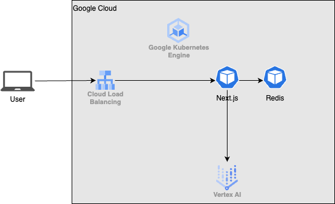
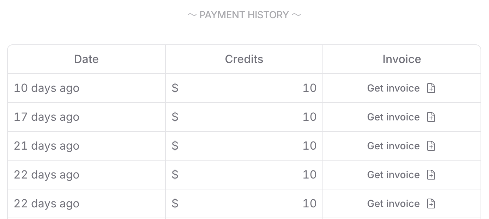

#  はじめに

本記事は[こちら](https://zenn.dev/hackathons/2024-google-cloud-japan-ai-hackathon)で開催されているイベントに向けたアプリケーション開発の記事です。  
元々、周りの人と話す中で漠然と複数の生成AIチャットを組み合わせてディスカッションさせたり、ロールプレイさせたり、戦わせたりすると面白いんじゃないか、ちょっとネタアプリみたいなものを作ってようというノリで作り始めてたところにちょうど良いイベントが開催されていたので応募してみました。以下はこのイベントに沿った課題記事になります。

#  ユーザー像と課題

ユーザー像と課題は上記の通り元々ネタアプリで始まったので後付けにはなってしまうのですが、  
ユーザー像は「生成AIチャットボットの開発に興味を持つ人」で課題は「効果的なコンテキストや指示文の作成方法を実践的に学ぶ機会が限られていること」と仮定しています。今回作成したアプリケーションで仮定したユーザー像の人に課題を解決するための場所の提供ができればと考えています。  
チャットボットの性能を向上させるためには、様々な対話パターンを試行錯誤する必要があると認識していますが、そのプロセスを楽しく行えるようなアプリケーション開発を目指します。

#  本アプリケーションの特徴

このアプリケーションの特徴は以下の通りです。

  * チャットができるWebアプリケーションです。
  * 利用者はチャットルームを作り、URLを共有することで他のユーザーを招待することができます。 
    * 簡易的なチャットルームとしたいのでログイン機能は実装しません。（将来作るかもしれませんが）
  * 利用者は生成AIチャットボットを作ることができます。作ったチャットボットはテンプレートとして保存して他のルームでも使用可能にできます。
  * 生成AIチャットボットに対してメンションすることでチャットボットと会話することができます。
  * 複数の生成AIチャットボットにメンションすると生成AIチャットボット間で対話させることができます。 
    * 例えば、`@bot-a @bot-b`とメンションすると`bot-a`から`bot-b`に話しかけることができます。`@bot-a @bot-b @bot-a`とすると`bot-a -> bot-b -> bot-a`という順番で会話が進みます。 
      * 現段階はシリアルな動作のみ実装しています。
  * ルーム内のチャット履歴は全ての利用者が閲覧できます。

###  このアプリケーションの拡張性

上記機能により単純な話相手とするだけでなく、チャットボット間の会話機能によりロールプレイをさせて頼んだり、想像力を膨らませたりすることができると考えています。アレンジの幅が広いのでこれ以外に活用できるかもしれません。今想定していることとしては例えば、歴史上の人物（織田信長、豊臣秀吉、徳川家康とか）チャットボットを作り会話させて歴史上の出来事を記憶させやすくする「**学習** 」とか、歴史上関わることのなかった人物同士を会話させたらどんなものが生まれるのかを観測する「**実験** 」、アニメキャラクターを演じさせて自分がその世界観に入って会話を楽しむ「**体験** 」とか、そんなことを考えています。自分が求めるキャラクター像を作る時にプロンプトを繰り返し編集するので自然とプロンプト生成能力が向上していくことを期待しています。  
つまりこのアプリケーションは、チャットボット開発の学習を実践的かつ楽しい体験として提供し、ユーザーが創造的に実験できる環境を実現します。

#  システムアーキテクチャ

本システムが稼働するシステムはGKE上にホストしました。おぼろげながら浮かんできたんです。GKEという単語が。インフラにかけるコストのことを考えるとCloud Run + Firestoreという組み合わせが最適なんだろうと思います。ただ、今回はKubernetesを使いたいというだけの理由でGKEを採用しました。普段の業務と違って自由なアーキテクチャを採用できるので、絶好の学習の機会だと思って選択しました。強いてあげるなら可搬性や、拡張性が優れている認識なので、今後の開発効率は上がるんじゃないかなと思っています（願望）。プロンプト管理のLangfuseとか今後使ってみたいツールをhelmで簡単にプロビジョニングできそうなのでそういう点も利点になるかもしれないなと思っています。データストア部分はプロトタイプ開発という段階なので実装が簡単なRedisをGKE上に一旦ホストしてますが、この部分は最終的には永続化データを置くのでFirestoreとかに変えると思います。

GKEはコントロールプレーンにもお金がかかるので個人開発の範囲では厳しいんじゃない？と思われるかもしれません。まぁ実際お金はかかるのですが、Google Cloudが提供する最高のプログラム[Innovators Plus](https://cloud.google.com/blog/ja/topics/training-certifications/six-things-you-can-do-with-500-in-google-cloud-credits)を契約してクレジットが余っていたので目一杯使っていこうと思います。資格バウチャーもついて、資格取得で合計$1,000/年クレジットがつくので個人開発・学習でGoogle Cloud使ってる全ての人におすすめです。

Webフレームワークはフロントエンド・バックエンドともにNext.jsを採用しています。Next.jsを学ぶ機会があったので、特に他のフレームワークと比べてこちらを採用したわけではないです。Redisへのアクセス部分にはSSR、Websocket周りはAPI Routesで実装してみました。Typescriptだけで作れるのは楽でした（ほとんどClineがやってくれたけど）。今回生成AIチャットボットの要になるのはVertex AIですが、このNext.jsアプリからVertex AI SDKでアクセスしています。モデルはトークン単価が安くお財布に優しいGeminiを採用しています。最終的には複数のモデルからユーザに選ばせたり、ユーザ持ち込みのAPIキーでのモデル選択もできるようにしたいと思っています。チャットの履歴を全部食わせるとコストが膨らんでしまうので、この部分をどう効率よくLLMに渡すかは悩み中で、今後改善できたら良いと思います。現状はシンプルに直近のいくつかの履歴だけを渡すようにしています。

#  デモ動画

本アプリケーションのデモ動画です。  
<https://youtu.be/mjNE3eha9W4>

#  さいごに

このアプリケーションはまだまだ未完成ではありますが、とりあえず想定していた動きをさせることはできました。私のエンジニアとしての経験としてはインフラ（特にAWS）が大部分を占めており、アプリケーション開発においてはUdemyなどで基礎的な講座はいくつか受けたことはあるものの、実開発で自身でコーディングしたことはなく、Google Cloudもまだまだ経験が浅いという状態です。そのレベルでも生成AI(特にPerprexity, Cursor, Cline, OpenRouterあたりを愛用してます)を活用することで思いついたものを2週間くらいでさっと作るということができました。割合としては7:3くらいでほとんどの部分はClineが書いてくれました。作っていて、雑な書き方やロジックの重複、セキュリティ的にまずい実装を提案してくることがありました。やはりAIに頼り切りになるのではなく、AIが作ったものを正しく評価できるだけの知識や経験は重要だと感じたので引き続き研鑽を続けたいと思います。

個人開発はいつかやろうと思っていつもやらないという状態が続いていたので、きっかけがなければなんだかんだ業務が忙しいとか理由をつけて、ずっとやらなかったと思います。今回のような機会を設けて頂いたクラスメソッドさんには感謝です。ありがとうございました。

#  おまけ

Clineで使うLLM ModelにVertex AIを使えばInnovators Plusのクレジット内でいけると踏んでたのですが、以下のようなエラーが出て、解決できなかったので諦めました。
    
    
    429 [{"error":{"code":429,"message":"Quota exceeded for aiplatform.googleapis.com/online_prediction_requests_per_base_model with base model: anthropic-claude-3-5-sonnet. Please submit a quota increase request. https://cloud.google.com/vertex-ai/docs/generative-ai/quotas-genai.","status":"RESOURCE_EXHAUSTED"}}]
    

ちょっと調べてみたところ、[こちら](https://github.com/cline/cline/issues/651)にissueを見つけたものの解決策なしでクローズされていました・・・いつか使えるようになるといいなぁ。  
今回は諦めてOpenRouterを使いました。  
  
Cline + OpenRouterでかかった費用です。参加賞のクレジットで返ってくるはずなので、許容です。
