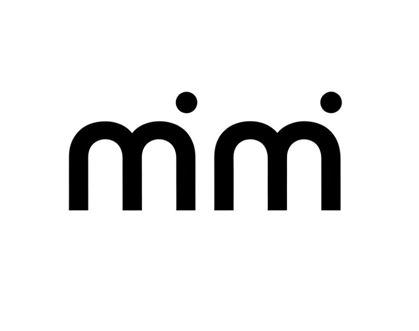
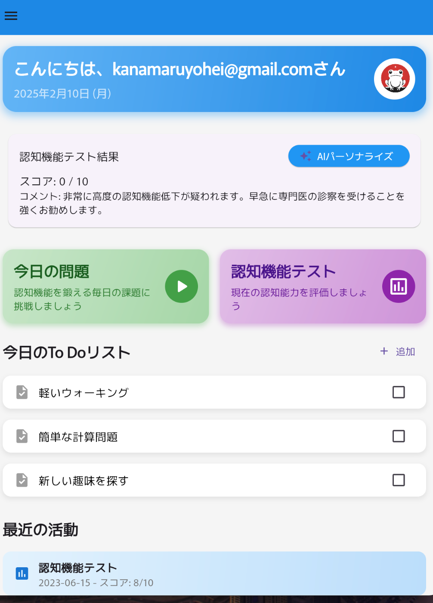
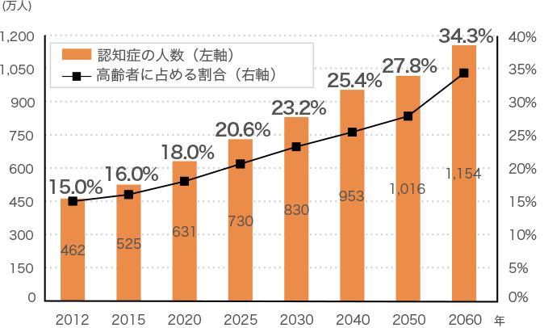
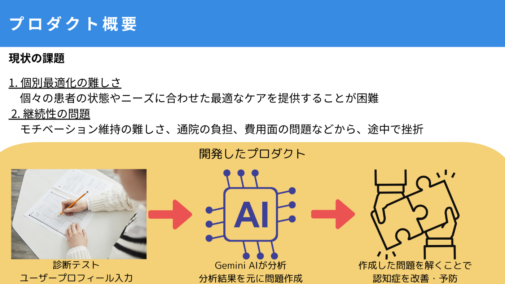
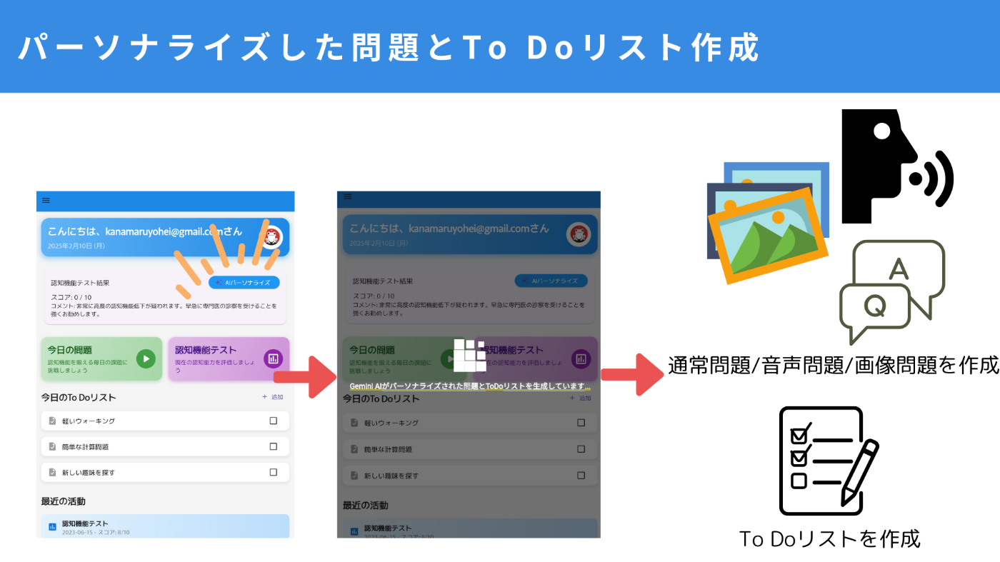
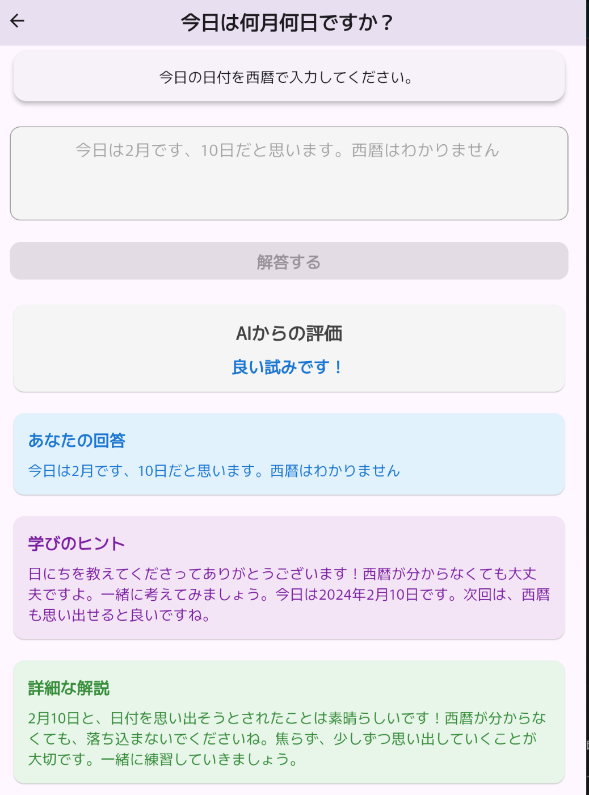
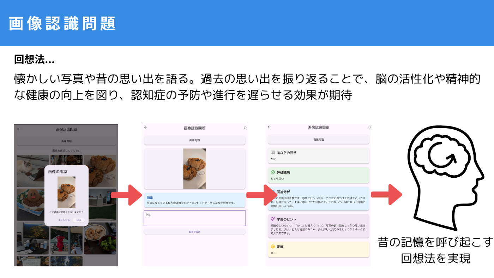
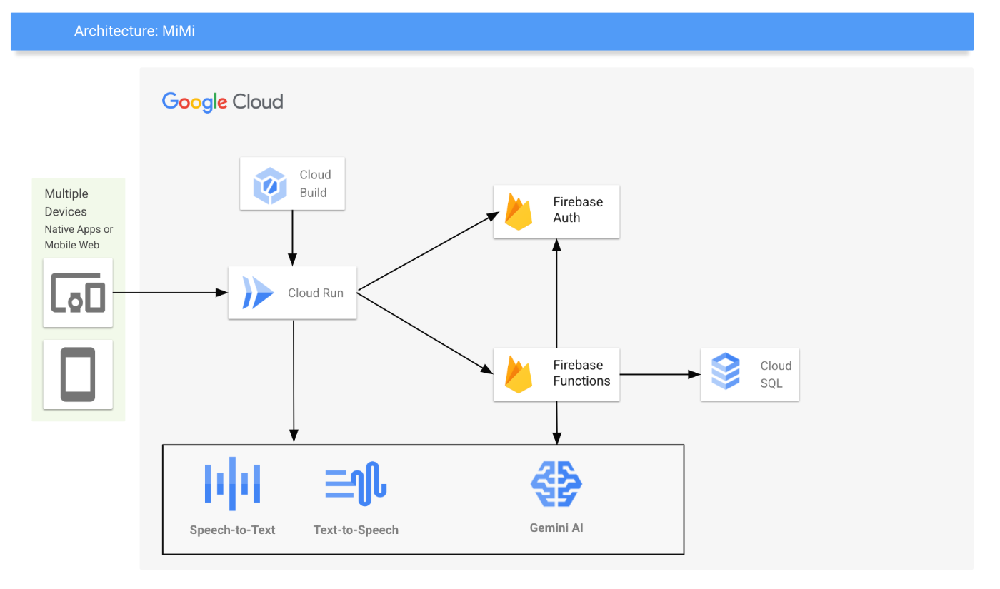

#  認知症予防・改善アプリ『mimi』

このアプリは [AI Agent Hackathon with Google Cloud](https://zenn.dev/hackathons/2024-google-cloud-japan-ai-hackathon)の参加アプリになります。

##  プロダクトの概要

今回、AI技術を活用した認知症予防・改善アプリとなる『mimi』を開発しました。  
従来の認知症予防・改善アプローチの課題を克服し、個々のユーザーにパーソナライズされた、継続可能な認知機能の維持・向上支援を促すプロダクトを目標としました。

**mimiの3大機能**

  1. ユーザーの基本情報（年齢、性別）や認知機能レベル（正誤、苦手な問題の傾向など）、生活習慣（運動習慣）などの情報を基に、Gemini APIを用いて最適な認知機能訓練の問題とTo Doリストを自動生成されます
  2. 認知機能訓練問題は、テキスト入力型問題に加え、画像認識問題や音声問題にも対応。飽きさせない工夫を考えています。例えば、画像認識問題では、ユーザーの過去の写真を利用し、懐かしい思い出を呼び起こすことで、回想法の効果も期待できます。
  3. Gemini APIの活用により、問題の難易度を自動調整。常に適切なレベルの問題を提供することで、モチベーションの維持に繋げます。

プロダクトURL: <https://mimi-hackathon-36692564230.us-central1.run.app/>

_開発デモ画面_

##  プロダクトが解決する課題

認知症は、現代社会が直面する最も深刻な課題の一つです。世界保健機関（WHO）の報告書によると、世界の認知症有病者数は現在約3,560万人に上り、2030年には6,570万人、2050年には1億1,540万人と、驚異的なペースで拡大していくと予測されています。

_日本における認知症の人の将来推計(<https://www.tr.mufg.jp/mamori/dementia/>)_

##  ターゲットユーザー

「mimi」は、以下のようなユーザーを想定しています。

  * **初期段階の認知機能低下が気になる方:** 日常生活で少しずつ物忘れが増えてきたと感じる方。例えば、冷蔵庫に何を入れたか忘れてしまう、同じことを何度も聞いてしまう、といった症状に不安を感じている方。
  * **認知症予防に関心のある高齢者:** 健康寿命を延ばし、いきいきとした生活を送りたいと考えている方。趣味や旅行など、アクティブな生活を維持するために、認知機能の低下を未然に防ぎたいと考えている方。
  * **認知症の家族をサポートする方:** 家族の認知機能維持・改善を支援したいと考えている方。介護の負担を軽減し、家族とのコミュニケーションを円滑にしたいと考えている方。

##  既存の予防・改善アプローチの課題

認知症の予防・改善には、早期発見・早期治療が重要です。現在、薬物療法や非薬物療法（認知機能訓練、運動療法、回想法など）が提供されていますが、これらのアプローチにはいくつかの課題があります。

  * **個別最適化の難しさ** 認知症の原因や症状は人それぞれ異なるにも関わらず、画一的なアプローチになりがち。
  * **継続性の問題：** モチベーション維持が難しく、通院負担や費用面から継続が困難。
  * **見逃しのリスク：** 軽度認知障害（MCI）段階での早期発見が難しく、適切な介入が遅れる。

##  本プロダクトのアプローチ

今回のハッカソンで開発したアプリ『mimi』は、この課題をGemini AIを活用することで解決しました。具体的には、Gemini AIが、

ユーザープロフィール

  * **患者の基本情報（年齢、性別）**
  * **認知機能レベル（正誤、苦手な問題の傾向など）**
  * **生活習慣（運動習慣）**

などの情報を総合的に分析し、個々の患者に最適化された認知機能訓練の問題とTo Doリストを自動生成します。

また、認知機能訓練問題では通常のテキスト入力型問題に加えて画像認識問題と発話問題を実現することができました。それぞれ、Gemini AIとSpeech To Text/Text To Speechを使用して実装しています。

_現状の課題とプロダクトの概要_

#  新規性

チームでの調査の結果、認知症改善・予防を目的としたサービス・アプリは少なく、また、ベストな方法が確立できていない状況です。それらの状況を踏まえて、今回AIを用いた開発を行ったことから以下の新規制があると考えています。

  * **AIによる個別化されたリスク評価と予防策:** 画一的なプログラムではなく、一人ひとりの状態に最適化された問題を提供。
  * **認知機能低下の兆候の早期検出:** 長谷川方の診断テストをアプリを通して実施すること初期段階での認知機能の変化を検知し、早期介入を促す。
  * **継続利用を促す工夫:** ゲーム要素やTo Do機能により、ユーザーの継続的な利用を促進。

#  機能仕様

##  認知症診断問題(長谷川式)

認知症診断問題には[長谷川式の評価方式](https://www.sompo-egaoclub.com/articles/topic/852)を採用しています。採用理由は日本で広く使用されている認知症スケリーニングテストであるからです。

最初にログインしたユーザーはこの診断テストを解く必要があります。解答の後に他のサービスが使用可能になります。

##  パーソナライズした問題とTo Doリスト作成(Gemini AI)

ユーザーが解いた診断テストの結果やユーザープロフィールを基にGemini APが問題とTo Doリストを作成してくれます。

Gemini APIはJSON形式でデータを返すことを指示し受け取った値をパースすることでそれぞれの問題を管理します。Gemini APIは2.0-flash modelを使用しています。

_診断テストに応じてパーソナライズした問題とTo Doリスト作成_

##  通常問題(Gemini AI)

通常問題では、回答の正誤判定にGemini AIを使用しています。

単純な正解不正解の判定だと「微妙なニュアンスの正誤判定が難しい」「不正解とすることで認知症患者にプレッシャーを与えてしまう」という理由で**Gemini AIを使用することでより柔和な正誤判定** を実現することができました。

##  音声問題(Speech To Text/Text To Speech)

音声問題では、Speech To Text/Text To Speechを利用して発話を促しています。発話をして会話することが認知症の予防・改善に繋がるためです。  
最初のGemini AIが作成した問題をText To Speechで問題文を読む→ユーザーの回答をSpeech To Textで正誤判定をしています。音声問題も通常問題と同様にユーザーの回答のレベルに沿って柔和な正誤判定することを目標としています。

<https://www.youtube.com/watch?v=Fr_AyAmL1mw>

##  画像認識問題(Gemini AI)

画像認識ではGemini AIを使用しております。画像から問題文を作成し、問題に回答することで画像認識能力を向上することが狙いです。

また、認知症予防・改善の方法の一つとして**回想法** というものがあります。これは日常的に以前の記憶を呼び覚ますことで脳の記憶を司る機能を活用するものです。  
ですので、**ローカルストレージから写真を読み込む → 写真から問題を作成する → 問題に回答することで以前自分が撮った写真からその時を記憶を呼び起こすことで回想法を擬似的に実現** することができました。

(現状はプリセットされた画像からしか問題を作成できないですが、それぞれのローカルストレージの写真を読み込んで問題作成することが本来の目標でした)

_画像認識問題_

##  デモ動画

<https://www.youtube.com/watch?v=VWMSSFiO0E0>

#  システムアーキテクチャ

##  システムアーキテクチャ図

_システムアーキテクチャ図_

##  コンポーネント

フロントエンド: Flutter  
バックエンド: Node.js/Express  
GCP環境: Cloud Run/Firebase Auth/Firebase Function

#  やりきれなかったことと今後の展望

##  やりきれなかった部分

今回のハッカソンでは時間的な制約があり、以下の機能実装を見送りました。今後の開発で実現したいと考えています。

  * **認証をIPASSからpasskeyへ変更：** セキュリティ強化のため、より安全な認証方式への移行。これはセキュリティを考慮しても対象となるユーザーのことを考慮しても、passkeyの方が安全で忘れることがないため良いはず
  * **端末に保存された画像からユーザー独自の記憶想起問題の作成：** ユーザーがアップロードした写真から、AIが自動で問題を作成する機能。より、パーソナライズされた問題で楽しく問題を解けるのではないかと考えていたため作成したかったです。
  * **日々の進捗管理や達成度に応じた問題作成：** ユーザーの進捗状況に応じて、問題の難易度を自動調整する機能、細かい管理と日々の変化への対応がAIが向いている領域であるため相性が良いはずだと考えています。

##  今後の展望

今後の展望としては、以下の点に取り組んでいきたいと考えています。

  * **継続的なデータ収集とAIモデルの改善:** 蓄積されたデータを用いてAIモデルを継続的に改善し、精度向上を目指します。よりパーソナライズされた問題を提供できるよう、学習データを拡充していきます。
  * **医療機関や介護施設との連携:** 医療機関や介護施設との連携を強化し、実証実験を通じて効果を検証します。実際の現場での利用を通じて、課題や改善点を見つけ出していきます。
  * **ユーザーコミュニティの形成:** ユーザー同士が情報交換や交流できるコミュニティを形成し、継続的な利用を促します。ユーザー同士の交流を通じて、モチベーションを維持し、新たな機能のアイデアを得たいと考えています。
  * **多言語対応:** 将来的には、多言語対応を行い、グローバル展開を目指します。世界中の認知症予防に貢献できるアプリに成長させたいと考えています。

#  まとめ

今回のハッカソンで開発した「mimi」は、認知症予防・改善に貢献できるアプリだと考えています。AI技術を活用することで、個々のユーザーに最適化された、認知機能維持・向上支援を実現できました。  
今後もAI/AI Agentの技術的躍進に注目しながらプロダクト開発を進めていきたいと思います。

本記事を通して、少しでも多くの方に認知症問題に関心を持っていただき、AI技術を活用した解決策に関わって頂ければ幸いです。

「mimi」は、まだ開発途上のアプリですが、皆様からのフィードバックを基に、より良いアプリへと成長させていきたいと考えています。ぜひ、ご意見・ご感想をお聞かせください。
