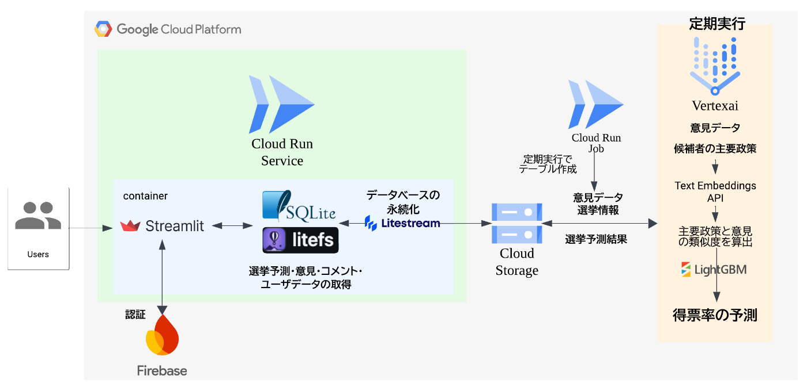

##  プロジェクトの概要

「日本国民は政治に関してどのような意見を持っているのか？」をリアルタイムで可視化し、AIで選挙結果の予測ができるアプリケーションを開発しました。

##  はじめに

現代社会において、多様な政治意見の満足度やトレンドを正確に把握することは、政策立案者や一般市民、メディア関係者にとって重要です。近年、東京都知事選や兵庫県知事選でネットメディアの影響力がオールドメディア（テレビ・新聞）を凌駕する事例がありました。さらに、オールドメディアのガバナンスに対する疑問（フジテレビの問題）があり、中立的で透明性の高い情報が必要とされています。

そんな中、生成AIを筆頭にAI技術が急速に発展し、AIによる社会のリファクタリングが求められています。中でも特に自然言語処理のブレイクスルーにより、文字ベースのタスクであれば、大学院生レベルの仕事が可能です。

本プロジェクトでは、中立な意見を瞬時に可視化し、収集された意見から新たなインサイトを生み出すアプリケーションを目指し、多くの政治的意見を可視化し、選挙を予測するアプリケーションを開発しました。

##  世論調査の課題

世論調査には以下の課題があります。

  1. 調査対象の限界  
従来の世論調査は対象が限定的で、全体の民意を十分に反映できないことがよくあります。

  2. 調査結果のタイムラグ  
結果が公表されるまでに時間がかかるため、リアルタイムで変化する国民の意見を即時に把握することが難しい。

  3. SNSデータのバイアス  
SNS上の意見は特定の層の影響を受けやすく、真の民意を正確に捉えるのが困難。

特に調査対象が限られていることは、インターネットをうまく活用すれば解決できると考えています。しかし、今のところそのような試みは行われていません。

##  誰にとって、どんな役に立つのか？

  * **政策立案者** : 政策の方向性を決定し、社会に有益な改善を立案するための有権者の母集団に近い意見をリアルタイムで提供。
  * **国民** : 自分の意見が社会全体の中でどのように位置づけられているかをリアルタイムで把握し、投票行動や社会的議論に活用できる。
  * **メディア関係者** : バイアスの少ないデータを使い、政治記事や報道・政治情勢分析の基礎データとして活用できる。

このアプリケーションで多くの意見を集めることができれば、多くのステイクホルダーにとってメリットがあります。

##  何ができるか

本プロジェクトは、以下の機能を提供します。

  * **データ可視化** : 地域別、年代別、性別ごとに政治意見を可視化し、国民の意見を直観的に理解できる機能を提供します。
  * **リアルタイム更新** : Cloud Storage を利用して政治意見データをリアルタイムで更新し、常に最新の情報を提供します。
  * **選挙予測** : 収集されたデータを基に、直近の選挙における得票率予測を行い、高い確率で選挙結果を予測できます。

##  どのように実現するか

###  技術構成

上記のアーキテクチャ図に示されたように、本プロジェクトは Google Cloud Platform (GCP) を使用して構成しました。

  1. **インターフェース:**

     * **Streamlit** を用いたウェブアプリで、ユーザーからの政治意見や選挙予測の入力を受け付けます。
     * **Firebase** による認証機能を搭載し、ユーザーのログインとデータ管理を簡単に行います。
  2. **データ管理:**

     * **SQLite** をローカルデータベースとして使用し、**LiteFS** により分散環境での高速アクセスを実現。
     * **Litestream** を活用してデータの永続化と自動バックアップを行い、**Cloud Storage** に保存します。※
  3. **データ分析と予測:**

     * 意見データを **Cloud Storage** に格納し、**Vertex AI** と **Text Embeddings API** を使用してテキストからベクトルに変換
     * 分析結果は **LightGBM** で処理し、得票率予測モデルを構築。予測結果も Cloud Storage に保存されます。
  4. **インフラ構成の技術要素:**

     * **Cloud Run** : コンテナ化された Streamlit アプリを安定した環境で動作させ、自動スケーリングと高い可用性を実現します。
     * **Cloud Storage** : 大量の意見データを統一的に管理し、分析やモデル学習に活用します。
     * **Vertex AI** : 深層学習モデルを構築し、Text Embeddings API を使用して文書をベクトル化を実施。

※Cloud SQLを使わない理由は費用的な問題です。

###  デモ

<https://youtu.be/EYJl0iNbKBo>

###  想定される一般的なフロー

  1. **ログイン:**

     * Firebase 認証を通じてメールアドレスとパスワードでログインし、ユーザーデータを管理。
  2. **ユーザー情報の入力:**

     * ユーザーは自身の属性情報（性別・年齢・市区町村）と意見を入力。
  3. **ダッシュボードの表示:**

     * 各トピックについての意見状況を可視化し、トレンドを直感的に把握できます。
  4. **トピックの詳細表示:**

     * 個別のトピックに関する詳細な意見情報を表示し、ユーザー間でコメントも可能です。
  5. **意見の送信:**

     * 送信された意見はリアルタイムでデータベースに反映されます。
  6. **データ分析:**

     * 収集された意見データは Vertex AI の Text Embeddings API により分析され、候補者の主要政策との類似度を計算。
  7. **選挙予測:**

     * LightGBM を用いて得票率の予測モデルを構築し、結果を Streamlit アプリで可視化。重要な変化はリアルタイムでユーザーに通知。
  8. **可視化:**

     * 予測結果や意見トレンドをダッシュボード形式で表示し、グラフも自動更新されます。

<https://opinion-galaxy-591561871703.asia-northeast1.run.app/>

##  Future Work

  * アンケートの実施、実際の選挙予測  
現在のアプリケーションでは、ダミーデータを用いているので、最初の実データをウェブ調査を用いて作成する。
  * インタラクティブな可視化機能の追加  
現在の機能は簡易的な実装になっているので、自分で可視化をカスタマイズできるような機能の追加を検討しています。
  * コメントでの討論機能と討論の自動判定の追加  
ネット上での政治の話が最終的に人身攻撃になることがあります。せっかく政治の話をするなら有意義な会話にしたいものです。コメント上の討論で討論を始めるとAIが勝敗もしくは討論の結果をまとめてくれる機能を作ると解決するのではないかという仮説から、この機能を作成することを検討中です。
  * 政府の文書をまとめてAIで、政府の政治活動を要約し、トピックの関連する政策の進行状況を表示  
今の政府が行なっていることって分かりづらくないでしょうか？常に国会に張り付いているわけにもいかないし、情報をメディアから仕入れようとしても、政治についてテレビで報道される時間は限られています。幸いにも、政府はネット上に各省庁から政策決定に関する文書を公開しています。それらを収集しAIに要約してもらうことで、政府の仕事を客観的に評価できるようになることを期待しています。
  * 意見データを用いた分析機能  
意見データをプラットフォーム上で分析し、SNSで発信できると良いなと思っています。Google Colabratoryと相性が良いと思っていますが、埋め込みとかできるようにならないですかね、、、？

##  まとめ

本プロジェクトは、GCP の強力なインフラと機械学習技術を活用して、政治意見の可視化と選挙結果予測を実現するアプリケーションを提供します。政策立案者、一般市民、メディア関係者などがリアルタイムで国民の意見にアクセスできることで、より透明性の高い政治プロセスの促進を目指します。技術的な柔軟性と拡張性も備えており、将来的な機能追加や大規模データの処理にも対応可能です。

久しぶりに小規模なアプリ作りましたがやっぱり楽しいですね。
