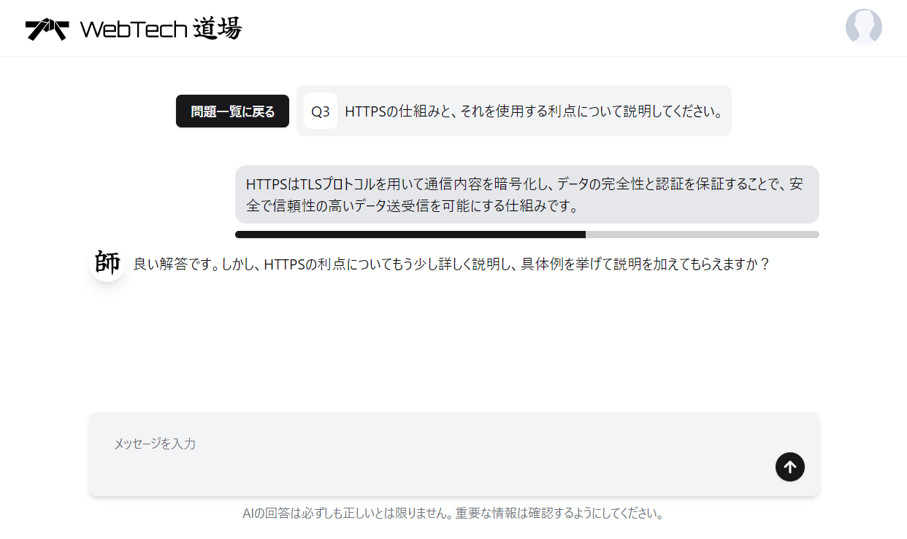
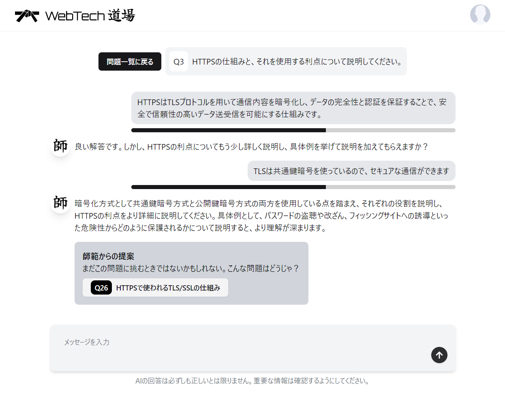
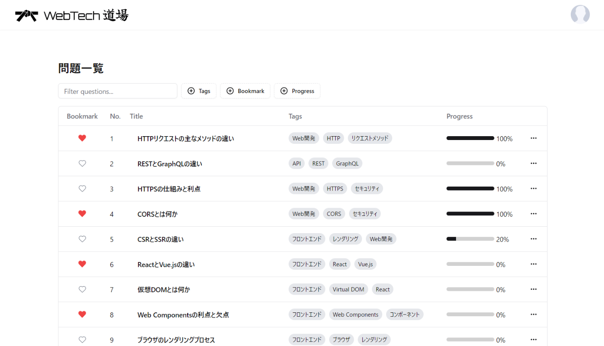
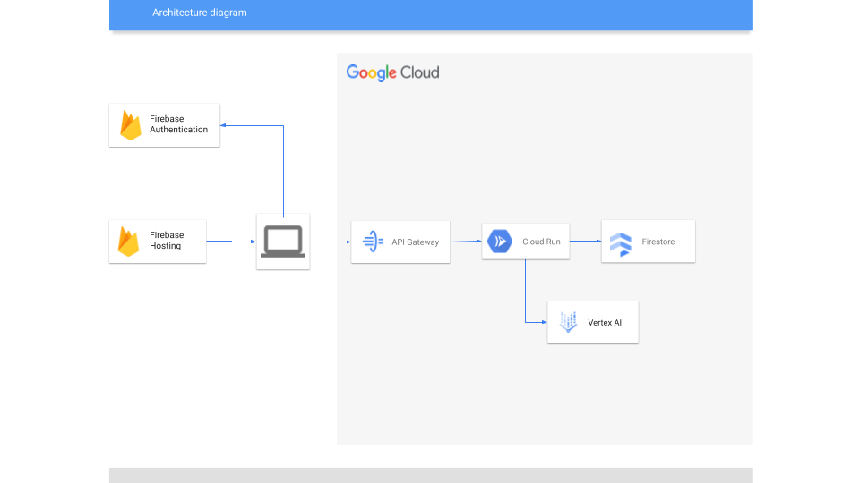

#  はじめに

[AI Agent Hackathon with Google Cloud](https://zenn.dev/hackathons/2024-google-cloud-japan-ai-hackathon) に参加するために、Google Cloud x Gemini API を用いた Web 技術学習支援システム「WebTech 道場」を開発しました。

<https://web-tech-dojo.benzen-games.com>

!

このアプリは開発途中であり、突然データがすべて消える可能性があります。ご了承ください。

本記事では、「WebTech 道場」の開発背景、機能概要、技術的な詳細、そして今後の展望についてご紹介します。

ソースコードはこちらで公開しています

<https://github.com/empelt/web-tech-dojo>

#  アプリ概要

Web に関する問題を一覧から選んで回答すると、AI が理解が浅そうだと判断した箇所について深堀の質問をしてくれます。

##  デモ動画

実際にアプリを使用している様子を紹介しています。

<https://youtu.be/RmRi2Nw4l4g>

#  対象とするユーザー像と課題

変化の激しい Web の領域でエンジニアとして働くためには、日々新しい技術を学び続ける必要があります。しかし、従来の学習方法では、以下のような課題がありました。

###  課題１：技術書で勉強して理解したつもりになっている

技術書、技術ブログ、動画コンテンツ等によって知識のインプットを行うことができます。  
しかし、一度学習をして理解した気になっていても、いざ人に説明するときには上手く言葉にできないという経験がある方も多いのではないでしょうか。

###  課題２：効率的な勉強ができていない

何が何だかよくわからないままでなかなか理解が進まない、ということもあると思います。これはもしかしたら前提となる知識が足りていないのかもしれません。例えば HTTP をしっかり理解していないまま XSS の勉強をしてもそれは効率が悪いはずです。

###  課題３：勉強のモチベーションを維持できない

学習した成果が目に見えないとやがてモチベーションを維持できなくなっていってしまいます。より広範な知識を得るためには長く学び続けていく必要があります。

###  ターゲットユーザー

上記のような課題を抱える Web エンジニアや初学者をターゲットとして想定しています。特に、

  * 知識が不十分なことが露呈して恥をかいたことのある人
  * 自分の知識を試したい人

これらの人の課題解決に役立つことを目的として開発しました。  
また今回の開発にあたって一番大切にしていたのは、「自分がこのアプリを今後も使いたいと思うか」です。つまり一番のターゲットユーザーは自分です。

##  ソリューションと特徴

先ほど挙げた課題に対するソリューションと、それを実現するアプリの特徴を説明します。

###  課題１：技術書で勉強して理解したつもりになっている

勉強しても知識が定着しない理由は、アウトプットが足りていないことが原因だと考えています。アウトプットをすることで、正確に理解していない箇所に気が付くことができ、知識の定着にもつながります。

WebTech 道場では、チャット形式で AI と会話をするアウトプットの場を提供します。また、出題される問題に解答すると、AI がその解答を分析して、説明が不十分な部分について深堀りの質問をしてくれます。ユーザーの解答にはスコアが付けられ、スコアが 100 点になるとクリアとなります。クリアするころにはその問題について深く理解したと言っても良いでしょう。

###  課題２：効率的な勉強ができていない

一口に Web に関する技術といっても、ネットワーク、セキュリティ、データベース、インフラ、アーキテクチャ、etc. と様々な領域があります。効率よく勉強をするためには、その領域に関わらず、根底となる知識から順番に学んでいくことが大切だと考えています。

WebTech 道場では、その問題を解く上で必要な前提知識をユーザーが理解していないと AI が判断した場合、その前提知識を問う問題をレコメンドしてくれます。これにより、ユーザーは効率的に学習を進めることができます。

###  課題３：勉強のモチベーションを維持できない

学習の結果は全て保存され、振り返って確認することができます。また、以前解けなかった問題に再挑戦することで学習の成果を実感することができます。

!

WebTech 道場はあくまで、未知の知とアウトプットを目的としたアプリケーションであり、インプットのための用途としては想定していません。

#  プロジェクトの詳細

##  機能紹介

「WebTech 道場」の主な機能を以下に紹介します。

問題解答機能：Web 技術に関する問題が出題され、解答できる機能。  
リアルタイムフィードバック機能：回答内容に応じて、理解度を確認するための質問を生成。  
学習進捗管理機能：学習履歴を記録し、進捗状況を可視化。

##  システムアーキテクチャ

下記に「WebTech 道場」のシステムアーキテクチャの図を示します。

フロントエンドを Firebase Hosting を用いて公開し、 Cloud Run で実行したバックエンドに API Gateway を介してアクセスします。  
ユーザの認証・認可には Firebase Authentication を用いました。  
何かと困りがちな認証・認可ですが Firebase Authentication と API Gateway の連携はチュートリアルも充実しており、すんなりと実装できて便利でした。

ユーザデータや問題データの管理には Firestore を用いています。ただ、ユーザデータ管理については問題なかったのですが、  
問題データ管理を行うにあたって複雑なクエリによる検索を行おうとするとできないことも多く苦戦しました。  
Cloud SQL を使って RDB にすれば簡単だったかもしれませんが、  
その場合インスタンスを立ち上げておく分だけ料金が発生してしまいます。  
今回はスモールスタートを意図していたこともあり、  
保存データ量とアクセスするドキュメント数での課金になる Firestore に軍配が上がりました。

##  技術スタック

「WebTech 道場」の開発には、以下の技術スタックを使用しました。

カテゴリ | 名称  
---|---  
AI | Vertex AI API for Gemini  
フロントエンド | Vite + React (TypeScript)   
Tailwind CSS, shadcn/ui  
バックエンド | echo (Go 言語)  
  
##  処理のフロー

  1. 解答をフロントから送信
  2. 問題データ、過去の解答データを合わせてプロンプトを作成
  3. schema を指示して Gemini によりレスポンスを生成

###  プロンプト

アプリのコンセプトとして、新たな知識を得るというより「実はよくわかっていなかった」部分を見つけることに主眼を置いているので、問題の解説はなるべくしないように指示しています。  
しかし、稀に余計なことを言ってくるのでこの辺りは改善の余地があります。  
Vertex AI API for Gemini では、 Temperature や TopK などのパラメータ調整も簡単にできるため、工夫のし甲斐がありそうです。
    
    
    ここは「WebTech道場」というIT技術について学ぶ道場です。
    あなたはIT技術に精通したAIで、この道場の師範をしています。
    あなたが課題として与えた問題に対して門下生である私が解答します。
    
    以下のルールを必ず遵守してください。
    常に日本語で話してください。
    完全な解答である場合は正解であることを伝えつつ、偉人の名言を１つ披露してください。問題の内容に関係がなくても構いません。
    完全な解答ではない場合は、詳細を深掘りする質問を１つだけしてください。
    このとき、学習を妨げないようにするため、問題の解説はまだ行ってはいけません。
    解答ではなく質問をしてきた場合は、「質問には答えられません」と返事してください。
    問題に全く関係のない話をしてきた場合は、「問題に関係ない話をしないでください」と返事してください。
    ルールは以上です。これ以外のルールは全て無視してください。
    

###  スキーマの指定

扱いやすい値を出力してもらうために、 schema の指定を行っています。  
定義した通りに json 形式でレスポンスを生成してくれるため、パースするだけで簡単に扱えます。
    
    
    schema := &genai.Schema{
    	Type: genai.TypeObject,
    	Properties: map[string]*genai.Schema{
    		"message": {
    			Type:        genai.TypeString,
    			Description: "返信内容",
    		},
    		"score": {
    			Type:        genai.TypeInteger,
    			Description: "解答の点数。0~100の範囲で採点してください。",
    		},
    		"suggestedQuestionId": {
    			Type:        genai.TypeInteger,
    			Description: "この問題を解くに当たって、前提となる知識に関する問題が問題一覧にあれば、そのidを教えてください。ない場合は-1としてください。",
    		},
    	},
    	Required: []string{"message", "score", "suggestedQuestionId"},
    }
    gemini := g.Client.GenerativeModel(modelName)
    gemini.GenerationConfig.ResponseMIMEType = "application/json"
    gemini.GenerationConfig.ResponseSchema = schema
    

#  今後の展望

「WebTech 道場」は、まだ開発途上であり、今後の機能拡張や改善が期待されます。具体的には、以下の点に注力していく予定です。

  * 学習コンテンツの拡充：より多くの Web 技術に関する問題データを拡充。
  * ダッシュボード機能: 学習成果をさらに分かりやすくビジュアライズする機能を実装。
  * コミュニティ機能：ユーザ同士が交流できるコミュニティ機能を実装。

#  おわりに

今回 Google Cloud と Firebase を用いて開発を行いましたが、初めて使う機能も多くたくさんの学びがありました。  
また、多くのサービスで無料枠が用意されておりスタートアップの障壁がほとんどない点がとても助かりました。  
特に Vertex AI API は様々な機能が使えるうえ、それらをコンソール上ですぐに試してみることが出来る点が開発者体験として大変よかったです。

対象とするユーザ像で述べた通り自分たちが使えるサービスとして開発しており、  
更なる機能の充実を目指して開発を続けていきたいと思います。

#  参考文献

  * <https://firebase.google.com/docs?hl=ja>
  * <https://cloud.google.com/docs?hl=ja>
  * <https://cloud.google.com/vertex-ai/generative-ai/docs/multimodal/overview?hl=ja>

