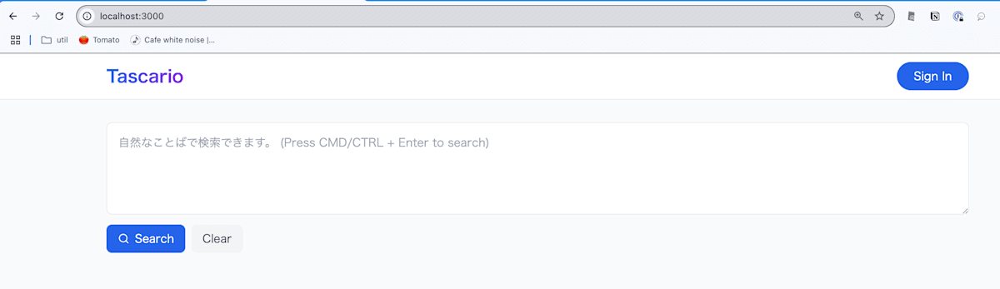
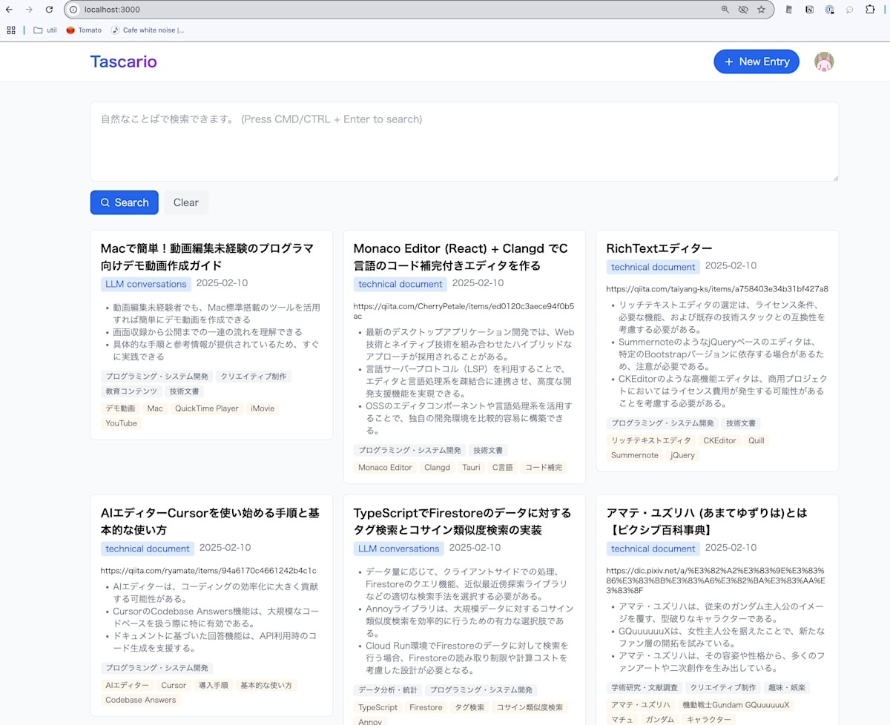
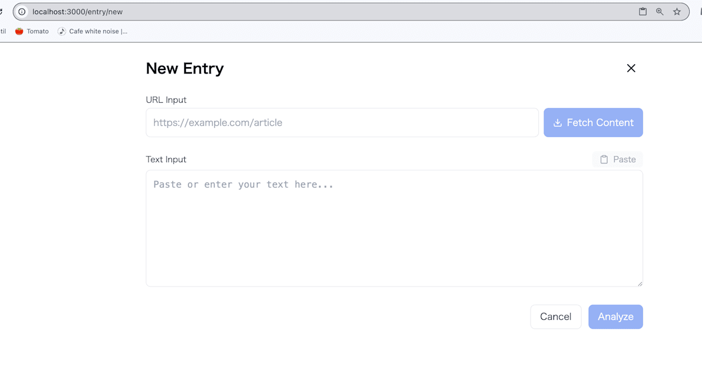
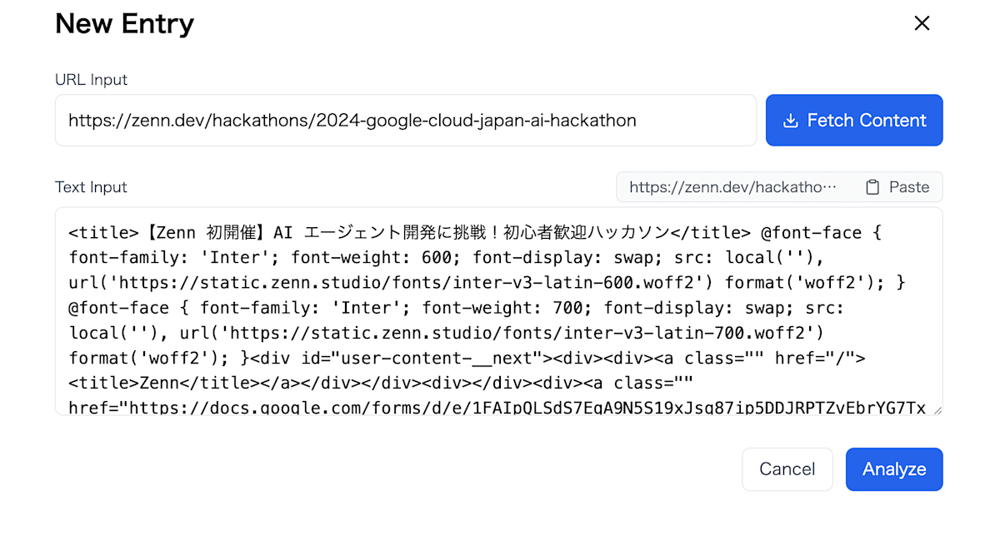
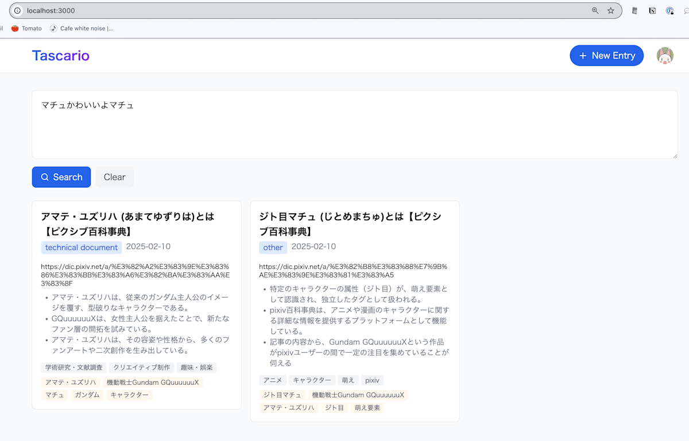
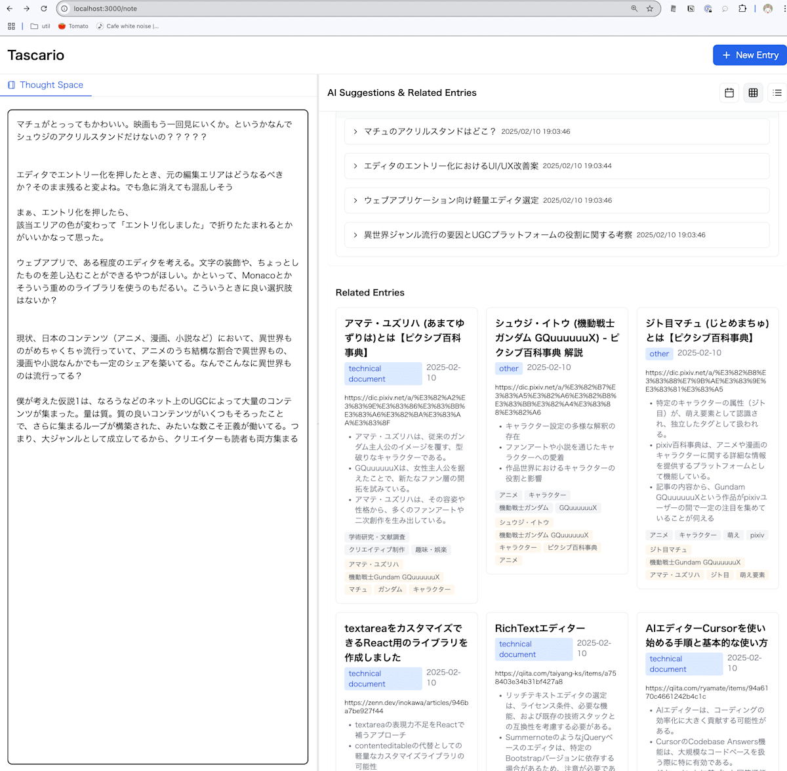

これは [【Zenn 初開催】AI エージェント開発に挑戦！初心者歓迎ハッカソン](https://zenn.dev/hackathons/2024-google-cloud-japan-ai-hackathon) の参加記事です。AI関連の会社に勤めている筆者ですが、完全に個人の資源と時間で、一人で参加したものです。

##  Tascario概要

Tascarioは、技術文書やLLMとの会話のような、日々大量に生じるインプットをGemini-2.0-Flashを使っていい感じに分析して、人間の思考負荷を減らして助けるためのプロダクトです。

  * 記事を取り込んで分析して、今読むべきか？得られる知見は何か？その記事から得られる洞察、取るべきアクションなどが分析されます
  * 自然な言葉で取り込んだ記事を検索して、今ほしい情報を取り出すことができます

<https://github.com/erukiti/tascario-public>

でAGPLですが、ソースコードを公開しています。正直、ぐちゃぐちゃなコードなので、こういうのもあるんだ、くらいの参考にしかならないと思いますが、見てみてください。

##  対象ユーザー

日々の情報に溺れている人。思考負荷を下げたい人。

###  想定ユースケース1

ChatGPT Plus/Pro, Google One, Claude Professional, Perplexity Proなどと契約して会話しまくってる人。

  * o1/o1-proのような、めちゃくちゃ賢いけどレスポンスの遅い会話は、大量に窓を開いて文章を投げて後でゆっくり確認するみたいな使い方をしがちです。
  * 同様に、複数のAIサービスを活用して、それぞれの回答の違いを参考にするという使い方もあります。

大量に会話が発生してそれらを管理しきれなくなるという問題があります。そこで、全部の会話を保存して、AIでいい感じに処理します。

ソリューション:

  1. 会話をしまくる
  2. その会話を保存してAIで分析する
  3. あとでAIで検索する

###  想定ユースケース2

日々大量の技術記事や、技術と無関係な情報と、色々なインプットがあるとして、それら全部を読むとそれだけで日が暮れてしまいます。どれを今読むべきか判断したいしところです。

また「後で読む」は本当に必要になったときに読みたいですが、本当に必要になったときというのを人力で実現しようとするととても大変です。検索ワードが完全一致しないと探せない、そもそも細かいことを覚えていない。なのでAIでいい感じに検索したいところだし、そもそも、自分の文脈に合わせて、勝手にサジェストしてほしいです。能動的に検索したくない。

ソリューション:

  1. 記事を取り込んでAIで分析する
  2. 分析結果を読んで、今読むべきか判断をする
  3. あとでAIで検索する、もしくはnote機能に思考を垂れ流すことで、「今読むべき記事」を勝手にAIがサジェストしてくれる

##  アーキテクチャ

Tascarioは、Google Cloud Platform上で動作する文書管理・分析システムです。

  * アーキテクチャ面では、T3 Stack（Next.js、React、TypeScript）をベースとしたアプリケーションがCloud Run上で動作しています。
  * データストアとしてFirestoreを使用し、テキスト分析にはVertex AIのLLMとEmbedding機能を活用しています。

主なユーザー操作は以下の4つです：

  1. 記事の登録：ユーザーが記事を投稿するとFirestoreに保存されます。同時に、Vertex AIを使用してLLMによる分析と、embeddingの生成を行い、記事本文と一緒にFirestoreに保存します。 
     * URLを指定した場合、バックエンドがプロキシになって記事を取得します
  2. ダッシュボード表示：ユーザーがダッシュボードにアクセスするとFirestoreから記事の一覧を取得して表示します。
  3. 記事検索：ユーザーが検索バーで検索を実行すると、以下のプロセスが走ります： 
     * まずFirestoreから全記事とそのembeddingを取得
     * Cloud Run上のアプリケーションメモリ内でコサイン類似度を計算
     * 類似度の高い記事をさらにLLMで判定して、関連する記事として返して、フロントエンドに表示
  4. ノートを書く。debounseされた自動保存+分析が走って、ちょっと時間がかかるけど関連したエントリが表示されます。

フロントエンドとバックエンドはtRPC APIを介して通信をしています。

このように、フロントエンドのすべての操作はtRPC APIを介してバックエンドと通信し、必要に応じてVertex AIやFirestoreと連携しながら処理を行う設計となっています。

##  導入方法

まず、インフラを構築してください

  * Google OAuth2
  * Cloud Run
  * VertexAI
  * Firestore
  * これらを使えるサービスアカウントの作成

僕はインフラが苦手過ぎて泣きながらやってたので、再現手順が最早わかりませんが、きっと皆さんならできるはずです。

<https://github.com/erukiti/tascario-public> がリポジトリです。  
クローンなりしてください。

`.env` ファイルに必要な情報を保存します。

  * `NEXTAUTH_SECRET` ランダムな文字列でいいです
  * `NEXTAUTH_URL` 認証用URL
  * `GOOGLE_CLIENT_ID` Google OAuth2 で使うClientID
  * `GOOGLE_CLIENT_SECRET` Google OAuth2で使うClientSecret
  * `GOOGLE_APPLICATION_CREDENTIALS` 動作に必要な権限を付与したサービスアカウントのJSONファイルのパス
  * `GOOGLE_APPLICATION_ID` Google CloudのアプリケーションのIDです
  * `GOOGLE_APPLICATION_LOCATION` Cloud Runなどの動くロケーションです。 `asia-northeast1` なら東京（ただし、現状VertexAIのgemini-2.0-flash-001はus-central1でしか動いてないので、Geminiへのアクセスだけロケーションを無視してus-central1にアクセスしてしまいます）

    
    
    npm i
    npm run dev
    

localhost:3000 で起動するのでアクセスしてみてください。

`Sign In` を押してGoogle経由でサインインしてください。

この画像では既に記事がある状態ですが、最初は記事が無いので、`+ New Entry` を押してください。

たとえば、気になるURLを、URL Inputに貼り付けてFetch Contentを押してください。

このように記事が取得できていれば `Analyze` ボタンを押してください。

すこーし、時間がかかりますが分析が完了したら、解析済みページに遷移します。

  * 概要
  * こういうときにこういうときに読みたい
  * 得られる知見
  * キーワード
  * 洞察
  * AIからの推奨

などが表示されます。

左上のボタンを押すとトップ画面に戻ります。

今度は、トップ画面の上部にある検索ボックスに文章を入れてみましょう。結構時間がかかってしまいますが、入力した文章に合わせた記事が表示されます。

###  完全ではないがノートを書く機能

細かいチューニングとか含めてノートを書く機能が間に合わなかったんですが、一応実装されています。

`http://localhost:3000/note` にアクセスしてみてください。

元々、僕は日々、Obsidianのdaily noteに、思考を垂れ流しながら、色々設計やTODO管理などあらゆることをしていて、外部の脳みたいに使っているんですが、それを再現しつつ、AIでサジェストがされるのを作りたかったのでした。というか、僕は「僕の考えた最強で最終のノート」を作りたい。

  * 結構遅い
  * その割に現状でのプロンプトで出せるものはちょっとまだ微妙かも
  * 関連するエントリは割と良いので、これ自体はあり
  * UIを考える時間がたりない！！！

##  動画

<https://www.youtube.com/watch?v=0D8MxAKsPXE>

###  Cloud Runへのデプロイ

.envと設定に問題がなければ動くはず。あ、Cloud RunとかCloud Buildに環境変数の設定が必要です。これもインフラ得意な人ならいけるはず！頑張って！！  
シークレットの類いはsecret managerに入れましょう。
    
    
    npm run deploy
    

提出タイミングでのデプロイは成功して、そちらでもローカルと同様二動いていることは確認しています。

##  技術的特徴

LLMは `gemini-2.0-flash-001` を使っています。プロンプトは、そんなに凝ったことはしていません。ResponseSchemaを指定して、必ずJSON形式で帰るようにしていることとResponseSchmaで、ほしいデータを表現しまくってることくらいです。プロンプト本文は注意事項と、分析の流れを書いてるだけですが、プロンプトなしで、スキーマだけ渡してもある程度の精度で動くはずです。

  * <https://github.com/erukiti/tascario-public/blob/main/src/server/entry/analyze/analyze-content.ts>
  * <https://github.com/erukiti/tascario-public/blob/main/src/server/entry/analyze/index.ts>

これらのプロンプトについては [gemini-2.0-flashが賢くてコスパがよすぎる件](https://zenn.dev/erukiti/articles/2502-gemini-20-flash) という記事で追加の説明をしています。

分析プロンプトで取得した「得られる知見」「よむべきとき」「洞察」の三つを、embedding化しています。  
embeddingには `text-multilingual-embedding-002` を使っています。最初 `text-embedding-004` を使ったところ、なぜか大半で一致度1になるという謎に見舞われて泣きそうだったんですが、よくよくモデル一覧を見るとマルチリンガルモデルがあるんですね。

検索する側は、別のことをやりたくて少し凝った構成にしています。

  * <https://github.com/erukiti/tascario-public/blob/main/src/note/analyze/utils.ts>
  * <https://github.com/erukiti/tascario-public/blob/main/src/entry/suggest.ts>

まず、入力したテキストを、空行で区切って `texts: string[]` にします。一つのプロンプトですが、これら文章の分析を個々に行います。  
分析した結果、前の文章とのつながりが判定できるので、つながりがあるものをグルーピングします。

たとえば、「マチュかわいいよ\n\nハッカソン参加してー」という文章なら、「マチュかわいいよマチュ」と「ハッカソン参加してー」の二つになります。これらは別々にさらに分析され、「問い合わせクエリ」という情報を生成して、それらをembeddingsにします。

そのあとは、Firestoreから全件取得して、自力でコサイン類似度を計算して上位を取得します。

そのあと、もう一回それらのエントリー（記事のこと）と、クエリ文章の関連性をLLMで判定して、最終的な「関連するエントリー」を算出しています。

!

Vertex Searchを使えれば、たぶんこんな苦労要らなかったと思います。

でも、インフラ苦手過ぎて、僕はエンドポイントの構築までで力尽きて諦めました。さすがに2日くらいまるごと溶けて、これは時間が無理だってなりました。

!

検索以外での凝った仕組みは「ノートを書く機能」を作ってたときの副産物です。

##  課題

いまは手動で記事を一つずつ入れるようになっていますが、一括インポートや、RSS feedの取り込み、SlackからのURLの自動取得などが考えられます。あるいはChrome拡張作りたいところです。

ノート機能は、本来自分が作りたかったものなので、完成させたいところです。

のびしろ

  * エラーハンドリング
  * ユニットテスト
  * プロンプトをスリムにできそう
  * Vertex Search!
  * 記事の分析でごく希に結果が英語になるときがある
  * UIのブラッシュアップ
  * コードが壊滅的に汚い
  * 本来のAI Agentっぽいことができてない 
    * Agentic RAGとか試したかった
    * 検索エンジンも使いたいよね
  * 複数の似た記事を統合したい 
    * 頑張ればできそうだったんだよな
    * LLMとの会話大量問題があるから、本来やりたかったこと
  * [本](https://note.com/erukiti/n/n807dabd62c4a)を書いてたので、Hackathonの作業開始出来たの、実質1/22くらいだった。もうちょい早く作業始めていれば！！！
  * やっぱりインフラ苦手すぎなので、誰かと組めば良かった
  * 動画作ったり、UIブラッシュアップとか手が足りない！！！
  * Geminiの構造化出力にzod schema使いたい

##  ほか余談

開発当初はVertexAIでGemini-2.0-flash-expが使えなかったのでGoogle AI Studioバージョンを使ってました。embeddingの取得をVertexAI使ってるから、一応規定を満たしているな！と思い込みながら作業してたら、先日VertexAIでも使えるようになったので急遽処理を変更しました。元々ai-studio, generative-ai, vertextaiなど、複数のコードを実験してたので、あまり時間がかからず修正出来て良かったです。

ソースコードの大半はClaude 3.5 Sonnetが書いてくれました。特にUI関連に強いですね。ウェブ上で実際の画面が見られますし。ChatGPTやGeminiもArtifactsを採用してほしいです。

あと、機能の相談とか色々なところで、Gemini-2.0-flash, Gemini-2.0-flash-thinking, 3.5-sonnet, o1, o1-pro, o3-mini, o3-mini-high, Perplexity Proをめちゃくちゃ使い倒しました。どれもそれぞれ少し違う面白い結果を返してくれるので、めちゃくちゃ発想を広げることや、技術調査が捗りました。

##  最後に感想

ハッカソンなるものに参加するのはほぼ初めてに近いけど、まぁやれることはやった！と思っています。こういうのも面白いですね。

のびしろはあるものの、今後改善していって「僕の考えた最強で最終のノート」を完成させて、実運用に乗せたいです。商売二なればいいけど、ならなくても個人で使いたいやつです。
