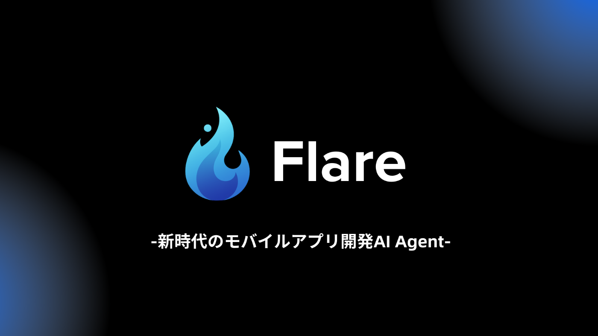
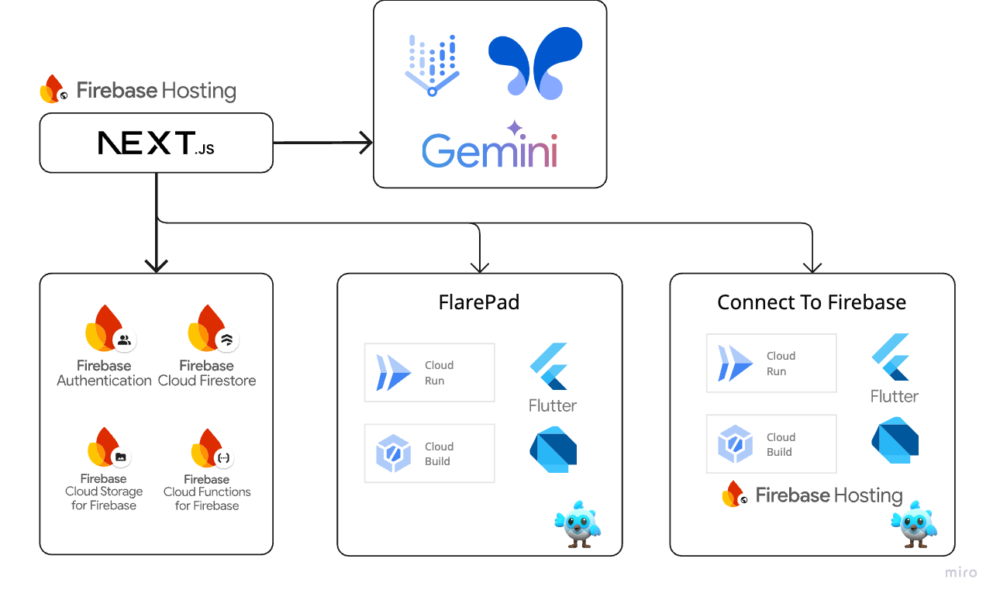
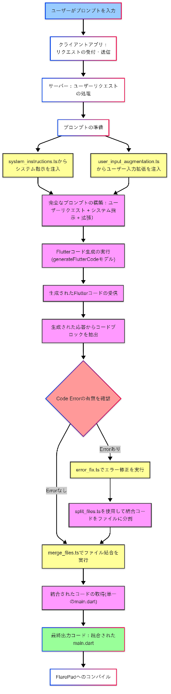

##  🔥プロジェクト背景

「アイデアを形にして検証したいけど、**モバイルアプリの開発費用はまだまだ高い上、時間もかかる** 」という我々の友人の多くが実際に抱えている課題に違和感を覚え、Flareプロジェクトは発足しました。

この課題は、特に新規プロジェクトの立ち上げ時に顕著でした。プロジェクトの本質的な価値を生み出す部分や価値の検証に注力したいのに、基礎的なコードの作成やデプロイ作業に膨大な時間を取られてしまいます。**実際、モバイルアプリ開発においては、MVPのローンチに300万円以上を要するケースが半数以上存在している** といった調査結果があったりと、アイデアを実現するに至らないケースが多数あることも事実です。この状況を、根本から変える必要があると感じており、この問題を解決してくれるAI Agentを作ることを目標に掲げました。

今回、我々は自然言語からFlutterアプリを開発してくれるAI Agent"Flare"を開発しました。**アプリの要件を伝えるだけで、Flutterアプリケーションを生成し、ワンクリックでFirebaseにデプロイ** 。かつては夢物語だった機能を、GoogleのAIテクノロジーとクラウドサービスを駆使することで実現しました。

想定しているユーザーは、以下のような方々です：

  * **限られたリソースで迅速にモバイルアプリのMVPを作り上げる必要があるスタートアップのCTO**
  * **アイデアを素早くプロトタイプ化して事前アンケートではなく、実際のアプリに関するフィードバックを得たいPdM**
  * **開発していくうちにモチベーションが低下し、アプリがお蔵入りしがちな個人開発者**

これらのユーザーに共通するのは、「アイデアの実現スピード」への強いニーズです。  
特に、Webアプリを開発してくれるAI Agentはいくつか存在するものの、モバイルアプリの開発を加速させるAI Agentは未開拓であり、モバイルアプリ開発に携わってきた我々こそがこのニーズを満足するようなAI Agentを作るべきなのではないか、と考えました。

##  💙Flareが実現する新時代のモバイルアプリ開発体験

Flareの最大の特徴は、自然言語による入力からFlutterアプリケーションの設計・生成を自動化している点です。この過程は以下のように進みます：

**1\. ユーザーが自然言語でアプリ開発要件を入力  
2\. Flare AI Agentが要件を解析し、必要なコンポーネントを特定  
3\. 最適化されたFlutterコードを生成  
4\. リアルタイムでプレビューを表示  
5\. 必要に応じてAIにデバッグを依頼、コードの自己修復  
6\. Connect to Firebase**

各開発工程に効果的にAIを組み込むことで、シームレスな高速プロトタイピングを実現させ、技術バックグラウンドの有無に関わらず多くの人がアイデアを形にすることが可能になると考えています。

##  🎥デモンストレーション

<https://www.youtube.com/watch?v=7Qcg6VfC_XU>

##  🤖システムアーキテクチャ

Flareのアーキテクチャは、Google Cloudのサービスを存分に活用し、高いスケーラビリティと安定したパフォーマンスを実現しています。

Flareの開発に用いた主要なコンポーネントは以下の通りです：

###  フロントエンド

フロントエンドはNext.jsを採用し、Firebase関連のサービス連携しています。

主要なコンポーネントとして：

  * **Firebase Authentication: ユーザー認証管理**
  * **Firebase Cloud Firestore: リアルタイムデータの保存と同期**
  * **Firebase Cloud Storage: ファイルストレージ**
  * **Firebase Cloud Functions: サーバーレスファンクションの実行**

を用いました。これらのFirebaseサービスを統合させることで、迅速に、スケーラブルかつ信頼性の高いフロントエンド基盤を開発しました。

###  バックエンド

バックエンドは、Google Cloudのサービスである

  * **Cloud Run: コンテナベースのサーバーレス実行環境**
  * **Cloud Build: 継続的インテグレーションとデプロイ**

を活用することで、開発のスピード感保ったままスケーラブルなアーキテクチャを構築することができました。

###  AI-Agent

Geminiを中心としたAIモデルの運用を行っております。Google AI Studio/Vertex AI APIを採用し、**gemini1.5-pro** 、**gemini2.0-flash-thinking** モデルそれぞれに要件の解析、コードの生成、ファイルの分割処理を効果的に分担させています。

AI Agentを開発するにあたり、調整するべき変数が多く時間も限られている中、独自のテスト項目を設けることでパフォーマンスのチューニングを行いました。  
具体的には、テスト用のアプリケーション10種に対して、

**1\. 返答当たりの応答時間  
2\. エラー修正のやり取り往復数**

が共に小さな値を取るように**Geminiモデルの役割組み合わせ、およびtemperature値をグリッドサーチでチューニング** しました。

Flare内部のAI Agentによる現状のワークフローは、下記の通りです：  

##  💻技術的な訴求ポイント

Flareでは2つのエンドポイントを用意しました。FlarePadとFirebase Hostingへのデプロイです。どちらもCloud Runを使用しているため、トラフィックに応じて水平にオートスケールしてくれます。また、Cloud BuildをGitHubのリポジトリと連携してCI/CDを構築しているため、GitHubにコードをpushすると、自動でデプロイが行われる仕様となっております。

###  DartPadを用いたプレビュー機能

Flareでは、FlarePadというFlutterのコードを実行して確認できる独自機能を実装しています。すぐに思いつく実装としては、Cloud Run等で`flutter build web`を実行、そのバイナリをiframeで表示というものです。  
しかし、この方法では、ユーザーは少なくとも1分ほど毎回プレビューの表示を待つ必要があります。今回は**DartPadと同じようにDDCコンパイラを使い、処理を高速化させました** 。FlutterのコードをCloud RunにPOSTし、DDCコンパイラでコンパイルした結果をiframeで表示させることで高速な描画機能を実装しました。

###  Firebaseへのワンクリックデプロイ

チームからは「**Firebase Hostingへのデプロイが可能になれば最高** だよね、、、」という声が上がりました。調査の結果、Firebase HostingはなんとREST APIを提供しているため、自然言語→Flutterコード→Firebase Hostingへのデプロイという流れが実現できそうでした。実際は、FlareのフロントエンドからFlutterコードをCloud Runで作成したエンドポイントにPOSTし、Cloud Runで`flutter build web`を実行。コンパイル結果をAPI経由でFirebase Hostingにデプロイしています。

##  🗺️今後の開発ロードマップ

  1. Flareモバイル版アプリ開発:Flareモバイルアプリ上でFlutter Projectを生成させることで、実機での動作確認をFlareモバイルアプリ上で可能にする予定です。

  2. ドメイン特化LLMモデルの独自開発:Flutter特有の開発パターンに特化したモデルの開発を進める予定です。Flareによって生成されるコードやファイル構成の品質向上に期待ができると考えています。

  3. Image-to-Code機能:FigmaなどのデザインスクリーンショットからFlutterコードを生成する機能を追加することで、一層イメージ通りのアプリ開発届けていく予定です

##  🍵総括

Flareは、単なるコード生成AIを超えて、開発者の創造性をすぐに体現させる「新時代のモバイルアプリ開発AI Agent」です。Google Cloudの最新技術を存分に活用することで今回Flareを開発し、以下を実現しました：

**1\. Flutterコード生成機能による高速開発  
2\. DDCコンパイラによるハイパフォーマンスなアプリPreview機能  
3\. Firebaseへのワンクリックデプロイ機能**

この一連の流れを自然言語から一気通貫させたモバイルアプリ開発体験をユーザーに届けることで、Flareはモバイルアプリ開発に付随する課題を氷解し得ると考えています。

Flareは、**あらゆる開発者の創造性を解放し、より良いソフトウェアを生み出すプロセスを加速させるための新しいプロジェクトです** 。我々このFlareを通じて、開発者コミュニティに新たな価値を提供し続けていく所存です。

最後に、AI Agent Hackathonを主催してくださったZennの皆様、支援をしてくださったGoogleの皆様、そして貴重なフィードバックを提供してくださったテスターの皆様に心より感謝申し上げます。
