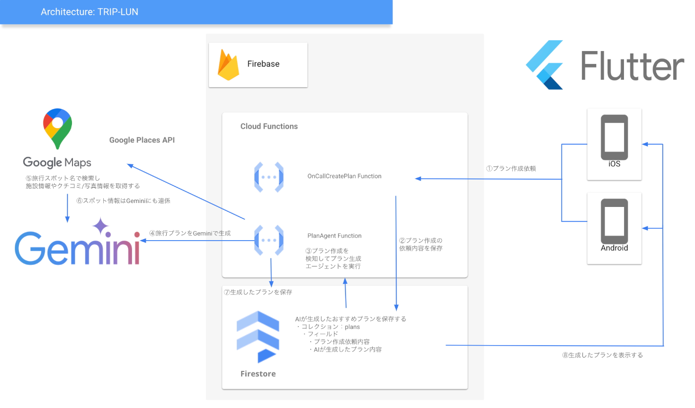

#  自己紹介

はじめまして、FooQoo と申します。普段は Web 系企業でバックエンドエンジニアとしてシステム開発に携わっており、[dx‐junkyard](https://www.dx-junkyard.com/) というコミュニティでハッカソンなどに参加しながら、日々新しい技術に挑戦しています。

今回は、[AI Agent Hackathon with Google Cloud](https://zenn.dev/hackathons/2024-google-cloud-japan-ai-hackathon) に挑戦し、旅行プラン作成の悩みを解決するサービス「TRIP-LAN」を作り上げました。どうぞよろしくお願いします！

#  まずはデモ動画をご覧ください

今回開発した「TRIP-LAN」の魅力をより実感していただくため、デモ動画を用意しました。  
スマホひとつで直感的に操作でき、生成AIによる旅行プラン自動生成の流れを実際にご覧いただけますので、ぜひご確認ください！

<https://youtu.be/sm1WVhKVqQQ>

#  はじめに

旅行の計画って、ワクワクする反面、情報収集やスケジュール調整がとても大変ですよね。  
ネット上にはたくさんの情報が溢れているけれど、どこから手をつければいいのか分からなかったり、各スポットの営業時間や口コミ、移動時間など、細かい調整に悩むことも多いです。

そこで今回開発したのが「TRIP-LAN」。スマホアプリ上で、必要な情報をシンプルに入力するだけで、最新の生成AI Gemini があなたにぴったりの旅行プランを自動生成してくれます。  
これにより、手間のかかる計画作成から解放され、誰でも簡単に自分だけのオリジナルな旅のプランを作ることができるようになります！

実際、忙しい毎日の中で旅行の計画に時間を割けない方や、初めての旅行でどこから始めたらよいか分からない方にとって、大きな助けとなるサービスです。

#  旅行プラン作成の課題と対象ユーザー像

旅行の計画づくりは、かつてはガイドブックや旅行代理店のツアーを利用するのが主流で、選択肢は限られていました。

しかし近年は、SNS や旅行系メディアなどから膨大な情報が得られるようになり、選べる幅が広がった反面、「どこを基準に比較すればいいのか」「何から決めればいいのか」と迷ってしまうケースが増えています。

さらに、移動手段や観光地の営業時間などの細かい調整も必要となり、自分に合ったプランづくりが難しいと感じる方が少なくありません。  
このような背景から、以下のような課題があるのではないかと考えました。

##  課題

  * **情報収集の手間**  
旅行先のホテルや観光スポット、移動手段など、情報があふれている中で「どこを選べばいいのか」が分かりにくい。いちいち自分でリサーチするのは、時間も労力もかかってしまいます。

  * **スケジュール調整の複雑さ**  
旅行先での移動時間、各スポットの営業時間、休憩時間など、細かい条件をすべて考慮してスケジュールを組むのは、とても大変です。

  * **自分好みのプランが見つからない**  
一般的な旅行サイトが提案するプランは、万人向けの内容になりがちで、個々の趣味やこだわりには必ずしもフィットしない場合が多いです。

##  対象ユーザー像

では、どのような方々がこの課題に直面しているのでしょうか？例えば、こんな方ではないでしょうか？

  * **旅行初心者**  
「行きたい場所は漠然と決まっているけど、どうやってプランを立てればいいのか分からない」という方。旅行の計画に慣れておらず、情報の海に溺れがちな方です。

  * **忙しい社会人や学生**  
仕事や勉強に追われ、なかなか旅行プランをじっくりと練る時間が取れない方。短い休暇の中で効率よくプランを立てたいと考えている方です。

  * **こだわりのある旅行者**  
一般的な観光地巡りでは物足りず、自分の趣味やライフスタイルに合わせたオリジナルな旅行プランを求めている方。例えば、地元のグルメや隠れた名所に焦点を当てたプランが欲しいというニーズを持つ方です。

こうした背景や目的の違いを持つ人々が抱える、「調べるのが大変」「自分の希望に合う情報が見つからない」といった悩みを解決し、どんな旅行スタイルでも充実した時間を過ごせるようサポートするのが、「TRIP-LAN」の大きな使命です。旅行の計画がより簡単になれば、思い出深い旅を自由にデザインできるようになり、忙しい日々の中でもスムーズに“自分らしい旅”を実現できるようになります。

#  TRIP-LANのソリューション

「TRIP-LAN」は、上記の課題を根本から解決するために、シンプルで直感的なスマホアプリと、生成AI Gemini を組み合わせた革新的なサービスです。以下に、どのようなソリューションで問題解決を図っているのか整理しました。

###  ソリューションのポイント

  * **AIによる自動プラン生成で手間を大幅削減**  
ユーザーが入力した基本情報をもとに、Gemini が最適な観光スポット、移動ルート、滞在時間、必要予算などを自動で提案してくれます。これにより、面倒な情報収集や調整の作業が一気に解消されます。

  * **直感的でシンプルな操作性**  
スマホアプリ上のわかりやすい UI により、誰でもストレスなく操作が可能です。入力画面では、AI がおすすめのキーワードを提示しながら、ユーザーが自分の希望条件を簡単に選択できる工夫が施されています。

  * **柔軟なプラン調整と履歴保存機能**  
一度作成したプランはいつでも見返すことができ、気に入らない部分だけ再生成することも可能です。ユーザーが何度でも試行錯誤しながら、自分だけの理想の旅を完成させることができます。

以下の表は、各課題に対してどのような効果が期待できるかを整理したものです。

解決対象の課題 | 期待される効果  
---|---  
**情報収集の手間** | AI が関連情報を自動で収集・整理するため、旅行計画にかかる時間を大幅に短縮。  
**スケジュール調整の難しさ** | 移動時間や滞在時間を自動計算し、現実的なスケジュールを提案。ユーザーは迷うことなくプランを完成。  
**個別ニーズへの非対応** | ユーザーの入力情報に基づいたオーダーメイドプランを自動生成。好みやペースに合わせた旅行計画が実現。  
  
この仕組みにより、たとえば、週末の短い旅行でも、ユーザーが「海沿いでのんびりしたい」という希望を入力するだけで、最適な観光スポットや移動ルート、さらには予算までが自動で計算され、数分で完成度の高いプランが提示されます。忙しい現代人にとって、計画のストレスから解放されるのはとても素晴らしいことです。

#  システムアーキテクチャの解説

「TRIP-LAN」は、ユーザーがシームレスに旅行プランを作成できるよう、最新技術を組み合わせたシステム設計になっています。ここでは、その主要な構成要素と処理の流れを説明します。

###  システム構成のポイント

おおまかな処理の流れは以下となっています。

  1. **モバイルアプリからプラン作成リクエスト送信**  
ユーザーがスマホアプリで「旅行プランを作りたい」と入力すると、その情報がFirebaseのCloud Functionsに送られます。ここでは、リクエスト内容の受け渡しがスムーズに行われる仕組みになっています。

  2. **Firestoreへのリクエスト情報保存**  
Cloud Functions内の「OnCallCreatePlan Function」が呼ばれ、ユーザーの入力情報（例：目的地、旅行日数、好みなど）がFirestoreに保存されます。これにより、後続の処理でデータを参照しやすくなります。

  3. **プラン作成エージェントの起動**  
Firestoreに保存された情報をトリガーに、別のCloud Functions「PlanAgent Function」が起動し、生成（Gemini）に処理依頼を送信します。

  4. **AI（Gemini）によるプラン生成とスポット情報取得**  
Geminiは、ユーザーの希望に沿って最適なプランを生成するため、必要に応じてGoogle Places APIから観光スポットの情報や口コミ、写真を取得し、より精度の高いプランを作成します。

  5. **生成されたプランのFirestoreへの保存**  
最終的に生成された旅行プランは、再度Firestoreに保存され、ユーザーはアプリ上でいつでも確認できるようになります。これにより、過去のプランも履歴として残るため、再利用や見直しが簡単です。

  6. **モバイルアプリでのプラン表示**  
ユーザーはアプリ上で、Firestoreに保存された最終プランを確認し、必要に応じて修正や再生成が可能となっています。実際の動作例として、ユーザーが「山間部で自然を楽しみたい」というリクエストを入力すると、最適なルートとスポット情報が表示されます。

以上がTRIP-LANの処理の流れになります。  
firebase x flutter x gemini x Google Places APIといったGoogleの技術を使った構成となっており、GCPのエコシステムを最大限活用しています！

##  AIエージェントの作り方

今回開発した AIエージェントは、ユーザーが入力した旅行に関する情報をもとに、質の高い旅行プランを自動生成するシステムです。質の高いプラン情報を作るためには、全体の流れが分かりやすく、具体的な情報が盛り込まれていることが重要です。AIエージェントは、以下の 4 つのステップを経て、最終的なプランを完成させています。

  * **初稿プランの作成**  
ユーザーの基本情報から旅行全体の骨組みを生成し、全体の流れを明確にする基盤を作ります。

  * **詳細情報の取得**  
Google Places API を利用し、各スポットの具体的な施設情報、レビュー、写真などを盛り込むことで、プランに具体性を加えます。

  * **提案文の清書**  
初稿プランと詳細情報を統合し、ユーザーが直感的に理解できる魅力的な提案文を作成します。これにより、全体の内容の質が向上します。

  * **JSONへの変換**  
生成された提案文を JSON 形式に変換することで、システム連携やデータ管理が容易になり、柔軟な運用を実現します。

この一連の流れは、ユーザーがシンプルな入力操作だけで具体性と信頼性のある旅行プランを手に入れられるように設計されています。質の高いプラン情報を提供するために、初稿プランで全体の流れを整理し、Google Places API によって具体的な情報を盛り込み、最終的な提案文で内容を清書。そして、システム連携を意識して JSON 形式に出力することで、運用面でも柔軟な拡張が可能になっているのです。

#  まとめと今後の展望

「TRIP-LAN」は、旅行プラン作成に伴う情報収集の手間、スケジュール調整の煩雑さ、そして一律なプランでは物足りない個別ニーズという課題を、最新の生成AIと直感的なスマホアプリで解決する革新的なサービスです。

  * **ホテル比較・検討・予約機能**  
複数のホテル情報を一目で比較できるよう、口コミや料金、設備情報などを網羅。最適な宿泊先を簡単に検討し、スムーズに予約できるシステムを提供します。

  * **現地までの移動方法提案**  
出発地から目的地までの最適な移動手段を、リアルタイムの交通情報やユーザーのニーズに合わせてご提案。公共交通機関、タクシー、レンタカーなど、最適な選択肢をサポートします。

  * **現地でのガイド機能**  
旅先でのおすすめスポット、グルメ、ショッピングエリア、イベント情報などを提供し、現地での充実した体験をサポート。旅行中の迷いや不安を解消します。

今回ご紹介した「TRIP-LAN」は、日常の忙しさや情報の多さに悩む現代人が、手軽に理想の旅行プランを実現できるように設計されたサービスです。  
簡単な操作で、あらゆる情報を瞬時に集約し、あなたの好みに合わせたオーダーメイドのプランを提供する仕組みは、従来の旅行計画の常識を覆す新たなアプローチと言えるでしょう。

現時点ではプロトタイプ段階ですが、今後さらなる機能拡充を考えております。  
最後までお読みいただき、誠にありがとうございました！

#  関連リンク

  * **GitHub リポジトリ**  
<https://github.com/FooQoo/trip-advice-agent-firebase>

