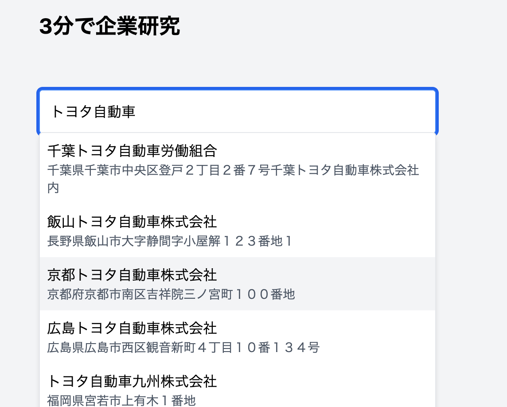
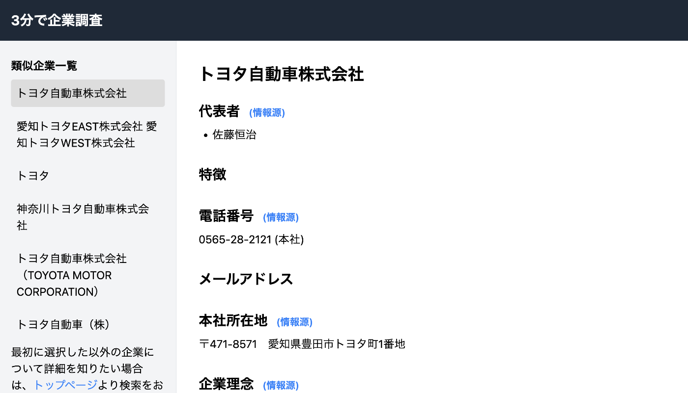
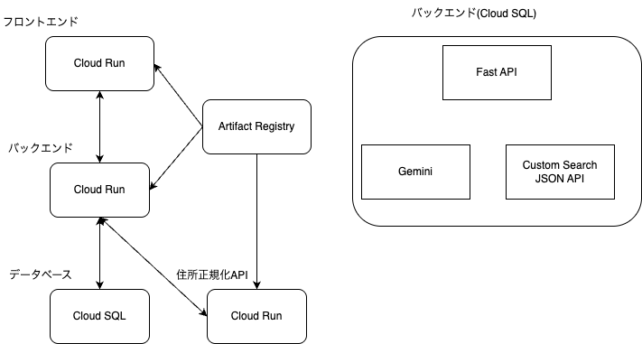

#  TL;DR (要約)

  * **[AI Agent Hackathon with Google Cloud](https://zenn.dev/hackathons/2024-google-cloud-japan-ai-hackathon)** に応募するため、**Geminiを用いたAIエージェントによる企業調査Webサービス** を開発しました。
  * **約500万社** の企業に対応。法人向けサービスに比べ1/100のコストでデータ取得
  * **企業調査を、AIエージェントがわずか3分で完了** させます。人力に比べて97%の時間削減。
  * **実例:** [トヨタ自動車株式会社](https://ai-company-research.gepuro.net/app/company/1180301018771) で、精度と網羅性を確認できます。
  * ~~**サイトでスグに試せる:** [3分で企業調査](https://ai-company-research.gepuro.net/app/) にアクセス~~
  * **技術詳細:** [GitHub](https://github.com/gepuro/ai_agent_company_research) で実装を公開

#  はじめに

Zenn初のオンラインハッカソン、テーマは「AIエージェント」。**GeminiのAIエージェントによる企業調査Webサービス** を開発しました。このサービスは、仕事で不可欠な企業調査を、AIエージェントで革新的に効率化します。さらに、他サービスと比較して**低コスト** 、**同等以上の価値** を可能にします。企業調査サービスは法人向けがメインで就職・転職での利用が困難でした。この課題を解決するために開発しました。

#  使い方 (３ステップ)

  1. **調査したい企業を選択する:**  
<https://ai-company-research.gepuro.net/app> にアクセスし、企業を検索します。日本国内の約500万社が登録されており、法人名で検索可能です。

  2. **AIエージェントによる企業調査を待つ:**  
企業選択後、AIエージェントがWeb情報を収集・分析し、3分程度でデータ作成

  3. **調査結果を確認する:**  
**AIエージェントが収集したデータ** を用いて、詳細な企業調査レポートが表示されます。企業概要、事業内容、財務情報、競合情報、企業文化など、多角的な情報を一目で把握できます。

例: [トヨタ自動車株式会社](https://ai-company-research.gepuro.net/app/company/1180301018771)

分析結果のページでは、検索時にヒットした企業も合わせて見ることができます。

  * [調査例: 株式会社ディー・エヌ・エー](https://ai-company-research.gepuro.net/app/company/4011001032721)

#  プロジェクトが対象とするユーザー像と課題

##  ユーザー像

  * **就職・転職活動中の学生・社会人:** 相手企業を深く知ることが重要ですが、新卒は多くの企業に接したり、転職は仕事をしながらなので、1社ごとの調査にかけられる時間には制限があります。面接の30分前であっても、情報取得が間に合います。

下記のようなユーザーもターゲットユーザーになります。

  * **ビジネスパーソン:** マーケティング、営業戦略などに必要なデータを取得できる。
  * **投資家:** 投資判断に必要な企業調査を効率的に行える。強み・弱みなどの定性的な情報も確認できる。

##  課題

  * 課題1: 企業情報の収集には多大な時間と労力がかかる。 
    * 情報源が散在しデータ整理に手間
  * 課題2: 費用とリードタイムが理由で、導入ハードルが高い 
    * **類似サービスでは、1社ごとの調査レポートに2,000〜50,000円、企業データベースを提供するSaaSは月額数十万円の費用** がかかり、個人や予算の少ない中小企業が気軽に利用できる価格帯ではない。
    * 法人向けのサービスなので契約が必要で、利用までリードタイムがある。
  * 課題3: データの鮮度 
    * データの更新頻度はサービスごとに異なり、最新のニュースを反映できていない可能性がある。

##  参考: 法人向けの類似サービス

サービス名 | 特徴 | 料金体系 | 参考URL  
---|---|---|---  
帝国データバンク企業情報 | 調査員が対象企業を訪問し、最新の経営状態を把握。既存の調査報告書の提供も可能。 | 調査問合票1枚あたり約15,000円～24,000円（枚数により変動） | [公式サイト](https://www.tdb.co.jp/services/lineup/research/)  
TSR REPORT | 国内最大級の約900万件以上の企業データベースを基に、与信管理や営業・マーケティングに役立つ情報を提供。 | 通常料金は1件50,000円 | [公式サイト](https://www.tsr-net.co.jp/service/detail/national.html)  
G-Searchデータベースサービス | 複数の企業情報データベースを一括検索可能。帝国データバンクや東京商工リサーチのデータも網羅。 | 月額450円（税込495円）の基本料＋各データ購入費用（例：帝国データバンク企業情報詳細2,200円） | [公式サイト](https://service.g-search.jp/2024/12/09/01061.html)  
Speeda | 世界中の企業情報、業界レポート、市場データ、ニュースなどを網羅した経済情報プラットフォーム。 | 要問い合わせ。 | [公式サイト](https://jp.ub-speeda.com/)  
Musubu | 法人営業の新規開拓を支援するクラウド型企業情報データベース。140万件以上の企業情報を収録し、豊富な検索軸でターゲティングが可能。 | 単月プランで月額60,000 ~ 330,000円で、プラン内にデータ取得制限あり。 | [公式サイト](https://musubu.in/)  
  
#  課題へのソリューションと特徴：GeminiによるAIエージェント

  * 課題1:「企業情報の収集には多大な時間と労力がかかる。」 
    * **Geminiの自然言語処理能力** 、**検索エンジン** を組み合わせることで、データの収集と整理を効率化
    * 8種類の検索パターンでそれぞれ上位3ページ、AIエージェントによる欠損データ補完のために10ページで、合計34ページにアクセスしています。手作業で記事を読む場合に、1ページあたり2分かかるとすると、合計で102分かかります。97%の時間削減に繋がります。
  * 課題2:「費用とリードタイムが理由で、導入ハードルが高い」 
    * Webサービスとして持続的に運用可能なコストで企業データを作成することで解決した
    * 1社のデータ生成に約10~20円かかる。Google Adsenseによる収入が1PVあたり0.2円としたら、1社ごとに50~100アクセスが損益分岐点であるので、広告のみでの運営が可能である。
  * 課題3:「データの鮮度」 
    * 検索エンジンを利用することで、常に最新のデータを反映できる

このAIエージェントは、単なる検索ではなくデータを構造化します。3ステップで1社あたり10〜20円で生成、類似サービス比1/100以下の低コストです。また、企業に関する情報を得ることによって、企業と求職者のミスマッチを減らせます。

##  3つのStep

###  **Step1: 調査対象の企業を特定する**

  * [国税庁 法人番号公表サイト](https://www.houjin-bangou.nta.go.jp/) のデータベースを利用し、日本国内の全企業(約500万社)を網羅。このデータベースには、国内の全ての法人が登録されています。
  * 法人名と住所を組み合わせることで、同名企業を正確に識別。
  * 検索機能では、法人名の一部からも検索が可能。
  * **このステップは、高単価な法人向けサービスと同等の網羅的な企業データへのアクセスが強み。**

###  **Step2: AIエージェントが自律的に企業情報を検索する**

  * GoogleカスタムサーチAPIを使い、企業名と関連キーワードの組み合わせで、Web上の情報を収集。
  * 検索キーワードの組み合わせ例: 
    * "〇〇株式会社 東京 会社概要"
    * "〇〇株式会社 事業内容"
    * "〇〇株式会社 強み"
    * "〇〇株式会社 競合"
    * "〇〇株式会社 社員数"
    * "〇〇株式会社 採用"
    * "〇〇株式会社 理念"
    * "〇〇株式会社 売上"

検索キーワードの組み合わせを増やことで、データ収集の網羅性があがります。

###  **Step3: AIエージェントがGeminiを活用してデータを整理・構造化する**

  * **Geminiを活用し、AIエージェントがWebサイトからデータを抽出し、構造化。**
  * Webサイトの構造変化に柔軟に対応。markdownに変換されたページから、**Geminiで必要な情報をピンポイントで抽出します。**
  * 検索結果と企業情報を照合し、同一企業のデータを統合。
  * 抽出データ項目例: 
    * 会社名、代表者名、設立年、本社所在地、電話番号、メールアドレス、事業内容
    * 売上高、従業員数、当期純利益、資本金 (過去3年分)
    * 企業の沿革、理念、事業内容、競合企業、求める人材像、スキル (採用観点)
    * SWOT分析 (強み、弱み、機会、脅威)
  * **複数サイトからの重複情報をGeminiで整理し、AIエージェントが信頼性の高いデータを抽出。**
    * 例: 代表者名が異なる表記で複数取得された場合、「代表取締役社長 山田太郎」「山田太郎」の2種類のデータになります。Geminiで重複排除をします。

このステップにより、**Web上に散在する情報を構造化し、利用可能なデータとして提供** します。

##  生成AI活用の詳細(データ生成のフロー)

検索とGeminiの利用によるデータ加工のフロー図は、こちらになります。検索パターンごとにプロンプトをカスタマイズし、目的の情報が収集しやすいようにしています。例えば、競合企業のデータを取得するときは、「◯◯株式会社の競合企業を調査してください」とプロンプトに加えることで、どの企業にとっての競合を取得したいかを明確にしています。強みや弱みの分析には、「SWOT分析を行ってください。」というプロンプトを追加しました。生成結果は、JSON形式で受け取るようにしています。  
プロンプトの例は、以下になります。
    
    
    ◯◯株式会社の競合企業を調査してください
    
    Webサイト: """
    (マークダウン形式のWebページを貼り付け)
    """
    
    情報がない項目は、空文字''にしてください。
    出力フォーマット(JSON): """
    [
        {"name": "会社名", "value": ""},
        {"name": "代表者", "value": ""}
        {"name": "本社所在地", "value": ""},
        {"name": "競合企業1", "value": ""}
        {"name": "競合企業2", "value": ""},
        {"name": "競合企業3", "value": ""},
    ]
    """
    

事前に定義された検索パターンでは、全てのデータを取得できていません。データを埋めるために必要な検索ワードを生成して、自律的にデータを埋めるエージェントを作成しています。

このようにして、任意の分析とデータ収集ができるアーキテクチャになっています。レスポンス速度が早く低コストなgemini-1.5-flash-002を利用しています。

各ページごとにデータを取得することで、ページの目的に沿う情報に絞って抽出できます。そのあとに、それぞれのデータを統合し、重複を排除する仕組みを導入しています。

各ページごとの生成結果と最終データをCloud SQLに保存し、データ生成結果の調査とユーザーへの結果表示の高速化を両立しています。

検索パターンや法人番号の付与の精度を上げることで、データの拡張と質を向上させることができます。特に法人番号を特定するロジックが現在の課題です。

###  データの精度について

[トヨタ自動車株式会社](https://ai-company-research.gepuro.net/app/company/1180301018771) の例を見て、各項目ごとにデータを確認してみると、明らかな誤りはないものの、データ取得漏れがあるため改善が必要です。

[株式会社ディー・エヌ・エー](https://ai-company-research.gepuro.net/company/4011001032721) においても、誤ったデータはなさそうで問題はありません。

#  企業調査におけるAIエージェントとしての独自性

  * **網羅性:** 国内約500万社の企業情報を網羅的にカバー。不足情報は**AIエージェントが自律的に探索** する
  * **迅速性:** 企業調査を数分で完了。大幅な時間短縮を実現。**AIエージェントが、効率的にタスクを処理し、高速な企業調査を実現します。**
  * **詳細な分析:** 企業概要、財務情報、競合情報、企業文化など、多角的な情報を網羅。**AIエージェントが、多様な視点から企業を分析します。**
  * **圧倒的な費用対効果:** **類似サービスと比較して、圧倒的に低コストで利用可能。** これまで高額な費用がかかっていた企業調査を、誰でも手軽に行えるようにします。既存のサービスは人海戦術でデータを収集しているケースが多い。
  * **リアルタイム性:** Web検索によって、常に最新の情報を収集・分析。
  * **柔軟性:** Webサイトの構造変化にも柔軟に対応。**Geminiで多様なWebサイトに対応します。**

#  システムアーキテクチャ

Cloud RunとCloud SQLを利用しました。アクセスがない時はCloud SQLのみの費用しかかからないので、**低コスト** で運営できます。また、アクセスが多い場合は、Cloud Runが **自動的にスケーリング** します。

#  デモ動画

<https://www.youtube.com/watch?v=InSeTuG35OI>  
音声合成ソフトの[AivisSpeech](https://aivis-project.com/)を利用しています。

#  ユーザーからのフィードバック

友人に利用してもらい、以下のようなフィードバックをもらい、バグ修正をし、今後の展望を見直しています。

  * 「さらっと調べられるのはとても良い。ターゲットが何か次第だけど、特定の企業の製品についてとか、就活の口コミについての調査とか、なにか企業の特定の何かをエージェントで深掘りしてくれたら嬉しいっておもった」
  * 「自社の理念を知るきっかけになった」
  * 「アクセスしたら、調査中の画面から次のページに移動しない」

#  今後の展望

  * データの品質向上 
    * **ニュース情報を積極的に利用することで、企業情報の更新頻度を向上させ、よりリアルタイムな情報提供** を目指します。
    * データの正確性を上げるために **法人番号を特定するロジックの改善** をする。また、取得したデータの正確性をチェックする処理を追加する。
    * データの正確性をあげるために、ユーザーによるフィードバック機能を追加します。
    * JavaScriptのレンダリングが必要なページに対応する
    * 事業について深堀りして、理解度を深められる仕組みを作る
  * 分析機能の追加 
    * 財務情報の詳細分析機能を追加し、より高度な企業調査を可能にします。**AIエージェントが、財務諸表を深く解析し、より精度の高い分析結果を提供します。**
    * グラフや図を用いた視覚的な表現を強化し、企業情報の理解を促進します。**AIエージェントが、分析結果を分かりやすく可視化します。**
  * コミュニティ機能 
    * ユーザー間の情報共有機能を追加し、企業調査のコミュニティ(口コミやユーザーによる企業調査の共有)を形成します。
  * 高収益化に繋げるために、外部サービスとの連携 
    * ニュースを閲覧するときに、該当企業の情報を確認できるようにし、そのニュースが強みを伸ばす目的のリリースなのか、弱みに対応するためのリリースなのかなどのを補足説明に利用する
    * 営業ツールやマーケティングサービスとの連携によって、プロセス改善や工数削減が実現します。

AIエージェントによるデータ収集、人手によるデータ修正、他システムとの連携などの機能が実装されることによって、企業情報の民主化が実現します。このようにサービスの可能性は多岐に広がります。将来的には、求職者が自身のスキルを活かせる企業を見つけられるようになります。

#  まとめ

生成AI活用で法人向けの企業調査サービスよりも安価に提供でき、広告収入のみでも持続的な運営が可能になります。
