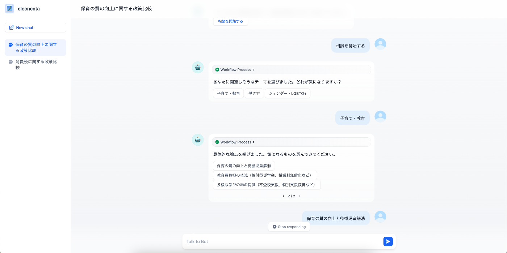
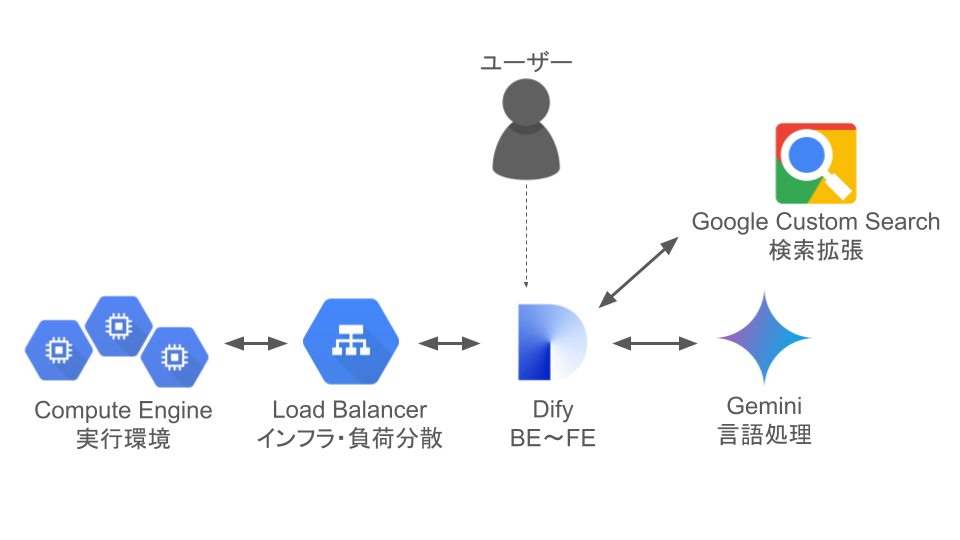
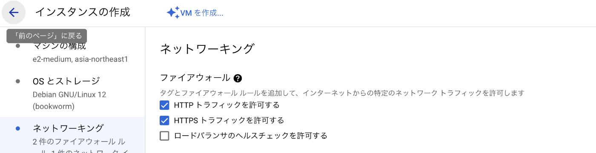
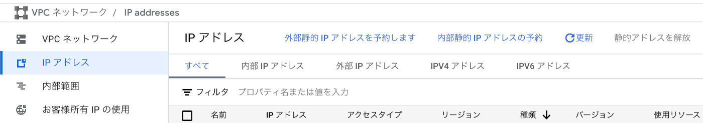
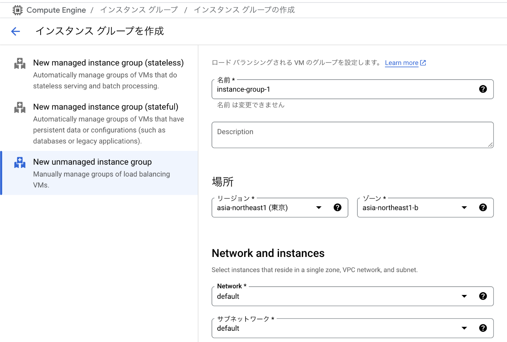
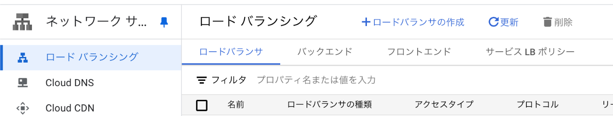
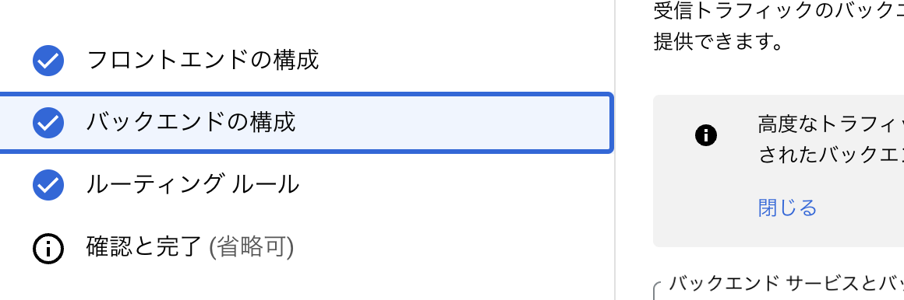
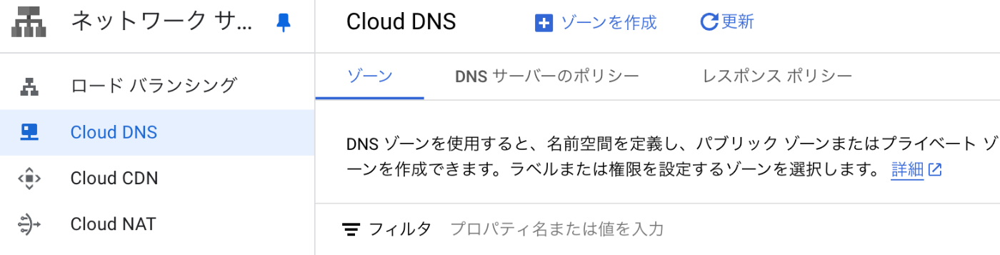
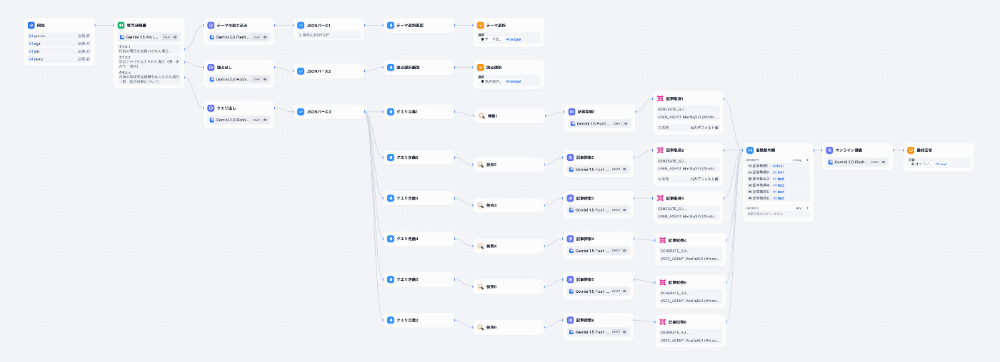

##  はじめに

[AI Agent Hackathon with Google Cloud](https://zenn.dev/hackathons/2024-google-cloud-japan-ai-hackathon) に参戦します！ということで、政党比較アプリ「elecnecta」を作りました！（PC・スマホ対応のブラウザアプリ）  
この記事では、開発の背景やアプリを作るまでの解説をしたいと思います！Google Cloud Compute Engine (GCPの仮想マシン) 上でDifyを環境構築したい！という方も是非みていってください。

##  プロジェクトの概要

###  アプリの概要

政党比較アプリelecnecta（エレクネクタ）は、「**国民の政治選択を分かりやすくし、主体感を促す** 」ことをコンセプトに生まれたAIエージェントです！  
ユーザーの性別や年齢、居住地域などのパーソナル情報をヒアリングし、個人に関心のある政治のテーマや議題をピックアップ、**ユーザー自身が気になった議題に関して、各政党の政策や方針を調べて、分かりやすくまとめてくれます** 。

<https://www.youtube.com/watch?v=rHKOvjjwnqo>  
ブラウザアプリですので、もちろんPCからでも使えます。  
  
会話履歴もサイドバーの中に残っています。ChatGPTライクなUIです。

###  プロジェクトの目的

本プロジェクトでは、自分自身と政治との関わりや政治への関心を感じづらいと思っている日本の有権者の人々をターゲットに、**投票の選択を支援する** 情報提供を目的としています！

政治ニュースや選挙を目にしても、それが自分の生活にどのような影響を与えるのかを実感できず、投票行動に躊躇してしまう人は少なくないでしょう。

elecnecta は、そうした課題を解決するために、各個人に関連する政治の論点を提示し、政党ごとの立場や政策を比較・可視化するエージェントアプリで、投票の選択を支援します。

###  対象ユーザー

  * 選挙や政治に関心を持ちたいが、どの政党を選べばよいか分からない日本の有権者
  * 日々の生活や関心事と政治の関係をより深く理解したい人

###  課題

  * 自分の生活や関心に影響を与える政治の議題がパッと分からない
  * 各政党のスタンスや政策の違いについて自分で調べる時間はない

###  ソリューション

  * ユーザーのプロフィール（性別、年齢、居住地域など）から関心のあるテーマや議題を提案
  * 各政党の声明や政策をリアルタイム調査し、比較・可視化する
  * 質問に答えるだけで、投票や政策に興味を持つきっかけをもらえる

##  アプリの特徴

###  透明性と中立性の確保

ローコードツールDifyを使うことで、設計とプロンプトの透明性を担保し、特定の意見やスタンスに偏るリスクを低減します！

###  リアルタイム性

検索拡張によるRAG（Retrieval-Augmented Generation）を活用しており、選挙や政策の最新情報をリアルタイムで反映して知ることができます！

###  ユーザビリティの高さ

ブラウザアプリでスマホ・PCのどちらでも使いやすく、アプリをインストールする精神的な負担も少ないです！

##  システムアーキテクチャ

###  アーキテクチャ

elecnecta のシステム構成は以下のようになっています。

####  インフラ

  * Google Cloud Compute Engine (GCE): Debian ベースの仮想マシンを利用
  * Google Cloud Load Balancer: HTTPS 対応と独自ドメイン設定
  * Google Cloud DNS: 独自ドメインの名前解決に利用
  * PostgreSQL: ユーザー情報やデータ管理のためのデータベース

####  アプリケーション

  * Dify：LLMアプリ構築のためのローコードツールです。 
    * バックエンド：ワークフローを構築
    * フロントエンド：Dify組み込みのUI生成機能を使用
  * CuntomSearchAPI 
    * RAG（Retrieval-Augmented Generation）によって政党の政策や声明のリアルタイム取得
  * Gemini API 
    * LLMによる取得情報の評価や回答の生成

##  構築の手順

###  GCE インスタンスの作成

  1. GCP コンソールから Compute Engine に移動し、新規インスタンスを作成。  
仮想マシンの作成：  
ファイアウォールの設定以外は基本的にデフォルトのままでOKです。

     * OS: Debian 12
     * マシンタイプ: e2-standard-2 (2 vCPU, 8GB RAM)
     * ファイアウォール: HTTP, HTTPS トラフィックを許可（後ほど使うため） 
       *   
静的IPの設定
     * VPCネットワークのサービスに移動し、外部IPアドレスにある先ほど作ったIPアドレスに対する静的IPを予約します 
       * 
  2. 必要なパッケージのインストール  
GCPコンソールのインスタンス詳細にある「SSH 接続」ボタンをクリックしてSSH接続します。※ここからはこのターミナルで作業します。

Dockerなど必要なパッケージのインストールをします。
    
    
    sudo apt update && sudo apt upgrade -y
    sudo apt install -y docker.io docker-compose postgresql git
    

  3. PostgreSQL の設定  
データベースにユーザー名「dify」、パスワード「dify-password」のユーザーを作成します。

    
    
    sudo -u postgres psql -c "CREATE USER dify WITH PASSWORD 'dify-password';"
    sudo -u postgres psql -c "CREATE DATABASE dify OWNER dify;"
    

  4. PostgreSQLの接続設定変更  
デフォルトでは、PostgreSQLはローカル接続にUnixドメインソケットとPeer認証を使用し、TCP/IP経由では localhost のみ受け付ける設定になっています。Difyのコンテナからこのデータベースに接続できるよう、設定を変更します。

/etc/postgresql/15/main/postgresql.conf ファイルを開きます。
    
    
    sudo nano /etc/postgresql/15/main/postgresql.conf
    

デフォルトでは listen_addresses = 'localhost' となっていますので、これを以下のように書き換えます（先頭の # を外して有効化）。
    
    
    listen_addresses = '*'
    

これにより、PostgreSQLがすべてのネットワークから接続を受け付けるようになります。  
5\. 認証方式の編集  
/etc/postgresql/15/main/pg_hba.conf ファイルを編集します。
    
    
    sudo nano /etc/postgresql/15/main/pg_hba.conf
    

以下の設定を変更・追加してください。

  * local all all peer という行を、認証方式をパスワード認証に変更するため、以下に変更

    
    
    local all all md5
    

-ファイル末尾に、下記の一行を追加（無ければ）。
    
    
    host    dify    dify    0.0.0.0/0    md5
    

これはユーザー dify がデータベース dify に対して、どのIPアドレスからでもパスワード認証（md5）で接続できるようにするルールですが、GCPファイアウォールで外部からのDBポートアクセスはブロックされているため、基本的に同一VM内＝コンテナからの接続のみが該当します。  
6\. PostgreSQLサービスの再起動  
設定変更を反映させるため、データベースサービスを再起動します。
    
    
    sudo systemctl restart postgresql
    

###  Dify のインストールと起動

OSSである Dify のアプリをインストールし、Docker Compose を用いて起動します。Dify は公式で Docker Compose ベースのデプロイ方法が提供されているため、それを利用します。

  1. Difyリポジトリのクローン  
Dify は GitHub 上で公開されているため、git clone コマンドでソースコードを取得します。

    
    
    git clone https://github.com/langgenius/dify.git
    

コマンド実行後、カレントディレクトリに dify というフォルダが作成され、その中にソース一式がダウンロードされます。  
Dockerディレクトリへ移動
    
    
    cd dify/docker
    

Dify リポジトリ内の docker ディレクトリに移動します。このディレクトリに Docker 関連の設定ファイル（Docker Compose 用の docker-compose.yml や .env テンプレートなど）が含まれています。  
2\. 環境変数ファイルの作成  
Dify では環境変数によって設定を行います。テンプレートファイルからコピーして .env ファイルを作成しましょう。
    
    
    cp .env.example .env
    

この .env ファイルの内容を編集することで、データベース接続情報や各種オプションを設定できます。  
3\. .env の編集（データベース設定）  
テキストエディタで .env ファイルを開き、データベース接続に関する項目を修正します。主に以下の変数を探して書き換えてください（行頭の # はコメントなので、コメントが付いていれば外します）。
    
    
    DB_HOST=localhost
    DB_PORT=5432
    DB_USERNAME=dify
    DB_PASSWORD=dify-password
    DB_DATABASE=dify
    

PostgreSQL の接続をテストしておきましょう。
    
    
    psql -h localhost -U dify -d dify
    

  4. 組み込み PostgreSQL コンテナの無効化  
Dify の標準 Docker Compose 設定では、PostgreSQL コンテナ（サービス名: db）が含まれています。今回、このコンテナは不要なので、リソース節約のため、docker-compose.yml から db サービスの定義をコメントアウトまたは削除しておきましょう。

  * ファイル内で services: 行の下にある db: から始まるブロック全体を削除します。
  * 加えて、他のサービス定義内にある **depends_on: db** の記述もあれば削除します。

  6. Dify コンテナの起動  
準備が整ったら、Docker Compose で全ての必要コンテナを起動します。

    
    
    sudo docker-compose up -d
    

  6. セットアップ画面へのアクセス  
うまくいけば、ブラウザで http://<インスタンスの外部IPアドレス>/install にアクセスすると、Difyが起動して、管理者アカウント作成用のインストールページが表示されるようになっています。

ここで任意のメールアドレス・パスワードを入力して管理者ユーザーを作成してください。

###  ロードバランサーの設定

インスタンス上で Dify 自体は起動しましたが、現状では一時的な外部 IP アドレスでしかアクセスできず、通信も HTTP のままです。ここでは Google Cloud Load Balancing を利用して独自ドメインをこのサービスに紐付け、HTTPS アクセスを可能にします。

  1. バックエンドの準備（インスタンスグループ作成）  
ロードバランサーはバックエンドとしてインスタンス グループを登録する必要があります。今回は単一の VM のみなので、非管理対象（unmanaged）インスタンスグループ を作成します。  

  * GCP コンソールで 「Compute Engine」→「インスタンス グループ」 に移動し、「インスタンス グループを作成」をクリックします。
  * ゾーンは先ほどの VM が属するゾーンを選択、グループの種類は「Unmanaged instance group」、インスタンスを選択で先ほど作ったインスタンスを追加します。

  2. ロードバランサーの作成

  * GCP コンソールで「ロード バランシング」に移動し、「ロードバランサの作成」を開始します。種類はHTTP / HTTPS、外部、グローバルをそれぞれ選択します。  
  
指示に従って設定を進めていきます。

  3. バックエンドの設定

  * 新しいバックエンドサービスを作成し、先ほど作ったインスタンスグループを紐付け。ポート番号は「80」を指定します。 
    * 
  * ヘルスチェックを作成します。（HTTP、ポート80でOK）

  4. フロントエンドの設定

  * プロトコルは HTTPS を選択し、ポートは 443 を指定
  * 新規に静的IPを予約して割り当ててください 
    * Googleが管理する新しいSSL証明書を作成できますので、[お名前](https://www.onamae.com/)等で取得した独自ドメインを入力し、設定します

###  DNSの設定

  1. Cloud DNS にアクセスし、Aレコードを追加。先ほどのロードバランサーのIPを指定します 
     * 
  2. ドメイン管理サービス側でもネームサーバーの設定が必要です。 
     * Cloud DNSのNSレコードに入っている4つの値を指定します

###  動作確認

  1. 設定の反映を待つ

  * DNSやSSL証明書の反映には時間がかかることがあります。（数分程度）
  * ロードバランサの証明書詳細を開くと見られるステータスが「ACTIVE」になるのを待ちましょう。 
    * 

  2. アクセス確認  
<https://your-domain.com> にアクセスし、Dify のログイン画面が表示されることを確認

これで HTTPS に対応した Dify 環境の構築が完了です！

###  Difyアプリの作成

####  概要

Difyのアプリ作成機能を使い、ユーザーとのやり取りができるバックエンドシステムを作ります。  
  
詳細な説明は省きますが、「チャットフロー」機能を活用しており、基本的には以下のフローで設計しています。

  1. ユーザーの質問を**分類** する
  2. 分類に応じた**処理** を実行 
     * LLMブロック：ユーザー属性の分析、検索のプランニング、取得情報の要約など
     * ツールブロック：Google検索、JSONパース、ボタン表示など
  3. **回答** ブロックでユーザーのアクションを促す or 目的情報の表示

####  補足

なお、検索ツールには組み込みのCustom Search APIがなかったため、自作しています。  
<https://github.com/agi-sari/elecnecta/blob/main/custom_custom_search.py>

上記のPythonコードをDifyのコードブロックに入れ、Custom Search APIのキーを入れてワークフロー化し、カスタムツールに登録することで擬似的に検索ブロックとして使えます。  
※「検索クエリ」と「取得順位数」を引数とし、任意の順位までのページをGoogle検索できます。

##  今後に向けて

###  まとめ

elecnecta の概要、課題の解決方法、システム構成、そして Google Compute Engine 上での Dify のセットアップ手順を詳しく解説しました。

elecnecta は、政治情報を個人に関連付けて提示し、投票行動を支援するアプリです。透明性の高い DifyのプロンプトとRAGによる最新情報の取得を組み合わせることで、正確で中立的な情報を提供することを目指します！

というわけで、Difyの中身や作り方についてもこれからの記事で書いていく予定です！

###  課題点

####  プロンプトのチューニング

現在まだ動作が安定せず、LLMが予期しない形式の出力を吐いてしまうことがあります。また、適切なモデル選択、パラメータ設定、プロンプトなどによってレスポンスや精度に改善の余地があります。今回時間の都合上難しかったので、引き続き磨いていきたいところです。

####  マルチエージェント化

中立性を持たせるために、賛成、反対、保守、リベラルといったスタンスの違いを持たせたICLで、マルチエージェントっぽく意見を作ってくれるマルチエージェント化をしてみたいです。これにより、もっと解像度の高い論点や要約結果を出せる可能性があります。

####  フロントエンド

Dify にはバックエンドAPIとしてアプリを公開する機能も含まれているので、TypeScriptやFlutterなどでフロントエンドのUIを作り込めれば、より自然な使用感で使えるアプリになると思います。面白くてボタンをぽちぽち押しているうちに意見が出来上がってる、みたいなUXが理想的です。
