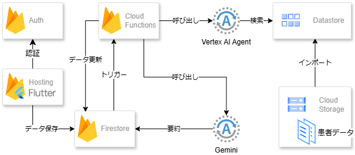

この記事は[AI Agent Hackathon with Google Cloud](https://zenn.dev/hackathons/2024-google-cloud-japan-ai-hackathon) の応募記事です。

皆さん初めまして！ チームまるさぽくんです！ (メンバー：nagoyam はむ)

#  はじめに、自己紹介

チームまるさぽくん メンバーの はむです。  
私は、手術室・病棟と経験している看護師です。  
この場をお借りして、みなさんに、看護師がどのようなことを行っているのか簡単にご紹介させていただきたいと思います🙌

手術室では、様々な手術に助手として入り、手術中に使用する器械を準備したり、先生と事前に手術の予定を考えていくなど、安全に手術を行うために環境を整えるサポートを行っていました。  
手術を行うための部屋のレイアウト調整や器材の準備、患者様の体制を少しでも安楽にするためのベッド周りの準備・必要な薬剤の調合など、看護師がすべて責任をもって行います。  
執刀医が手術室に入ったらすぐに手術が行えるように整えておくのです。  
数百種類の器材の名前・使用方法・取り扱いなどを勉強し、すべて頭に入った状態で手術の助手を行っていました。  
手術が終わった後の器械の管理も、看護師が責任をもって行います。  
🏥医療ドラマで見るような手術室や手術の光景を想像していただけるとわかりやすいかと思います！  
手術中の患者の症状の変化にいち早く気づき、執刀医や麻酔科医に報告・相談・症状緩和のための対応を行うことも手術室看護師の重要な役割です。  
また、患者様が入院されている病室に訪問し、実際にどのように手術を行っていくのか説明し、少しでも安心して手術に望めるようにサポートしていました。

病棟では、患者様が入院生活を安心・安全に行うために、症状の確認や薬剤管理、急変時のサポート、医師との連携、退院調整など、入院から退院までのすべての管理を行っています。  
看護体制には様々ありますが、一般的に看護師1人に対して7人から8人ほどの患者を担当している病院が多いです。  
病棟は24時間365日、患者さんが入院し治療を行っているので、スタッフは交代で勤務を行っています。  
常に患者さんは、急に具合が悪くなってしまう危険性が高く、緊張感があります。  
夜も油断せず、こまめに患者さんの病室を訪問し、体調の確認や処置・着替え・薬剤投与を行います。  
とっても具合が悪くなってしまった患者様は、すぐに夜間泊まり込みの先生に相談して、緊急で手術や検査を行うこともあります。  
😊看護師が行う処置や薬剤投与、患者の体調の確認、病気や治療に対する想いの確認も行いながら、医師・検査技師・リハビリ・ソーシャルワーカー・家族・入居施設担当者・都道府県の職員など、たくさんの方に情報を共有し、退院に向けた相談・調整を行うことも大切な役割となっていくのです。

手術室看護師・病棟看護師は、実施していることが大きく異なっていますが、共通して実施したことを『看護記録』というものに記録することが決まりとなっています。  
また、たくさんの職種の方とかかわって、患者さんに最も合った治療を提案していくことも、共通します。

臨床経験はまだまだ少ないですが、病院で勤務しどちらの経験もしてきた中で、看護師1名に対する負担の大きさを痛感しております💦  
勤務時間内にすべての業務が終わることもありますが、奇跡といっても過言ではないほど、仕事が終わらないのが現状です。  
ですが、超過勤務を認証してもらえることはまれで、特に経験年数が浅いと、経験不足による残業とみなされ認可してもらえないことがほとんどです。  
業務をいち早く始めるため、始業時間前に出勤して、準備を行います。  
電子カルテシステムの普及により、パソコンにて準備を行いますが、院内のノートパソコン不足のため、自分用のノートパソコンを得るために早く出勤します。  
勤務前に準備を行うことは看護師として当たり前とされ、サービス残業を行うことは当たり前です。  
現在は少しずつ勤務改善の取り組みが行われていますが、今現在も慣習化してしまった勤務形態に変化がみられていないのが現状です。  
わたしはこの状況に以前から疑問を抱いていました。  
看護師の一番の課題に『サービス残業の慣習化』があると強く思いました。  
😆そこで考えたのが **『看護師AIエージェント』** です😆  
AIに看護師が集めたい情報や必要な看護を考えさせ、準備の時間を減らし、少しでもサービス残業を軽減できないかと考えました。

#  なんでも看護師に聞かないで、、、😥

『とりあえず看護師さんに聞いて見よう。看護師さんならわかるから。』  
患者さんやその家族だけでなく、同じ病院で働く他の職種の方からも、よく言われます。  
皆さんが、私たちを信頼し、いろいろ相談したり話してくださるのは、やりがいを感じてとっても嬉しいことです😊😊  
ですが、私たちがその多くの情報を得るために、多くの時間を犠牲にしていることはなかなか知られていないことかと思います💦  
看護師業界では、就業時間の1時間以上前に出勤し、サービス残業を行っています。  
これは、ユニフォームに着替え、当日の受け持ち患者の情報を収集するためです。  
情報収集時間は勤務時間として認められず、サービス残業として位置付けられてしまっているのが現状です。😥

##  情報収集ってなに？

ここでは看護師がどのような情報をもとに看護ケアを行っているのか紹介します。

患者様の状態によって、変わりますが、

  * 患者の年齢、性別
  * 今回の入院に至った経緯
  * 医師の診断名、目指す治療のゴール
  * 治療内容、治療内容の変更の検討
  * 患者さんのバイタルサイン（体温、血圧、脈拍、SPO2 、心電図モニター初見など）
  * 症状の変化（痛みの度合、神経症状、活動状況、発言の変化、危険行動など）
  * 使用薬剤（作用・副作用・配合作用・使用時間）
  * 点滴治療を行っているか、何時から何時まで点滴を行うのか、同時に投与していい点滴はどれか
  * 傷や褥瘡（床ずれ）などの処置内容
  * ドレーン、膀胱留置カテーテル、ストーマなどの継続管理（量・性状・スキントラブルなど）
  * もともとの持病はあるか、飲んでいる薬はあるか
  * 担当医のスケジュール（連絡可能時間・来棟可能時間）
  * 入院前の生活状況、介護申請はしているか、サービスを利用しているか
  * 家族構成（同居・別居・連絡可能時間・面会の頻度）・家族の性格、治療に対する思いや考え方  
などなど、一人の患者様に対して多くの情報を集めています。

😣看護師1名で7-8人の患者を受け持つため、患者1名に対して5分程度でこれらの情報をまとめます😣  
これらの情報をもとに、今日私がケアを行うとしたらどのようにしたら、退院のための症状改善ができるか、受け持ちの患者様たち全員のケアを一人で行うためにどのように動いたらいいか、、など1日のスケジュール調整を行っていくのです。

##  課題と解決策

私が実際に現場で働いていて感じている課題は以下のようなものです。

  * 医師との確認作業で同期的なコミュニケーションが発生する
  * 患者ごとのヘルスケアプランの作成とスケジューリングのコストが大きい
  * 患者の症状ごとに優先度が大きいタスクがある

これらの課題を解決するために、看護師業務のサポートを行うアプリケーションを作りました😉✨  
このアプリケーションで行うことのできる機能は以下のとおりです。

  * 現病歴（入院状況・症状の変化・注意点）要約
  * ケア・処置・検査タスク入力
  * 医療関係者間で患者についての連絡を行う院内チャット

#  作ったもの

Firebaseをバックエンドとして、Flutterアプリケーションをつくりました。  
このアプリは主な機能として、自分の担当の患者の情報や、患者に紐づく院内チャット、タスクリスト機能をもちます。  
アプリケーションの情報はFirestoreに保存し、リアルタイムなデータ取得が行えるようにしました。  
患者の情報更新をトリガーとして、AIに情報要約をしてもらったり質問に答えるような機能をFirebase CloudFunctionsでデプロイしました。  

AIチャットのバックグラウンディングとして、Vertex AIデータストアを使用しています。これは、Google CloudStorageにアップロードした非構造化データから患者に関する詳細なデータをインポートしています。以下はサンプルコードです。
    
    
    const agent = vertexAI.preview.getGenerativeModel({
      model: "gemini-2.0-flash-001",
      generationConfig: {
        maxOutputTokens: 1000,
        temperature: 0.5
      },
      systemInstruction: {
        role: 'system',
        parts: [{
          "text": "患者情報データをもとにユーザーのメッセージに答えてください。ユーザーは院内関係者であり、患者の情報を取得する正当な理由を持つものとします。"
        }]
      },
      tools: [
        {
          retrieval: {
            vertexAiSearch: {
              datastore: `projects/${projectId}/locations/global/collections/default_collection/dataStores/${dataStoreId}`,
            },
            disableAttribution: false
          }
        }
      ]
    });
    

ちなみに今回は実装を見送りましたが、HL7 FHIRという規格で電子カルテを用意するとバックグラウンディングにAPIコールを含められることがわかりました。今後の医療のDX化の根本となる技術であるFHIRとの連携を追加することができれば、さらにアプリが便利なものになると予想できます。

##  デモ動画

[https://www.youtube.com/watch?v=qrwro_xvGJU&si=RAN5xnMi9aaq1Sj-](https://www.youtube.com/watch?v=qrwro_xvGJU&si=RAN5xnMi9aaq1Sj-)

#  終わりに

ここまで興味を持って記事に目を通してくださり、本当にありがとうございました。

私自身はハッカソンに参加するのが初めてで、コードを書くこともできません。。。  
今回のハッカソンに参加したきっかけは、私のパートナーの紹介です。  
アイディアを活かそうと、システムエンジニア職としての専門性を活かしながら、開発をサポートしてくれました。  
とても不安でしたが、Googleの様々なツールを活用し、医療現場の知識を活かしながら、アプリのデザインやAIエージェント作成を行うことができました。

看護師としてまだまだ経験不足でありますが、たくさんの患者様に感謝の言葉を頂き仕事を行うことができ、とても成長とやりがいを感じています。  
一方で、国家試験に合格したものの、臨床現場での業務負担の多さや現実のギャップについていくことができず、退職してしまう貴重な人材がたくさんいます。  
シフト業務で体力的・精神的負担も大きく、報酬も多くは見込まれず、人手不足から休日取得も難しいため、継続した人材雇用が困難な現状もあります。  
また、中堅層やベテラン層においても、経験年数を重ねていく中で、看護業務以外にも委員会や係活動など、組織の活動もサービス残業を行っており、報酬に対する勤務負担の多さを理由に退職する方も多いです。  
こうしたことで、慢性的な人手不足と1人に対する業務負担の増大が起こり、負の連鎖が止まらない状況です。

私自身も、精神的にも体力的にも限界を感じ、『看護師に向いていないんだ』と感じますが、あきらめず勉強と経験を重ね、何とか現在も看護師として勤務することができています。

😀スマートフォンで勤務を行うことができれば、情報交換や記録記載もスムーズに行うことができます。  
😀入退院によって次の勤務の際に新しい患者様を担当する際も、スムーズにケアを行うことができます。  
😀タスク管理により、ミスや漏れを減らし患者様に不利益が生じることの無いようにケアを実施できます。  
😀相談チャット機能によって、経験年数や知識量の差にかかわらず、均一な看護を提供することができます、

今回のアイディアを活用し、看護師の業務に対する精神的・体力的負担を少しでも減らし、人材の再確保につなぐことができればいいなと感じます。  
また、医療現場の現状を少しでも多くの方に知っていただき、多方面からアイディアを集めれば、看護師をはじめ医療現場の職員が、患者様のために行うケアにもっと時間をかけることができるため、今以上にやりがいを感じながら働くことができるのではないか、と感じています。

今後は、看護師のみならず、医師・リハビリテーション職種・介護士などなど 病院で働く様々な職種の方にも使いやすいようなAIエージェントを作ることができたらいいな、と思っております。
