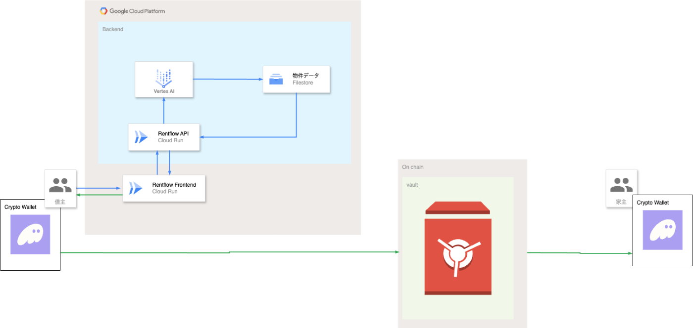

#  はじめに

##  概要

本プラットフォームは、AIの自然言語検索とスマートコントラクトを組み合わせることで、「検索から契約までをストレスフリーに完結できる」賃貸システムを目指しています。  
AIを活用して物件検索を効率化し、契約はブロックチェーン上のスマートコントラクトを利用することで、不透明な審査を排除し、トラストレスな仕組みを実現します。

この記事では、本サービスの背景やコンセプト、技術要件を紹介し、「どんなユーザーが、どんなメリットを得られるのか」を掘り下げて解説します。

!

スマートコンラクト部分は未実装です。間に合いませんでした🙇‍♂️  
また、構想とある通りこのハッカソンにおいて作った部分も特にサービスとして切り出せるような出来には至っていません。  
アイディアの根っこになる部分をPOCとして実装してみました。

##  謝辞(O'Reillyの謝辞風)

まずはこのような素晴らしいハッカソンを開き、参加する機会を設けてくださったZennの方々、そしてGoogle Cloudのクレジットを気前よく参加者に配ってくださったGoogle Cloud Japanの方々に心からお礼を申し上げます。

また、本ハッカソンの参加にあたり、数多くのAIサービスの協力に支えをいただきました。  
まずはアイディアの壁打ちに付き合ってくれ、貴重なフィードバックをたくさんくれたChatGPTo1pro。彼の的確な指摘と示唆に富む意見はアイディアを固め、発展させていく上で必要不可欠でした。  
ChatGPTo1とGemini2.0Flashは常にレスポンスよく小回りの効く対応をしてくれ、様々なサービスを利用していく中で常に献身的にサポートしてくれました。  
さらにWindsurfはAIとCryptoに知見があるとは言えない私の手先となりコーディングを行ってくれました。  
彼らがいなければこのハッカソンに提出することろまで到達できなかったでしょう。  
心から感謝します。

また、この記事の読者の皆様にも感謝を申し上げます。  
拙いプラットフォーム構想にはなりますが、お時間と好奇心に余裕がありましたら是非読んでいただければ幸いです。

#  プラットフォームの概要

##  従来の賃貸プラットフォームの課題

###  物件検索が面倒

既存の検索サイトはチェック項目が多く、日本特有の慣習（礼金・仲介手数料など）も理解しなければならず、ユーザーにリテラシーが求められます。特に海外の方や個人事業主は、検索・契約プロセスを進める上で手間を感じがちです。

###  審査の不透明性

保証人や収入証明の有無で審査に落ちやすいなど、不透明な部分が多いのも問題です。個人事業主や海外の方は、クレジットヒストリーや在留資格の問題で、十分な資金があっても断られるケースが少なくありません。

###  滞納リスクや保証会社との折衝

貸主は「家賃を踏み倒されたら困る」というリスクを抱え、保証会社に依存している現状があります。借主が滞納を起こした場合、双方にとってトラブルの火種となる可能性が高いです。

##  対象となるユーザー像と課題／ソリューションと特徴

想定している主なユーザーは以下のとおりです。

  * 個人事業主  
従来の「雇用形態」や「安定収入」という信用指標が弱いため、物件審査に通りにくい。  
保証会社の審査が厳しかったり、「連帯保証人がいないと契約不可」といった場面に直面しやすい。

  * 海外の方／外国人留学生・就労者  
日本語が堪能ではなく、既存の物件検索サイト（多量のフォーム入力・選択チェックなど）が使いづらい。  
在留資格や国籍を理由に審査が厳しくなる、あるいは情報不足で断られるケースも多い。

  * 忙しい社会人／ITに慣れた層  
細かい条件をチェックリストで選ぶことに手間を感じ、もっと気軽に「会話するように」物件を探したい。  
不動産会社への来店や書面でのやりとりを最小限にし、オンラインで完結したい。

  * 金銭トラブルを未然に防ぎたい貸主と借主  
大手であれば管理会社に委託できる金銭トラブルを抱えることに不安な借主や、個人間の賃貸契約を行いたいがお金の未払いが不安でやっていない。

#  ソリューション

##  概要

###  アーキテクチャ図

  
このアーキテクチャ図でのGoogle Cloud部分まではデモが可能な状態になっていますが、借主Aのウォレットからスマートコントラクトを介してVault領域にデポジットし、そこのでデポジットされ暗号通貨を貸主Bのウォレットに送金するという部分は実装が間に合いませんでした。

  * フロントエンドのサーバーとバックエンドのAPIサーバーはCloud Runで構成されています。
  * ユーザーが自然言語で入力した検索内容はVertex AI Studioで解析した上で、Firestoreの検索クエリの形式にフォーマットに変換されます。

###  デモ動画

<https://youtube.com/shorts/E522Xd5pi9A>

###  AIによる自然言語検索

ユーザーが「家賃は8万円以下で、駅から10分以内、ペット可、外国人OKの物件を探してる」と一文で入力すれば、AIが自動で各条件を解析。複雑なフォーム選択を省略し、直感的なUXを実現。  
絶対にAIを活用しなければ実現できない機能ではありませんが、VertexAiを介してデータベースとやり取りすることで、かなり柔軟で多様な検索を高速で実現できるようになると感じています。

###  スマートコントラクト活用によるトラストレス化

借主は予め仮想通貨で家賃相当額をデポジットし、毎月の引き落としをスマートコントラクトが自動で実行。貸主は滞納リスクを心配する必要がなく、保証人を立てなくても契約しやすくなる。  
個人事業主や海外の方が審査に落とされやすい大きな要因の一つとして、収入の不安定さが指摘されることが多いが、スマートコンラクトを介入させることで金銭面の不透明さを解消することができる。

###  入金時のステーブルコイン変換

価格変動の大きい暗号通貨で入金された場合、即時にステーブルコイン（USDC等）へ変換。家賃相当額を安定して保管できるため、急激な相場変動に左右されない仕組みを確保。

##  詳細

###  ユーザー入力

例：「家賃は8万円以下で、駅徒歩10分以内、フリーランスOK、ペット可」  
VertexAIStudioを用いて、家賃上限・間取り・ペット可・フリーランスOKといった複数のフィルタを抽出して物件データを検索。  
結果表示一覧を返す。  
ユーザーのメリット  
・短い入力文で複雑な条件を同時に指定でき、曖昧な希望にも対応。  
・多言語対応が進めば海外からの利用者も検索しやすい。

###  スマートコントラクトを用いた契約(未実装)

####  仕組み

契約を開始する際は、まず「契約」ボタンをクリックすると、借主のウォレットが起動し、署名の承認を求めます。借主が承認するとVault領域へ仮想通貨のデポジットが行われ、たとえばSOLなどで入金した場合は即時にステーブルコインへ変換され、スマートコントラクトによって残高が管理されます。

家賃の支払いは毎月自動で行われ、家賃日になるとスマートコントラクトが残高から引き落としを行い、そのまま貸主に送金します。退去時に残高が残っていれば、借主がwithdraw操作をして引き出すことで返金を受けることができます。

この仕組みは「トラストレス（信用を必要としない）」であることが大きなメリットです。Vaultにロックされたデポジットが担保となるため、貸主は滞納リスクをほぼ排除できます。一方、借主にとっては保証人や煩雑な審査の必要がなく、金銭面がクリアであれば契約のハードルを大幅に下げられるという利点があります。

####  ステーブルコイン変換でリスク回避

暗号通貨にはボラティリティ（価格変動）のリスクがあり、通貨価格が大きく変動すると貸主・借主の双方に大きな不安を与える可能性があります。そこで、本システムでは「即時変換」の仕組みを取り入れ、たとえばSOLで入金された場合は、モックでもよいのでDEXや独自モジュールを用いてUSDCへ変換する設計を想定しています。

USDCは1USDC≒1USDという安定価値を持っているため、家賃に相当する金額を明確に管理できる点が大きなメリットです。変換後はデポジットとして安定的に保管されるため、貸主・借主の不安を和らげられます。

システム全体のアーキテクチャとしては、まずフロントエンドから「契約ボタン」を押すことでAnchor経由でSolanaのスマートコントラクトが呼び出されます。スマートコントラクト側はAnchorフレームワークで実装され、主にデポジットの管理と家賃決済のロジックを担当します。こうした仕組みにより、安定性と使いやすさを両立した賃貸契約のプラットフォームを目指しています。

#  今後の展望

まずスマートコントラクト部分の実装を完了させたい。  
実際サービスをローンチさせるとなるとかなり高いハードルがあるが、POCとしての完成度を高めたい。

以下列挙

  * このプラットフォームが必要な理由の定量的なデータの収集
  * 貸主の物件登録フローの確立
  * OCR活用での書類審査フローの効率化
  * ベクトル検索を導入してより柔軟で曖昧な自然言語入力からユーザーにフィットする物件を提案できるようにする
  * 収入以外の審査プロセスの自動化  
在留資格書類やフリーランスの収入データを解析し、追加書類を自動で求めるなどスムーズに審査を通す。

#  まとめ

本プラットフォームの狙いは、「複雑な賃貸契約を、AIとスマートコントラクトで合理化し、個人事業主や海外の人など既存の日本の賃貸契約の仕組みに満足できない人にも開かれた仕組みにする」ことです。  
AIの自然言語検索で従来のフォーム入力の面倒を解消し、スマートコントラクトによるデポジット式の支払いで滞納リスクを減らし、保証人不要のトラストレスな契約を提供。さらに、ステーブルコインを使った変動リスク回避で安心感を高める。  
部屋を借りたくても信用力で弾かれる外国人・フリーランスにとっては、「預け金さえあれば契約できる」革新的な選択肢になると考えています。

#  おわり

AI Agent Hackathon with Google Cloudのアィディアを考える中で、AIエージェントとは何かをよく考えました。  
単純にエージェントという意味を考えれば代行なので、AIが代行に関わっていれば全てAIエージェントサービスなのかもしれないと当初考えましたが、それではどうしてもAIが何を解決するソリューションなのかという輪郭が自分の中で見えてこず、非常に悩みました。

最終的に私自身個人事業主として活動する中で、既存の賃貸物件検索サイトや審査の仕組みに不満を感じていたこともあり、その分野でのサービス開発を考え始めました。  
考え出すと物件検索の煩雑さに対してLLMを活用してより探しやすくするアイディアを思いつきました。  
ただ、それだけだと従来のLLMサービスとの差別化をあまり感じず、賃貸物件の審査面を考えた時にCryptoを活用することでより面白いアイディアになると考え、AIxCryptoの賃貸プラットフォームを構想するに至りました。
