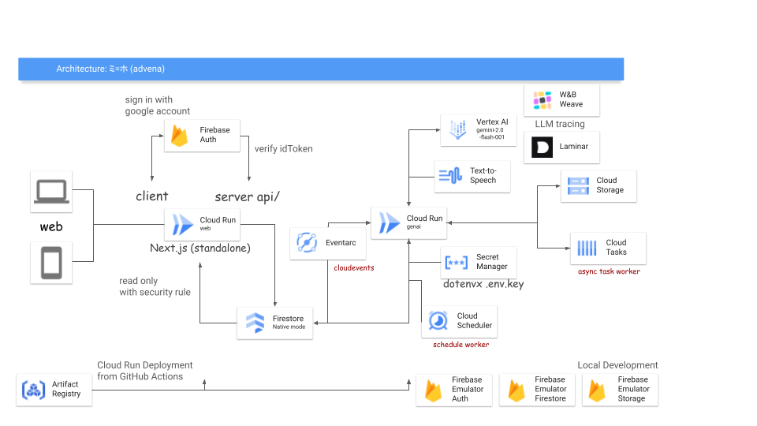

こんにちは hironow と申します！  
このたび AI Agent Hackathon に参加しましたのでその参加記事となります！  
どうかよろしくお願いいたします。

**本記事は[AI Agent Hackathon with Google Cloud](https://zenn.dev/hackathons/2024-google-cloud-japan-ai-hackathon) の次の提出物にあたります:**

> プロジェクトについて説明した Zenn の記事  
>  文字数は 4000～6000 文字とし、下記 ⅰ~ⅲ を必ず記事中に含めてください。  
>  ⅰ. プロジェクトが対象とするユーザー像と課題、課題へのソリューションと特徴をまとめた説明文  
>  ⅱ. システム アーキテクチャ図の画像  
>  ⅲ. プロジェクトの 3 分以内のデモ動画  
>  ※デモ動画は自作の上、YouTube に公開し Zenn 記事に埋め込んでください。

##  プロジェクト

「ミ=ホ」 (読み方: ミーホ)と言います。実装上のコードネームは advena (アドヴェナ)です。

毎日出版される書籍の内容を紹介という形で要約し、AI合成音声でラジオ番組として提供するサービスです。  
利用者は任意のキーワードを登録でき、同じくそのキーワードの検索結果に基づくラジオ番組も提供するところまでは間に合いませんでした…。  
提出時点で、直近の書籍全部の紹介を行うラジオ番組が提供できています。

書籍データは国立国会図書館が提供するRSS FeedおよびAPIを利用し、非営利目的での活用にあたります。  
※活用にあたっては昨年12月下旬に国立国会図書館さまへ問い合わせ済みです

##  プロジェクトが対象とするユーザー像

  * 書籍を読む人
  * 書籍のレビューを読む人
  * 良い書籍を見つけたい人
  * 日本で発売される書籍を隈なく知りたい人

##  課題

  * 新刊コーナーでの出会いが少ない。特に都市部以外では顕著 (この部分は長年の筆者が思ってきた強い課題)
  * 紙の書籍を触りに行く機会が減少している
  * 書籍のレビューがあまり当てにならないことが稀によくある (筆者の個人的な感想)
  * 今後AI・LLMの発展により、さらに書籍出版の需要が変化する可能性がある
  * 毎日出版される書籍の数は多い日で100冊を超えることがある。その中から自分の好みに合った書籍を見つけるのは困難 [参考](https://www.books.or.jp/)

##  課題へのソリューション

  * 書籍の内容の内、タイトルほかメタデータを元に要約します。要約の形態はラジオ番組の台本を構成して、録音はAI合成音声、スクリプトはLLMが担当します
  * このラジオを契機に、書籍の内容に興味を持ち、紙の書籍を触りに行く機会を増やす (正確に言うとインターネット上で閲覧可能な情報以上を得られるのは紙媒体のみという立ち位置です)
  * 自分自身で書籍を他者のレビューより先に読むことで、本当に欲しい書籍との出会いを増やす
  * 廃刊になってしまう前の出会いを創出したい [参考](https://togetter.com/li/2502536)
  * 対象年齢の基準は他サービスに倣い13歳 [参考](https://openai.com/ja-JP/policies/terms-of-use/) とする

出社時間やお昼休憩、退社時間の寄り道前など、数分だけの時間を使ってその日は発売の書籍情報を知ることができます。  
ラジオ番組になっているので無心で聞くことができ、またその日の気分に合わせて聞くことができます。  
台本の閲覧もでき、その台本に使われた書籍一覧も閲覧できます。

##  特徴

本ハッカソンの審査基準

> アイデアの質  
>  アイデアの創造性と独創性について評価します。
> 
> 問題の明確さと解決策の有効性  
>  問題が明確に定義されているか、そして提案されたソリューションがその中心となる問題に効果的に対処し、解決しているかを評価します。
> 
> アイデアの実現  
>  開発者がアイデアをどの程度実現し、必要なツールを活用し、拡張性があり、運用しやすく、費用対効果の高いソリューションを作成できたかを評価します。

「運用しやすく」というワードがあったため、本プロジェクトは以下の特徴を強く持ちます。  
なお、本記事執筆時点においてbeta版のみの提供となりますが、リリース後は少なくとも半年間の運用期間を設けようと思ってます。その後は未定です。

**審査対象条件に関する特徴:**

  * 本プロジェクトは非営利目的で運用されます。
  * 本プロジェクトは国立国会図書館が提供するRSS FeedおよびAPIを利用します。
  * 本プロジェクトはGoogle Cloudの以下のサービスを利用します。 
    * Cloud Run
    * Eventarc
    * Cloud Pub/Sub
    * Cloud Scheduler
    * Cloud Tasks
    * Cloud Text-to-Speech API
    * Gemini API in Vertex AI
    * Firebase Auth
    * Firebase Firestore (Native Mode)
    * Cloud Storage (for Firebase)

**本Webサービスの特徴:**

  * スマホファーストで設計しました
  * 認証はGoogleアカウントのみを利用します
  * ラジオ番組の提供が毎日行われます 
    * ただし、新規出版がない日は提供されません
    * キーワード付きのラジオ番組の提供は新規出版がある日のみ行われます _(未実装)_
  * ラジオ番組の提供は日本時間の午前0時から午前1時ごろに行われます 
    * ラジオ番組の提供は1日1回のみです
  * ラジオ番組は1分から3分程度で構成され、AI合成音声で提供されます
  * ラジオ番組で利用された書籍情報を閲覧できるUIを提供します
  * キーワードを登録できるUIを提供します _(未実装)_
    * 現時点で登録できる件数は1つのみです (「AI LLM エンジニア」と言う単位で1つであり、1ワードのみではありません) _(未実装)_
  * キーワードを登録すると、そのキーワードのためのラジオ番組が提供されます _(未実装)_
  * UIとしてゲームライクなフィールドを提供します。このフィールドは各種UIを人間に提供するためのものですが、AIがAgenticに振る舞うことができる拡張性を想定して、場として提供しています

**実コード上の特徴:**

  * 運用サービスおよび運用中の拡張を見据えて、設計しています。
  * Firestoreのデータ構造は、無停止でのmigrationに対応しています。
  * Eventarcによるイベント駆動型の処理、Cloud Tasksによる非同期処理の移譲、Cloud Schedulerによる定期処理の非同期実行を採用し、運用中の拡張を見据えています。
  * LLMの推論中の結果トレースは、Weights & BiasesのWeaveとLaminarの2つを用いてロギングしています。
  * LLMの利用は、huggingface/smolagentsを使うことで、agenticな振る舞いおよびTool Callの拡張性を見据えています。
  * Firebase Emulatorと連携して、Firebase Auth、Firestore、Cloud Storageを使って開発を進めることができ、Development Experienceを向上させています。
  * miseおよびpnpm、uvを使って開発環境の立ち上げを迅速に行うことができます。
  * dotenvxを用いて環境変数の管理を行い、環境変数の管理を向上させています。 `.env.keys` へのアクセスを適切に管理する前提で、リモートでの動画配信や生配信で `.env` ファイルが映りこんでしまっても問題ないように設計しています。
  * Next.jsはstandaloneモードでclientとserverを分離しており、server側でFirebase Authのverifyを行っています。
  * FastAPIはCloud Run上で authenticated 必須のAPIとして提供しており、Firebase Authのverifyが不要となっています。
  * 各種Google Cloudへのgcloudコマンドは `scripts/` にまとめてあり、運用中の拡張や、terraform化に向けた拡張性を見据えています。

**LLMの特徴:**

  * ラジオ番組という特性かつText to speechで読み上げるため、常用漢字のみを出力とするように調整しています。
  * ラジオ番組の台本の構成というタスク上、thinkタグを使い、まず構成を考えてからscriptタグで読み上げ文章を生成する調整を行いました。
  * 共感性を高める調整を入れました。例えば、感嘆などを指示しています。

##  システム

アーキテクチャ図

##  デモ動画

YouTube 3分以内  
<https://youtu.be/baGulSFkPp4>

**コードリポジトリ:**  
<https://github.com/hironow/advena>

**プロジェクトダッシュボード:**  
<https://github.com/users/hironow/projects/5>

##  余談

**開発中にcommitterになったもの(いずれも軽微かつmerge済み):**

  * [huggingface/smolagents](https://github.com/huggingface/smolagents/pull/379)
  * [livekit/agents](https://github.com/livekit/agents/pull/1415)

**開発中に悩まされたもの:**

  * auth.js(旧next-auth.js)のv5対応 
    * Firebase Emulatorで動く形式への対応
  * Eventarcのデバッグ方法 
    * localhostへのcallを模擬する対応
  * Cloud Tasksのデバッグ方法 
    * Tailscale Funnelを使った対応
  * Next.js standaloneモードでのbuild対応 
    * dotenvxの環境変数の投入も含めた対応
  * iOS Safariのover scroll対応 
    * CSSだけでは対応できず、JavaScript対応と一部使いにくくなる部分の調整

**記事執筆時点で動いているprompt:**

huggingface/smolagents の agent として動いています。 `` タグ内に記述してください。
    IMPORTANT: ラジオ中に音楽は流れません。「(音楽)」というscriptは不要です！
    IMPORTANT: `` を必ず絶対に出力してください。それではどうぞ:
    
