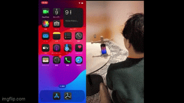
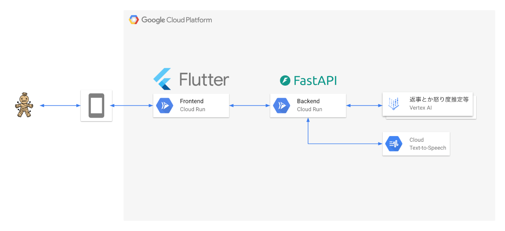
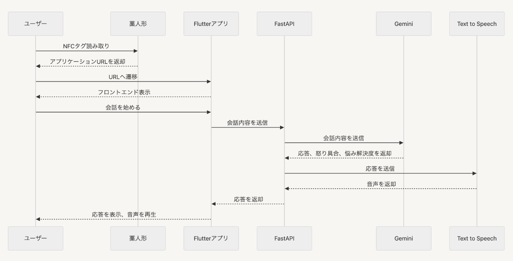

この記事は[AI Agent Hackathon with Google Cloud](https://zenn.dev/hackathons/2024-google-cloud-japan-ai-hackathon)のために書いた記事です。

##  ワラドール・トークについて

現代社会はストレス社会！みなさんは日々のイライラをどう発散していますか？  
タイトな納期、急な仕様変更、思い通りにならないスケジュールなど、ストレスが溜まる理由はさまざまです。  
どうにもならなさを誰かにさらけ出したいけど、感情的なふるまいで人との関係性を悪くしたくないですよね。  
そんな不安から、本当の気持ちを話せる相手は限られてしまいます。  
スポーツや趣味もストレス発散には有効ですが、時間やお金、意志の力が必要であり、コストもかかります。  
ネガティブな感情を気軽に打ち明けたい…！  
仕事や私生活でうまくいかないときに発生したイライラ、藁人形にぶつけて発散しませんか。

怒りや不満を発散したい衝動を抱えながらも感情的になれない全ての方に向け、いくらでも感情的に話せる藁人形、ワラドール・トークを制作しました。  
  
ワラドール・トークは人間の怒りや不満を受け止める藁人形です。  
人間相手に感情的になると角が立つこともありますが、AI相手なら遠慮は不要！呪うようにストレスをぶつけられます。  
ユーザのストレスを受け止めつつイライラの元を聞き出し、前向きな解決策を提示してくれます。

藁人形に埋め込まれたNFCをスマホで読み取るとアプリが起動し、会話がスタートします。  
  
今回は「classmethodさんのオフィス奇麗すぎて羨ましい」ってテーマで会話してみます。

<https://youtu.be/cVoSGAhJs5s>

今回はサービス紹介のためストレスではなく羨ましい気持ちをぶつけてみましたが、会話終了後にユーザに次のアクションを提示してくれるのでスッキリした気分で次の行動に移れます！

AIに悩みを相談できるサービスは色々ありますが、

  * モノとして実在するため藁人形を見たときに嫌な感情をぶつけてもよい“赦し”があるように感じ、試してみたくなる
  * 会話終了後にネクストアクションが提示される  
上記2つがこのサービスの独創的な特徴です。

ワラドール・トークは[こちら](https://frontend-service-hfj6mvu2jq-an.a.run.app/)から試せます。  
気が済むまでストレスをぶつけ、スッキリした気分で次の一歩を踏み出してください！

##  システムアーキテクチャ

###  シーケンス図

下記はワラドール・トークの起動から初回の応答が返却されるまでのシーケンス図です  

NFCにCloud Runから払い出されたURLを埋め込み、スマホで読み取って遷移します。  
チャットベースのUIを採用しており、テキストまたは音声による入力をFastAPIに渡します。  
FastAPIはアプリケーションと各種AIを繋ぐハブの役割を担っており、応答やユーザの怒り具合、悩み相談の進捗度、音声をFlutterアプリに返します。  
Flutterアプリは音声の再生やユーザの怒り具合、悩み相談の進捗度から振る舞いを変えます。  
悩み相談の進捗度ポイントが貯まると"もう藁人形には頼らない"ボタンが表示され、押下すると過去のやり取りを元にユーザにネクストアクションを提示し、会話を終了します。

##  バックエンドの使用技術

###  Gemini 1.5 Flash

感情的なユーザにすぐ応答できる速度を優先したかったためGemini 1.5 Flashを採用しました。  
体感的には1秒未満でレスポンスが返ります。かなりはやい！  
応答の内容も納得感があり、プロンプトでの制御もかなり効きやすいと感じています。

###  Text to Speech

Geminiからの応答を音声に変換してくれます。  
今回は安心して悩みを話せる人ってどんな人だろう？と思い、頼れる兄貴肌な声を想像してパラメータを設定しました。  
設定項目は下記の通りです。

main.py
    
    
    # 音声パラメータを設定
    voice = texttospeech.VoiceSelectionParams(
        language_code="ja-JP",
        name="ja-JP-Neural2-D"
    )
    
    # オーディオ設定
    audio_config = texttospeech.AudioConfig(
        audio_encoding=texttospeech.AudioEncoding.LINEAR16,
        effects_profile_id=["small-bluetooth-speaker-class-device"],
        pitch=-8.0,
        speaking_rate=1.3
    )
    

`language_code`は日本語、`name`は男性の声、`pitch`は低めに設定、`speaking_rate`は少し早めに設定しました。  
声の種類多すぎてびっくりしました、各言語ごとに数パターンの声があるのでとんでもない量です。  
ピッチや再生速度を変えて理想の声を制作するのが楽しかった！  
<https://cloud.google.com/text-to-speech/docs/voices?hl=ja>

###  Vision AI

アプリケーションのfavicon用の画像を生成してもらいました!  

下記はfavicon生成に使用したプロンプトです。
    
    
    No face Voodoo doll made of bundled straw, with a black pin in its torso.
    Stylized, simple logo for favicon of web site, transparent background.
    

日本藁人形を生成するのは難しかった…

###  Cloud Run

FlutterアプリとFastAPIはCloud Runでデプロイしています。  
アクセスがあった時しか課金されないサービスなので好きです、Lambdaと異なりWebSocket対応してるのも好きです。(今回はWebSocket不使用)

###  FastAPI

今回初めて使用しました。  
スキーマのドキュメント整備を気にせずAPIを作れるので非常にハッカソン向きです。  
GCPのドキュメントにはPythonでリクエストを送信するサンプルコードが多めだったこともあり、AIを活用した開発をするならかなりの初速を出せると思います。  
FastAPIでスキーマ駆動開発をしよう！

##  フロントエンドにはFlutterを使用

###  Flutterを選定した理由

今回作成するアプリは、モバイルでアプリを起動することが前提となります。  
なぜなら、NFCタグをスマホでタッチした後にアプリが起動することを想定しているからです。  
そこで、クロスプラットフォーム開発ができるFlutterを選定することにしました。

FlutterはiOS, Android, Web など様々なプラットフォームのアプリを一つのコードベースで開発することができます。  
その中で今回は、Webアプリとしてリリースしました。  
これにより以下のメリットがあります。

  * NFCタグによるアプリ起動がURLの呼び出しでだけ済むため簡単
  * サーバーにデプロイするだけで済むため、リリースを即座にできる
  * どのデバイスOSでも試すことができ、汎用性が高い

さらに、先述したようにFlutterはクロスプラットフォーム開発に対応しています。  
今後、iOS/Androidの各プラットフォームのストアでアプリをリリースすることができれば、ユーザー体験をさらに向上させることができます。  
一つのコードベースで対応することができるので、現在のコードの大部分を使用することができます。  
そして、リリース後の保守・運用も最小限の努力で済みます。  
なぜなら、iOSやAndroidで機能を追加・変更する場合もコードの大部分を共有できるためです。

このように、拡張性が高く柔軟な開発をすることができることは、Flutterによるクロスプラットフォーム開発の強みと言えます。

###  Flutterによる効率的な開発

何度もお伝えしている通り、Flutterの特徴はクロスプラットフォーム開発が可能な点です。  
しかし、それだけではありません。  
Flutterは豊富な「ウィジェット」と「ライブラリ」によって高速な開発をすることができます。

> ウィジェットとは、アプリケーションのUIを構成する基本的な要素のことです。  
>  ボタンやテキスト、画像などの見た目のパーツだけでなく、レイアウトや装飾、アニメーションなどもすべてウィジェットとして扱われます。

Flutterでは、これらのウィジェットを自由に組み合わせたりカスタマイズすることで、柔軟なデザインとインタラクションを簡単に作り上げることができます。  
ウィジェットのパラメーターを調整するだけで、UIの細かい色・サイズ・形を自由にカスタマイズできるため、直感的に作業を進めることができました。

また、豊富なライブラリを使用して簡単に様々な機能を持たせることができます。  
例えば、今回アプリに実装した「音声をテキストに変える機能（Speech to Text）」は「speech_to_text」というライブラリを使用しました。  
また、「Audio再生機能」には「just_audio」というライブラリを使用しました。  
このようにマイクやオーディオなど、デバイスの機能を使用したい場合も、Flutterのパッケージを使用すれば簡単に実装することができます。

他にもホットリロードによってリアルタイムな実装内容の反映など、開発を効率的に進めるためのサポートが充実しています。

Flutterを使用することで、短期ながらも効率的にアプリ開発をすることができ、とてもコスパの良い最高の選択となりました。

##  “場”の拡張性 ~AIエージェントにおける「在り方」について~

現在、数多くのAIサービスが存在していますが、その多くは「一度使えば満足し、すぐに忘れ去られてしまう」と感じてしまうものです。  
AIエージェントが人間に寄り添う存在となるためには、機能の利便性やUIの使いやすさはもちろんのこと、いかに日常生活に溶け込み、自らの存在感を効果的にアピールできるかという点も重要ではないかと思います。

今回作成したワラドール・トークは、藁人形という存在感のありすぎるデザインを通じて、利用者に「嫌なことがあったら、いつでも思い切りぶつけてくれていいんだよ」というメッセージを届けています。  
ネガティブな感情をそのまま吐露するのは心理的なハードルを感じやすく、利用者自らが積極的に行動するのは難しいかもしれません。  
しかし、このような存在を含めて利用者とコミュニケーションするAIエージェントであれば、「嫌なことがあったら頼っていい」という安心感を、自然な形で利用者に与えることができるのではないでしょうか  
ワラドール・トークはGemini APIとCloud RunをTerraformでデプロイするといった、運用しやすくコスパも高い普遍的なサーバレス構成です。  
このような気楽なサービスのURLをNFCタグに、NFCタグをモノの中に埋め込めば、“場”そのものが一気に拡張されるのではないでしょうか。  
AIそのものに与えるキャラクターとモノを組み合わせることで“場”が拡張され、新しい考え方や発見につながると感じています。

##  Produced by 丑の刻参ラーズ

####  りっく

ハード担当。本当はIoTを組み込みたかったけど、所持してたマイコンが全て文鎮になってた人。二児の父。子どもと一緒に呪いの藁人形を作った。  
<https://zenn.dev/riku_8000000bit>

####  澤田

フロント担当。チームMTGが緊張しすぎて毎回酒を補給していた。  
<https://zenn.dev/vaza__ta>

####  きのうち

フロント担当。自称脳筋。勧めたものを即ポチる衝動性を持った危険な男。  
<https://zenn.dev/kinoucyu_yuta>

####  ひととり

バックエンドとPdMを担当。皆で楽しく制作できてよかったと思っている。この記事の筆者。  
<https://zenn.dev/hitotori>
