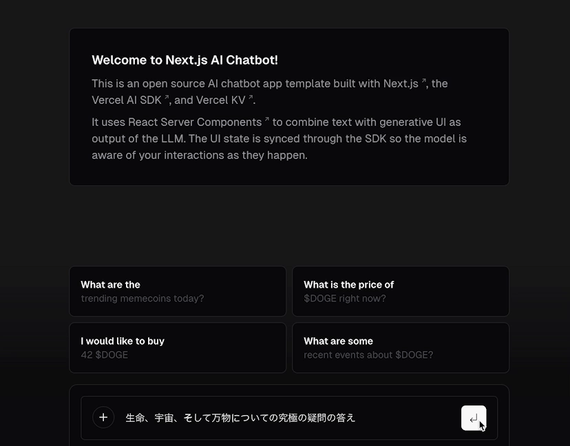
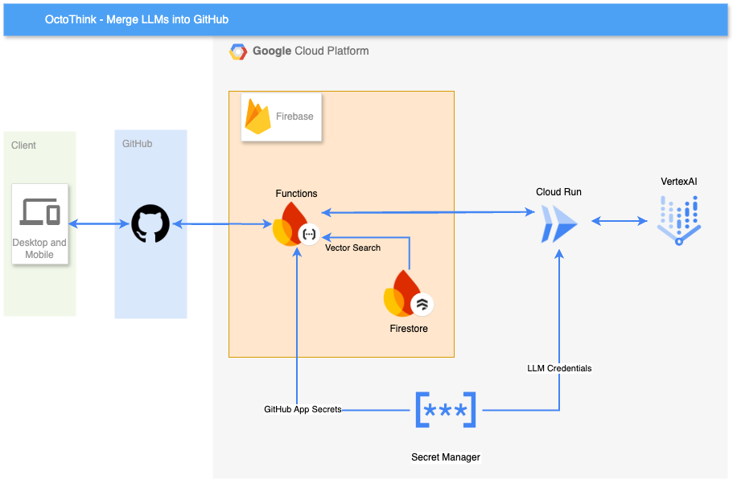
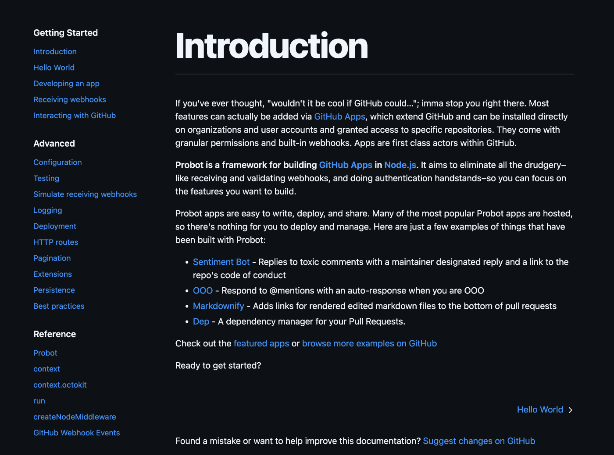

#  はじめに

この記事は、勢いで登録したAI Agent Hackathon with Google Cloudのために作ったGitHub App、**OctoThink** の紹介記事です。

##  問題設定

  * ユーザー像 
    * 日常的にGitHubを使う開発者／事業担当者
  * 課題 
    * AIツールが日常的なものとして定着しない
    * AIツールを日常的な要件に馴染むようにカスタマイズできない

###  課題: 日常に溶け込まないAI

ChatGPTが鮮烈な登場を遂げて2年以上経ちますが、いまだに「AI」という言葉を聞かない日はありません。これだけ「言挙げ」（わざわざ言葉にして論うこと）されている、ということは、「AI」が日常遣いの道具にはなっていない、という裏返しです。

筆者も次々と出てくる新しい技術をできる限り試してきました。たとえばAgentのツールの使用を可視化するための技術として、こんな記事も書きました。

<https://zenn.dev/ptna/articles/850a3978ba3f74>

こういう新しいものは、導入の道は舗装されておらず、頻繁なアップデートですぐ壊れます。記事のVercel AI SDKも4.1になりました。Next.jsも15になりました。「experimental」まみれのAIツールは、日常遣いには向いていません。

日常遣いできるものは何か。「民藝運動」で知られる柳宗悦の「雑器の美」からヒントを得ます。

> 毎日触れる器具であるから、それは実際に堪えねばならない。弱きもの華やかなもの、込み入りしもの、それらの性質はここに許されていない。分厚なもの、頑丈なもの、健全なもの、それが日常の生活に即する器である。手荒き取扱いや烈しい暑さや寒さや、それらのことを悦んで忍ぶほどのものでなければならぬ。病弱ではならない。華美ではならない。強く正しき質を有たねばならぬ。それは誰にでも、また如何なる風にも使われる準備をせねばならぬ。[1]

ここから日常遣いに適したツールの要件を取り出してみます。

  * 毎日触れること
  * 便利であること
  * 地味だが、しっかり使えること
  * シンプルであること
  * 壊れにくいこと
  * カスタマイズ性・拡張性に富むこと（手に馴染むこと）

日常にAIを浸透させようと考えたとき、まず私にとって「毎日触れる」場は、GitHubでした。

GitHubにAIを連携する手段として、探せばGitHub Actionsが見つかります。Copilot Workspaceもあります。私にとって「日常遣いの道具」にするには以下の問題がありました。

  * カスタマイズ性 
    * ある程度可能だが、限界がある。
  * フィードバックループが回りにくい 
    * 使うなかで気づいたフィードバックをすぐに反映できない。（手に馴染まない）
  * 費用 
    * 有料の場合、メンバー数ごと比例して増えていく。たとえば[Code Rabbit](https://www.coderabbit.ai/pricing)なら$12/developerから。

であればと、個々のユーザーがセルフホストし、カスタマイズすることを想定して作ったGitHub Appが、**OctoThink** です。

**OctoThink** は以下を重視した設計になっています。

  * デプロイが容易であること 
    * GitHub ActionsによるCD
    * デプロイのためのGoogle Cloudのセットアップのコード化
    * 環境変数の検証
  * カスタマイズ・機能拡張が容易であること 
    * 機能追加は`command`または`action`を追加することで実現可能。それぞれの`command`/`action`は相互に独立しているため、シンプルな実装となり、テストしやすい。
    * AIの処理本体はバックエンドに置き、GitHub App側から変動の多いAI層を分離。
    * 複数LLMベンダー対応
    * yamlでの構成ファイル

##  デモ

<https://youtu.be/ap8pr5bRXV8>

Narration: Puck from Gemini 2.0 Flash

##  アーキテクチャ

###  Firebase Functions

GitHub App。GitHubからのイベント受け取り、レスポンスを担当。

###  Firestore

ベクトルデータベースとして利用。Issueの要約を保存し、類似Issueを返す。

###  Secret Manager

各種の秘匿情報を一元管理。ローカルでemulateできるように作っています。

###  Cloud Run

バックエンド。Vertex AIやOpenAIなどのAI関連のAPI処理を担当。

##  Repo

<https://github.com/HosakaKeigo/OctoThink>

##  使用技術

###  Probot

<https://probot.github.io/docs/README/>

Node.js用のGitHub Appのフレームワーク。認証周りやGitHub API連携を型付きで扱いやすくしてくれます。

  
_Docもこの項目数。非常にシンプル_

###  Hono

[Zod OpenAPI](https://hono.dev/examples/zod-openapi)が良いです。Node.js/DockerとしてCloud Runにhostingしています。

!

####  Firebase FunctionsでHonoを使う

着手当初は、下記の不具合があったため、筆者はCloud Runを選択しました。  
<https://github.com/honojs/hono/issues/1695>

つい最近解消したようで、今回のユースケースでもFirebase Functionsで統一できそうです。

###  Vitest

<https://vitest.dev/>

##  実装上の工夫

###  GitHub Actions

Google CloudのCD（継続的デリバリー）を構成する際の認証方法として、**Workload Identity連携** がありますが、経験上、仕組みの理解から適切なロールの付与、デバッグの難易度が高いです。

対策として、下記の記事を参考にさせていただき、APIの有効化、Workload Identity Pool/Providerの作成等をシェルスクリプトでできるようにしました。

<https://blog.g-gen.co.jp/entry/create-workload-identity-for-gha-terraform>

###  シークレット／環境変数／configの検証

デプロイ容易性に関連し、必要なシークレット、環境変数、configの検証を行うようにしています。

Firebase FunctionsやCloud Runはトップレベルのコードをデプロイ前に検証するため、下記のようにして、

functions/src/index.ts
    
    
    initSettings();
    
    /**
     * Firebase Functions entrypoint
     */
    export const octoThink = functions.https.onRequest(
    

ZodやValibotで以下のような検証を行えば、デプロイ後に構成値の不足でエラーになることがなくなります。
    
    
    export function initSettings(): v.InferInput<typeof ConfigSchema> {
    	if (typedConfig) {
    		return typedConfig;
    	}
    
    	try {
    		const configFile = loadFile("config.yml");
    		const rawConfig = YAML.parse(configFile);
    		typedConfig = v.parse(ConfigSchema, rawConfig);
    

###  拡張しやすい構成

ClineやGitHub Copilot EditなどAIでのコード拡張を想定して、スコープの小さな変更で機能拡張ができるような、規則的な疎結合構成を意識しています。

GitHub App側は変更・追加の想定される処理の部分を「command」と「actions」として、他と独立して開発できるような構成にしています。

たとえばcommandを追加したい場合は、commandのconfigとそれに対応するhandlerを定義します。

functions/src/app/commands/index.ts
    
    
    	{
    		name: "question",
    		description:
    			"現在のIssue/Pull Requestに関してAIに一般的な質問/要求をします。",
    		pattern: /^\/question/i,
    		handler: questionCommandHandler,
    		args: {
    			type: "string",
    			description: "AIへの質問。",
    			optional: false,
    		},
    		types: ["issue", "pull_request"],
    		removeCommand: false,
    	}
    
    
    
    export async function questionCommandHandler(
    	context: Context<"issue_comment.created">,
    	question?: string,
    ) {
    	[...]
    
    	const response = await requestBackend<CompletionResponseData>({
    		endpoint: `/${getDefaultProvider()}/completion`,
    		method: "POST",
    		data,
    	});
    
    	const answer = cleanMarkdownResponse(response.completion);
    	await context.octokit.issues.createComment(
    		context.issue({
    			body: formatAsAccordion(answer, {
    				title: "💡 回答を表示",
    				provider: getDefaultProvider(),
    			}),
    		}),
    	);
    }
    

一方でバックエンドはAIベンダーごとに規則だったファイル分けにして、既存の実装からベンダーの追加がしやすい作りにしています。
    
    
    src/
    ┣ routes/
    ┃ ┣ gemini/
    ┃ ┃ ┗ completion.ts
    ┃ ┣ multi/
    ┃ ┃ ┗ completion.ts
    ┃ ┗ openai/
    ┃   ┗ completion.ts
    ┣ schema/
    ┃ ┣ routes/
    ┃ ┃ ┣ gemini/
    ┃ ┃ ┃ ┗ completion.ts
    ┃ ┃ ┣ multi/
    ┃ ┃ ┃ ┗ completion.ts
    ┃ ┃ ┗ openai/
    ┃ ┃   ┗ completion.ts
    ┃ ┗ openapi.ts
    ┣ services/
    ┃ ┣ gemini.service.ts
    ┃ ┣ openai.service.ts
    

##  認証

Cloud Runのエンドポイントは保護してあり、
    
    
    import { auth } from "google-auth-library";
    
    const client = await auth.getIdTokenClient(backendUrl);
    

と`google-auth-library`を使い認証付きリクエストを送っています。

##  今後の展開

###  Agentとしての拡張

`command`はAIにとってのツールとして捉えることもできます。現在実装されている`/act`コマンドはtool use（Function calling）の要領で、使用する`command`をAIに選ばせるコマンドです。これを拡張して、既存の構成のままTool Agentとして構築できるのでは、と考えています。

###  Firestoreのベクトル検索の活用

Firestoreはベクトル検索に対応しており、意味検索が可能です。`/search`コマンドはこれを活かして、すでにCloseされたIssueから類似Issueを検索します。

料金面でどこまで現実的かが課題ですが、Firestoreを活用すれば、リポジトリ全体をベクトル化して、RAGとして機能させることもできるのでは、と想像しています。

<https://firebase.google.com/docs/firestore/vector-search?hl=ja>

脚注

  1. <https://www.aozora.gr.jp/cards/001520/files/54958_53049.html> ↩︎

