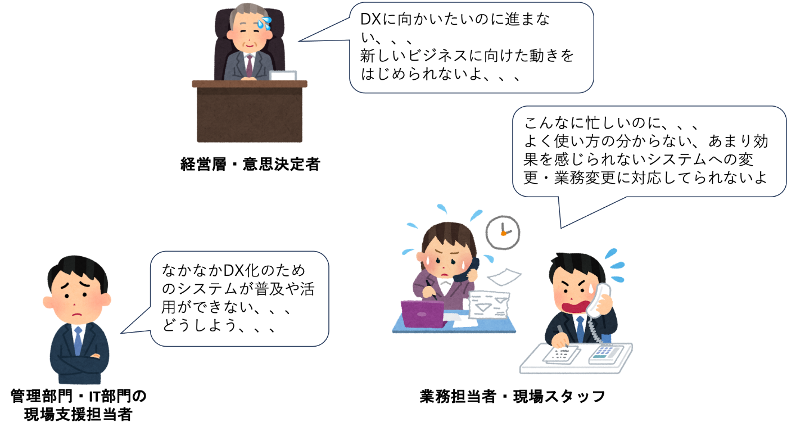
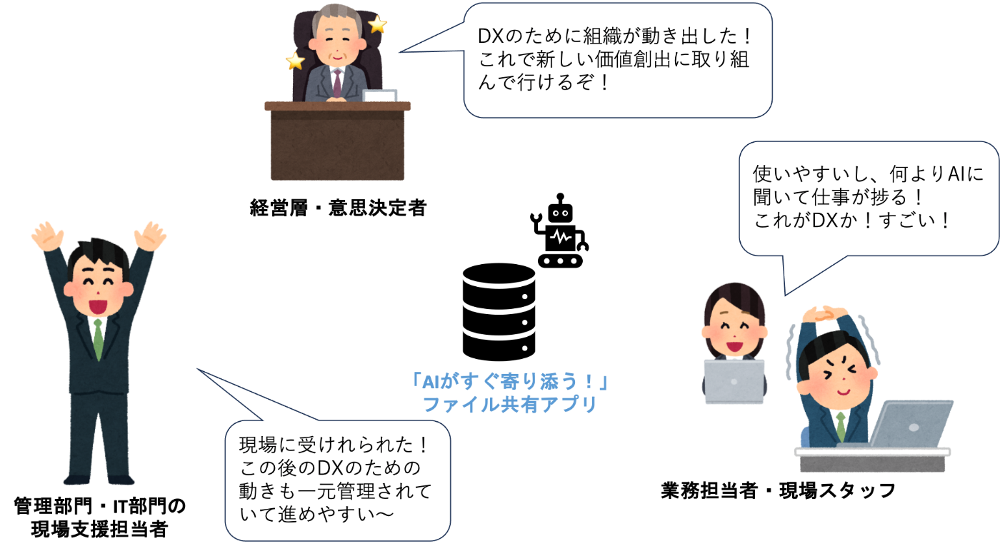
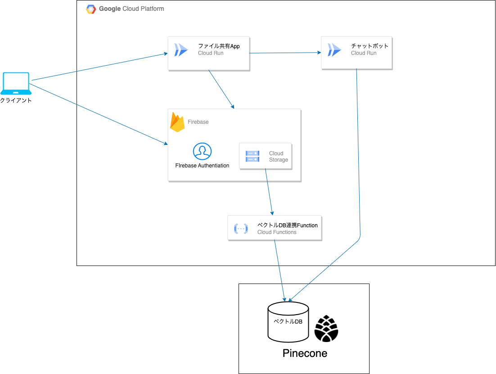

##  要約

本プロジェクトは、企業のDX推進で現場負担を軽減し、業務を迅速化するため、**ファイル共有サービスに生成AIとRAGアーキテクチャを組み合わせたソリューション** を提案します。Firebase、Cloud Storage、Vertex AI等のGoogle Cloud製品を用い、ユーザーが自然言語で質問することで必要な情報を即座に抽出する仕組みを構築。これにより、**業務効率化、投資対効果の向上、そして組織全体の変革** を促進します。

##  はじめに

現代の企業にとって、DX（デジタルトランスフォーメーション）は避けて通れない課題です。経済産業省が示すように、DX化は①デジタイゼーション、②デジタライゼーション、③デジタルトランスフォーメーションの段階を経ます。([引用1](https://www.meti.go.jp/policy/it_policy/dx/::_gaiyou.pdf) )  
活用が進む企業がある一方、現場の業務慣行や固定概念が変革の障壁となり、多くの企業でDXが停滞しています。

そこで、本提案では、②で活用できるファイル共有サービスに生成AIとRAGアーキテクチャを組み込むことで、**現場に「AIがすぐ寄り添う」DX化を実現することを支援できるソリューション** を目指します。

※RAGとは  
RAGは「Retrieval‐Augmented Generation（リトリーバル・オーグメンテッド・ジェネレーション）」の略で、簡単に述べると、「必要な情報を外部から探し出して（retrieval）、その情報をもとに文章を生成する（generation）技術」のことです。（生成AIより引用）

##  プロジェクトが対象とするユーザー像と課題

###  ユーザ像

  * 日々の業務に追われているのにDX化による高負荷を強いられる業務担当者・現場スタッフ
  * DX化を目指しているがイマイチ進捗がなくて困っている経営層・意思決定者
  * DX化を行いたいのに現場の反発に悩まされる管理部門・IT部門の現場支援担当者

###  課題背景

業務担当者・現場スタッフは例えば、他社との請求処理やシステム開発のプロジェクト資料など、情報は集約されていますが、活用や現場への還元が限定的で、以下の課題が生じています。

  * 現場の摩擦: 現状の業務フローに「新たなツール」や「未知のテクノロジー」を導入することに対して、現場の抵抗感が強い。
  * 効率化の実感不足: 単なるファイルの共有・管理だけでは、**業務効率化や意思決定の迅速化が実感されにくく、変革へのモチベーションが生まれにくい** 。

経営層・意思決定者はDX化によるビジネスモデルの変革や競争力強化・データ活用による販路拡大、  
新商品開発を進めたいですが、なかなか変わらない現場に困っているのではないかと考えます。DX化にはトップダウンの動きも大切ですが、**現場のマインド、既存の組織文化が変化を受け入れづらく** 、この変革は簡単なものではなく頭を抱えていると思います。

そして、DX化を上から掲げられて、遂行しているが現場からの反発もあって、右往左往されている管理部門・IT部門の現場支援担当者は右からも左からもプレッシャーを受けていると考えられます。**現場を納得されるだけの良い提案ができず、そのために経営層にも良い進捗報告ができず** 、悩んでいるかと思います。

これらの背景から、DX化の対応がうまく進んでいないと考えられます。

##  課題へのソリューションと特徴

###  提案するソリューションの概要

そのようなDX化の課題について本ソリューションでは、ファイル共有サービス+AIによる機能提供を行います。

###  ソリューションの特徴

####  ファイル共有サービス機能

  * ドキュメントの一元管理  
請求処理やシステム開発に関する各種ドキュメントを**一元管理し、部署間や外部パートナーとの共有を容易** にします。ファイルのアップロード、ダウンロードが可能です。また、**ユーザごとのファイル共有場所のアクセス権限が設定可能** であり、セキュリティと整合性を保ちながら情報を統合します。
  * ユーザーフレンドリーなインターフェース  
現場担当者が**直感的に操作できるシンプルなUI** を提供し、既存の業務フローに無理なく組み込める設計となっています。

####  AI機能

  * 自然言語による対話型サポート  
ユーザーはファイル共有サービス上で、請求書の内容やシステム仕様などについて**自然言語で質問することが可能** です。チャットボット形式の対話インターフェースを通じ、**すぐに回答やサポート情報を得ることができます** 。
  * RAGアーキテクチャによる情報統合  
共有されている膨大なドキュメントや過去の業務データをもとに、AIが関連情報を自動で検索・抽出し、質問に対して的確な回答を生成します。これにより、**現場の疑問に対して迅速かつ正確な解決策を提示できます** 。

###  本ソリューションのメリット

####  業務担当者・現場スタッフ

  * DX化に伴う業務フローの変更負荷の軽減 
    * 業務影響としてファイル管理のみ、このソリューションで行うという形で管理するため、**現場の業務フローに大幅な改良を加えずDX化に参加することができる**
    * UIについてもシンプルな機能の提供のみなので、**ITリテラシーも大きく必要とせず即座に利用できる**
  * AI活用による業務効率化 
    * 例えば、ある請求処理の内容やシステム仕様の詳細をファイルを一つ一つ見るのではなく、**チャットボット形式の対話インターフェースを利用して内容確認を行える** ので、担当者は即座にDX化による恩恵を感じることができ、**早い段階で成功体験を感じられる**

####  経営層・意思決定者

  * 組織全体のDX推進の促進 
    * 本ソリューションにより、現場での迅速な業務改善が実現するため、経営層は**組織全体の生産性向上や市場競争力の強化に直結する効果を期待できる**
  * 投資対効果（ROI）の向上 
    * 現場担当者がすぐにAIサポートの効果を実感できることで、DX投資のリスクが軽減され、**短期間での効果検証が可能**
    * これにより、経営判断の裏付けとしても有効
  * 変革の浸透と組織文化の醸成 
    * 現場での成功体験が経営層にフィードバックされることで、従来の慣習にとらわれない柔軟な働き方が広がり、組織全体の変革がスムーズに進む土台作りが可能

####  管理部門・IT部門の現場支援担当者

  * 業務統合と運用効率の向上 
    * 複数の部署やシステムで分散していたドキュメントを一元管理できるため、**運用管理の手間が大幅に削減され、担当者はより戦略的な業務に専念できる**
    * ドキュメントや資料をクラウド上で管理できるため、その後の**DX化のための自動化やデータ活用などに即座に繋げることが可能**
  * セキュリティとコンプライアンスの強化 
    * ユーザごとのアクセス権限設定により、情報漏洩リスクを抑えつつ、**内部統制やコンプライアンス遵守が徹底できる**
    * これにより、管理部門は安心して業務を遂行でき、IT部門もシステムの安定運用を実現できる

##  デモ

<https://youtu.be/ybO5AbXSMXI>

##  システム紹介

###  システム構成図

本システムは以下のような構成で作成しています。

###  利用している技術

####  ファイル共有App

主要機能の1つでユーザにファイル共有機能を提供します。後述でも記載しますが、ログイン機能のFirebase Authenticationを利用しています。加えてファイルのアップロード、  
ダウンロード先としてもCloud Storage for Firebaseを利用して連携しています。  
フレームワークにはNuxtjsを使っています。ここのWebフレームワークの選定理由は特に大きな意図はなく、Webアプリで仕事や趣味上よく利用していたためです。

####  Firebase

ファイル共有AppやチャットボットAppの認証やファイル連携のバックエンドとして組み込んでいます。  
Authenticationでユーザの管理やトークンのクレーム内容を管理しています。特に、**カスタムクレームにtenantやrole、group情報を埋め込むような設定** にしており、この情報を元に**各アプリの認可機能に組み込むような作り** をしています。  
Cloud Storage for Firebaseはファイル共有の場所を提供していますが、一点だけ面白い機能を利用させていただいています。**「Firebase Security Rules」という機能** があり、これを利用することで**どのユーザがどのフォルダのファイル(正確にはオブジェクトストレージなので、ファイルのプレフィックス情報の認識ですが、分かりやすくここではフォルダやファイルの概念で説明します)を操作していいのかを制御** しています。  
具体的には

  * tenantに属しているか判断
  * roleがadminであればtenant内のファイルを自由に操作できる
  * roleがuserであれば所属しているgroupのファイルのみを操作できる  
といったことを僅か数行のコードで実現できます。  
これを用いてアプリからFirebaseのライブラリを使うだけでバックエンド処理を書かずに実現しています。  
Authenticationのカスタムクレームに情報をまとめることができるとDBなどを持たなくてよくなるので便利だと思います。

####  ベクトルDB連携Function

これはCloud Storageのファイルのアップロードなどをトリガーに動くサーバレスのバックエンド機能になります。  
ユーザからはファイルの操作のみを行なってもらい、非同期でベクトルDBに登録しています。  
後のチャットボットで利用するために処理になります。

####  Pinecone

ベクトルDBになります。調査すると色んなサービスがありましたが、どうしてもベクトルDBに実現してもらいたいことがあり、それをベースに選びました。それは**メタデータを登録してフィルタリングができること** です。  
**複数のテナントやグループが同じベクトルDBを触ってもらうことで運用コストが下げられます** が、そのユーザへの制御が簡単にできたらいいなと思った背景があります。チャットボットからはログインしているユーザ情報を確認して、フィルタリング機能を使って連携してもらうようにしてアクセス制限を実現しています。

####  チャットボットApp

ファイル共有Appからログイン情報を連携してチャットボットAppにログインします。このチャットボットはユーザから対話インターフェースを通して質問を受け、**保存しているファイル情報、すなわちベクトルDBから検索を行った上でその内容を踏まえた上** でユーザに回答します。  
また、**ファイル情報に関係していなかった質問であれば可能な限り分からないことをAIに回答させるようにしています** 。  
チャットボットは何も知識がないので、急いで色々探して、簡単に作れそうなGradioというフレームワークとFastAPIを絡めて実現しています。裏ではLLMとして、Vertex AIのGeminiモデルを利用しています。ベクトルDBには先ほど紹介したPineconeを利用してファイル内容を検索して回答に入れ込んでいます。

###  今後の展望

  * ファイル共有サービスの機能拡張 
    * ファイルの一時ダウンロード、アップロードURL発行機能
    * UI・UXの向上 
      * 画面のレイアウト整備
      * ドラッグ&ドロップ操作
      * ファイル階層のパンくずリスト表示(admin/share1/test1/test.pdfのような階層情報を表示)など
    * 権限制御機能の向上 
      * 閲覧のみの権限実現やより細かい階層構造の認可制御
    * ユーザ作成機能・管理機能・編集機能
    * 外部連携用機能
  * チャットアプリ 
    * 回答精度の向上 
      * RAGの改良
    * ChatアプリのUI・UXの向上 
      * レイアウトなど
    * 実践的なユースケースによる検証 
      * 実際のユースケースに合わせた条件でのAIの回答満足度の調査やそれに対しての調整
      * 調査によって得られた設定は何らかの形でチャットアプリに設定できるようにする 
        * 例：請求ドキュメントに適した設定やシステム開発のドキュメントに適した設定など

###  まとめ

本提案は、企業のDX推進で現場の抵抗や情報活用の非効率性を、ファイル共有＋AIで解決します。具体的には、Google Cloud の各種サービスを基盤とし、RAGアーキテクチャを活用したチャットボットにより、**現場の疑問に迅速かつ正確に応答するシステム** を実現しました。  
今後はフィードバックをもとにUI/UXや権限制御、チャットボットの精度を改善し、実用性・信頼性の向上を図ります。これにより、DX投資のリスクを低減し、短期間での効果検証が可能となるとともに、**企業全体の生産性向上と組織文化の変革に寄与できる** と考えております。
