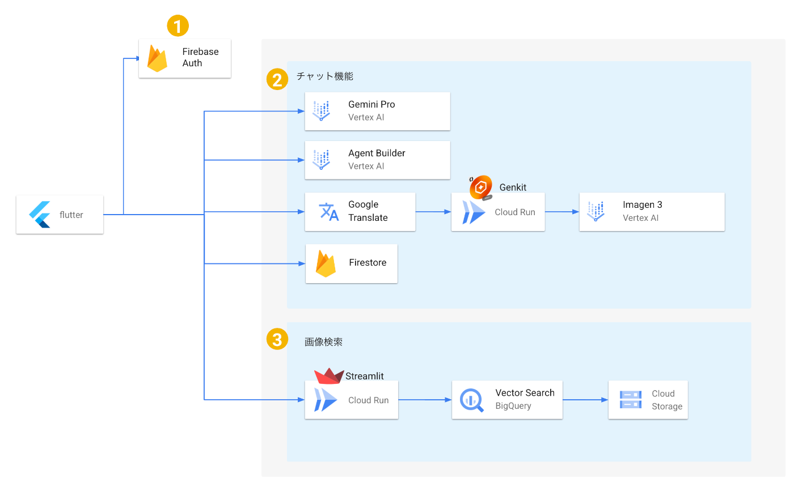

##  AIインテリアコーディネーター： AIと一緒に、曖昧なイメージをカタチに【AI Agent Hackathon with Google Cloud】

**「温かみのある雰囲気にしたいけど、どうすればいいか分からない...」  
そんな言葉では表現しきれない、漠然としたインテリアの理想も、AIとならカタチにできる。**

**漠然としたイメージをAIが解釈し、画像生成によって可視化、そして実世界の商品へと繋げられるサービスを目指しました。**

!

本記事は、Zenn初のオンラインハッカソン「AI Agent Hackathon with Google Cloud」の応募記事です。

###  ⅰ. プロジェクト概要：AIと一緒に、表現できないイメージをカタチに

**対象ユーザーと課題**

本プロジェクトが対象とするユーザーは、以下のような方々です。

  * **言葉で表現するのが難しい、漠然としたイメージを持つ方:** 「なんとなく落ち着ける空間」「温かみのある、優しい雰囲気」といった、具体的な言葉にしづらい理想の空間を思い描いている。
  * **インテリアに関心があるものの、どのようにコーディネートすれば良いか分からない方:** 雑誌やSNSで素敵なインテリアを目にするものの、自分の部屋に取り入れる方法が分からず、一歩を踏み出せない。
  * **引っ越しや模様替えを検討している方:** 新しい生活空間をどのようにデザインすれば、自分らしい快適な空間になるのかイメージが湧かない。

これらのユーザーは、理想のインテリアを実現したいという願望を持ちながらも、知識、時間、予算などの制約に加え、「コーディネート」という言語化しづらい領域で、その実現に苦労しています。具体的には、以下のような課題を抱えています。

  * **言語化の難しさ:** 「温かみのある」や「落ち着ける」といった漠然なイメージは持っているが、具体的なコーディネートをイメージすることができない。
  * **情報収集の煩雑さ:** インターネットや雑誌で情報を集めるものの、情報過多で何が自分に合っているのか判断できない。
  * **コーディネートの難しさ:** 家具や小物の組み合わせ、色使い、配置など、考慮すべき要素が多く、センスや経験が必要とされる。

**ソリューションと特徴**

本プロジェクトは、これらの課題を解決するために、以下の4つの機能を提供します。

  1. **AIチャットによるイメージの具現化:** Gemini Proを用いて、イメージを伝えるだけで、理想の部屋の画像生成のためのプロンプトを作成します。言語化が難しい抽象的な表現をAIが解釈し、具体的なプロンプトに変換します。
  2. **AIによる暮らしの豆知識の提供:** Agent BuilderがCloud Storageにある資料から、インテリアに関する豆知識を紹介し、より快適な空間作りを支援します。
  3. **imagen3による高精度な画像生成:** 生成AIを用いて、具体的なコーディネートされた部屋の画像を生成し、イメージを明確化します。AIが生成した画像は、ユーザーが抱く漠然としたイメージを可視化し、具体的なコーディネートのヒントを提供します。
  4. **画像検索による商品の特定:** 生成された画像に含まれる家具や小物を、画像検索機能 (Vector Search)を用いて検索し、実際の商品と結びつける。

本プロジェクトの特徴は、以下の通りです。

  * **言語化しづらいイメージをAIがカタチにする:** AIがユーザーの曖昧な表現を解釈し、言語化、それを画像化することで具体的なコーディネートのヒントを得られる。また画像検索機能により、生成された画像に含まれる家具や小物を、検索できるため実世界の商品と結びつけられるところが特徴です。

###  ⅱ. システムアーキテクチャ図

**システムアーキテクチャの説明**

  * **①ログイン機能:** フロントエンドはFlutterを使用。 
    * **Firebase Auth:** 認証で使用。
  * **②チャット機能:**
    * **Gemini Pro (Vertex AI):** ユーザーのテキストによる要望から、Imagen3で画像を生成するためのプロンプトを作成します。

    * **Agent Builder (Vertex AI):** Cloud Storageに保存されたインテリアに関する知識データに基づいて、ユーザーに役立つ情報を提供します。

    * **Imagen3 (Vertex AI):** 生成AIを用いて、コーディネートされた部屋の画像を生成します。

      * **Google Translate:** Imagen3で画像を生成するために、英語に翻訳します。
      * **Genkit (Cloud Run):** 画像生成のためのプロンプトをImagen3に送信し、生成された画像をユーザーに返します。
    * **Firestore:** ユーザーのチャット履歴を保存します。

  * **③画像検索機能:**
    * **Streamlit (Cloud Run):** 画像検索のためのインターフェースを提供します。
    * **Vector Search (BigQuery):** アップロードされた画像をベクトル化し、類似画像を検索します。
    * **Cloud Storage:** 家具や商品の画像を保存します。

###  ⅲ. プロジェクトのデモ動画

<https://youtu.be/YY4fDd1XRGA>  
※Vector Search で検索結果として取得した画像は [pixabay](https://pixabay.com/) の画像を使用しました。

**デモ動画の内容**

デモ動画では、本プロジェクトの以下の機能を紹介しています。

  * **ログイン機能**
  * **曖昧な表現からのプロンプト生成:** ユーザーが「ナチュラルで明るい雰囲気」と入力すると、AIがそれを解釈し、具体的なプロンプトを生成。
  * **Agent Builderによる豆知識の提供:** Agent Builderがインテリアに関する豆知識をチャットで提供する様子。
  * **プロンプトから画像生成:** Imagen3でAIが言語化したプロンプトから画像を生成。
  * **生成された画像からの商品検索:** 生成された画像に含まれる家具や小物をVector Searchで検索し、実際の商品の情報が表示される様子。

###  ⅳ. リポジトリ

  * チャット機能のリポジトリ

<https://github.com/rsuzukiMuchi/aiagent-coordinator>

  * Vector Search を用いた画像検索のリポジトリ

<https://github.com/rsuzukiMuchi/vector-search>

###  ⅴ. プロンプト

使用したプロンプトは下記になります。

  * Gemini Proのプロンプト

    
    
          final prompt = '''
    あなたはプロのインテリアコーディネーターです。ユーザーの好みや要望をヒアリングし、具体的なインテリアの提案を行います。
    
    以下の制約に従ってください：
    1. ユーザーの回答に基づいて、具体的なインテリアの提案を行う
       - 家族構成や暮らしのスタイル、趣味を考慮する
       - 家具の配置
       - 色使いの具体例
       - 素材の組み合わせ
       - 照明の提案
       - 具体的な商品カテゴリー
    
    2. 提案の際は以下の要素を含める：
       - 具体的な色の組み合わせ（例：ベージュ×グレー、ネイビー×白など）
       - 具体的な素材（例：オーク材、リネン素材、ベルベットなど）
       - 具体的なアイテム（例：3人掛けソファ、円形ダイニングテーブルなど）
    
    3. 会話の進め方：
       - ユーザーの回答を分析し、具体的な提案を行う
       - 提案の後に、さらに詳細を決めるための質問をする
       - 親しみやすい敬語で話す
       - 回答は3-4文程度でまとめる
    
    4. 提案例：
       "モダンなお好みに合わせて、グレーを基調としたインテリアがおすすめです。
       具体的には、ライトグレーの3人掛けファブリックソファと、オーク材の低めのコーヒーテーブルを組み合わせ、
       アクセントとしてネイビーのクッションを2-3個添えるのはいかがでしょうか？"
    
    5. 最終的には、ユーザーが指定したスタイルに基づいて、Imagenで画像を生成するため詳細な説明を行ってください。
    
    ユーザーの入力: $message
    ''';
    

  * Imagen3 で画像生成を行う際のプロンプト

    
    
    const prompt = `You are the best Japanese photographer in the world.
          Please generate an image of ${input.imageDescription}.`;
    

###  展開

  * 画像生成したものを実世界の商品と結びつけるために画像検索を行ったが、他にも生成されたインテリア画像をAR/VR空間に配置し、実際に部屋に家具を配置した際のイメージを体験できる機能など他にも面白そうなことができそうだと感じました。

###  まとめ

本プロジェクトは、AIが言語化しづらいニーズを理解し、画像生成によって可視化、そして現実世界の商品へと繋げることで、ユーザーに新しいインテリア体験を提供する革新的なサービスを目指しました。  
今回のハッカソンの他の方の記事も見させていただき、勉強させていただこうと思います。

###  参考にしたサイト

<https://firebase.google.com/docs/auth/flutter/start?hl=ja>  
<https://zenn.dev/nozomi_cobo/articles/flutter-genkit-imagen>  
<https://www.cloudskillsboost.google/paths/1282/course_templates/1162/labs/509214>  
<https://www.cloudskillsboost.google/focuses/81832?parent=catalog>
