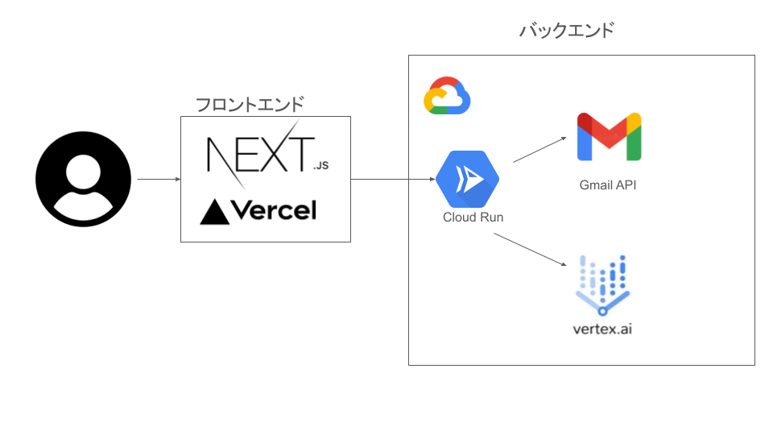

##  はじめに

皆さんは、ECサイトでお買い物をしたり、旅行サイトで予約したり、インターネットで購買をすると思います。

その際、必ずと言っていいほど聞かれるのが「**メルマガ登録** 」ですね。  
もちろん、リピート顧客確保したいという気持ちは重々わかりますが...  
昨今ではあの手この手でメルマガ登録を促そうという**巧みなECサイトが増えている** 現状もあります。

皆さんはメルマガ登録でこんな経験ないですか？

  * 「文字が小さくて気づかず登録してしまった」
  * 「defaultでonになっていることに気づかなかった」
  * 「一度offにしたつもりなのになぜか登録されている」

これらの**ヒューマンエラーで登録されたメルマガは数知れない** ことでしょう。

昨今メールを開かない人も多くなる中で、気づかず登録されたメルマガにさらに気づかず、解約するのも面倒といった始末になっていませんか？

実際、年にECサイトで買い物する数は年々増えています。

10代: 39回 | ██████████████████████████████  
20代: 33回 | ████████████████████████  
30代: 30回 | ██████████████████████  
40代: 24回 | ███████████████  
50代: 18回 | ████████  
60代: 17回 | ███████

※参考元  
[https://netshop.impress.co.jp/node/13476#:~:text=いずれの年代もEC,2回増えている。&text=EC利用者のネット,回数が増えている。&text=「店舗で実物を確認,は増加している。](https://netshop.impress.co.jp/node/13476#:~:text=%E3%81%84%E3%81%9A%E3%82%8C%E3%81%AE%E5%B9%B4%E4%BB%A3%E3%82%82EC,2%E5%9B%9E%E5%A2%97%E3%81%88%E3%81%A6%E3%81%84%E3%82%8B%E3%80%82&text=EC%E5%88%A9%E7%94%A8%E8%80%85%E3%81%AE%E3%83%8D%E3%83%83%E3%83%88,%E5%9B%9E%E6%95%B0%E3%81%8C%E5%A2%97%E3%81%88%E3%81%A6%E3%81%84%E3%82%8B%E3%80%82&text=%E3%80%8C%E5%BA%97%E8%88%97%E3%81%A7%E5%AE%9F%E7%89%A9%E3%82%92%E7%A2%BA%E8%AA%8D,%E3%81%AF%E5%A2%97%E5%8A%A0%E3%81%97%E3%81%A6%E3%81%84%E3%82%8B%E3%80%82)

年に３０回買い物をしたとして、３０メルマガを登録してしまった場合、メルマガの登録にチェックを探す時間が30秒。チェックを外す作業が１秒。  
と考えるだけでも**15分30秒** も無駄にしていることになります。

また、こういった作業は精神的にストレスを感じるので実際の精神的苦痛は数知れずでしょう。

もしメルマガを登録ししまったとしたら、解除するのに、メールを探す作業に１分。  
メルマガ解除するのに２分として、30回分だと....  
**１年間で1時間半** も時間を余分にすることができます！！

皆さん、他の人より１時間半１年間で時間が増えたら何をしたいですか？

東京から富士山を見にドライブもできるでしょう。  
新幹線なら名古屋まで行けちゃいます。

**まるで気付けば溜まってしまうホコリのように、不要なメルマガも溜まり溜まっているそこのあなた！**

そんなあなたの悩みを解決するために今回作ったのが、そこで、**Gmail API** を活用し、**AIエージェント** が自動で不要なメルマガを削除するシステムを開発しました。  
「**メルマガ断捨離エージェント** 」です。

本記事では、プロジェクトの概要と、ユーザー像と課題、そしてそれに対するソリューション、アーキテクチャなどを記載します。

##  対象ユーザーと課題

###  対象ユーザー像

  * 年に３０回以上ECサイト・旅行サイトなどで買い物をする人。
  * メールをいつか整理したいと思いつつ面倒で後回しにしている人。

###  ユーザーが抱える課題

  * **手動管理の手間:**  
重要でも緊急でもない作業なので後回しにしがちな上に、毎回手動でフィルタリングや削除作業を行う必要がある。解除方法もメルマガにより異なる。それらの精神的苦痛と時間が浪費さる。

  * **重要な情報の見落とし【FOMO（Fear of Missing Out）】**  
膨大なメールの中から本当に大切な情報を見つけ出すのが難しい。  
受信のトレイや不要な通知も来るので本当に大切なメッセージにも気づきづらくなる。

##  課題へのソリューションと特徴

###  ソリューション概要

本プロジェクトは、**Gmail API** で最新のメールデータを取得し、**AIエージェント** が各メールの内容を解析。不要と判断したメルマガやニュースレターを自動的に削除することで、受信トレイを常に最適な状態に保ちます。

###  主な特徴

  * **高精度な自動判定**  
独自のロジックとAIを組み合わせて、不要なメルマガを判定。

  * **メルマガ管理画面と要約**  
ユーザーに対して本当に不要なのかどうかをメルマガの一覧と要約した情報を取得。

  * **解除案内**  
解除する方法をAIに解析させ、解除URLに飛ぶボタンを設置。  
解除方法も伝えてくれる。（理想は自動で解除できるようにしたい）

##  サービスの構成

##  サービスデモ

<https://youtu.be/-Z7m2MdLRGQ>
