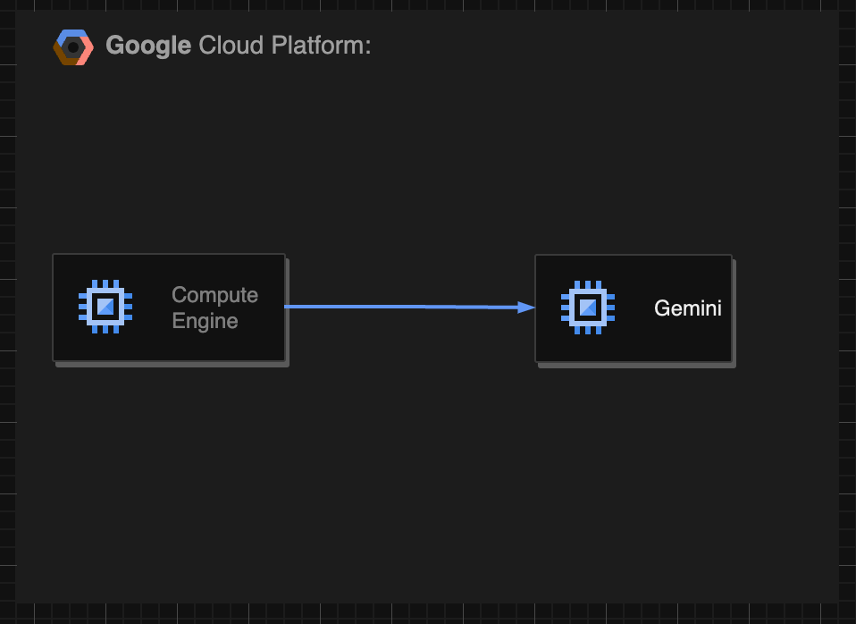

本記事は[AI Agent Hackathon with Google Cloud](https://zenn.dev/hackathons/2024-google-cloud-japan-ai-hackathon) 向けのプロジェクト紹介記事です。  
正直なところ時間不足で中途半端な成果になってしまったのですが、折角いただいた機会ですので投稿しておきます…

* * *

[LLM Fixer](https://github.com/kaibadash/llm_fixer) は、テストや Linter の失敗を自動的に修正するシンプルなコマンドラインツールです。

みなさん以下のようなケースで困ったことはありませんか？

  * 新しいメンバーがジョインしてきて、Linter が整備されていない環境に Linter を導入してくれたが人力では直せない数の警告が出た
  * 各種ライブラリのバージョンアップにより、単純な変更作業が生まれたが数が多すぎる
  * 泣く泣く警告を無視するように設定を整えてやり過ごしたが、今もそのエラーはそのままである

これまでは人間がド根性でエラーを修正していましたが、この手のエラーを修正するのは LLM と相性が良いです。

  * 既存のテストや Linter コマンドの前に `llm_fixer fix` を付けるだけで、エラーを自動的に修正します
  * 1 つのファイルを対象とした修正に特化しています
  * シンプルなコマンドライン設計により、既存のツールチェーンに簡単に組み込めます
  * 利用する LLM やモデルを環境変数で指定可能でコストや品質を調整可能

##  使用例

動画を参照ください。

<https://youtu.be/K-xFKFVf9sY>

###  インストールとセットアップ
    
    
    # TODO: よりシンプルな方法に改善予定です。
    git clone https://github.com/kaibadash/llm_fixer.git
    cd llm_fixer
    
    # Set environment variables. Google Gemini を利用する例
    export API_KEY="your-api-key-here"
    export LLM_API_BASE="https://generativelanguage.googleapis.com/v1beta"
    export LLM_MODEL="gemini-2.0-pro-exp"
    
    # Add to PATH
    export PATH="$PATH:/path/to/static-analysis-fixer/bin"
    

###  実行例

Ruby の静的解析ツール [Rubocop](https://github.com/rubocop/rubocop) のエラーを修正する例を示します。  
今回はコーディング性能の高い `gemini-2.0-pro-exp` を利用しています。

RSpec のテストコードを対象に静的解析を行う例です。  
通常の開発の通り、静的解析を実行します。
    
    
    $ bundle exec rubocop spec/lib/abc_spec.rb
    Warning: Layout/LeadingCommentSpace does not support AllowRBSInlineAnnotation parameter.
    
    Supported parameters are:
    
      - Enabled
      - AllowDoxygenCommentStyle
      - AllowGemfileRubyComment
    
    Inspecting 1 file
    C
    
    Offenses:
    
    spec/lib/abc_spec.rb:11:5: C: RSpec/LetSetup: Do not use let! to setup objects not referenced in tests.
        let!(:user) { create(:user) }
        ^^^^^^^^^^^
    spec/lib/abc_spec.rb:12:5: C: RSpec/LetSetup: Do not use let! to setup objects not referenced in tests.
        let!(:message) { "sample" }
        ^^^^^^^^^^^^^^
    
    1 file inspected, 2 offenses detected
    

2 つの `RSpec/LetSetup` の警告が出ています。使われていないテスト変数を生成しているため、削除するか必要なタイミングで参照するように修正しろ、という旨の警告で以下のいずれかの対応をすることになります。

  * `let!` を `let` に変更する
  * before でテスト変数を明示的に作成する
  * 使われていないなら削除する

人手でやると地味に大変で非常に面倒です…。

そこで `llm_fixer fix` を付加して再実行します。
    
    
    $ llm_fixer fix rubocop spec/lib/abc_spec.rb
    # 中略
    ===== Start generating fix =====
    ---
     a/spec/lib/abc_spec.rb
    +++ b/spec
    /lib/abc_spec.rb
    @@ -10,8 +10,
    6 @@
       end
    
       describe ".chat" do
    -    let!(:user) { create(:user) }
    -    let!(:
    message) { "sample" }
         let!(:chat) { create(:chat) }
    
         it "got LLM response", :v
    cr do
    patch:
    --- a/spec/lib/abc_spec.rb
    +++ b/spec/lib/abc_spec.rb
    @@ -10,8 +10,6 @@
       end
    
       describe ".chat" do
    -    let!(:user) { create(:user) }
    -    let!(:message) { "sample" }
         let!(:chat) { create(:chat) }
    
         it "got LLM response", :vcr do
    ===============
    patching file 'spec/lib/abc_spec.rb'
    spec/lib/abc_spec.rb was fixed!
    

修正及び Rubocop の再実行を行ってくれました。  
あとは人間が変更内容をチェックして問題なければ修正完了です！

###  大量のファイルの場合

現状は 1 つのファイルしか受け付けないのですが、シンプルなツールであるため、`find` コマンドを利用してファイルを指定することで対応可能です。
    
    
    find spec -type f -exec llm_autofix fix bundle execrubocop {} \;
    

##  実装とこだわりのポイント

今回想定しているのは大量のテストケースがある場合で、LLM に渡す文字数も多くなるのを想定しています。  
入力はファイルすべてを渡す必要がありますが、LLM から受け取る出力はパッチ形式にすることで数を抑えました。

エラーを得るためのコマンド実行でエラーが得られなかった場合は、LLM へのリクエストを行いませんので、修正済みのファイルを渡してしまってもコストが嵩むことはありません。

##  システム アーキテクチャと今後の発展

シンプルなツールのため面白みはありません…。GCE と Gemini で検証で行いました。  
今回は時間的な成約で MVP のシンプルな実装のみになってしまいましたが、今後は以下のような発展を考えています。

  * 利用方法に応じてプロンプトを調整できるようにする
  * API として用意し、CI から呼び出して修正の Pull Request を作成する
  * LLM はまだまだ高額であるため、コストを抑える目的で最初は安いモデルで試行して、改善できなかった場合、高性能なモデルを利用して改善を試みる
  * 修正の結果、別のエラーを引き起こすことがあったので、それも勝手に修正する
  * 変更差分からコミットログの生成を行う
  * 大量のファイルを修正する場合、コスト低減及び修正時間の短縮の目的で[バッチテキスト修正](https://cloud.google.com/vertex-ai/generative-ai/docs/multimodal/batch-prediction-gemini?hl=ja) を利用する

##  終わりに

私の所属している会社でも冒頭に上げたように、多くの警告が放置されているところがあります。  
安価なモデルだとコーディングは難しいようで、単純にコメントアウトしてきたりであんまり使い物になりませんでした。  
Gemini Pro や ChatGPT o1 を使うほうが良さそうですが、今度はすぐに rate limitに達してしまいます…。  
早速、LLM Fixerを適用してみたのですがなかなか良い精度で修正ができていると感じます(エラーの修正内容の難易度にもよると思いますが…)。  
時間足らずになってしまい、中途半端な成果物になってしまった感じがありますが、育てていきたいと思います。
