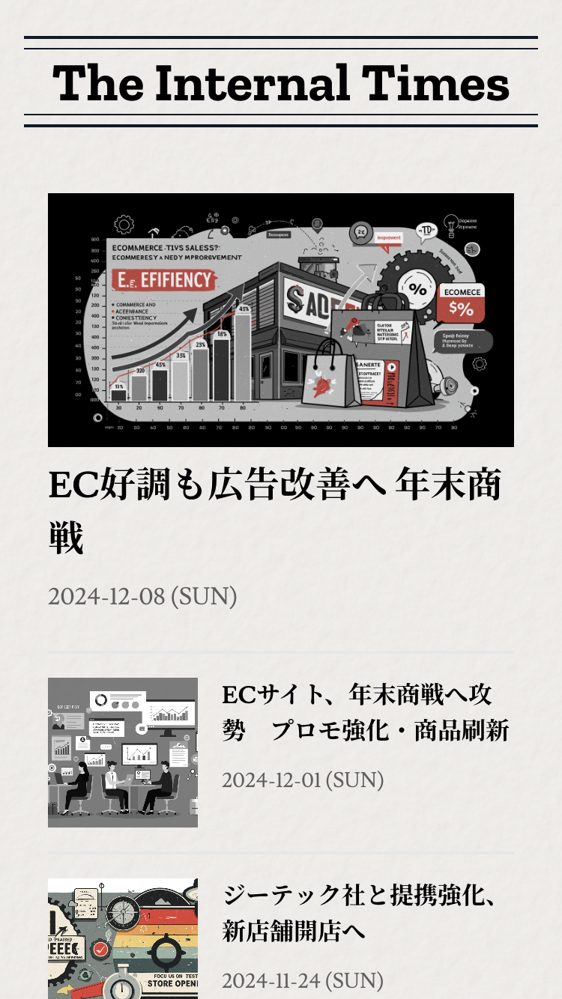
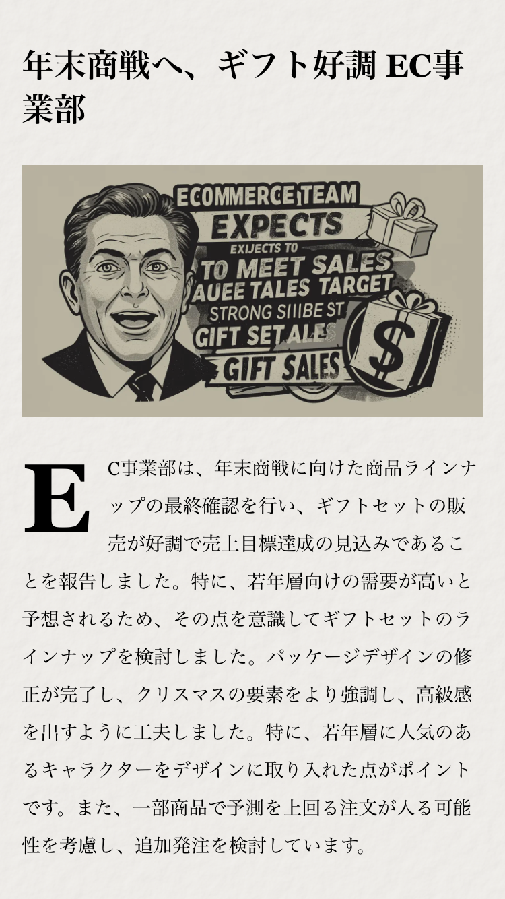
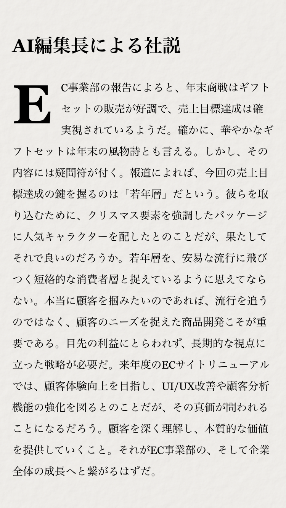
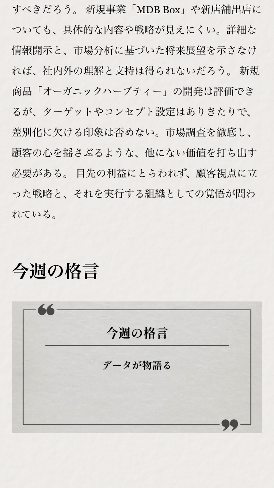
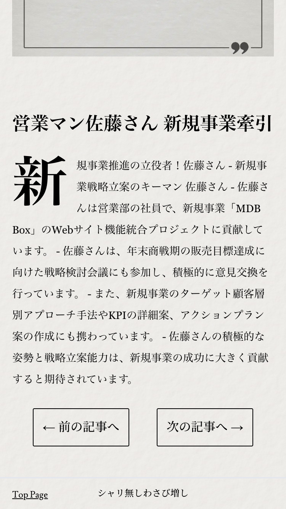
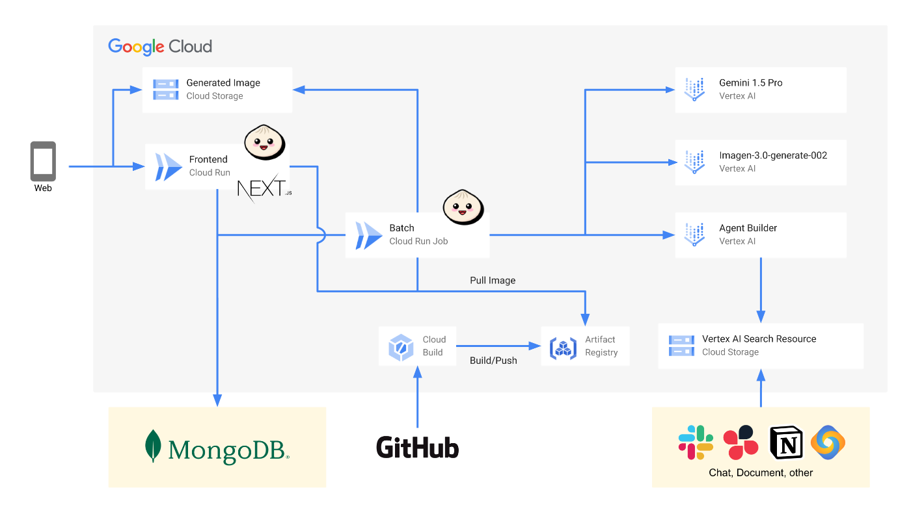

#  社内のぞき見新聞 ～The Internal Times～

##  概要

本記事はZennが主催するAI Agent Hackathon with Google Cloudにエントリーするプロダクトについての紹介記事です。

<https://zenn.dev/hackathons/2024-google-cloud-japan-ai-hackathon>

##  チーム名

**シャリ無しわさび増し**

##  プロダクト名

**社内のぞき見新聞 ～The Internal Times～**

##  プロダクト概要

チャットや議事録などをデータソースとして、AIが自動で情報を収集しその週にあった出来事を新聞記事の形でまとめてくれるプロダクトです。

##  ユーザー像と課題

###  課題

  * 一定以上の人数規模になると組織全体の出来事をキャッチアップするのは難しい
  * コミュニティが所属する部署やチームに閉じられてしまい、人脈が広がりづらい
  * 組織内の情報やメンバープロフィールを共有するための手法として社内報があるが、情報収集や編集には人的コストがかかり、コンテンツを考えるのも大変

###  ユーザー像

  * 何かしらの組織（会社、大学など）に所属するメンバー
  * それらを統括する立場にいる経営層や代表

##  ソリューションと特徴

###  ソリューション

定期的に組織内での出来事をAIエージェントが自動で収集し、新聞記事の形でまとめてくれます。

これによって人間が情報収集して編集する時間的コスト・頭脳的コストを削減しつつ、新聞形式で組織内の情報を楽しくキャッチアップすることができるようになります。

###  特徴

組織内での近況がわかるトピックスの他にも、編集長になりきったAIによる社説、メンバーの活躍やプロフィールを紹介する「今週の格言」や「突撃！今週の〇〇さん」などのおもしろコンテンツを生成できるようにしており、読み手が楽しんで情報収集することができます。

▼デモ動画  
<https://youtu.be/IBP-h7HTR_o>

記事一覧ページ | 社内トピックス  
---|---  
 |   
AI社説 | 今週の格言 | AIによる社員紹介  
---|---|---  
 |  |   
  
##  システムアーキテクチャと工夫

###  システムアーキテクチャ図

###  使用技術

種別 | 使用技術  
---|---  
Frontend | Next.js, Bun, Prisma, Tailwind CSS  
Batch | Bun  
npm packages | vercel/ai, vercel/og, vercel/turborepo, biome  
DB | MongoDB Atlas  
Hosting | Cloud Run  
Vertex AI | Gemini, Imagen3, Agent Builder, Vertex AI Search  
Deploy | Cloud Build, Artifact Registry  
  
###  プロンプトエンジニアリング

４つのトピックスを作るためにそれぞれプロンプトを用意し、それぞれに合ったモデルを使ってプロンプトを調整しました。

####  事業トピックスプロンプト

##### 1.情報の重複を避ける

  * 課題: 
    * 過去に抽出したトピックスと重複しないようにする必要があったが、AIがどの情報が「すでに出たものか」を適切に判断するのが難しい。
  * 工夫した点: 
    * 過去のトピックス一覧を明示的に記載する枠を設け、AIに適切に判断させるように修正。過去に抽出された事業トピックス】枠を作成。

##### 2\. できるだけ多くの事業部の情報を取り上げる

  * 課題: 
    * 特定の事業部が話題を独占しがちで、他の部門が取り上げられにくくなる可能性があった。
  * 工夫した点: 
    * 事業部ごとに分類し、トピックの分布を考慮するような指示を追加。特定の事業部の話題に偏らないよう、バランスよく抽出するよう条件を追加。

##### 3\. 影響力のある情報の選定基準

  * 課題: 
    * どの情報が「重要」なのかを定義するのが難しかった。単なる発言数やリアクション数だけでは、影響力の大きいトピックスを正しく抽出できない可能性がある。
  * 工夫した点: 
    * 具体的な成果や影響が記述されているものという指示の追加。

####  AI社説プロンプト

##### 1.辛口な意見を述べるキャラクターの設定

  * 課題: 
    * 単なる要約や一般的な意見ではなく、辛口な視点を持つ社説ライターらしい文章にする必要があった。
  * 工夫した点: 
    * 攻撃的すぎる表現や倫理的に問題のある主張を避けるため、「論理的かつ適切なリテラシーを保つ」条件を追加。「辛口な意見を述べるキャラクター」として設定しつつ、過度な言葉とのバランスを意識。

##### 2.出力される文章の質

  * 課題: 
    * 生成される文章が「一貫性のない批判」や「的外れな意見」になることがあったため、適切な批評を促す指示が必要だった。
  * 工夫した点: 
    * 単なる否定ではなく、具体的な提言をしてもらうために、建設的な議論を促すように調整。単なるまとめではなく、新聞の社説として価値のある辛口な意見をAIが生成できるよう工夫。

####  今週の格言プロンプト

##### 1.「格言」にふさわしい発言を抽出する

  * 課題: 
    * どのような基準で「格言」になりうる発言を選ぶかを決めるのが難しかった。
  * 工夫した点: 
    * ただの雑談や業務報告ではなく、印象的な発言を選ぶ必要があった。そのため、「ユーモアや知見が含まれていて、印象に残る一言であること」「示唆に富む発言」を条件として追加。

####  AI編集長が突撃取材！今週の〇〇さんプロンプト

##### 1.対象となる社員の選定基準

  * 課題: 
    * 単に「最近Slackで発言が多かった人」だと、発言量だけで選ばれてしまい、内容に偏りが出る可能性があった。
    * 逆に「貢献度の高い人」だけを選ぶと、同じ人が何度も選ばれるリスクがあった。
  * 工夫した点: 
    * バランスよくいろんな人が取り上げられるように、発言頻度や異なる部署で選出させるように条件を追加。

####  開発環境

##### PR-AgentとGemini for Vertex AIによる自動レビュー

[PR-Agent](https://github.com/qodo-ai/pr-agent)を活用した自動レビューを用意していました

プルリクエストのタイトルと説明も自動生成してくれるので、体験がよかったです

各メンバーは普段は仕事もあるので、レビューをする時間も取りづらかったのでPR-AgentとGeminiで最低限のレビューをする運用はうまくいったと思います

GitHub Actions内でのVertex AIとの連携は`google-github-actions/auth`を使えば簡単にできたので、そこもよかったポイントでした

##  おわりに：社内コミュニケーションの新たな可能性を拓く

「社内のぞき見新聞 ～The Internal Times～」は、AIエージェントが社内の情報を自動で収集し、新聞記事の形で配信することで、組織内のコミュニケーションを活性化し、一体感を醸成することを目指したプロダクトです。

###  組織の課題を解決し、新たな価値を創造

従来型の社内報は、情報収集や編集に多大な人的コストがかかり、更新頻度も限られていました。また、情報が特定の部署やチームに偏りやすく、組織全体の動きを把握しづらいという課題もありました。

「社内のぞき見新聞」は、これらの課題を解決するために、AI技術を活用しました。AIエージェントがチャットや議事録などのデータソースから自動で情報を収集し、多様なコンテンツを生成することで、情報収集・編集コストを大幅に削減し、更新頻度を高めることができます。

また、AIエージェントは特定の部署やチームに偏らず、組織全体の情報をバランスよく収集することができます。さらに、社説やインタビュー記事など、読み手が楽しめるコンテンツを生成することで、社内報のエンゲージメントを高めることができます。

###  今後の展望：さらなる進化を目指して

今回のAI Agent Hackathon with Google Cloudへの参加を通じて、「社内のぞき見新聞」は完成度を高めることができました。しかし、まだまだ改善の余地はあります。

今後は、より多くのデータソースに対応し、情報収集の精度を高めることで、記事の質を向上させていきたいと考えています。また、ユーザーインターフェースを改善し、より使いやすいプロダクトにすることで、社内コミュニケーションの活性化に貢献していきたいと考えています。

「社内のぞき見新聞」は、AI技術を活用することで、社内コミュニケーションのあり方を大きく変える可能性を秘めています。今後も、その可能性を追求し、より多くの組織に貢献できるプロダクトへと成長させていきたいと考えています。
