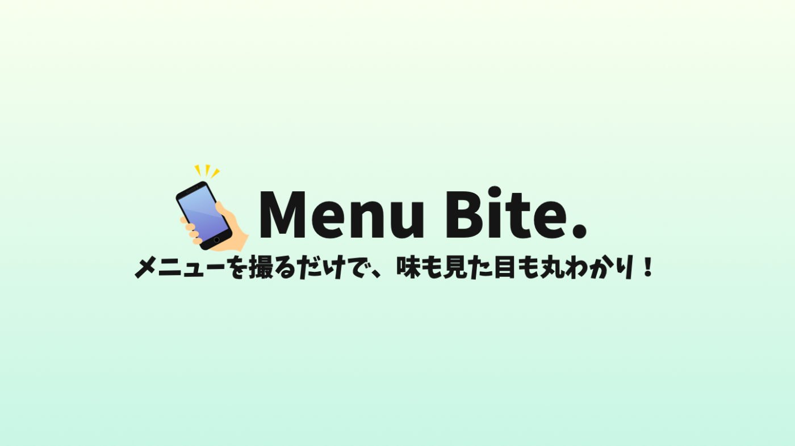

##  はじめに

この度、初めて Flutter を用いてスマホアプリを作成したので、記事にまとめてみました！✨  
アプリ名は **"Menu Bite"** で、**「海外の飲食店でもメニューを撮影するだけで、どんな料理かイメージができるアプリ」** というコンセプトで作成しました。**Google や OpenAI の API** をフル活用することで、個人開発ながら機能的なアプリになっていると思うので、ぜひご一読ください！

↓アプリを実際に動作させている様子です！  
<https://youtu.be/NZzHmhjRFYg>

今回作成したアプリは、こちらのハッカソン（↓）に応募しました！  
（3/7 追記）Moonshot 賞を受賞させていただきました！🏆

##  背景

###  海外の飲食店で困ること

海外旅行の飲食店利用において、**メニューを見てもどんな料理かわからない！！** といった問題に出くわすことがある。例えば、"우동"、"çorba" といった文字がメニューに書いてあったとして、どのような料理かイメージできるだろうか。馴染みのない言語で書かれたメニューを理解するのは難しいものである。

###  既存の翻訳ツールの限界

解決策として、**「Google レンズ」のような画像翻訳ツール** を利用することが考えられる。確かに、Google レンズを用いると、スマホカメラをメニューにかざすだけで翻訳が行われる。しかし、**料理名が得られるだけで料理の詳細や見た目についてはわからない** という問題点がある。

###  飲食店の協力を必要とする解決策はコストがかかる

他の解決策として、デジタルメニューなどの多言語対応システムを導入してもらうなどの解決策も考えられるが、**各飲食店に協力を要請する必要がある、多額のコストがかかる** といった問題点がある。

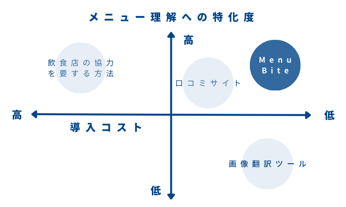  
解決策の案のポジショニングマップ。

###  Menu Bite が解決する課題

以上を踏まえて、我々は次のようなアプリを作成したいと考えた。

  * 料理の名前、詳細、見た目が簡単に理解できる
  * アプリだけで機能が完結する（飲食店の協力を必要としない）

アプリだけで機能が完結することで、ユーザーは**どんな飲食店でもメニューの写真を撮るだけで料理の情報を得られる！**

##  アプリ概要

###  開発プラットフォームとシステムアーキテクチャ図

フロントエンドに Flutter、バックエンドに Python の FastAPI を使用して開発を行なった。システムアーキテクチャ図は以下のようである。Vision API でメニュー画像から抽出したテキストを ChatGPT によって処理する。Dall-E 3 により画像の生成、Custom Search API で Web 検索による画像の取得を行う。バックエンドサーバーは App Engine にアップロードした。

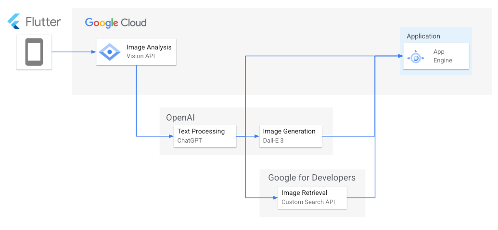

###  機能要件

メイン機能 | サブ機能  
---|---  
（１）料理名の翻訳 | （４）注文機能  
（２）料理の説明文を表示 | （５）注文履歴の保存  
（３）料理の画像を表示 |   
  
上記のような機能を実装することにした。なお、サブ機能である注文機能については、海外の飲食店において **「注文内容を伝えるのが難しい」** という別の問題に対する解決策である。取得したメニュー情報を利用して注文まで簡単に行えるようにすることで、**「メニューを撮影」するだけで①メニューを理解する,②注文を行う** という二つの目的を同時に達成できる。また、注文履歴機能については、海外での食事を思い出として保存する役割を持つ。

###  画面構成

画面構成は、以下のようになっている。まずアプリを開くとカメラ画面が表示される。メニューを撮影すると、プレビュー画面に遷移し、画像の確認を行える。画像を送信すると、メニュー画面に遷移し、読み取った料理の名前や画像などが表示される。注文する料理を選択したら、注文ボタンを押すことで注文画面に遷移する。注文完了ボタンを押すと、注文履歴画面に遷移する。

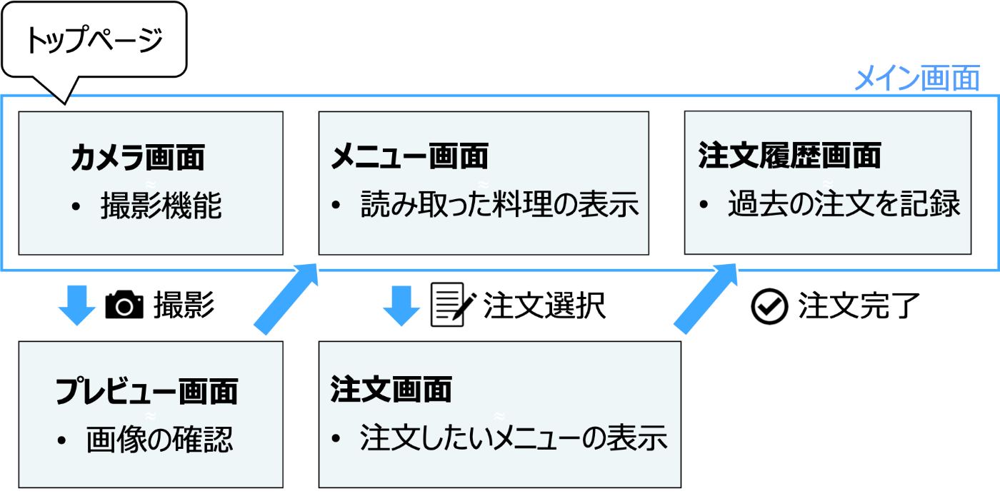

##  機能

###  カメラ機能

アプリ全体の共通の仕様として、上部のバーから①言語設定、②下部のタブバーから別画面への遷移が行える。カメラ画面では、メニューを**③カメラで撮影、あるいは④写真フォルダから選択** できる。  
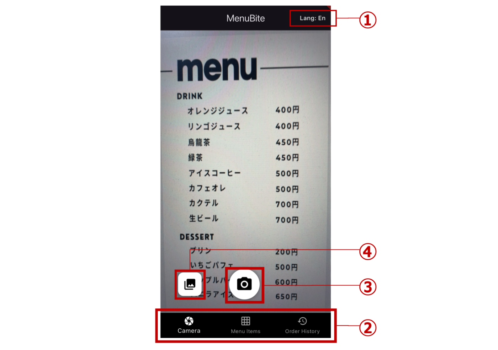

###  メニュー画面

メニューの画像から得られた料理に関する情報を表示。上部の①バーからカテゴリを選択すると、**そのカテゴリに応じた料理の一覧** が表示される。②各料理のウィジェットには、**料理の画像、名前（元言語、翻訳語の言語）、料金** の情報が表示される。③ゴミ箱ボタンで料理情報を削除できる。選択した料理とその個数に応じて、④注文ボタンに合計金額が表示される。  
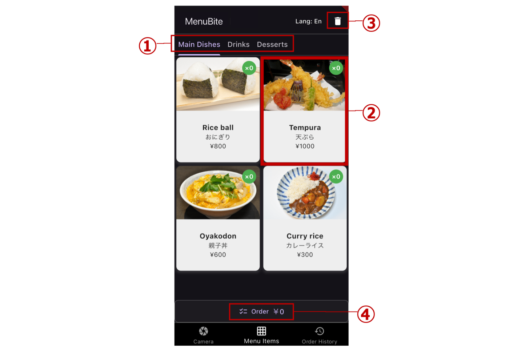

###  各料理の詳細画面

メニュー画面で特定の料理をタップするとポップアップが出現。①料理名（検索リンクが貼られている）、②料理の説明文が表示される。③画像生成ボタンをタップすると**生成 AI による画像生成** が行われる。④個数選択ボタンで注文する個数を選択すると、⑤確定ボタンに注文数に応じた金額が表示される。  
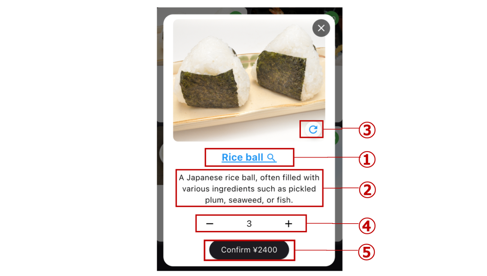

###  注文画面

注文画面では、①ユーザーに対する **「店員さんにこの画面を見せてください」** というメッセージを表示。その下に実際に②店員さんに見せる注文内容を表示。注文内容にはメニューの書かれていた言語で **「以下のメニューをお願いします。」** というメッセージと共に、選択した料理とその個数が表示される。  
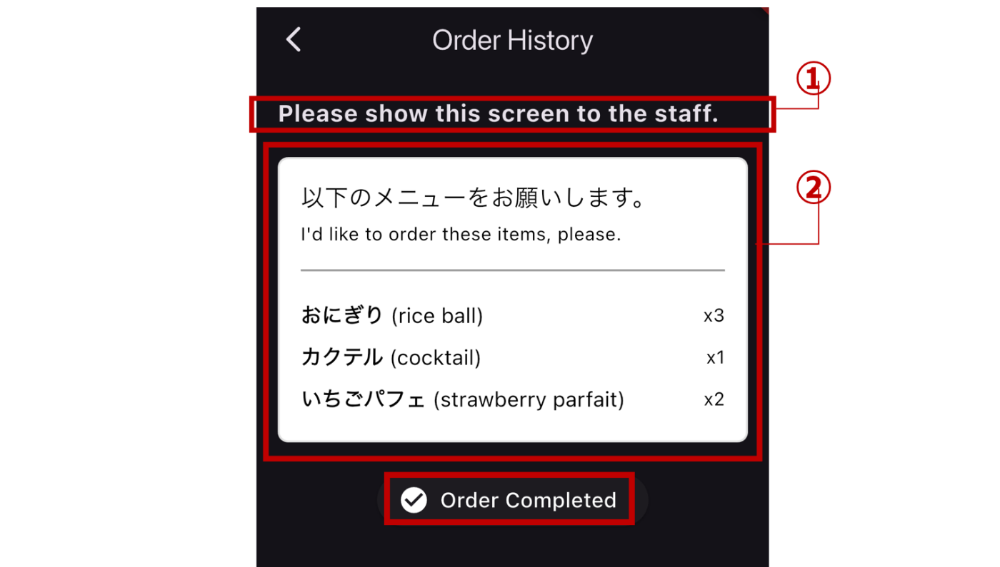

###  注文履歴

**①過去に注文した料理を確認** できる。また、実際に食べた**②料理の画像を投稿** できる。③ゴミ箱ボタンで注文履歴を削除できる。  
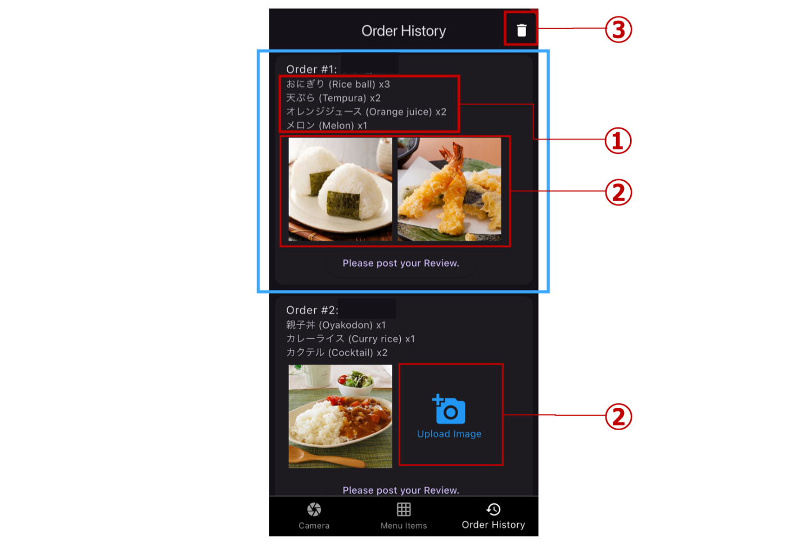

##  技術

実装にあたって、主に **Google、OpenAIのAPI** を利用した。具体的には以下の四つを用いた。

  * Google 
    * [Cloud Vision API](https://x.gd/lqlK7)
    * [Custom Search API](https://x.gd/zZZjP)
  * OpenAI 
    * [ChatGPT API](https://x.gd/IOitS)
    * [DALL·E API](https://x.gd/Y3hra)

###  Cloud Vision API

開発するアプリに簡単に画像検出機能を実装できるサービス。画像ラベリングやランドマーク検出など様々な機能を提供しているが、ここでは**光学式文字認識（OCR）** を利用する。Cloud Vision API の OCR 機能を用いてメニュー画像から**料理名、カテゴリ名、料金の抽出** を行う。

###  Custom Search API

RESTful リクエストによってウェブ検索結果を取得できるサービス。この API を用いて、**料理名をクエリとした画像の検索** を行い、料理画像を取得する。この際用いるクエリには OCR で取得した料理名に ChatGPT による誤字の修正（後述）を施したものを利用した。

###  ChatGPT API

以下の目的で利用。

  1. 料理名の抽出：取得したテキストから料理名を抽出
  2. 誤字の修正：「天ふら」→「天ぷら」
  3. 料理名の翻訳：「天ぷら」→「tempura」
  4. 説明文の生成： 「天ぷら」 → “Deep-fried seafood or vegetables.”
  5. カテゴリの分類：「メイン」、「サイド」など
  6. 料理名と料金の結び付け：各料理の料金を対応

プロンプトは以下のように作成した。一行目で料理名の翻訳と説明文の生成を行うように指示している。この時、**language 変数を置くことによって設定言語に応じて翻訳が行える** ようにしている。二行目から五行目で、料理名を抜き出して誤字の修正を行い、各料理をカテゴリに分類し、料金を表す文字列を各料理の料金として利用するよう指示している。最後に出力の形式と具体例を与えている。

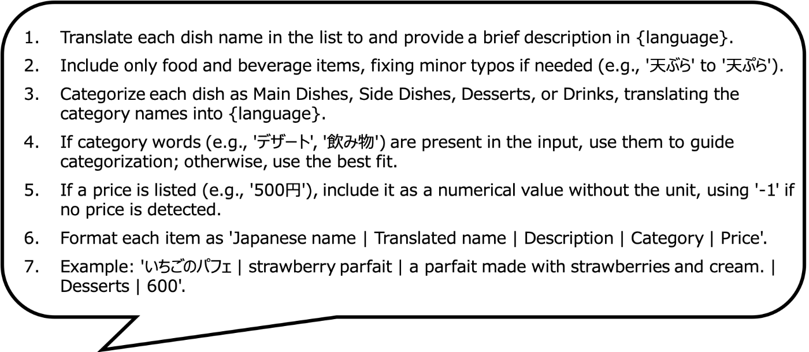

###  DALL·E API

料理画像の生成を行うために利用。プロンプトは以下のように作成した。料理が机に直で置かれるのを防ぐため、**適した皿に載せるように指示** している。また、誇張の強い画風になるのを防ぐため、**自然に描くように指示** している。

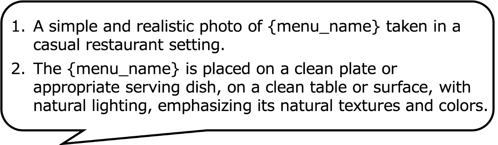

画像を生成してみた結果。  
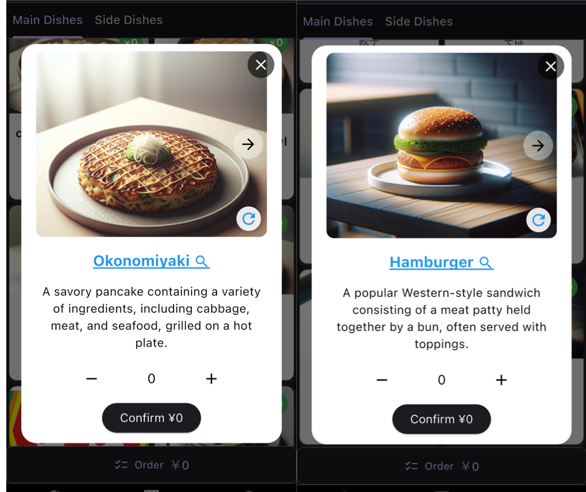

##  多言語対応

Menu Bite は多言語対応を行っている。アプリ内で処理する言語には、**翻訳元の言語（メニューを表記している言語）** と**翻訳先の言語** が存在する。

翻訳元の言語については、Cloud Vision API が読み取ることができて ChatGPT が理解できれば良いので、それらの対応言語数に依存する。現時点（2025/2/10）では、[Cloud Vision API が 60 言語以上](https://x.gd/2wdQr)、[ChatGPT が 80 言語以上](https://x.gd/IyC1N)に対応している。

翻訳先の言語については、先述したように ChatGPT に与えるプロンプトで言語指定を変数で行っているため、言語設定で選択できるようにさえすれば ChatGPT の対応している全ての言語で生成を行える。また、システムとして表示される文字についても変数を置いて、**言語ごとの対応表を作成** することによって多言語対応している。

##  最後に

初めての Flutter 開発でしたが、Google や OpenAI の API を駆使することで実用的なアプリを開発できました。特に、**画像認識・検索・言語生成といった強力な機能をAPIとして活用できる** ため、個人開発でも高機能なアプリを作ることが可能だと実感しました。

このように、既存のAPIを組み合わせることで、「こんな機能があったら便利なのに」というアイデアを、少人数・短期間でも形にすることができるのが、今の開発環境の魅力です。

「アイデアはあるけど、技術的に難しそう…」と感じることも、APIを活用すれば意外と実現できるかもしれません。**皆さんもぜひ、APIを活用した開発に挑戦してみてはどうでしょうか？？**

最後までお読みいただき、ありがとうございました！😆
