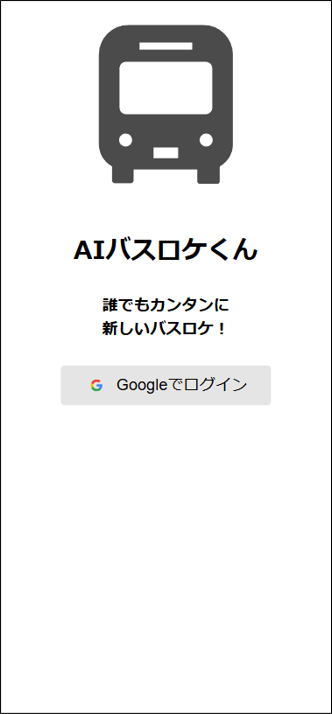
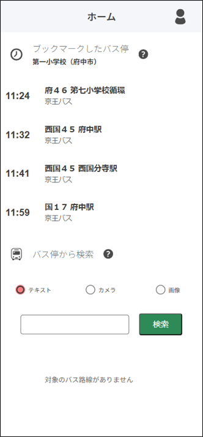
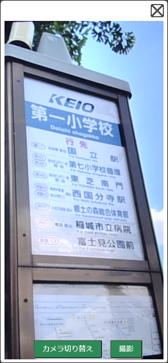
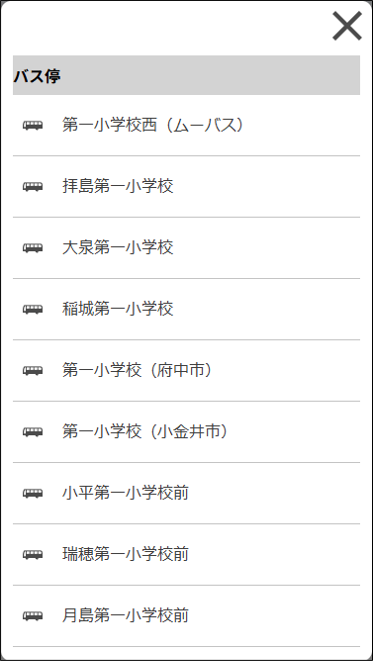
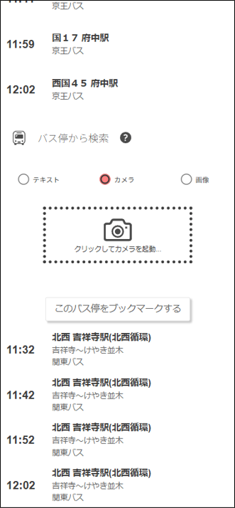
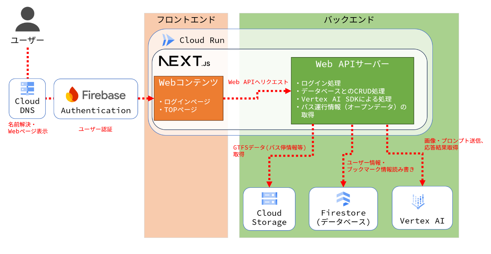

#  「AIバスロケくん」とは？

  * 「AIバスロケくん」は、生成AIを活用した新しいバスロケーションサービスです。 
    * スマートフォンのカメラなどで撮ったバス停の画像から、バスの到着予定時刻や現在位置を手軽に知ることができます。
  * AIバスロケくんは[AI Agent Hackathon with Google Cloud](https://zenn.dev/hackathons/2024-google-cloud-japan-ai-hackathon)への応募作品です。

#  使い方

  1. [AIバスロケくんのページ](https://ai-bus-location.imagawayaki.net)へアクセスし、Googleアカウントでログインします。  

  2. カメラボタンをタップする  

  3. バス停を撮影する 
     * バス停名が写るように撮影します。（他の文字が写りこんでいてもOK！）  

  4. 表示されたバス停候補を選択する 
     * 撮影した画像から生成AIがバス停名を抽出し、それをキーワードにしてバス停を検索します。
     * 目的のバス停をタップして選択します。  

  5. 次に来るバスが分かる！ 
     * 選択したバス停に来るバスの到着予定時刻や現在位置を地図で確認することができます。  

  * ※注意点: 現在β版のため、カメラ検索・画像検索は1ユーザーにつき5回までの機能制限を付けさせていただいています。(回数制限は定期的にリセットされます)

#  プロジェクトが対象とするユーザー像・課題

##  ユーザー像

  * このサービスの主な対象ユーザーは下記のとおりです。 
    * **通勤・通学利用客**
      * 道路事情によりバスは多少遅れて到着することも多いので、少し遅刻をしても間に合う可能性があります。その場面ではバスが今どの位置を走行しているか気になる場面が多いですね。
    * **高齢者**
      * 自宅や駅から離れた病院に通院する高齢者の方は、マイカーだけでなく公共交通機関であるバスを利用することが多いかと思います。
      * また、シルバーパス制度により比較的安い料金でバスに乗ることができるため、歩くと大変な距離を移動するときもバスが手軽に利用できます。

##  バスロケーションサービスの課題

  * バスロケーションサービスを既にいくつかのバス事業者各社からリリースされています。 
    * 参考: [都バス運行情報サービス](https://tobus.jp/blsys/navi)
  * しかし、既存のバスロケーションサービスには下記のような課題と思われます。 
    1. 検索のために出発地や目的地・時刻などを手入力しなければならない
    2. バス事業者ごとにバスロケーションサービスを使い分けなくてはいけない。また、UI/UXも各サービスごとに異なる場合がある

#  課題へのソリューションと特徴

  * AIバスロケくんの特長は大きく4つあります。 
    1. カメラでバス停を撮影するだけで検索できる
    2. 撮影済み画像のアップロードでも検索可能
    3. バス停のブックマーク機能でバスの現在位置がすぐ分かる
    4. 複数のバス事業者をまとめて検索できる
  * **特徴1. カメラでバス停を撮影するだけで検索できる**
    * スマートフォンのカメラでバス停を撮影すると、生成AIが撮影画像に含まれるバス停を認識しバス停名のみを自動抽出します。自動抽出されたバス停名をキーワードにしてバスの現在位置を検索できます。
    * 急いでいてスマートフォンを操作する時間がない場合でも便利です。
  * **特徴2. 撮影済み画像のアップロードでも検索可能**
    * 撮影済みの画像やスマートフォン・PCに保存されている画像からも検索できます。
    * カメラと同じように生成AIがバス停名を抽出してくれます。
  * **特徴3. バス停のブックマーク機能でバスの現在位置がすぐ分かる**
    * いつも使っているバス停をブックマークすることで、TOPページからいつでもバスの位置情報を確認することができます。
  * **特徴4. 複数のバス事業者をまとめて検索できる**
    * 複数のバス事業者から提供されているオープンデータを利用しているため、1つのサイトから事業者問わず様々なバス位置情報を検索できます。

#  システムアーキテクチャ

##  0\. 構成図

##  1\. Webアプリケーション

  * フロントエンドのWebコンテンツとバックエンドのWeb APIサーバーは[Next.js](https://nextjs.org/)で開発しました。 
    * Next.jsを使うことで開発言語をTypeScriptに統一させ、フロントエンドとバックエンドを同じプロジェクトで開発することができました。
  * Next.jsで開発したコンテンツはCloud Runへデプロイしています。 
    * Cloud Runはコンテナを利用したマネージドサービスのため、ハードウェアやOS・ミドルウェアの管理をあまり意識せずコーディングに集中することができます。
    * また、オートスケーリングに対応しているため高負荷アクセス時もパフォーマンスを落とすことなく利用できます。

##  2\. データベース

  * ユーザー情報やブックマーク情報を格納するデータベースはNoSQLであるFirestoreを利用しています。 
    * 今回は大規模なデータのやり取りやトランザクションは必要ないため、処理速度が速くスキーマを意識せず使えるFirestoreを選びました。
    * また、Firestoreは無料枠を利用できるためコストも低く抑えられます。 
      * <https://cloud.google.com/free/docs/free-cloud-features?hl=ja#firestore>

##  3\. 生成AI基盤

  * 生成AI基盤はVertex AIを採用しました。 
    * Next.jsはNode.js環境で動作しているため、Node.js用のSDKを利用してVertex AIの機能を利用できます。 
      * <https://cloud.google.com/vertex-ai/generative-ai/docs/reference/nodejs/latest>
    * モデルは「gemini-1.5-flash-002」を選択しました。 
      * Gemini Flashは軽量モデルのためレスポンスが早いことが特徴です。
      * 軽量モデルなので精度は低くなるのでは、と当初考えていましたが、実際に使用してみるとしっかり画像の中からバス停名のみ抽出することができたため充分利用できるレベルかと思います。
  * また、Vertex AIでは「**マルチモーダルAI** 」をサポートしているため、バス停の撮影画像とプロンプトの文字列の2つを入力としてバス停名を抽出しています。 
    * ※マルチモーダルAIとは: 文字だけでなく画像・動画・音声など複数種類のモダリティを入力として使用できる生成AIのことです。 
      * 参考: [マルチモーダル AI | Google Cloud](https://cloud.google.com/use-cases/multimodal-ai?hl=ja)

##  4\. その他

  * 認証基盤は[Firebase Authentication](https://firebase.google.com/docs/auth?hl=ja)を利用しました。 
    * 数行のコードで簡単に認証処理を実装することができ、様々なログイン手段（ID/パスワード、Google認証、SNS認証、etc..）に対応しているため採用しました。
    * 今回は手軽に利用開始できるようにするためGoogle認証を利用しました。 
      * ID/パスワードの新規登録を無くすことで初回利用時の精神的ハードルを下げることを目的としています。
  * バス停名やバス便情報などのGTFSデータはCloud Storageに保存しています。 
    * GTFSデータは複数のtxtファイルをzip圧縮した形式で提供されていることが多いため、Cloud StorageにGTFSデータを置くことにしました。
    * データの最新化のため、バッチ処理で定期的に最新化します。
  * 独自ドメインを利用しているため、名前解決にCloud DNSを利用しています。

#  デモ動画

<https://www.youtube.com/watch?v=6b6Dplvdeyc>

#  今後の展望

  * **モバイルアプリ化**
    * 現在はWebアプリケーションなので、Webブラウザからアクセスしないと利用できません。 
      * 急いでいるときに利用したい、という場面では少しスピード感が遅く感じられるかもしれません。
    * 今回はNext.jsを使って実装したため、同じReactの書き方ができる[React Native](https://reactnative.dev/)を使えば比較的簡単にiOS/Android両方に対応したモバイルアプリへ移植することができそうです。
    * また、[PWA](https://developer.mozilla.org/ja/docs/Web/Progressive_web_apps)の形にすれば今のWebアプリケーションを改良することでモバイルアプリのように利用することができます。
  * **位置情報検索機能の追加**
    * 現在は乗りたいバス停が利用者自身で明らかになっていることが前提ですが、初めて来た場所でそもそも近くのバス停がどこか分からないケースも考えられます。
    * JavaScript/TypeScriptでは位置情報を取り扱う[Geolocation API](https://developer.mozilla.org/ja/docs/Web/API/Geolocation_API)を利用できるため、位置情報から最寄りバス停がどこなのか検索できます。 
      * 最寄りバス停が分かれば、現在実装されている仕組みでバスロケ情報を出すことができそうです。

#  まとめ

  * 今回はGoogle CloudのマルチモーダルAIを活用したアプリとして、カメラ画像を利用したバスロケーションサービスを開発しました。
  * 最初はマルチモーダルAIと聞いて「開発が難しいのかも」と身構えていましたが、実際に使ってみるとSDKも整備されているため簡単に実装できたので驚きました。 
    * Gemini Flashのレスポンスの速さにもビックリですね。
  * マルチモーダルの入力には画像だけでなく動画・音声も使えるため、今後様々なアイディアを考えてみたいと思います。

