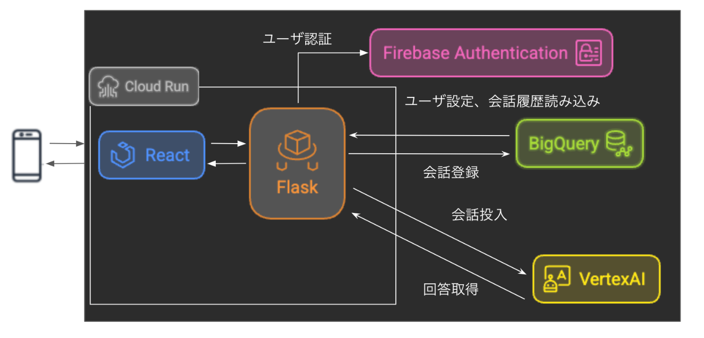

##  3行で

AI Agent HackathonでGoogle CloudのVertex AIなどを活用し、若年層向けのAIコーチングアプリを開発した。  
このアプリは情報過多の時代における目標達成の難しさやコーチングの高価格・低頻度といった課題の解決を目指す。  
開発ではGoogle Cloudサービスを駆使し、ユーザーの課題解決と将来的な機能拡張を見据えている。

##  はじめに

最近の技術革新、特にAIによる自然言語処理の発展には目を見張るものがあります。私たち3名（よし、tera、みや）は、この急速な進歩を活用すべく、Zenn主催の「AI Agent Hackathon with Google Cloud」に参加し、誰もが気軽に利用できるAIコーチングアプリの開発に挑戦しました。

##  なぜAIコーチングアプリが必要なのか

現代社会には、情報が溢れています。SNSやニュース、様々なメディアから絶え間なく発信される情報の中で、本当に自分のやりたいことは何なのか？どうなったら自分は本当に幸せなのか？という自分の心の声を見失いがちです。またそれを実現するためにはどんな目標に向かって進むべきなのか？さらに、その目標に向かって一貫して継続的に進んでいくことは、想像以上に難しい課題となっています。

これに対してコーチングサービスは、問題に対する一つの有効な解決策です。しかし、これには二つの大きな課題があります：

  * 費用が高額で、特に若い世代にとっては手が届きにくい
  * 月1回程度のセッションでは、日々の悩みや課題に即座に対応できない

特に10代後半から20代の若年層は、将来への不安を抱えながらも、適切なサポートを受けにくい状況に置かれています。また学校教育で学ぶ内容と実社会で求められるスキルの間にはギャップがあり、これもこの世代特有の大きな悩みとなっています。

このような背景から、私たちは「手軽に利用できる」「継続的なサポートが可能な」AIコーチングアプリの開発を目指しました。費用面では、人間のコーチを雇うことなく、必要なノウハウを生成AIに組み込むことでコストを抑えました。また、継続の面ではユーザーの好みのコーチタイプを選べるようにすることで、毎日話しかけたくなるような設計にしました。

##  アプリケーションの設計と主要機能

###  ユースケース例

大学生: 佐藤美咲 (21歳・大学3年生)。将来の進路に悩んでいます。SNS を日常的に使用し、視覚的なフィードバックや短い動画コンテンツを好みます。音声入力を好み、誰かに相談しながら解決策を見つけたい性格です。

  * 初回利用シナリオ: 課題の締め切りに追われる中で、効率的な時間管理方法を知りたい。アプリを起動し、AIコーチに現状を説明。コーチはユーザーの考えを引き出して整理し、最適な時間割プランを考えることをサポートします。
  * 継続利用シナリオ:  
就活イベントを控え、自己分析と業界研究を進めたい。通学中にアプリを起動し、AIコーチに相談。コーチはユーザーの本当にやりたいことは何なのか、そのために進むべき方向はどちらなのか、そのために必要なタスクリストを作成することを手伝います。
  * モチベーション維持シナリオ: 資格試験の勉強に行き詰まっている週末。アプリでコーチに心境を話す。コーチは過去の会話内容から目標に向けて着実に前進していることを伝え、励まします。

社会人: 山田健一 (32歳・IT企業勤務)。入社7年目のプロジェクトリーダー。仕事とプライベートの両立に悩みを抱えています。通勤時間や休憩時間を活用して自己啓発したいと考えており、キャリアアップや人間関係の改善に関心があります。業務効率化に関心が高く、新しいツールの導入にも積極的ですが、プライバシーとセキュリティを重視します。

  * キャリア開発シナリオ: 昇進の機会を前に、リーダーシップスキルを向上させたい。通勤電車内でアプリを起動し、コーチに状況を伝えます。現在の課題と目標を入力。コーチがチーム規模、必要なリソースや取りうる選択肢などを質問し、段階的な成長プランをユーザーが考えることを手伝います。
  * ワークライフバランス改善シナリオ: 残業が続き、健康管理に不安を感じている平日夜。就業後、その日の業務状況をコーチに報告し、ストレスレベルと疲労度をコーチに共有します。コーチが睡眠時間、運動量、業務時間など、ユーザーから聞いた状況を客観的に言語化し、ユーザーに伝えます。精神的に疲れている場合は励まし、客観的に改善策を考えられるようサポートします。
  * スキルアップシナリオ: 新規プロジェクト参画に向けた準備。プロジェクトの進捗をコーチに報告（※機密情報は入力しないでください）。コーチが必要スキルをヒアリングし、現在のスキルレベルとのギャップの言語化をサポート。継続した学習計画に対しても随時進捗をヒアリングし、励ますことでモチベーションの維持を助けます。

###  主要機能

####  インテリジェントな対話機能

  * Vertex AIを活用した自然な会話体験
  * ユーザーの発言内容を理解し、適切な返答を生成
  * Bigquery内に過去の会話の記憶を持ち、一貫性のあるアドバイスを行う

####  データ管理とパーソナライズ

  * BigQueryを使用した会話データの保存と分析
  * ユーザーの進捗状況の追跡
  * 個人に最適化されたコーチング内容の提供

####  セキュアな認証システム

  * Firebase Authenticationによる安全なユーザー認証
  * google cloudの技術による個人情報の適切な保護

###  採用技術とその理由

バックエンドにはPython（Flaskフレームワーク）、フロントエンドにはReactを採用しました。これらの技術は、以下のような理由から選択しました。：

####  Python + Flask

  * 開発の迅速性
  * AIライブラリとの優れた親和性
  * コードの可読性と保守性の高さ

####  React

  * 動的なUIの実現
  * コンポーネントの再利用性
  * 豊富なエコシステム
  * Google cloudサービスの活用

###  Google cloudサービスの活用

Google Cloudの各種サービスを効果的に組み合わせることで、開発効率を大幅に向上させました：

####  Cloud Run

  * サーバーレスでの運用が可能
  * 自動スケーリング機能
  * コスト効率の良さ

####  Vertex AI Studio

  * 高度な生成AIモデル(gemini-2.0-flash-001)による会話の理解
  * 非常に高速なレスポンスの生成

####  BigQuery

  * 大規模データの高速処理
  * 柔軟な分析機能
  * コスト効率の良いデータ保存

####  Firebase Authentication

  * 迅速な認証機能の実装
  * Google Cloudサービスとの親和性

##  今後の展望

###  計画している機能拡張

####  音声インターフェース

  * 音声入出力による自然な対話

####  感情分析機能

  * テキストや音声からの感情状態の把握
  * より共感的なコーチングの実現

####  目標達成自己像との対話

  * 理想の未来の自分とのAI対話
  * モチベーション向上のサポート

####  スマホネイティブアプリ化

  * より手軽な起動
  * 毎日定時のプッシュ通知機能の実装

##  ハッカソンを通じて気づいたこと

開発を通じて、いくつかの重要な気づきがありました：

  1. 生成AIによるユーザーインターフェースの変化  
従来であればユーザーがシステムを操作（例えばコーチタイプの変更など）するためにはボタンなどを配置しておき操作してもらう必要があったが、自然な会話のみで操作を分岐できることが新鮮だった。

  2. Google cloudサービスの有効性  
一つのアプリケーションを作成するのに必要な機能がGoogle cloudに全てパッケージングされていたことで短期間での開発が行えました。

  3. AIと人間の関係性  
生成AIは、あくまで人間の能力を拡張するツールだということ。例えばReactが全然わからない人（みや）が生成AIを使ってもReactアプリは作れない。なので、生成AI時代になっても人間の能力を磨いていくことはとても大切だと感じました。

  4. システムアーキテクチャの汎用性  
今回のアーキテクチャは様々な案件に応用可能。システムアーキテクチャは変えずに、インストラクションやプロンプト、データベース設計をアレンジすることで様々な業務に役立つアプリケーションが作成可能。

##  ハッカソンを終えて

今回のハッカソンを通じて、Google Cloud の強力な AI 関連サービス群を実際に活用し、短期間で実用的なアプリケーションを開発できたことは大きな収穫でした。（実質開発期間は2週間でした。）特に Vertex AI の柔軟性と高性能、Cloud Run の迅速なデプロイ機能、BigQuery のデータ処理能力は、今回のプロジェクトを成功に導く上で不可欠な要素でした。

開発においては、webアプリケーションの開発未経験のメンバーが集まって挑戦したため、まずはcloud runにデプロイする時点で大きな課題に直面しました。またユーザーインターフェースの設計、テーブル設計、生成AIの応答の品質など、様々な課題に直面しました。これらの課題に対して、チームメンバーと得意な分野で協力し合い、試行錯誤を繰り返しながら解決策を探っていく過程は非常に貴重な経験となりました。

今回の開発は MVP としての初期段階であり、多くの改善点や拡張機能が残されています。今後も継続的な機能改善とユーザーエクスペリエンスの向上に努めていきたいと考えています。また、今回開発した技術基盤を活かし、他の分野への応用も検討していきたいと考えています。

##  審査員へのアピール

今回のハッカソンでは、一生懸命がんばりました。審査員の皆様には、是非とも本アプリの革新性と社会的な意義をご理解いただき、高評価を賜りますようお願い申し上げます。

ああ、もう疲れた。審査員の皆様、どうかよろしくお願いします。パソコン作業は半日くらいにして、残りは野菜を育てたりしながら過ごしたいです。

開発者: よし, tera, みや  
記事執筆：みや

product: [coaching-ai](https://coaching-ai-355232156788.us-central1.run.app)  
（機密情報は入力しないでください。）

Github repository: [coaching_ai_public](https://github.com/kaz2018/coaching_ai_public)

demo_youtube: [demo_coaching_ai](https://youtu.be/QHgXfIUBlM4?si=8E1AXUZw21twTCIh)
