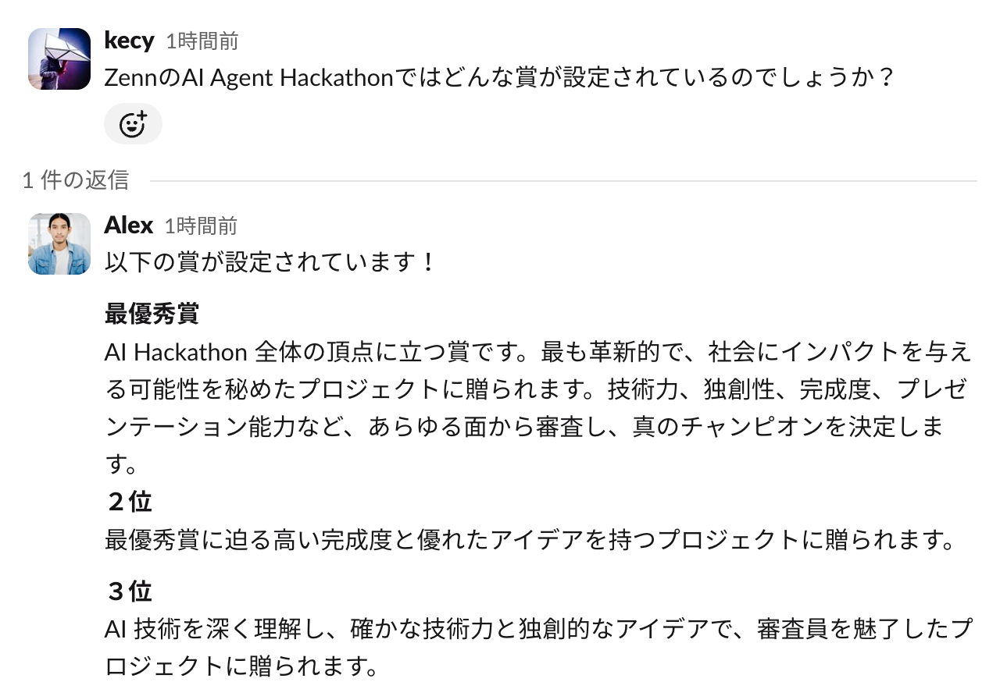
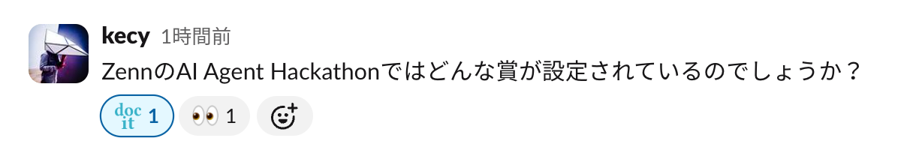
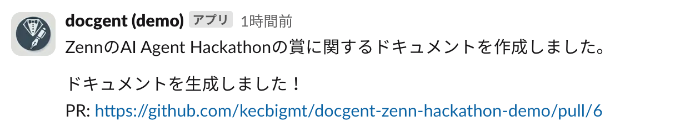
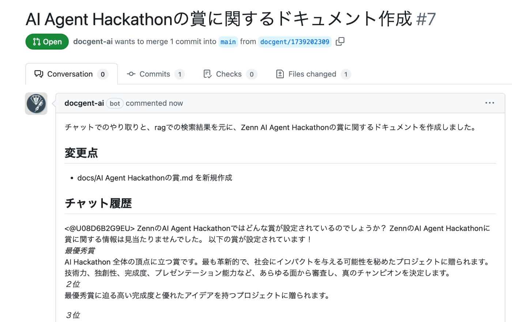
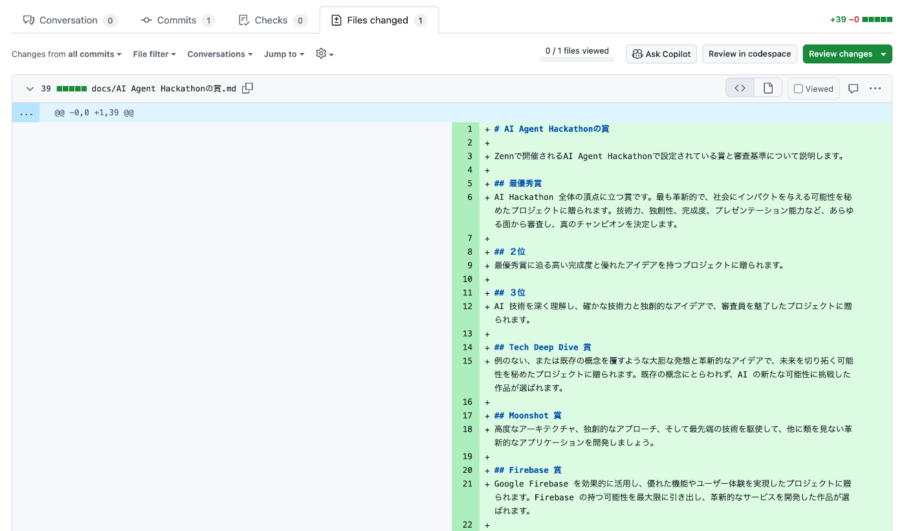
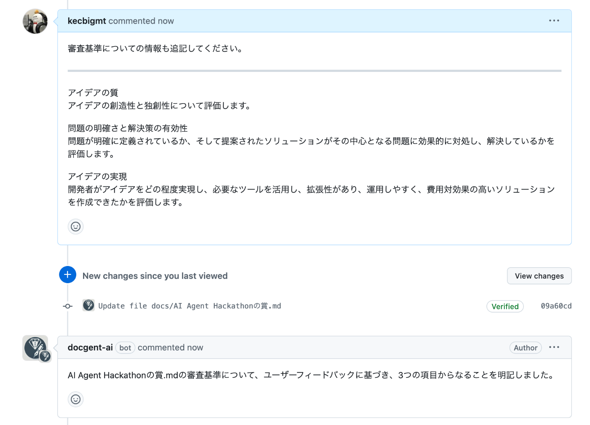
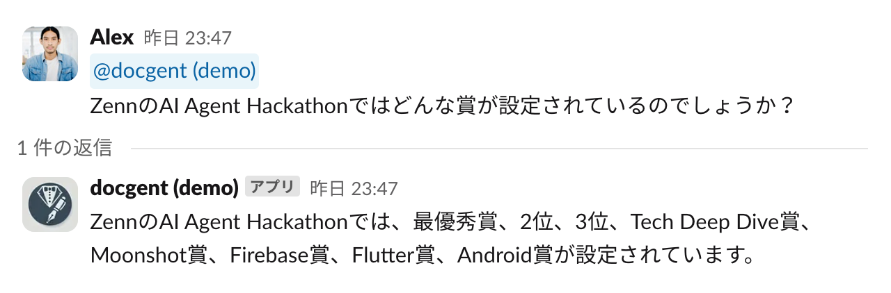
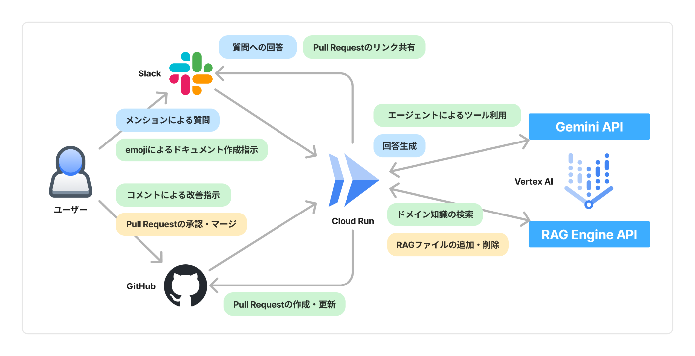
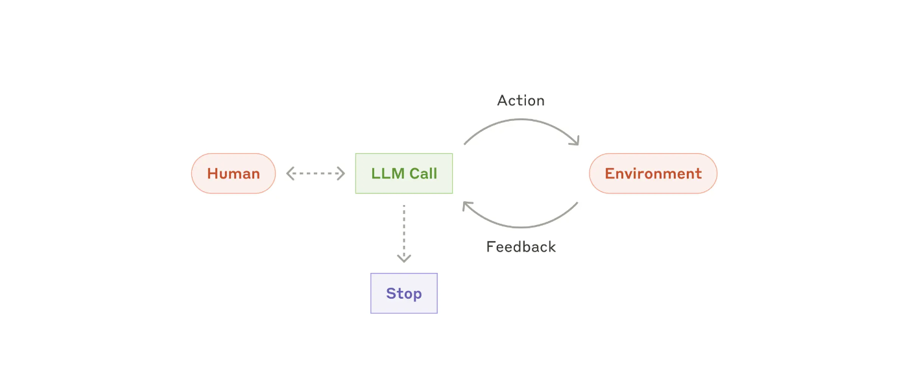
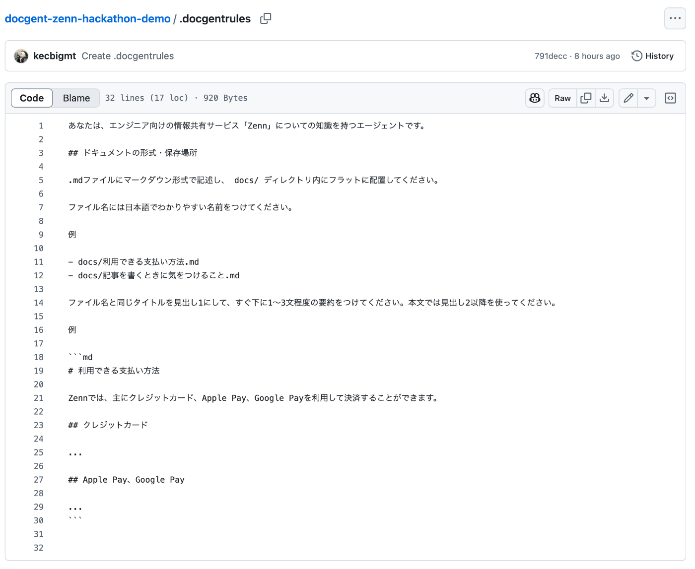

※この記事は「AI Agent Hackathon with Google Cloud」向けに開発したAIエージェントの説明のために作成したものです。

<https://zenn.dev/hackathons/2024-google-cloud-japan-ai-hackathon>

##  前書き

現代のソフトウェア開発組織では、素早く高頻度で機能追加・改善していくことが求められると同時に、LLMの時代においてはAIによる利活用を見据えて **「ドキュメンテーション」の重要性** が高まってきています。

しかし、「包括的なドキュメントよりも動くソフトウェアを[1]」重視するアジャイル開発を実践する中で、

  * 忙しない日々の中でどうしても残すべきドキュメントを残せない
  * 過去に書いたドキュメントの古い内容がアップデートされず放置されていて当てにならない

という組織も少なくないと思います。

きっと今日もどこかの組織のSlackでは、他の部署や開発チームから仕様確認の問い合わせが寄せられ、それらに人手で回答する努力が積み重ねられていることでしょう（私も他人事ではありません）。

**「ドキュメントが整備されていれば、答える手間が省けるはずなのに」**

この課題、AIエージェントで解決できないか？ というのがこのプロジェクトの発端です。

##  今回開発したもの

先に結論です。Google Cloudを用いて「**Docgent** 」というWebアプリケーションを開発しました。

ソースコードをこちらに公開しています。  
（Slack App・GitHub Appの設定が必要なのでセットアップが面倒ですが、ご自身のGoogle Cloudプロジェクトでデプロイしていただける形になっています）

<https://github.com/kecbigmt/docgent>

<https://www.youtube.com/watch?v=L7dzehHun18>

一連の流れはデモ動画から確認できますが、主な機能は以下の4つです。

  1. SlackのスレッドをもとにしてGitHub上でドキュメントを作成
  2. GitHubのPull Requestでのコメントに基づいて編集内容を改善
  3. mainブランチに反映されると、AIエージェントの知識として蓄積
  4. Slackでの質問に対して、蓄積した知識をもとに回答

以下で順を追って説明します。

###  1\. SlackのスレッドをもとにしてGitHub上でドキュメントを作成

Docgentの出番は、**組織内のSlackでの会話** から始まります。

Slack上で他の部署や開発チームから仕様の質問を受けたり、チーム内で仕様や設計の議論が交わされたりしている場面を想定します。

  
_スレッドのやり取り例_

ここで専用のemojiでリアクションをつけると、即座にDocgentが反応し、

  
_:doc_it: をつけると、:eyes: で反応してくれます_

おおむね20秒前後でドキュメントを書き起こし、GitHub上でPull Requestを作成してくれます。

###  2\. GitHubのPull Requestでのコメントに基づいて編集内容を改善

作成されたPull Request上では、開発チームが慣れ親しんだGitHubの画面でDocgentの作業内容を確認することができます。

  
_PRの概要_

  
_ファイル差分_

ここでコメントをつけると、これにも即座にDocgentが反応し、おおむね20秒前後でファイルの修正を行ってくれます。

このように、インターフェイスは全てSlack・GitHubで完結するようにしていて、Devinの使用感に近いと思います。

###  3\. mainブランチに反映されると、AIエージェントの知識として蓄積

必要な修正を行ってからPull requestを承認・マージし、変更内容がmainブランチに反映されると、それをフックに、更新のあったドキュメントファイルがAIエージェントの知識として蓄積されます。

ドキュメントの内容はチャンク分割・テキスト埋め込みにかけられ、いわゆるRAG（Retrieval-Augmented Generation）に利用できるようになります。

###  4\. Slackでの質問に対して、蓄積した知識をもとに回答

Docgentは、Slack上での質問に回答することができます。

回答するときには、それまでに蓄積したドキュメントの中から質問との類似度が高いものが内部でピックアップされ、それを前提知識として回答内容を生成します。

また、蓄積したドキュメントは将来のドキュメント作成・更新でも利用されます。

  
_最初は答えられなかった質問にも答えられるように_

##  システムアーキテクチャ

大まかなシステムアーキテクチャは以下のようになっています。

  * バックエンド 
    * Go
  * フロントエンド 
    * Slack App
    * GitHub App
  * インフラ 
    * Google Cloud Run
    * Vertex AI 
      * Gemini API
      * RAG Engine API

開発速度優先・インフラ省力化のために、思い切って自前のUIやDBを一切持たない構成にしました。

Gemini APIの利用者は多いと思いますが、それに加えて最近GAになったばかりのRAG Engine APIを使って、RAGの部分を開発しました。

RAG Engine APIについてはこちらの記事が参考になります。

<https://zenn.dev/google_cloud_jp/articles/rag-engine-quickstart>

##  その他技術的な裏話

###  エージェントの制御方法

Anthropicのブログポストで紹介されているような、オーソドックスなやり方で制御しています。

  
_[Building effective agents](https://www.anthropic.com/research/building-effective-agents)より_

LLMが利用可能なツール・その使い方・その他周辺情報をシステムプロンプトとしてGeminiに伝え、作業が終わるまでループさせます。

システムプロンプトや全体の制御を考えるにあたっては、Clineを大いに参考にしました。

こちらがシステムプロンプト：

<https://github.com/kecbigmt/docgent/blob/main/internal/domain/systeminstruction-template.md>

Docgentでは以下のようなツールを用意しました。

  * find_file: リポジトリ内のファイルを取得する
  * create_file: ファイルを新規作成する
  * modify_file: ファイルを編集する
  * rename_file: ファイルパスを変更する
  * delete_file: ファイルを削除する
  * create_proposal: Pull Requestを作成する
  * query_rag: RAGコーパスからドキュメントを検索する
  * attempt_complete: エージェントとしての作業を終了する

例（query_rag）：

<https://github.com/kecbigmt/docgent/blob/main/internal/domain/tooluse/rag.go>

Clineと違って、ツールごとに使用方法やデータ構造を定義していて、ユースケースごとにどのツールを渡すか・ツールがどう振る舞うかを変えられるようにしています。

<https://github.com/kecbigmt/docgent/blob/bd5abee9bc7cfeecc79b75c2c8afb80ea650c5db/internal/application/proposal_generate.go#L73-L163>

例えば、PR新規作成のユースケースではcreate_proposalを利用できますが、PR修正のユースケースでは使えないようにして、不正な振る舞いを防止しています。

###  レイヤードアーキテクチャ

ハッカソンのためのソフトウェアとしてはやり過ぎ感もありますが、今後オープンソースのプロジェクトとして育てていきたい思いもあり、**エージェントを動かす一連のコードをレイヤードアーキテクチャで表現する** 試みも行いました。

技術の移り変わりが激しい領域だからこそ、エージェントのコアたるロジックが外部ライブラリ・外部サービスに依存しないよう構成しています。

  * /internal 
    * /domain ... Docgent のビジネスロジック本体や重要な概念を表現するレイヤー
    * /application ... システムが提供するユースケースを実装するレイヤー
    * /infrastructure ... HTTPリクエスト処理、外部サービス連携、データ永続化などの技術的な実装を担うレイヤー
  * /cmd 
    * /server ... 具体的なアプリケーション実装は持たず、「設定・起動・DI」のみ担当する

（依存は常に下から上に向かうようになっています）

実を言うと、2025年2月現在ではRAG Engine APIの公式ライブラリはPython版しか存在せず、今回必要な部分はGoのためにスクラッチで開発しました。

こういったところも、公式のライブラリが将来出てきたら簡単に差し替えられるようになっています。

###  Goの採用

ライブラリの充実度からいって、PythonやTypeScriptで開発したほうが速いのは明らかでしたが、今回はエージェントの動作原理の勉強・実践を兼ねていたため、あえて選びませんでした。

また、レイヤードアーキテクチャを導入する上で、

  * インターフェイスやジェネリクスにより最低限の抽象化が可能
  * 標準パッケージが充実していて無用なサードパーティ依存を避けることができる

という点から、Goを選びました。

その直後の感想：

<https://x.com/kecy_ja/status/1878987441308402083>

前述の通りRAG Engine APIのライブラリをスクラッチで書くなど、結果として色々遠回りしたところはある気がしますが、優れたエコシステムを持つGoにもAIプロダクトの波が広がっていくほんのわずか一助にでもなったらいいなと思います。

###  .docgentrules（おまけ）

最低限知って欲しいドメイン知識や、ドキュメントを書くときのフォーマットを指定できるように、GitHubリポジトリの直下に .docgentrules というファイルを置くと、エージェント実行時に必ず読んでくれるようになっています。

.clinerules や .cursorrules の真似がしたくて追加した機能です。

##  今後の展望

社内Slackでも動作確認がてら使ってみて、会話をもとにしたドキュメント生成からRAGによる質問回答まで、**これなら最低限のプロダクトとしてワークするはず** というところまで確かめることができました。

とはいえ、まだまだ改善点は多いで、今回のハッカソンのおかげで形になったのきっかけに育てていこうと思っています。

改善点・案

  * Pull Requestレビュー時にファイル内のコメントにも対応できるようにする
  * GitHubリポジトリに蓄積したドキュメントファイルをもとに、静的ファイルジェネレータを使ってヘルプページを生成して、GitHubが見られないメンバーや社外にも公開できるようにする
  * 自前のGoogle Cloudでデプロイせずともサービスを利用できるようにする
  * その他安定性向上 
    * エージェントがエラーを自己修正できるようにする
    * エージェント以外の処理途中でエラーになったときのリトライ

脚注

  1. [アジャイルソフトウェア開発宣言](https://agilemanifesto.org/iso/ja/manifesto.html)より ↩︎

