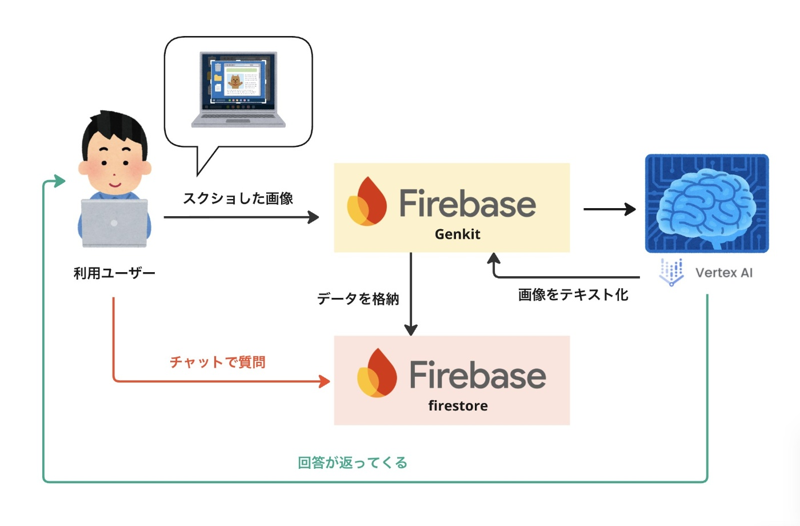

こんにちは（Twitter： @keng0o_ ）です。

今回はZennでハッカソンに応募した際に作ったサービスについて話したいと思います。  
ハッカソンへの提出を目的とした成果報告になりますので少し長くなります。  
時間のない方は 1. 動作デモだけ読んでください。

* * *

####  1\. 動作デモ

<https://youtu.be/U-OsvYuX6nw>

動作デモ動画です。

まず1時間ほどPCでの日常生活の記録をしていきます。  
その後チャットにて記録の振り返りをしています。

具体的には

####  質問

"Youtubeで見ていたもののタイトルの一覧を出して"

####  回答

> "ユーザーさんがYouTubeで見ていた動画のタイトルは以下の通りです。 * 【激辛監査】SHOGUN BURGER「激辛チキンバーガー」の辛さMAXで悶絶するせいやに大げさ疑惑浮上!? 【霜降り明星】 これは、2025年2月10日 23時26分にFinal Cut Proで動画編集をしている最中に視聴していた動画です。 記録には、この動画の再生時間やチャンネル名、投稿日時などの情報も含まれています。 "

####  質問

"読んだブログの記事を一覧で出して"

####  回答

> "ユーザーさんが読んだブログ記事は以下の通りです。 * **【Final Cut Pro】 動画にテロップを挿入する方法** (tourboxtech.com) このブログ記事は、2025年2月10日 23時26分に、Final Cut Proで動画編集中に閲覧されていたものです。 記録には、このブログ記事の投稿日や記事の話題などの情報も含まれています。"

というような結果になっています。

* * *

##  2\. 課題：私たちが抱える「記憶」と「時間」の制約

私たちは、日々多くの情報に触れ、様々な活動をしていますが、その全てを詳細に記憶し続けることはできません。

  * **記憶の限界:**
    * 「昨日何してたっけ？」「あの時見たサイト、どこだっけ？」と、すぐに思い出せないことが多々あります。
    * 重要な情報やアイデアを忘れてしまい後悔することも少なくありません。
  * **時間の有限性:**
    * 自分が何に時間を使っているのか、正確に把握するのは難しいものです。
    * 無駄な時間を過ごしてしまったり、本当にやりたいことに時間を使えなかったりすることも。
  * **記録の煩雑さ:**
    * 手書きの日記やメモは、手間がかかる上に、検索性が低く、後から見返すのが大変です。
    * 複数のツール（カレンダー、ToDoリスト、メモアプリなど）を使い分けていると、情報が散らばってしまいがちです。

* * *

##  3\. 作ったもの：PCライフを自動記録する「AI日記」

これらの課題を解決するために、私たちは「AI日記」を開発しました。

  * **機能概要:**
    * サービスを起動し、「記録」ボタンを押すと、PCの画面を1秒間隔でスクリーンショット撮影します。
    * 撮影されたスクリーンショットをAIが解析し、自動で日記を生成します。
    * ユーザーは、AIに質問する形で、過去の行動を振り返ることができます。 
      * 例：「今日はYouTubeを何時間見てた？」「昨日見た資料のタイトルは？」
  * **特徴:**
    * **自動記録:** 手動で記録する手間は一切ありません。
    * **AI解析:** AIがあなたの行動をスクリーン画面の映像を解析し、情報として提供します。
    * **簡単検索:** 過去の記録を、キーワードや日付で簡単に検索できます。

* * *

##  4\. 解決策：AIが「記憶」と「時間」を拡張

「AI日記」は、以下の方法で、上記の課題を解決します。

  * **記憶の補完:**
    * 1秒間隔のスクリーンショットが、あなたのPCライフを詳細に記録。
    * AIが、記録された情報を解析・要約し、あなたの「記憶」を補完します。
  * **時間の可視化:**
    * AIが、あなたの時間の使い方を分析し、可視化。
    * 無駄な時間や、集中できていない時間帯などを発見できます。

####  4\. 実装ポイント：技術的な工夫

システムアーキテクチャ  

利用技術

  * Next.js
  * React
  * Firebase Auth, Firestore
  * Firebase Genkit
  * Vertex AI Gemini
  * TailwindCSS
  * Firebase App Hosting
  * v0

* * *

##  5\. 実装ポイント：技術的な工夫

  1. **スクリーンショットの非保存：プライバシーへの最大限の配慮**

     * **技術的背景:**
       * 通常、スクリーンショットは画像ファイルとして保存されますが、「AI日記」では、撮影したスクリーンショットを一時的にメモリ上に保持し、AIによる解析が完了した時点で速やかに破棄します。
       * これにより、ユーザーのPCに画像ファイルが残らないため、プライバシー漏洩のリスクを最小限に抑えます。
     * **ユーザーへのメリット:**
       * 「スクリーンショットがどこかに保存されているのではないか…」という不安を解消し、安心してサービスを利用できます。
       * PCのストレージ容量を圧迫することもありません。
     * **補足:**
       * AI解析に必要な最低限の情報（テキスト、オブジェクトの位置など）は、一時的に保持しますが、これも解析後に破棄されます。
  2. **差分検出によるAI処理の最適化：高速化と効率化**

     * **技術的背景:**
       * 1秒ごとにスクリーンショットを撮影しますが、画面に変化がない場合（例：ユーザーが何も操作していない、動画を一時停止している）、AIによる解析処理をスキップします。
       * 差分が検出された場合のみ、AIにスクリーンショットを渡し、解析処理を実行します。
     * **ユーザーへのメリット:**
       * AIの処理リソースを効率的に利用することで、サービスの安定性を向上させます。
       * 無駄なAI処理を減らすことで、将来的なサービス利用料の低減にもつながる可能性があります。

* * *

##  6\. 今後の展望：さらなる進化の可能性

「AI日記」は、記録・分析ツールにとどまらず、ユーザーの生活を多方面からサポートする、より賢く、安全なパートナーへと進化していきます。

  * **機能概要:**
    * AIが、ユーザーのPC利用状況（会話内容、画面表示）をリアルタイムで解析し、状況に応じて、メンターのようなアドバイスを提供します。
    * アドバイスは、ユーザーの生産性向上、学習支援、メンタルヘルスケアなど、多岐にわたります。
  * **具体的なアドバイス例:**
    * **集中力低下の検知:**
      * 「集中力が低下しているようです。少し休憩を取りませんか？」
      * 「SNSを見る時間が長くなっています。タスクに集中しましょう。」
    * **長時間作業への警告:**
      * 「〇時間以上作業を続けています。休憩を取って、目を休めましょう。」
      * 「同じ姿勢で作業を続けています。ストレッチをしましょう。」
    * **タスク管理の提案:**
      * 「今日のタスクは〇〇ですね。まずは△△から始めましょう。」
      * 「〇〇のタスクの締め切りが近づいています。優先順位を上げましょう。」
    * **学習サポート:**
      * 「〇〇（学習内容）について、理解度はどうですか？復習が必要かもしれません。」
      * 「〇〇（関連情報）について、参考になるWebサイトがありますよ。」
    * **メンタルヘルスケア:**
      * 「最近、ストレスを感じているようですね。リラックスできる音楽を聴いてみませんか？」
      * 「〇〇さん（友人/同僚）と、少し会話してみると気分転換になるかもしれません。」
    * **コミュニケーション改善:**
      * 「メールの文章が少し硬いようです。もう少し柔らかい表現にしてみましょう。」
      * 「オンライン会議で、発言が少ないようです。積極的に意見を出してみましょう。」
    * **健康管理:**
      * 「最近夜更かしが多いようです。睡眠時間を確保しましょう」

####  2\. 画面の情報から詐欺や悪質な情報に対して警告

  * **機能概要:**
    * AIが、Webサイトやメール、SNSなどの画面表示内容を解析し、詐欺や悪質な情報（フィッシングサイト、偽ニュース、有害コンテンツなど）を検知します。
    * 検知した場合、ユーザーに警告を表示し、注意を促します。
  * **具体的な警告例:**
    * **フィッシングサイト:**
      * 「このサイトは、個人情報を不正に入手しようとする可能性があります。注意してください。」
      * 「入力したパスワードが、他のサイトで使い回されている可能性があります。変更を検討してください。」
    * **偽ニュース:**
      * 「この情報は、信頼できる情報源からのものではありません。注意してください。」
      * 「このニュースには、誤解を招く表現が含まれている可能性があります。」
    * **有害コンテンツ:**
      * 「このサイトには、不適切なコンテンツが含まれている可能性があります。」
      * 「この動画は、暴力的な表現を含んでいます。視聴には注意してください。」

####  3\. 性能の改善

  * **AIモデルの精度向上:**
  * **処理速度の高速化:**
  * **ユーザーインターフェースの改善:**

####  4\. セキュア

  * **データ暗号化の強化:**
  * **アクセス制御の厳格化:**
  * **プライバシー保護技術の研究開発:**

これらの展望を通じて、「AI日記」は、単なる記録ツールから、あなたの生活をより良くするための、信頼できるパートナーへと進化していきます。

* * *

##  6\. 所感：「AI日記」がもたらす未来

「AI日記」は、私たちの「記憶」と「時間」に対する概念を、大きく変える可能性を秘めています。

単なる記録ツールではなく、自己理解を深め、生産性を向上させ、より豊かな人生を送るためのパートナーとなることを目指します。

「AI日記」が、多くの人々にとって、なくてはならない存在になることを願っています。

* * *

サービスはこちら  
<https://ai-record--ai-record-com.asia-east1.hosted.app/>
