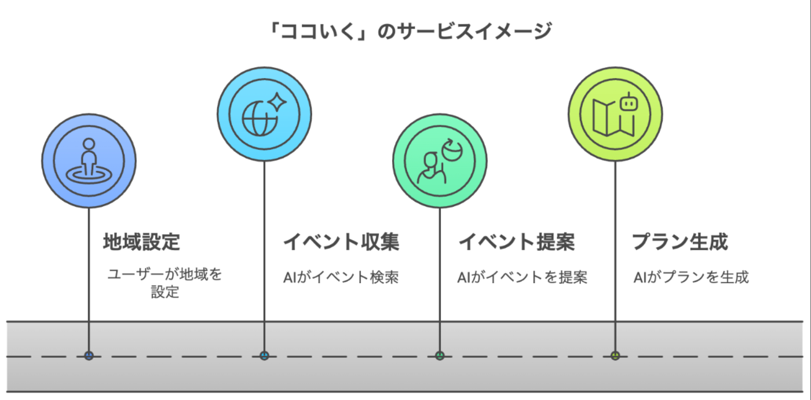
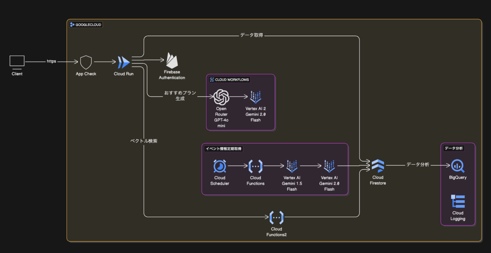
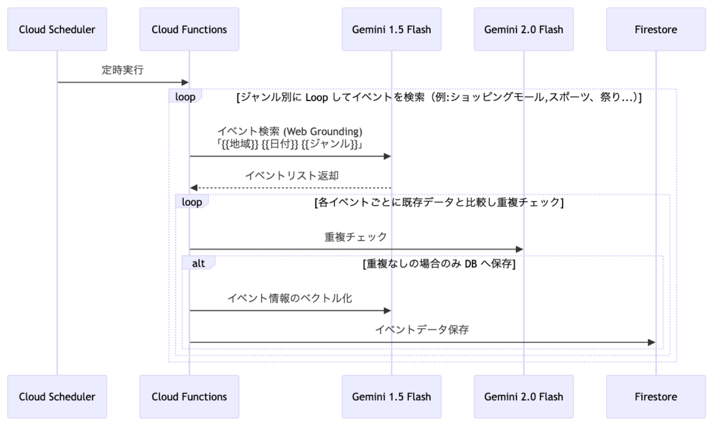
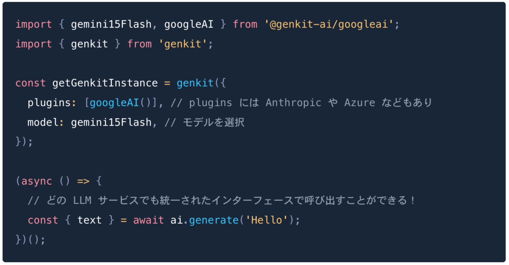
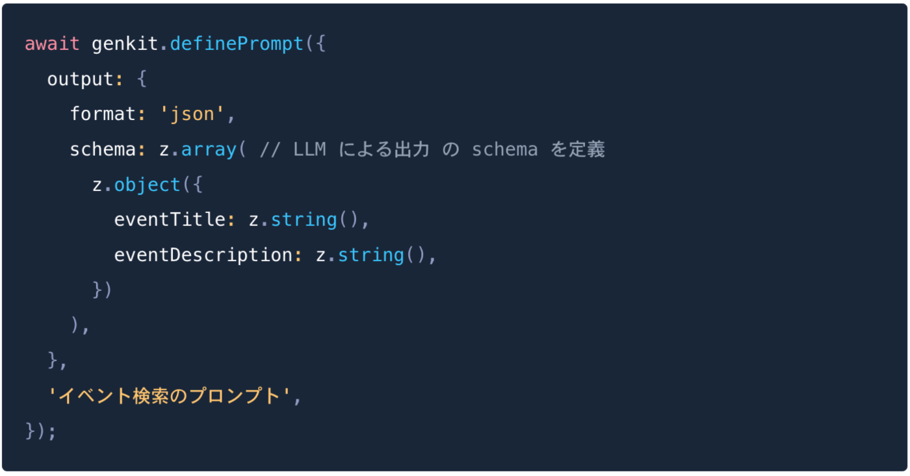
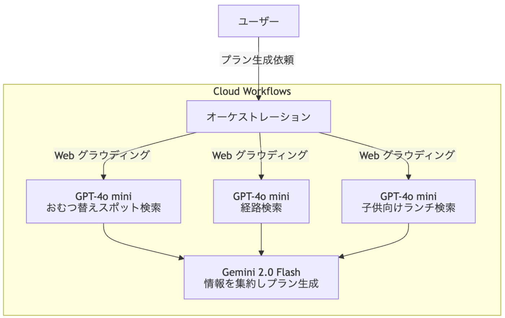

**■ 2025/03/13 追記**  
本作品は **Tech Deep Dive 賞** を受賞しました！🏆  
受賞にともない、ハッカソン挑戦の裏側について記事公開しましたのでご覧いただけたらうれしいです！

<https://zenn.dev/kikagaku/articles/d2876e8e2e50a5>

* * *

!

この記事は Zenn 主催の AI Agent Hackathon with Google Cloud への応募記事です。  
記事は Publication へ投稿していますが、応募は個人として行っています。

##  おでかけプランニング AI エージェント「ココいく」

「**ココいく** 」は子育て世代のパパママの週末のお出かけをサポートする AI エージェントです。

###  「どこいく？」から「ココいく！」へ。

**子供** 「今日はどこいくー？」  
**パパ** 「ちょっと今考えてるから待ってて！」（行きたいイベントが見つからないし検索も大変...）  
...  
**子供** 「どこいくー？決まった？？」  
**パパ** 「😂 😂 😂」

パパママならあるあるのこんなやり取り。  
週末のおでかけ先探しに困った経験はありませんか？

「**ココいく** 」を使えばそんなパパママのお悩みとはもうおさらば！  
**きっとあなたにぴったりな週末の「ココいく！」が見つかるはず 🙂**

###  「ココいく」の特徴

  * 子供をもつ**パパママを対象ユーザー** としたお出かけプランニング AI エージェント
  * **ユーザーは地域を一度設定するだけ** で AI エージェントが毎週その地域で開催されるイベント情報を Web から自動収集
  * 最新のイベント情報からユーザーの好みに基づいた**おすすめイベントを提案**
  * 気になるイベントに対しては AI エージェントが**１日の遊びプランを生成＆提案**

####  機能紹介

<https://youtu.be/P4T32mnVsFU>

##  「ココいく」が解決する課題

###  1️⃣ 地域活性化のためのイベントが他の情報に埋もれてしまう問題

  * 膨大なインターネット情報の中で、価値あるローカルイベントの情報が埋もれてしまう
  * そのため、せっかくの地域の取り組みが認知の機会を失ってしまっている

###  2️⃣ 週末のお出かけ先探しが大変すぎる問題

  * イベント主催者が多岐にわたり（ショッピングモール/行政/民間など）情報が分散している
  * それらの情報が一元で管理されているメディアがない（既存のものは網羅性に課題あり）
  * そのためパパママは週末のおでかけ先の検索がとても大変  
※ [こちら](https://c.nishinippon.co.jp/hanbai/10training/enquete/2019/06/262600721c7bd016fc959ce4e41d450785e3f2db.php) のアンケート調査では３人に１人が休日に何をするかで悩むと回答

「**ココいく** 」ではこれらの課題を解決し、パパママをお出かけ先探しの負担から解放し、地域イベントの活用を最大化に貢献します！

##  課題へのソリューション

###  1️⃣ Web グラウディングを活用したイベント情報 DB の構築

  * VertexAI Studio を活用
  * Web グラウディングでイベント情報を定期的に収集し Cloud Firestore に保存
  * **常に最新かつ網羅的なイベント情報データベースを構築** する
  * ✅ 地域イベントが埋もれてしまうことへのアプローチとともに、パパママの検索を代行

###  2️⃣ ベクトル検索を活用したおすすめイベント情報の提案

  * Cloud Firestore のベクトル検索を活用
  * ✅ **各ユーザーの好みに基づいたイベントをおすすめ** することで検索の手間をさらに削減

###  3️⃣ マルチエージェント型のお出かけプラン生成

  * Cloud Workflows を活用
  * マルチエージェント型で各種情報（おむつ替えスポット、イベント会場までの移動ルート、子供向けランチなど）を検索＆集約し、**最適なおでかけプランを提案**
  * ✅ イベントに対する解像度を上げ、パパママのお出かけ先探しの意思決定をさらに手助け

####  アーキテクチャ

##  AI 関連の採用技術とその理由

###  VertexAI Studio

LLM 周りは VertexAI Studio をメインに活用しています。

  * Web グラウディング（Gemini 1.5 Flash）
  * エンベディング（textEmbedding004）

ここでは VertexAI Studio を活用した「**イベントの情報収集** 」に焦点をあて説明します。

グラウディングでは「{{地域}} {{日付}} {{ジャンル}}」のような検索ワードを指定し、特定の地域のイベント情報を網羅的に収集できるようにしています。  
また、Gemini 2.0 Flash による重複チェックを入れることで同じイベントが複数保存されることを防ぎ、イベント情報の正規化を図っています。

!

ユーザーアクセス時にリアルタイムで Web から情報を取るような構成にしなかった理由

  * 単純な Web グラウンディングではイベント情報の網羅性に課題がある
  * Web グラウディングそのものに時間がかかりユーザー体験が悪い
  * アクセス都度 Web グラウディングを行うとコスト(費用)が高い

###  Firebase Genkit

VertexAI の LLM の呼び出し及びプロンプトの管理は Firebase Genkit で一元化しています。  
Firebase Genkit を活用することで LLM のインターフェースを統一できることに魅力を感じ採用しました。

####  モデル呼び出しの一元管理

通常、LLM を呼び出す際には各サービスでインターフェースが異なるため、それぞれのサービスで呼び出しを管理する必要があります。  
ただ Firebase Genkit を使うことで以下の通り統一されたインターフェースで管理できるため**適材適所に合わせて柔軟にモデルを変更して開発をすることができました。**

####  LLM の output を型安全に扱う

Firebase Genkit の `Dotprompt` を使うことで **なんと LLM の出力を schema 管理できるようになり型安全に扱えます。**  
例えば「**ココいく** 」では Web から取得したイベント情報を特定の schema に従って Firestore に保存する必要があるため DB の schema をそのまま `Dotprompt` に渡しています。  
こうすることで Web の情報をもとに LLM が schema に適した出力をしてくれるため **LLM の出力形式の制御問題にあたることなく開発することができました。**

###  Cloud Workflows

「**AI おすすめプラン生成** 」には Cloud Workflows を活用しています。

今回は VertexAI Studio しか Google Cloud の API は使ってないのですが、例えば将来 BigQuery に格納した地理データやイベントデータなどとも連携してプラン生成をしたい場合に Cloud Workflows であれば柔軟に対応できるかと思い採用しました。

「**ココいく** 」での具体的な活用事例を紹介します。

ユーザーからプラン生成のリクエストがあると Cloud Workflows 内で Web 上から情報収集を始めます。  
その後各種情報を集約しプランを生成します。  
**マルチエージェント形式で構築することで、それぞれの LLM が独立して情報を収集/集約し、より高品質なプランを生成を可能** としています。

※ Web グラウディングに GPT-4o mini を利用しているのは「[Google 検索の検索候補の要件](https://cloud.google.com/vertex-ai/generative-ai/docs/multimodal/grounding-search-suggestions?hl=ja)」を仕様上満たすことができなかったため Gemini ではなく GPT を採用したという背景  
※ GPT-4o mini は Open Router を経由

###  Cloud Firestore（ベクトル検索）

「**おすすめイベントの表示** 」のためのベクトル検索には Cloud Firestore を活用しています。

**Cloud Firestore はベクトル検索に必要な事前の設定が特に必要なく** 、少ない開発期間でもスムーズにアプリに組み込むことができそうだったので採用しました。

「**ココいく** 」ではユーザーにおすすめのイベントを表示する際にベクトル検索を使っています。  
以下に簡単なロジックを記載します。

  * アプリ上でイベントの閲覧や保存などの行動をユーザーが取った際にベクトル値を更新 
    * ベクトル値にはカテゴリ/開催地などを含ませ、細かい粒度でユーザーの好みを学習
    * また、ユーザーの行動別に重み付けを行い、ユーザーの好みに寄るようなベクトル値を生成
  * ページ閲覧時にベクトル検索を実行し、Firestore からおすすめイベントを取得

##  その他の採用技術

###  Firebase

「**ココいく** 」は **Firebase をフル活用** し開発を行っています。

  * DB 
    * Cloud Firestore
  * 認証 
    * Firebase Authentication
  * セキュリティ 
    * Firebase App Check / Cloud Firestore Security Rules
  * バックエンド 
    * Cloud Functions for Firebase
  * Hosting 
    * Firebase Hosting (Cloud Run)

####  運用面でのメリット

  * DB 管理 
    * Cloud Firestore はトラフィック負荷、またはデータベースサイズの増加に応じて**自動スケーリングされるので運用面でのコストが抑えられます。**
  * CI/CD の整備 
    * Firebase Hosting は `firebase init hosting` のコマンドを実行することで自動で CI/CD の設定が行われますので**アプリケーションの初期段階からライフサイクルの最適化が可能です。**

####  コスト面でのメリット

Cloud Run や Cloud Functions, Cloud Firestore は無料枠が大きく設定されていますので、サービスがスケールするまでは**大きなコストを掛けることなくサービスの提供が可能でコスト面でも優れています。**

##  データ分析

「**ココいく** 」では以下の仕組みでユーザーの行動データ等を収集し、それをもとにデータ分析を行う想定をしています。

###  LLM の出力品質の分析

  * Firebase Genkit を利用した [Monitoring](https://firebase.google.com/docs/genkit/monitoring?hl=ja) により LLM へのインプット・アウトプットを監視
  * ※ Firebase Genkit では `enableFirebaseTelemetry` を１行追加するだけで LLM のログ出力が可能（リンク内参照）

###  ベクトル検索の精度分析

  * ユーザーがイベントをクリック時におすすめイベントをクリックしたか否かのフラグを Cloud Firestore に保存し BigQuery へエクスポート
  * エクスポートされたデータを元にベクトル検索の精度を計測
  * ※ Cloud Firestore → BigQuery へのエクスポートは Cloud Firestore Extension の `Stream Firestore to BigQuery` で実装

##  まとめ

####  「ココいく」の AI エージェントとしての特徴

ユーザーが必要とする指示は初回の１回のみで、設定後は常にバックグラウンドで情報を集約し、ユーザーにあったイベントを自動でおすすめします。  
そのため従来のユーザーアクションから始まる対話型エージェントを超えた一歩進んだ AI エージェントとして機能しています。

####  「ココいく」の技術的な特徴

Google Cloud （特に Firebase 関連）の各種サービスを活用し、運用面やコスト面に優れたシステムを構成となっています。

####  リポジトリ

<https://github.com/tishibashi1003/ai-event-guide>

####  「ココいく」 URL

<https://zenn-hackathon-b8dca.web.app/>

!

本ハッカソンの参加条件には「以下の方は参加できません。（中略）企業の意向によって当該企業の代表として選出された個人」という記載があります。  
Zenn の担当者の方へ確認を取り以下の条件を満たしていれば Publication への投稿でも問題ということでしたので Publication へ投稿しています。

  * 企業の代表としての参加ではない
  * 企業所有のアカウント（Google Cloud など）ではなく開発者の権利で使用できるツールを使っていること

