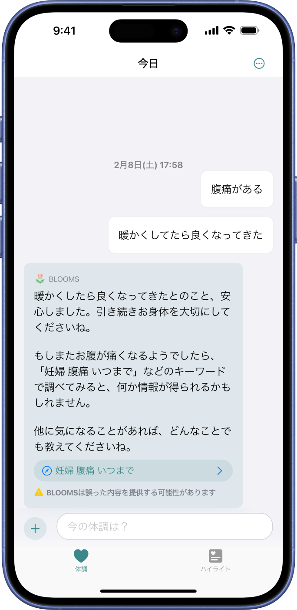
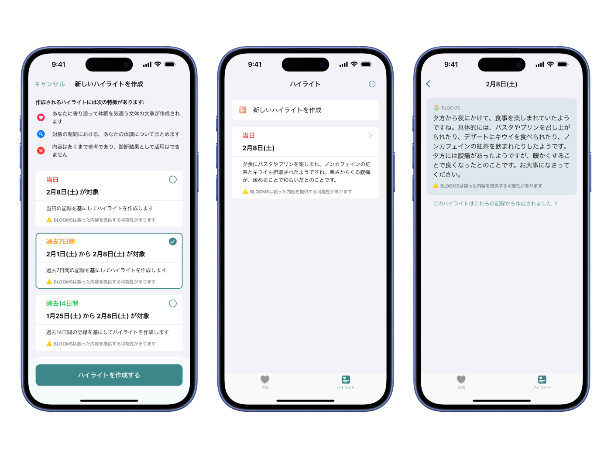
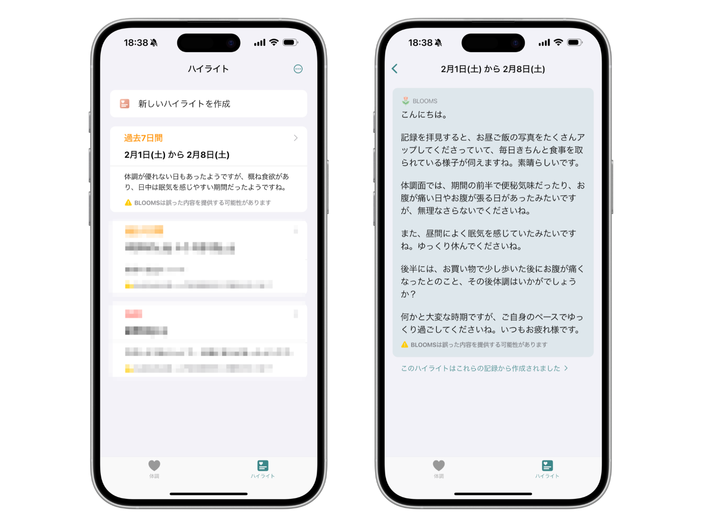
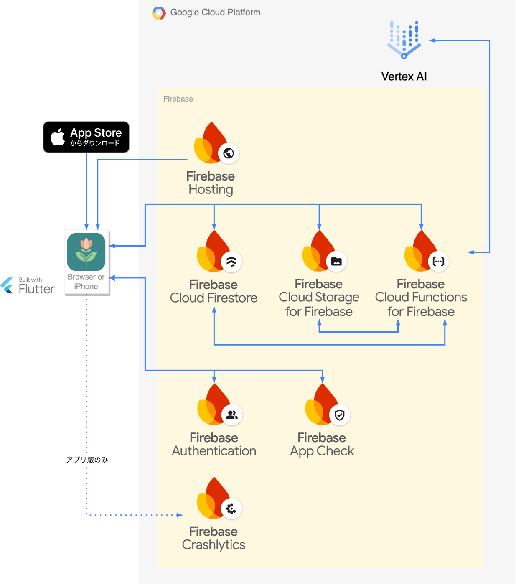

この記事は **[【Zenn 初開催】AI エージェント開発に挑戦！初心者歓迎ハッカソン](https://zenn.dev/hackathons/2024-google-cloud-japan-ai-hackathon)** への提出を目的とした成果報告です。

#  BLOOMS

今回開発したものは「BLOOMS」という iOS/Web アプリケーションです。発音は**ブルームス** です。

BLOOMS は妊婦の方が体調や日々の出来事を記録すると、生成 AI が感想を述べたり、関連情報が得られるであろう Google での検索キーワードを提案したり、一定の期間にどのような記録があったのかを要約してくれるアプリケーションです。

!

このアプリケーションは**医療情報を提供するものではありません。**  
ただし、生成 AI を利用している都合上、提供する内容を 100%制御することはできないため、あくまで参考程度に止める必要があります。

##  対象のユーザ像と課題

BLOOMS は妊婦の方が利用することを想定しています。具体的には**妻のために開発したアプリケーション** です。

現在、妻が妊娠中であり、体調が変化しやすい状態を目の当たりにしています。辛さを軽減するために取れる対策がないか調べてみたり、医師や助産師に相談してみたりしています。

しかし、いつどのような体調の変化があったのかを把握しておかないと、対策を調べたり効果を検証したり、医師に症状を相談するのが難しいとわかりました。  
体調は様々な理由で日々変化するため、**記憶だけに頼るのは難しく、何らかの記録に残しておく必要がある** と考えました。

##  課題へのソリューション

世の中には、マタニティダイアリー[1]と呼ばれる体調を記録したり役立つ情報を参照できる日記があります。いわゆる手帳型の日記帳であり、手書きで記録することが一般的です。

BLOOMS はこれを代替し、さらに**生成 AI を用いて記録に対する付加情報の提供や要約** を行います。これにより、ユーザは従来通り体調を記録するだけで、**関連する情報を得られるきっかけが提供** され、自身の体調についてより深く理解することができると考えています。

なお、マタニティダイアリーに類似するアプリは存在していますが、生成 AI を利用したことで**自由度の高い記録が可能になった** 点で差別化を図っています。

###  日々の体調の記録

BLOOMS では、日々の体調や出来事をテキストや写真で記録することができます。  
生成 AI は記録される度に感想を述べたり、より有用な記録となることを支援する回答を行います。

  
_テキストと写真の記録_

###  検索キーワード

BLOOMS は記録に関連して、付加情報が得られると推測される検索キーワードを提案することがあります。検索キーワードをタップすると Google での検索結果を閲覧することができます。

  
_検索キーワードの提案_

BLOOMS では、生成 AI が直接情報を提供するのではなく**信頼性の高い情報源へのアクセスを支援** することで、ユーザに**安全な情報収集の機会** を提供します。

現代の生成 AI では 100% の信頼性は担保できないため、健康被害が発生する可能性のある情報を提供することは避けるべきです。  
Google の検索結果であっても信頼性には注意が必要ですが、マタニティ・ベビー用品を扱っている会社などでは、様々な症状やその対処法に関する情報が専門家の監修のもとに提供されており、適切な情報を選択することで、より安全に情報収集できると考えています。

例えば、冷え性について検索すると様々な信頼性が高いと思われる情報が得られます。  
[https://www.google.com/search?q=妊婦+冷え性+原因](https://www.google.com/search?q=%E5%A6%8A%E5%A9%A6+%E5%86%B7%E3%81%88%E6%80%A7+%E5%8E%9F%E5%9B%A0)

###  記録の要約

BLOOMS には、一定期間の記録を要約する「ハイライト」機能があります。

  
_新しいハイライトの作成と概要と詳細_

ハイライトは週ごとの振り返りや、妊婦健診の問診時に活用できると考えています。

妊婦の方は妊娠週数によって 1〜4 週間に 1 回のペースで妊婦健診を受けることが標準的とされています[2]。私も何度か付いていきました。

例えば、便秘は妊娠中によくある症状の一つですが、食物繊維や水分の摂取を意識することで改善できる場合もあるとされています[3]。  
食物繊維や水分の摂取について記録しておけば、ハイライトによって便秘の改善に対する効果を把握したり、医師への相談に役立てることができるでしょう。

####  妻の 1 週間のハイライト

実際に妻の記録で作成した 1 週間のハイライトをご紹介します。今週の出来事が大まかに把握できることがわかります。

  
_妻の 1 週間のハイライト_

##  デモ

<https://youtu.be/E55mRCPdaK8>

動画のナレーションは Text-to-Speech AI を利用しました。

!

デモ動画、および本記事の内容はバージョン`1.0.1`時点のものです。  
ハッカソンの審査期間中（〜2025 年 3 月 13 日）には、セキュリティやバグといった重大な問題への対処が必要な場合を除き、アップデートは行いません。

###  iOS 版

<https://apps.apple.com/jp/app/blooms/id6740260241>

###  Web 版

ブラウザの仕様上、Web 版は一部機能が制限されています。

<https://app.blooms.kingu.dev/>

##  システムアーキテクチャ図

クライアントは Flutter、バックエンドは Firebase を利用しています。

###  Flutter

開発期間の時間的制約もあり、iOS と Web のみの対応としました。

###  バックエンド

####  Firebase Authentication

プライバシー保護の観点から**匿名認証のみを採用** しました。

BLOOMS では、ユーザの健康状態というデリケートな情報を扱うため、Google アカウントやソーシャルアカウントのような個人と紐づく認証方法は採用せず、匿名認証のみを採用することで、プライバシーリスクを低減しています。

####  Cloud Functions

Vertex AI API for Gemini にリクエストを送って、ユーザの記録に対する回答やハイライトの生成などに利用しています。これらの関数は Cloud Firestore へのデータ書き込みをトリガーとして実行されるように設定されています。

また、写真のリサイズ、WebP への変換、BlurHash の生成、Cloud Storage への保存も行っています。

####  Firebase Hosting

BLOOMS の Web 版と Widgetbook をホストしています。

Widgetbook は UI カタログの一種であり、以下の URL で公開しています。  
<https://widgetbook.blooms.kingu.dev/>

UI コンポーネントの確認がブラウザでできるのは**Web に対応している Flutter ならでは** と言えるでしょう。

####  データの物理削除

Cloud Firestore の TTL ポリシーを利用することで物理削除を行っています。

アカウントの削除は、削除対象となるアカウントを Cloud Functions で Admin SDK を用いて Firebase Authentication から定期的に削除します。  
削除をトリガーとして[Delete User Data](https://firebase.google.com/docs/extensions/official/delete-user-data?hl=ja)が実行され、関連するデータを物理削除しています。

####  その他

以下については文字数制限の関係で割愛します。

  * Cloud Firestore
  * Cloud Storage
  * App Check
  * Crashlytics

###  生成 AI

Vertex AI API for Gemini の Gemini 2.0 Flash を利用しています。2025 年 2 月 5 日に一般提供となりました。  
システム指示の一例は以下です。粗は感じているので、まだ改善の余地があると考えています。  
<https://github.com/KoheiKanagu/blooms/blob/v1.0.1/firebase/functions/src/features/condition/application/setupGenerativeModel.ts>

###  ソースコード

こちらから確認できます。`v1.0.1`のタグ時点がハッカソン提出時のバージョンです。  
<https://github.com/KoheiKanagu/blooms/tree/v1.0.1>

##  BLOOMS という名称について

BLOOMS の正式名称は「Body Log Observation and Outlook for Maternal State」であり、日本語だと「母体の体の状態の観察と展望」のような意味合いです。  
また「BLOOMS」は「花が咲く」といった意味になります。

ここで言う「花」とは赤ちゃんをイメージしており、**出産という出来事を花が咲くと捉えて命名** しました。

ちなみに、サービスの名称を英文の頭文字で表現することはよくありますが、私は英語が得意ではないため、Gemini に考えてもらいました。  
アイコンは Gemini の Imagen で生成されたものをベースに手動でベクター化しました。

##  費用について

Firebase は 1 ヶ月あたりの無料枠が充実しているため、ある程度のユーザ数まではほぼ無料で運用できると予想しています。  
Gemini 2.0 Flash は無料枠こそありませんが、100 万トークンあたり$0.10 という価格設定です。

妻の実際の 1 週間の記録をもとにして費用を見積もってみます。

妻は 1 週間で 16 回の短文のテキストの記録、写真の記録が 7 回あったため、約 15,000 トークンであると推定されます。また、ハイライトで週 1 回、過去 7 日間の記録を要約する場合、約 4,000 トークンであると推定されます。

同程度のユーザが 1 万人と仮定すると、`((15000+4000)*4*10000)/1000000*0.10 = 76ドル/月`となります。  
**ユーザ一人あたりのランニングコストが 1 円以下は非常に安価** だと思います。（この規模になった場合は Firebase の無料枠は超えているはずですので、実際にはもう少し高くなると思われます）

##  今後の展望

以下のような展望を考えています。

  * BLOOMS の回答が 👍 か 👎 かのフィードバック
  * 音声での記録
  * ハイライトの種類の拡充
  * ユーザのパートナーと記録の共有
  * Passkey のサポート
  * ウィジェットのサポート
  * マネタイズの仕組みの検討

妻には引き続き利用してもらっており、フィードバックをもらいながら改善を進めていきたいと考えています。

##  おわりに

今回のハッカソンの参加をきっかけに初めて "AI エージェント" を用いたサービスを開発しました。  
GitHub Copilot は以前から利用しており、その可能性は感じていましたが、実際に生成 AI を用いたサービスを開発したことで新しい技術に触れる良い機会になりました。

もっと詳しい内容や Flutter のテクニックについても語りたいのは山々ですが、字数制限のため割愛します。需要があれば別途記事にするかもしれません。

拙い文章ではありましたが、最後までお付き合いいただきありがとうございました。

脚注

  1. [【妊娠に気づいたら】「マタニティダイアリー」で今しか書けない記録を残そう｜たまひよ](https://st.benesse.ne.jp/ninshin/content/?id=97770) ↩︎

  2. ["妊婦健診"を受けましょう（リーフレット）｜厚生労働省](https://www.mhlw.go.jp/bunya/kodomo/boshi-hoken13/) ↩︎

  3. [【助産師執筆】妊娠 18 週 便秘がつらい…実は困っている妊娠中のお通じ事情｜アカチャンホンポ](https://www.akachan.jp/topics/midwife/journal_m18/) ↩︎

