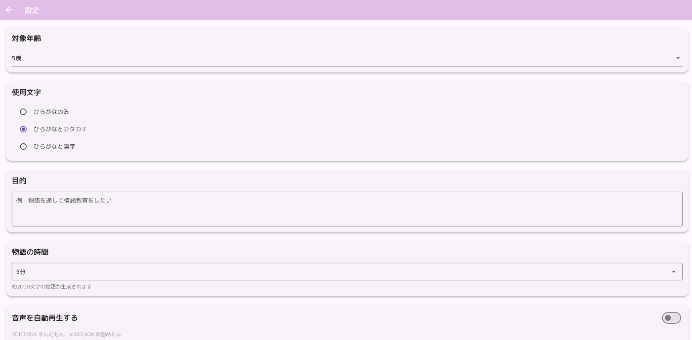
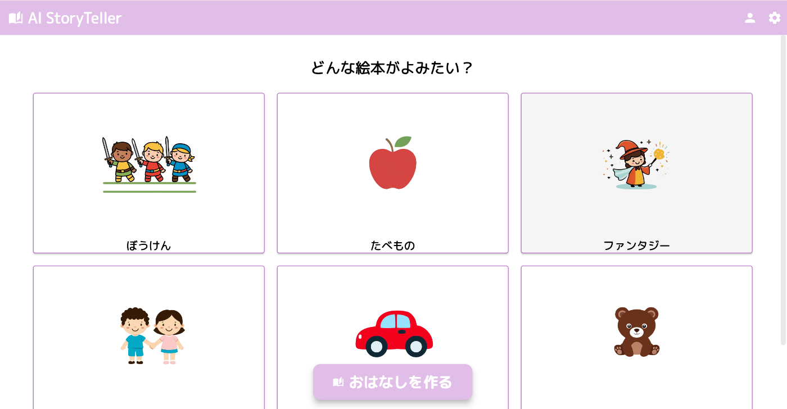
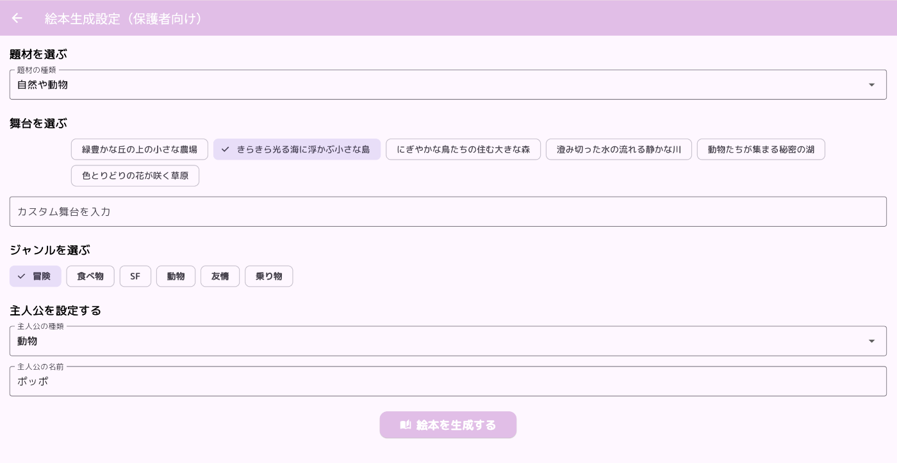
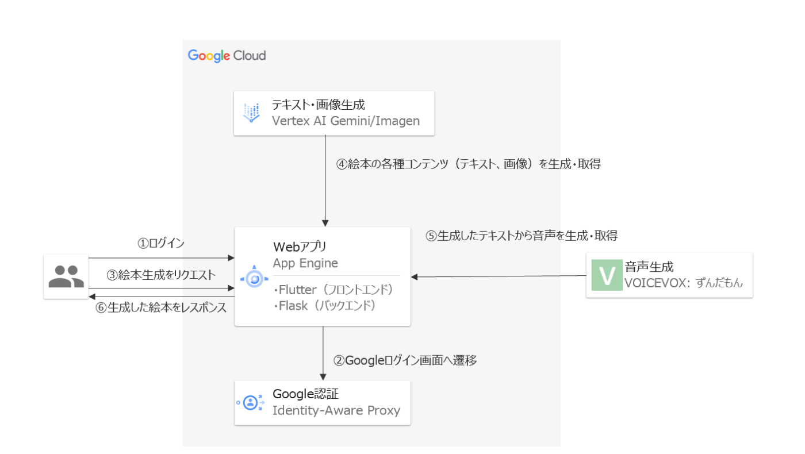

#  はじめに

!

本記事はZenn主催の[AI Agent Hackathon](https://zenn.dev/hackathons/2024-google-cloud-japan-ai-hackathon)に向けて、作成したAIエージェントについて説明します。  
【3/13追記】 🏅Flutter賞をいただきました！

こんにちは！  
AIを使って自分だけの物語を作成し、絵本の読み聞かせをしてくれるWebアプリ「AI Storyteller」を作りました。  
このアプリではGeminiの最新の文章生成・画像生成機能を活用して自分だけの物語を作成し、子どもに読み聞かせすることができます。  
これにより、子どもの創造力を育み、親子のコミュニケーションを深めることを狙いとしています。

#  デモ動画

<https://youtu.be/PQsFq1aUgVA>

#  対象ユーザー

  * 子ども（4歳～12歳頃）
  * 保護者（特に共働きの夫婦やシングルマザー/ファザー）

#  解決したい課題・ソリューション

解決したい課題は**教育格差** です。絵本の読み聞かせは子どもの語彙力や表現力・想像力を高めるのに有効であるといわれていますが、以下の要因により、昨今では読み聞かせの機会が減少しています。

##  【要因1】共働きの増加

現在は夫婦共にフルタイムで働く共働き世帯が増加しています。そのため家事の負担が大きいこと、仕事で帰る時間が遅くなることで親が子どもに絵本を読み聞かせる時間がなかなかとれていないと考えられます。これよって、子どもが新しい本に出会う機会が減少しています。

以下の調査では、子育てをする主婦のうち、73.1%が「読み聞かせをする時間がないから」という理由で読み聞かせをしていないことが分かりました。  
  
＜出典＞  
<https://cocreco.kodansha.co.jp/cocreco/general/life/labo/k6CvO>

##  【要因1】ソリューション

  * AIによる絵本作成と音声による絵本読み聞かせ機能: アプリの主要機能として、AIが絵本を生成し、音声で読み聞かせる機能を提供します。これにより、親が時間がない場合でも、子どもは物語に触れることができます。
  * 読み聞かせ時間のカスタマイズ: 設定入力画面（保護者向け）で、読み聞かせ時間を設定できるようにします。短い時間で完結する物語や、分割して読み聞かせができるように機能を実装します。

##  【要因2】絵本の値段が高い

絵本は、高価なボード紙が使われていたり、安全のため角を丸くしていたり、水に濡れても大丈夫なように加工をしてあるなど製造コストがかかるため高いです。

絵本1冊あたりの値段の平均は約**1200円～1300円** となります。例えば一週間に1回、月4回読み聞かせをしたいとなると、生後0歳～8歳までに読み聞かせにかかる値段を計算すると以下の値段になります。

!

1200(円/冊）× 4(回/月) × 12(ヶ月) × 8(年間) = **約46万(円)**

トータルで**約50万** 円となり、月4回読み聞かせるだけでも高いコストがかかると想定されます。

よく3歳までに3万冊、などと言われますが、それにかかるコストは**3600万** 円です。絵本だけにそんなにコストをかけられるのは一部の家庭に限られてしまいます。  
<https://toyokeizai.net/articles/-/329101>

図書館や児童館でも絵本は読めますが、利用できる時間が限られている・混雑・そもそも行く時間がないなどの問題も挙げられます。

##  【要因2】ソリューション

  * 本アプリ「AI Storyteller」を使った場合、1回あたりの絵本を作る料金は約**12円** になります。  
普通の本とは内容のクオリティやオリジナリティが異なるため、単純比較はできないと思いますが、上記で一週間に1回、月4回読み聞かせた場合の値段と比較するとかなり安いです。

!

12(円/冊）× 4(回/月) × 12(ヶ月) × 8(年間) = **約4,600(円)**

なお、ざっくりとした料金の内訳は以下となります。  
\- Imagen(絵本のイラスト生成)：1枚当たり約$0.02(3.1円)  
\- Gemini 1.5 Flash：1回あたり約$0.0001875（0.03円）  
※Webアプリのインフラ部分は除きます。  
※1回当たり、4枚のイラストを生成する想定とします。  
※アプリ内ではGemini 2.0 Flashを使っていますが、執筆時点では料金表が見当たらなかったため、Gemini 1.5 Flashで計算しました。

##  【要因3】読み聞かせの環境が整っていない

  * 絵本を家庭内で購入する場合、置く場所を確保するのは家が狭い場合難しいです。
  * 保育園や幼稚園では先生が多くの子どもの世話をする必要があり、一人ひとりに十分な時間をかけて読み聞かせをすることが難しい場合があります。
  * 親や先生は絵本に必ずしも詳しいとは限らないため、子どもの発達段階や興味に合わせた絵本を選ぶのが難しい場合があります。
  * 発達に課題がある子どもや、特別な配慮が必要な子どもに対して、個別のニーズに合わせた読み聞かせが難しい場合があります。

##  【要因3】ソリューション

  * Webアプリなので絵本を置く場所は必要ありません。
  * 特定のテーマやジャンルをカスタマイズできるため、子どもの発達段階や興味、発達に課題がある子どもなど1人1人に合った絵本を選び、個別に読み聞かせることができます。  
具体的には子ども用としてジャンルを選ぶだけで絵本を生成する機能・大人用として詳細な絵本のカスタマイズする機能があります。  
これにより、子どもが好きなジャンルの本を自由に選べる・親がいなくても簡単に絵本を作れる・大人が子どもに読み聞かせたい内容をカスタマイズすることができます。

##### 共通設定

子ども用・大人用に絵本を生成するときにこの設定がデフォルトとして反映されます。

  * 対象年齢  
対象年齢を選択できます。
  * 使用する文字  
ひらがな・ひらがなとカタカナ・ひらがなと漢字の３つから選択できます。
  * 読み聞かせの目的  
絵本の読み聞かせを通してどのようなことを学ばせたいのか設定することができます。
  * 物語の時間  
3分～10分まで選択できます。  

##### 子どもが絵本を作る画面

  * ジャンル  
好きなジャンルを選択できます。  

##### 保護者が絵本を作る画面

  * 題材  
あらかじめ10個の題材が用意されています。
  * 舞台  
題材を選択するとさらに詳しい絵本の舞台を選択したり、自分で設定することができます。
  * ジャンル  
好きなジャンルを選択できます。
  * 主人公の種類  
人間、動物など主人公の種類を選択できます。
  * 主人公の名前  
主人公の名前を自由に設定できます。  

#  システム構成

##  処理の流れ

  1. Webアプリへログインする
  2. Googleアカウントのログイン画面へ遷移する。
  3. ユーザーがフロントエンドで絵本生成をリクエスト:ユーザーが必要な情報を入力し、生成ボタンを押す。
  4. AIエージェントによって生成されたコンテンツの取得:フロントエンドからバックエンド（Flask）にリクエストが送信され、バックエンドは、受け取ったリクエストを基にAIエージェント（Vertex AI Gemini/Imagen）に絵本生成を依頼する。AIエージェントから生成されたテキストと画像を受け取る。
  5. 音声生成・取得:生成されたテキストを基に音声を生成し、取得する。
  6. 生成した絵本をユーザーへ返す。  

##  フロントエンド処理

  * 技術スタック: Flutter
  * 機能: 
    * ユーザーインターフェースの構築
    * 絵本生成リクエストの送信
    * 結果の表示（生成された絵本のテキストや画像）
    * Googleログイン画面への遷移

##  バックエンド処理

  * 技術スタック: Flask
  * 機能: 
    * 絵本生成リクエストの受信
    * AIエージェント（Vertex AI Gemini/Imagen）へのリクエスト送信
    * 生成されたテキストと画像の取得
    * 音声生成リクエストの処理（VOICEVOX: ずんだもん）
    * 結果をフロントエンドにレスポンスとして返却

#  まとめ

今回はAIハッカソンという機会をたまたま知り、初めて個人開発に取り組んでみました。  
せっかくなのでこのアプリは今後公開して、皆さんにも是非使ってもらいたいなと思います！
