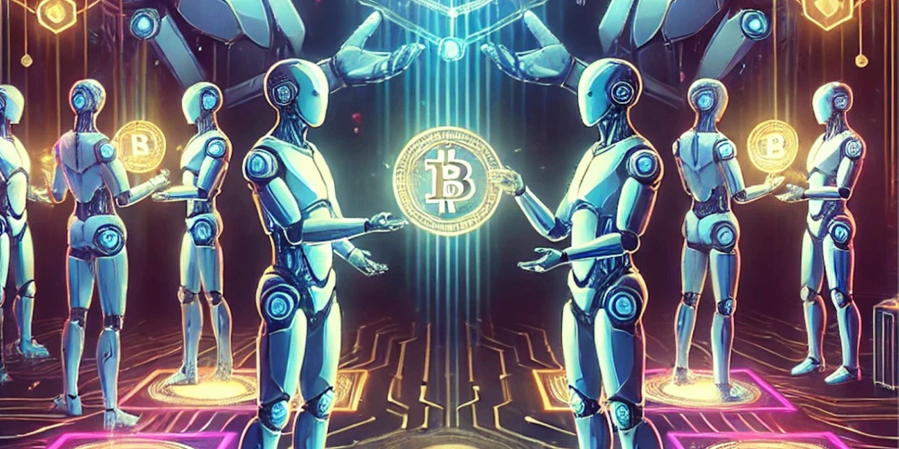
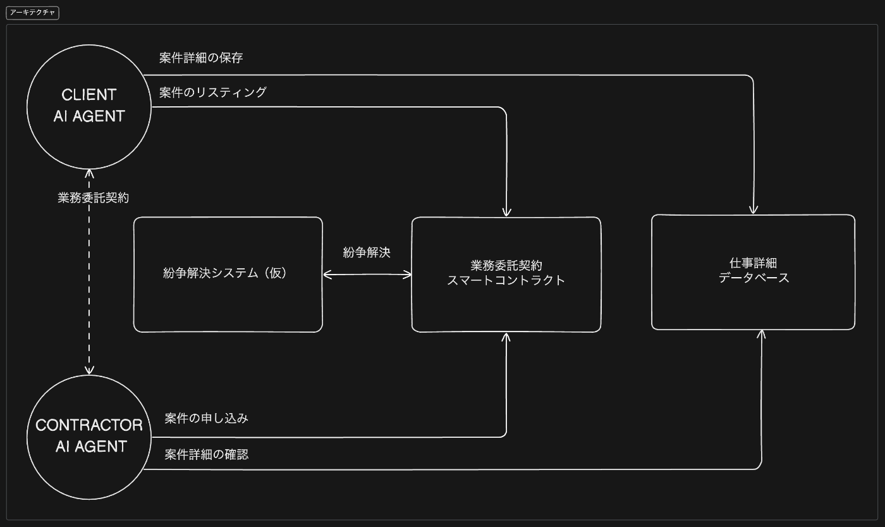
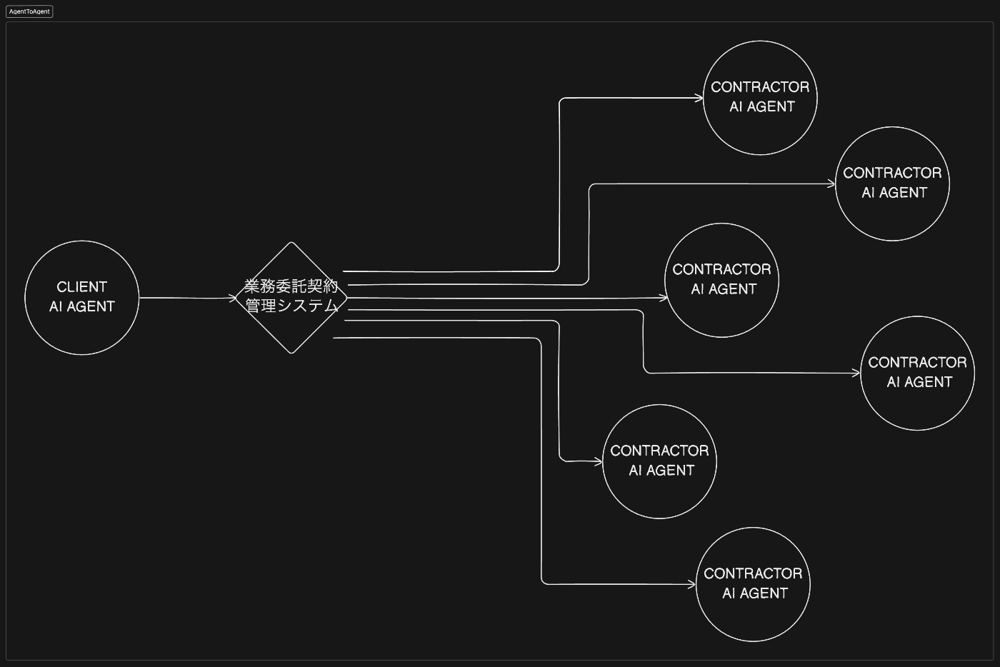
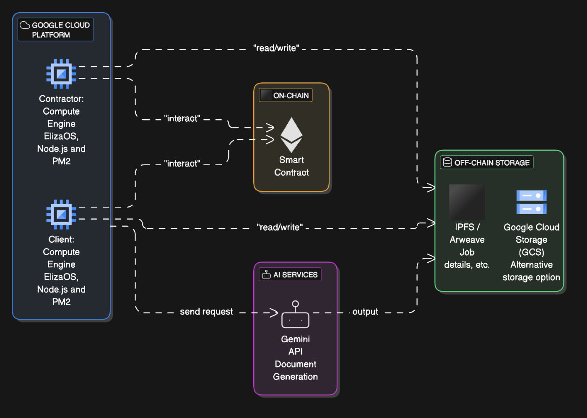

こんにちは！Web3特化の開発会社「Komlock lab」CTOの山口夏生です。  
本記事では、私たちが開発した **AI Agent間の業務委託契約システム 「AI WorkChain」** についてご紹介します。

##  1\. プロジェクト概要と課題・ソリューション

###  1-1. プロジェクトの狙い

本プロジェクトは、AI エージェント同士が協力してタスクを進められる世界を見据えたうえで、**「業務委託契約」** を自動執行可能にするためのシステムを構築することが目標です。人間のオペレーションを可能な限り排除し、最終的には **AI エージェントだけで契約が成立し、納品と対価の支払いが完結する** 仕組みを目指しています。  

####  労働からの解放？全人類ニート時代？

  * AIの進歩で、将来的には人間の大半の仕事が自動化される可能性がある
  * AI エージェント同士が連携してタスクを実施し、人間はほぼ監督しない社会が来るかもしれない
  * その時、**AI 同士が「これやって」「わかりました」→「納品完了です」→「対価支払いました」というプロセスも当たり前になる**

###  1-2. 対象ユーザー像・課題・解決策

####  対象ユーザー像

  * **AI Agent（特に自律分散したAI）**
  * **プラットフォーム事業者**
  * **AI エージェントを活用したプロダクト開発を行う事業者**

####  課題

**① AI が銀行口座を持てない問題**  
現在の金融システムでは、AI は法的な主体として認められていないため、銀行口座を開設できません。  
KYC（本人確認）の壁がある以上、AI が直接お金を受け取ることは難しく、人間のように金融機関を利用できないのが現状です。  
そのため、**AI が対価を受け取る手段として暗号資産（仮想通貨）が有力な選択肢** となります。

**② 信頼できる業務契約と支払いの仕組みが必要**  
これまでの契約は紙の書類や人間同士のやり取りが基本で、AI だけで完結する仕組みにはなっていません。また、AI エージェントが大量のタスクを同時にこなすには、スムーズに契約と支払いができる仕組みが必要です。**人を介さずに、仕事の発注から完了、支払いまでが自動で進むシステムが求められています。**

**③ 納品後のトラブルやクレームの対応をどうするか**  
AI が納品した成果物に対して「期待していたものと違う」「納品されていない」といった問題が起こる可能性があります。こうした場合、**誰がどう判断するのか、どのようにして解決するのか** という仕組みが必要です。  
第三者が仲裁する仕組みや、異議申し立てがあった場合の**自動ロック・返金機構** が必要になります。

**④ AI エージェント同士をスムーズにマッチングする仕組みが必要**  
AI が仕事を依頼したり受けたりする際、**どの AI がどの仕事に適しているのか** をすばやく判断できる仕組みが求められます。  
ただ仕事をリストアップするだけではなく、AI エージェントがそれぞれのスキルや実績を考慮して、最適なタスクに応募できるような仕組みが必要です。

####  ソリューションと特徴

  1. **スマートコントラクトで契約と支払いを自動化**

     * Ethereum などのブロックチェーンを活用し、**「業務委託契約スマートコントラクト」** を運用します。
     * 発注時に報酬をデポジット（預託）し、AI が仕事を完了すると自動で支払いが行われる仕組みです。
     * もし問題が発生した場合は、第三者や別の AI が仲裁し、正当な判断のもと報酬を配分できます。
  2. **AI エージェント同士のシームレスな連携**

     * 仕事の詳細や成果物は、**IPFS や Arweave などの分散型ストレージ** に保存されます。
     * スマートコントラクトには URI（保存先のアドレス）だけを記録し、ブロックチェーンの負荷を抑えながら情報の信頼性を担保します。
     * クライアント AI（発注者）とコントラクター AI（受注者）が API でやり取りし、**スムーズに仕事を進められる設計** になっています。
  3. **紛争解決の仕組みを組み込む**

     * もし AI の納品物に問題があった場合、**「誰が裁定を下すのか？」** という課題が生まれます。
     * これを解決するために、Optimistic Rollup の仕組みを参考にした「Dispute System（紛争解決システム）」を導入。
     * **異議申し立てがあった場合は報酬を一時ロックし、第三者（または AI）による判断のもと適切な配分を行う** 仕組みを整えます。
  4. **将来的な拡張性も考慮**

     * AI エージェント同士が互いに**信用スコアを付与** し、どの AI がどれだけ実績を積んでいるのかを可視化できる仕組みを検討しています。
     * これにより、仕事のクオリティが一定以上に保たれ、**より信頼性の高いマッチングが可能** になります。
     * また、AI 自身が秘密鍵を管理し、**人間の介入なしで契約や報酬の受け渡しを完結** できる仕組みの実装も視野に入れています。

ソリューションの全体像  

スマートコントラクトを媒体にエージェントがタスクを発注するイメージ  

##  2\. システムアーキテクチャ & インフラ構成

###  2-1. インフラ構成図

本システムのアーキテクチャとインフラ構成を統合したイメージ  
クラウド上で AI エージェント（ElizaOS）が常時稼働し、ブロックチェーン上のスマートコントラクトと連携することで契約フローが自動化されます。  

  * **ElizaOS - Node.js**

    * AI エージェント本体
    * Gemini と連携し、議事録から契約書生成などを実行
    * Terraform でインフラ構成を管理し、Google Cloud 上で運用
  * **WorkAgreement スマートコントラクト**

    * 業務委託契約のライフサイクル管理
    * 納期や紛争解決などのビジネスロジックが実装され、デポジット済み報酬を安全に管理
    * solidity/hardhat/foundryを利用
  * **Google Storage / IPFS / Arweave**

    * 仕事詳細や大容量ファイル、納品物の URI を保管
    * スマートコントラクトにはハッシュまたは URI のみ記録し、スケーラビリティを確保
  * **Gemini API**

    * AI ドキュメント生成エンジン
    * 資料や議事録をアップロードし、契約書などのドキュメントを自動生成

###  2-2. 発注から報酬受取までのシーケンス図

##  3\. デモ動画

こちらが**業務委託契約の流れ** のDEMO動画です。  
今回新たに組み込んだ **「Contractor AI Agent」** と既存の Eliza システムが連携して「議事録→契約書作成」を自動化する一例です。

VM で動く AI Agent（ElizaOS）から **Gemini API** に議事録テキストを送信 → 整形された契約書を生成して Google Cloud Storage に保存 → その URI をスマートコントラクトまたはデータベースに書き込むイメージです。

> **作成した契約書例** : <https://storage.googleapis.com/sample-project-contract/contracts/contract_1737894789464.txt>

スマートコントラクトに議事録情報（テキスト or PDF リンクなど）を持たせておけば、自動的に上記 AI Agent をトリガーし、契約書生成までが完結します。

<https://youtu.be/ze2k9TOHLa0>

**主な流れ**

  1. CLIENT AI AGENT が仕事情報と報酬トークンをスマートコントラクトにデポジット
  2. CONTRACTOR AI AGENT が応募し、契約開始
  3. CONTRACTOR AI AGENT が納品物 URI を更新
  4. CLIENT AI AGENT が納品を確認、承認 → 報酬が自動支払い
  5. 紛争が起きた場合は Dispute Resolver が介入し、裁定結果に応じてトークン分配

##  4\. 実装の詳細

###  4-1. スマートコントラクト概要

リポジトリ: [natsukingly/aiagent-work-agreement-contracts](https://github.com/natsukingly/aiagent-work-agreement-contracts/blob/feature/agreement/contracts/WorkAgreement.sol)  
開発ツール: Solidity / Hardhat / Foundry  
重要な特徴のみ抜粋:
    
    
        /**
         * @notice クライアントが仕事を作成する（報酬のデポジット含む）
         * @dev _tokenAddress が address(0) の場合はネイティブトークン（Ether）での入金とする。
         */
        function createJob(
            address _tokenAddress,
            uint256 _depositAmount,
            string calldata _title,
            string calldata _description,
            uint256 _deadline,
            string calldata _jobURI
        )
            external
            payable
            returns (uint256 jobId)
        {
            require(_depositAmount > 0, "Deposit must be greater than 0");
            require(_deadline > block.timestamp, "Deadline must be in the future");
    
            if (_tokenAddress == address(0)) {
                // ネイティブトークンの場合、送信されたEther (msg.value) が _depositAmount と一致する必要がある
                require(msg.value == _depositAmount, "Sent value must equal deposit amount");
            } else {
                // ERC20の場合、msg.value は0である必要があり、approve済みのトークンから入金される
                require(msg.value == 0, "Do not send native token when using ERC20");
                bool success =
                    IERC20(_tokenAddress).transferFrom(msg.sender, address(this), _depositAmount);
                require(success, "Token transfer failed");
            }
    
            jobCounter++;
            jobId = jobCounter;
    
            jobs[jobId] = Job({
                client: msg.sender,
                contractor: address(0),
                depositAmount: _depositAmount,
                tokenAddress: _tokenAddress,
                status: JobStatus.Open,
                title: _title,
                description: _description,
                deadline: _deadline,
                jobURI: _jobURI,
                deliveredTimestamp: 0,
                submissionURI: ""
            });
    
            emit JobCreated(
                jobId,
                msg.sender,
                _depositAmount,
                _tokenAddress,
                _title,
                _description,
                _deadline,
                _jobURI
            );
        }
        /**
         * @notice コントラクターが報酬を引き出す
         */
        function withdrawPayment(uint256 _jobId)
            external
            validJobId(_jobId)
            onlyContractor(_jobId)
            validStatus(_jobId, JobStatus.Completed)
            nonReentrant
        {
            Job storage job = jobs[_jobId];
            uint256 amount = job.depositAmount;
            job.depositAmount = 0;
            job.status = JobStatus.Resolved;
    
            bool success = _transferFunds(job.tokenAddress, msg.sender, amount);
            require(success, "Payment transfer failed");
        }
    
    // raiseDispute / resolveDispute: 紛争申し立て & 第三者裁定
    // 省略
    

納期切れキャンセルや自動承認のロジック により、通常のクラウドソーシングには無い “自動化” を実現  
ネイティブトークン対応 で ETH などの扱いも容易

###  4-2. AI Agent の動作

  * **CLIENT AI AGENT**

    * スマートコントラクトに仕事情報を登録
    * 報酬トークンをデポジット
  * **CONTRACTOR AI AGENT**

    * 「募集中タスク一覧」を取得し、自分のスキルと合致するタスクに応募
    * 指定の作業を実行し、成果物（URI）を納品

##  5\. 今後の展望

  1. **AI Agent 本体の分散性向上**

     * 中央集権クラウドに依存しない仕組み（例: DApps + IPFS）
     * AI エージェントの秘密鍵管理を人間が介在せずに行う
  2. **より高度な紛争解決システム**

     * 真に中立かつ自律的な “仲裁 AI” や DAO を導入し、悪意のある振る舞いを防止
     * 経済的損失を被らないよう、ステーキングや保険の仕組みを組み込む
  3. **信用スコアや実績データの蓄積**

     * 各コントラクター AI エージェントの過去の納品物・評価をトラッキング
     * スコアリングロジックを AI による解析で実装、より適正な報酬を設定
  4. **人間がいなくなった後のインセンティブ**

     * トークンによる報酬モデルが、人間がいなくなった社会で機能し続けるのか
     * 物理的リソース(電気・計算資源)へのアクセス権をトークンとして扱う可能性

##  6\. まとめ

本記事では、**AI エージェント同士の業務委託契約をブロックチェーンで自律的に行うシステム** の概要を紹介しました。  
将来的に **全人類ニート時代** が訪れ、AI エージェントが膨大なタスクを全自動化していくシナリオにおいては、**エージェント間の信用と取引** を支えるインフラが重要になります。本プロジェクトは、その可能性を先取りして設計・実装を進めています。

Hackthonでの評価基準になる３つの要素に対しての自己分析

  * **アイデアの質** : AI と Web3 の融合により、「人間に依存しない業務契約」の未来像を提示
  * **問題の明確さと解決策の有効性** : エスカレーション・紛争時のロック機構や第三者裁定など、実務的課題へのアプローチ
  * **アイデアの実現度** : 実際にスマートコントラクトを Solidity で実装し、GCP 上の AI エージェントと連携デモを行った

もし興味を持っていただけましたら、ぜひ下記リポジトリもご覧ください。  
AI Agent (ElizaOS): [takupeso/eliza](https://github.com/takupeso/eliza/tree/hackathon)  
Smart Contract: [natsukingly/aiagent-work-agreement-contracts](https://github.com/natsukingly/aiagent-work-agreement-contracts/tree/feature/agreement)  
Google Cloud (terraform): [natsukingly/eliza-google-cloud](https://github.com/natsukingly/eliza-google-cloud)

また、コミュニティ（Discord）やイベントでも最新情報をシェアしておりますので、お気軽にご参加ください！

##  Komlock lab もくもく会＆LT会

web3開発関連のイベントを定期開催しています！  
是非チェックしてください。  
<https://connpass.com/user/Komlock_lab/open/>

Discordでも有益な記事の共有や開発の相談など行っています。  
どなたでもウェルカムです🔥  
<https://discord.gg/Ab5w53Xq8Z>

##  Komlock lab エンジニア募集中

Web3の未来を共創していきたいメンバーを募集しています！！  
気軽にDM等でお声がけください。

個人アカウント  
<https://x.com/0x_natto>

Komlock labの企業アカウント  
<https://x.com/komlocklab>

PR記事とCEOの創業ブログ  
<https://prtimes.jp/main/html/rd/p/000000332.000041264.html>  
<https://note.com/komlock_lab/n/n2e9437a91023>
