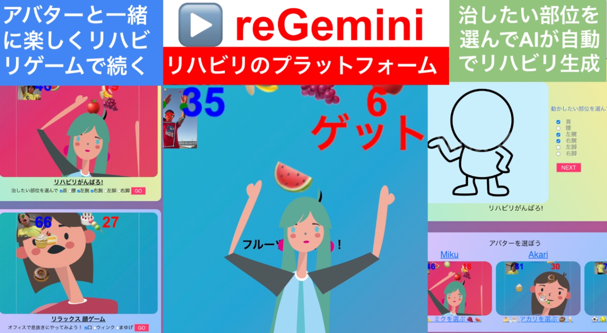
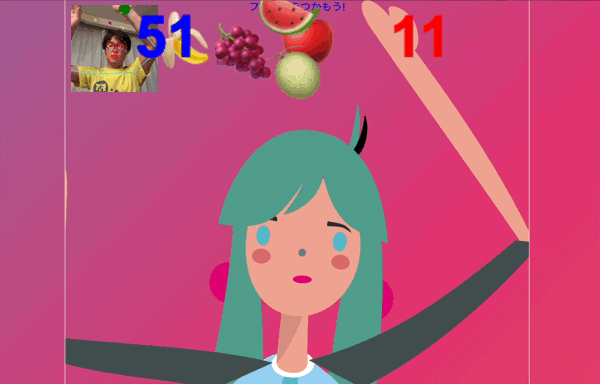
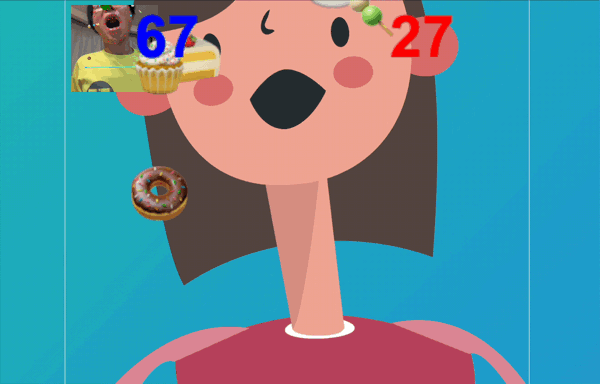
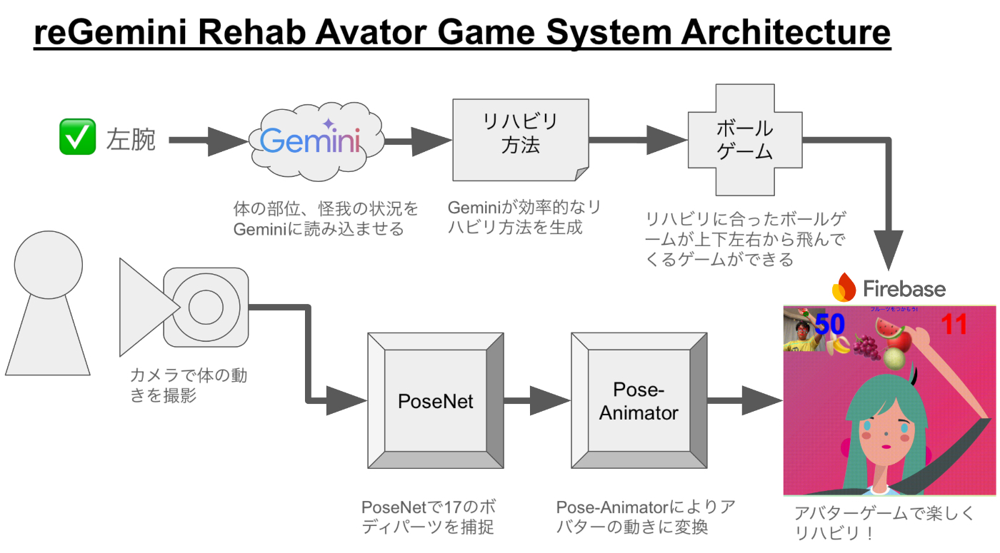

#  ReGemini - Rehab Gemini Projectとは

###  Rehab Geminiは、リハビリをGeminiで生成して、双子キャラのアバターと一緒にやってもらう事で、モチベーション高く、リハビリを続ける事ができるアプリ

  * つまらないリハビリを、双子のようなアバターが一緒にやってくれるWebアプリ
  * 治したい部位を選ぶと、Gemini AIが自動でリハビリ方法を指南
  * リハビリに応じて上下左右からボールが降ってくるゲームになり、楽しくリハビリできる
  * リハビリだけでなく、筋トレやダンスなど、体を使った運動支援プラットフォームに！

#  i. ReGemini Project Details:

##  ReGeminiが対象とするユーザー像

  * 怪我をした人、骨折した人
  * リハビリが必要な人
  * 理学療法士などのリハビリに関わる方
  * リハビリを介助する近親者、友達など
  * 筋トレ、ダンスなど体に関する事に興味ある人

##  ReGeminiが解決する課題、ソリューション、特徴

###  解決すべき課題

骨折などで怪我をした際、そこから回復の為にリハビリが必要ですが、以下のような課題があります。

  * リハビリ内容を伝えられても、その後正確に実施する事ができない（再現性の問題）
  * 説明直後はできたとしても、その後継続的にする事ができない（覚えられない）
  * 継続的に行う必要があっても、続ける事ができない（継続の難しさ）
  * 単調な作業が多い為、飽きてしまい続けられない（単純作業による飽き）
  * 怪我、入院中の生活が平板で、楽しくリハビリをできない（モチベーションを維持できない）
  * 目標が見えず、やる気がわかない（ゴールが見えず、継続実施が困難）
  * 自分の症状に対して、ベストなリハビリが分からない（適性の問題）
  * 療法士などの不足によるリハビリ指導の難しさ（人材不足）

###  課題へのソリューション

アバターアプリReGeminiにより解決:

  * スマホだけでできる気軽なリハビリ・アプリ
  * アバターの動きを真似る事で、自然にリハビリ
  * スマホカメラから、PoseNetで体の動きをトラッキング
  * 好きなアバターを選ぶことでモチベーションアップ（孫に似たキャラと一緒にやる等）
  * 上下左右から降ってくるボールなどを取るゲーム性により楽しく続けられる（ゲーミフィケーション）
  * 対処する部位を選んでリハビリをカスタマイズ
  * 選んだ部位からAIが自動的にリハビリ方法を指南
  * リハビリ以外にも筋トレ、ダンス、顔トレなどにも対応
  * 理想的な動画をアップする事により、それを真似たリハビリ、動きを提供

###  アプリの特徴と機能

ReGemini アプリはこんな事ができます

  * PoseNet: 体の17個の部位と顔パーツをカメラで読み取り、位置を取得
  * Pose-Animator: PoseNetの部位をSVGのアニメーションに連動させ、リアルタイムの動きを生成
  * Gaming: 上下左右からオブジェクトを動かし、PoseNetパーツとの当たり判定でゲームを作る
  * AI: 体部位とアクティビティVertex Geminiに与え、それに適したリハビリ、運動方法を自動生成

ReGeminiの特徴と機能 | ReGemini Screen  
---|---  
**\- Webから Rehab.Ktrips.net にアクセス  
\- 画面からアバターを選ぶ  
\- リハビリしたい部位を選ぶ  
\- AIリハビリを押す  
やりたい内容、部位からGeminiが自動的にリハビリ方法を生成し、表示  
\- 動かす部位の位置を赤丸🔴で、PoseNetが認識、追随  
\- 上下左右からボールなどが落ちてくるので、赤丸🔴部位でそれをキャッチ  
\- 1ゲーム60秒で何点取れるのか、楽しく遊んでリハビリ  
\- 結果が残り、毎日続ける事で、継続的なリハビリをキープできる** |     
Use Cases | reGemini at Hospital  
---|---  
**様々な運動、ユースケースに対応:**  
  
**1.リハビリ:** 怪我した部位を選んでアバターとリハビリ  
**2.筋トレ:** 鍛えたい所を選んで腹筋、背筋  
**3.PoseWatch** を付ければ、心拍や運動の強度を  
結果に反映。当たり判定結果を、バイブでフィードバック  
**4.ビデオ** をアップロードすると、その動きをPoseNetに取り込む。  
ビデオと自分の動きが一致するかを判定して、ヨガやダンスの練習に使えるように！  
**5.毎日続けられるかチャレンジ** ゴール設定（東海道五十三次等）により長く続けられる仕組みづくり |   
  
#  ii. System Architecture システム アーキテクチャ

##  アプリの使い方

Rehab Geminiの簡単な使い方:

  1. スマホ又はウェブから Rehab.Ktrips.net にアクセス
  2. 画面から好きなアバターとどこをリハビリしたいかを選ぶ
  3. 例えば、ミクちゃんで、左腕の運動したければ、そこをチェックして、"AIリハビリ"を押す
  4. その情報から、AI Geminiが最適なリハビリ方法を生成し、画面に表示
  5. その情報に基づいて、ボールやケーキなどが上下左右から飛んでくる
  6. 運動したい部位が赤丸（🔴）で表示されるので、その部分を使ってボールなどを取る
  7. 得点が加算され、運動のモチベーションアップ！
  8. 様々なリハビリに活用できる
  9. リハビリ以外にも、筋トレやダンスなどにも対応

User > Select body parts > Vertex Gemini creates rehab methods  
PoseNet produces body-detect camera games > Camera detects body movements and let's do rehab with fun!

#  iii. Project Video 動画

<https://youtu.be/TBn1nA0gwJg?si=ayvW_nKVBPYV1IyT>  
[リハビリアプリ動画]

#  Products with Google Platform and APIs

Google Products | Optional Products/OSS  
---|---  
**1\. Google Cloud AI Products**  
\- [x] Gemini API in Vertex AI  
\- [x] Vertex Platform |  **3\. Optional products**  
\- [x] Google Firebase  
  
  
**2\. Cloud Compute Products**  
\- [x] Google App Engine  
  
|  **4\. OSS products**  
\- [x] PoseNet  
\- [x] Pose-Animator  
  
##  Github and App

  * **Github** \- <https://github.com/ktrips/rehab>
  * **Tech Blog** \- <http://blog.ktrips.net/rehab>
  * **App** \- Rehab.Ktrips.net

#  Background

開発に至った背景：  
**2024/3月** マウンテンバイクで落ちて左腕をヒドく骨折して1ヶ月入院  
**2024/4月** リハビリを1年くらいやらなきゃ治らない、、、でもつまらない  
娘がお見舞いに来てくれて、一度だけ一緒にリハビリしてくれた！楽しかった！一緒にやってくれる人がいれば続けられる、ゴールがあればやる気になる！  
**2024/9月** この想いを元に、Raspberry Piでリハビリデバイス作った！MakerFaire Tokyo 2024に出展！  
MakerFaire会場で、スマホだけの方がどこでも出来て便利との声。リハビリだけじゃなく、筋トレやダンスにも使いたいとも >> スマホのWebアプリ reGemini.Ktrips.net に！  
**2024/10月** やっぱりハードが好きなので、PoseWatchを作成し、心拍数と運動強度との連動、当たり判定からのフィードバックを実現  
ビデオアップロードから、ヨガやダンスの動きを真似る事により、ポーズのプラットフォーム化（開発中）  
**2024/12月** 再手術で再入院。めげずに病室でreGeminiリハビリ！  
reGemini at Hospital <https://www.youtube.com/shorts/zGF_8c6UH44>  
**2025/1月** AIエージェントとしてブラッシュアップして、reGeminiに！ ←イマココ!
