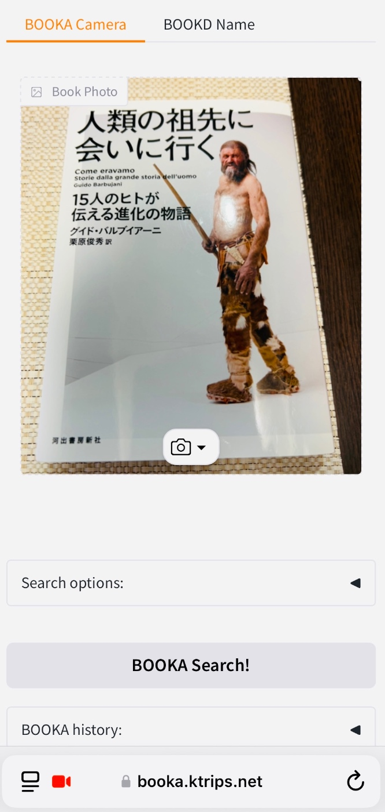
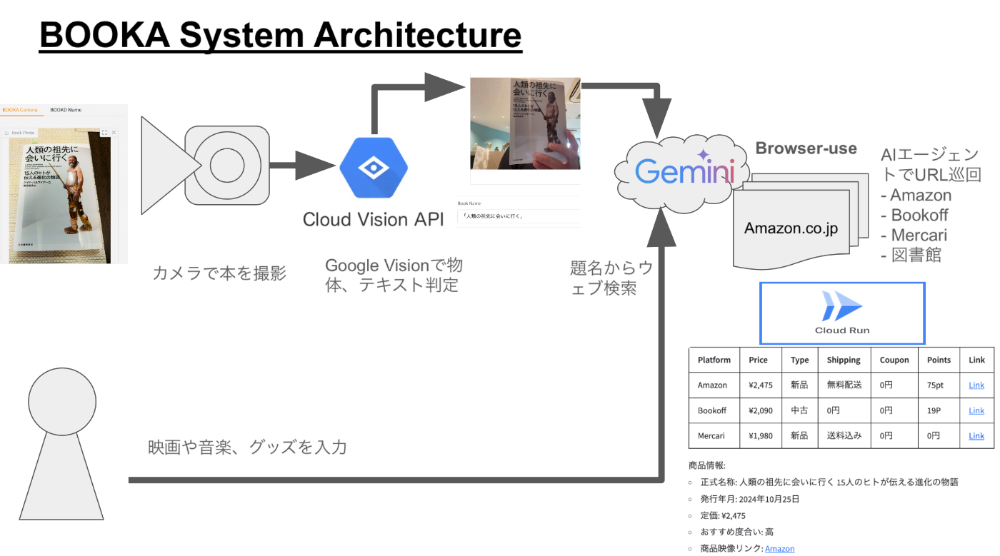
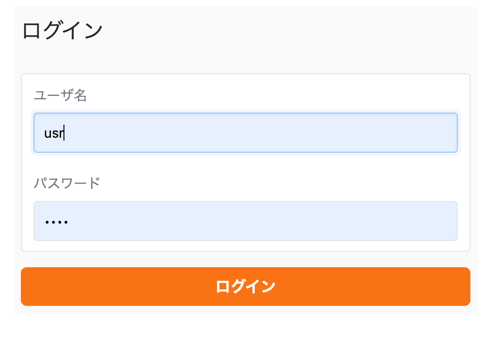
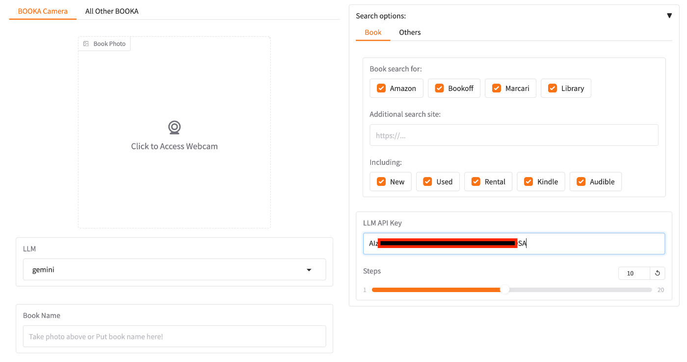
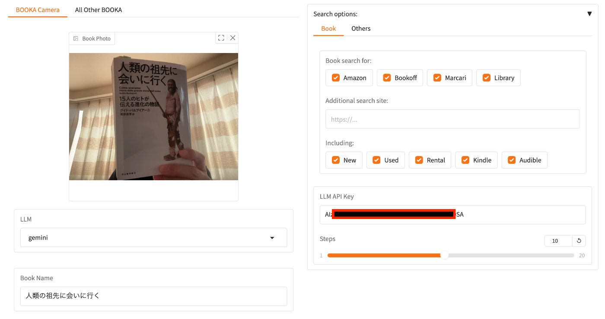
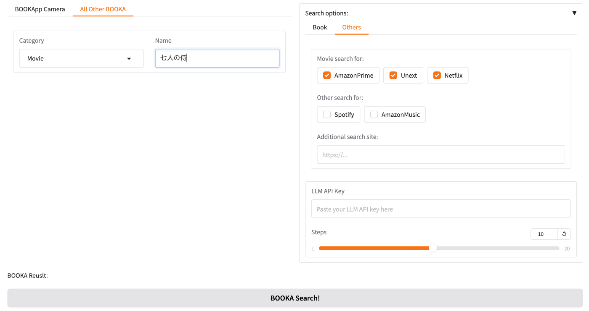
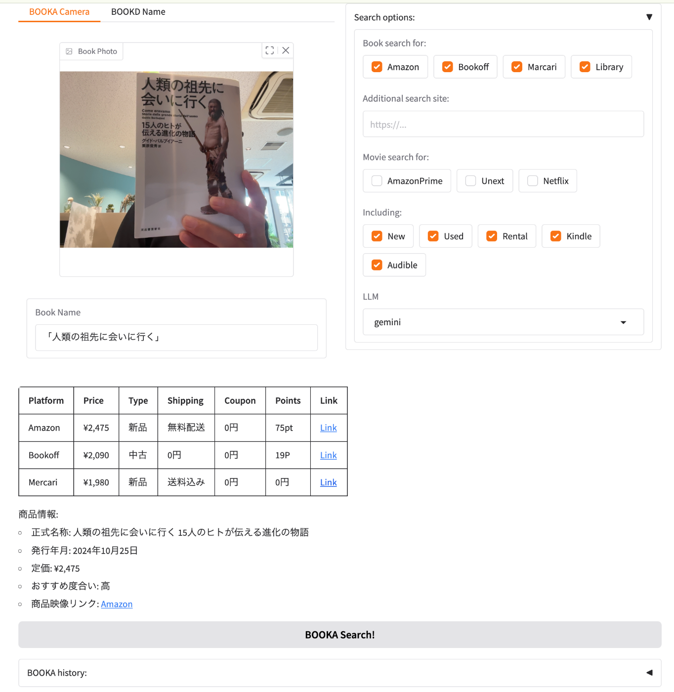

#  BOOKA Projectとは

###  BOOKA(ブッカ)とは、本好きのために、本の写真を撮るだけで記録ができ、お得に本を手に入れ、読書記録を残せるAIエージェント・アプリ！

  * BOOKA（ブッカ）は、本好きのために、なるべくお得に本を見つけるWebアプリ
  * カメラで本の表紙を撮るだけで、本のお勧め情報と最低価格をチェック
  * その他、映画、音楽などのブッカもチェックできます

#  i. BOOKA Project Detail:

##  BOOKAが対象とするユーザー像

  * 読書が好きな人
  * 読む本を探している人
  * 本をお得に取得したい人
  * 読書記録、感想などを残したい人
  * その他のもの（映画や音楽など）もなるべくお得に手に入れたいと思っている人

##  BOOKAが解決する課題、ソリューション、特徴

###  解決すべき課題

読書が好きで、いつもいい本が手に入れられないかなあと思っている私には、こんな課題がありました。

  * どこから買うと一番お得か調べるのに面倒くさい（お得第一！）
  * いい本を見つけた時（本屋、ウェブ、人から聞いた話など）、それを記録しておきたい（ついつい忘れてしまう）
  * いい本を見つけたい（セレンディピティ）
  * 何を読んだか忘れてしまう、記録に残したい（読書記録）
  * 映画や音楽なども同様に、メモ、お得価格、記録を残したい（その他のメディア、エンタメ）
  * 趣味の幅を広げたい
  * インスピレーションを得たい
  * 視野を広げたい
  * 直感からそこに何があるかを把握したい

##  課題へのソリューション

BOOKA（ブッカ）アプリにより解決できる事:

  * 本の写真を撮るだけで、その本のサマリー、オススメ度合い、価格が分かる
  * その本がどこで買うと一番お得か分かる（アマゾン、メルカリ、ブックオフ等）
  * 写真を撮って記録を残せる、読書ノートになる
  * 検索記録から、お勧め本の情報を得る（リコメンデーション）
  * 本の正式名称が分からなくても、一部でその本を探し当てる、必要情報を得る
  * 定期的に巡回し、最新の価格を取得
  * 本以外にも映画や音楽などにも適用
  * 新品を買う、中古、レンタル、電子版、図書館、オーディオブックなど、その人にとって最適の形式を表示
  * スマホでできる手軽さ
  * クラウドにデータを残し、どこからでもアクセス、チェック、更新できる

##  アプリの特徴と機能

###  BOOKA Functionality:

  * Cloud Run上にデプロイされたウェブ・アプリ（BOOKA.Ktrips.net）
  * ログイン、セキュリティ機能
  * カメラにより本の名称をVision取得
  * 複数のLLMモデル（Gemini、ChatGPT、Claude）を選択可能
  * 本の名前の一部でもあいまい検索できる
  * ウェブ巡回し、本のサマリー、オススメ度合いと、本の価格の比較が表になって表示
  * 結果が“BOOKA History”に残って、いつでもチェック可能
  * 本以外にも、映画や音楽、その他グッズの価格チェックも可能

###  BOOKA Options:

  * "Search Options"を開き、LLM API Keyに選んだLLMのAPI Keyを貼り付ける。Stepsを増やすと多くのサイトを巡回する事ができる（最大20 Step）
  * 既に本の名前が分かっていたら、Book Nameに本の名前を入れる（一部可）
  * "All Other BOOKA"タブから、映画や音楽、その他の価格をチェックできる
  * "Search Options"に、巡回したいURLを入れる事により、その他のサイトも巡回できる

###  BOOKA Search Sites

**事前登録済みのサービス：**  
**Book**

  * Amazon - <https://amazon.co.jp>
  * Bookoff - <https://shopping.bookoff.co.jp/search>
  * Marcari - <https://jp.mercari.com/>
  * Rakuten - <https://rakuten.co.jp/>
  * Library - <https://setagayaliv.or.jp/>

**Movie**

  * AmazonPrime - [https://www.amazon.co.jp/gp/video/storefront/ref=atv_hm_hom_legacy_redirect?contentId=IncludedwithPrime&contentType=merch&merchId=IncludedwithPrime](https://www.amazon.co.jp/gp/video/storefront/ref=atv_hm_hom_legacy_redirect?contentId=IncludedwithPrime&contentType=merch&merchId=IncludedwithPrime)
  * Unext - <https://video.unext.jp/>
  * Netflix - <https://netflix.com/>

**Music**

  * Spotify - <https://spotify.com>
  * AmazonMusic - <https://music.amazon.co.jp/>

**Other Goods**

  * Amazon - <https://amazon.co.jp>
  * Rakuten - <https://rakuten.co.jp/>

#  ii. BOOKA System Architecture システム アーキテクチャ

##  アプリの使い方

BOOKAアプリの使用ステップ | BOOKAアプリ・スクリーン  
---|---  
**1\. スマホかウェブから、BOOKA.Ktrips.net にアクセス  
  
2\. ログイン画面で、ユーザーは usr、パスワードは事前に取得したものを入力** |   
**3\. BOOKA Camera画面が出たら、Webcamボタンから写真を撮影  
  
4\. カメラボタンを押して、写真を保存** |   
**5\. AIが自動で本の名称を取得  
  
6\. LLMモデルを、Gemini、ChatGPT、Claudeから選択  
  
7\. "Search Options"からLLM Keyに、モデルのAPI Keyを入力** |   
**8\. 本の名前が取得したら、“BOOKA Search!”を押して、価格を巡回  
  
9\. 本の名前の一部が分かっていたら、直接Book Nameに入れて、検索  
10\. （巡回が終わるまで1,2分待ちます）** |   
**11\. 巡回が終わると、本のサマリー、オススメ度合いと、本の価格の比較が表になって表示される  
  
12\. 結果が“BOOKA History”に残って、いつでもチェック可能** |   
  
#  iii. Project Video 動画

<https://youtu.be/uAXQVojHjS0>  
[BOOKA Movie]

#  Products with Google Platform and APIs

  * Google Cloud Run
  * Gemini API in Vertex AI
  * Google Vision API
  * (OSS) Gradio
  * (OSS) browser-use

##  Github and App

  * **Github** \- <https://github.com/ktrips/booka>
  * **Tech Blog** \- <http://blog.ktrips.net/booka>
  * **App** \- BOOKA.Ktrips.net

#  Background

BOOKAの開発に至った背景：

  * 週に２、3回は本屋を巡って、いい本がないか探しています
  * 本を撮って、次に読みたいリストを作っているのですが、その価格チェックを自動でできないか考えていました
  * 毎回AmazonのKindleやメルカリ、ブックオフをチェックするのがめんどくさいので、それをGeminiのAI Agentで一発解決！
  * 買いたいものリスト、読書記録にもなって便利！
  * 本のアプリ Book Appだが、その他の物価（ブッカ）も調べられるよう、映画や音楽、グッズなどに応用
  * アプリ、Webサービスとして展開できないかプロジェクト進行中  

###  BOOKA - AI Agent by Gemini
