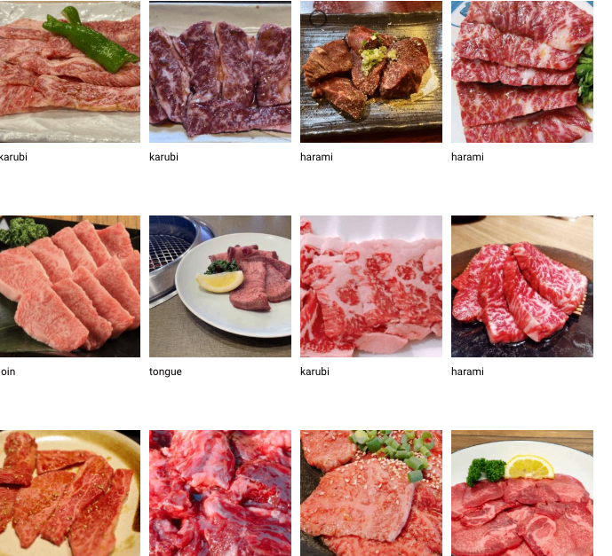
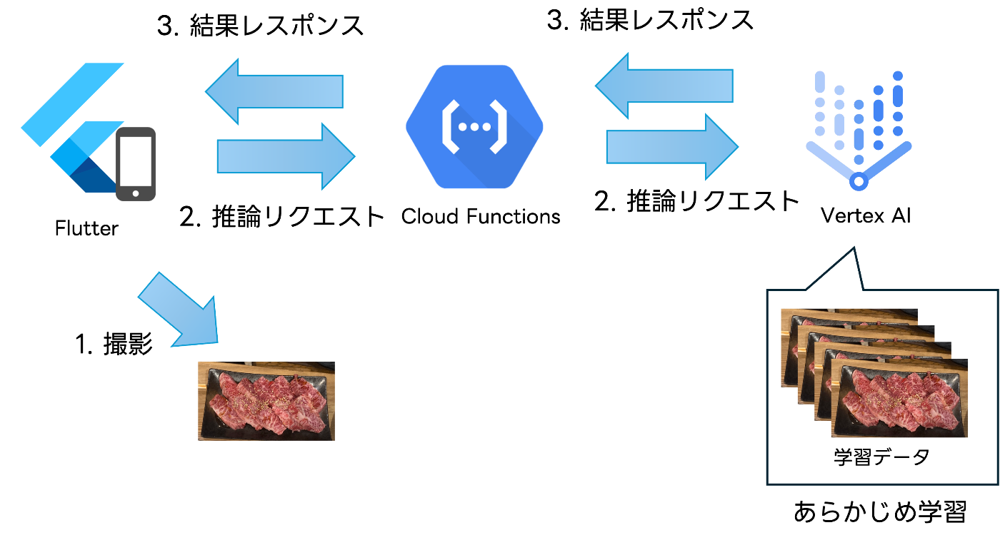

##  概要

焼き肉に行ったときに頼んだお肉を色々持ってきてもらって、「あれこれ何の肉だっけ？」と思うことがよくあります。そんな時にその焼き肉を見て、なんの肉か判定してくれるスマホアプリを作ってみました。

###  デモ

ある日の焼肉屋に行った時に撮影したハラミの画像を読み込ませてみました。すると、正解を当ててくれました。

<https://x.com/kure/status/1888946694639038804>

##  作ったもの

iPhoneアプリ(Flutter)として開発しています。カメラで撮影、もしくは、ギャラリーから既存の画像を読み込み、分類ボタンを押下すると、焼き肉の種類の判定結果を返してくれます。

##  仕組み・作り方

焼き肉の画像分類にはGoogleのVertex AIを用いました。  
肉の分類は、カルビ、ハラミ、ロース、タンの4種類としました。  
トレーニングデータは主に[写真AC](https://premium.photo-ac.com/)の素材と自分で撮影した画像を用いました。アップしてそれぞれにラベルを付けていきます。

Vertex AIの推奨としては1ラベルにつき、1,000データのようですが、今回は1ラベルにつき20弱程度のデータとなっています。（最低が1ラベルにつき10データ）

Vertex AI でのエンドポイントとのやり取りは公式のSDKが提供されているPython（Cloud Functions）で実装しました。フロントエンドはFlutterで実装し、Cloud FunctionsをHTTPでトリガーする形としました。

構成としては以下のようなイメージです。

##  結果

学習に使わなかった手元の撮影画像等を使って、判定を試しました。

6枚試したところ、結果は、、

3勝3敗でした。

うーむ、どの肉も画像が似通ってますし（人間が見ても分かりづらいくらい。だからこそ今回チャレンジしてみたわけですしね）、やはり推奨通り、画像データがまだまだ必要ということですね。

##  感想

AI（画像分類）の知識はほぼゼロでしたが、Vertex AIがすべてよしなに学習から分類まで行ってくれるので簡単に分類モデルを作ることができました。また、デプロイしてエンドポイントまで作ってくれるのもありがたかったです。

精度的にはやはりデータが命なので、今後はもっと大量かつ正確なデータを学習させていきたいところです。学習データの調達がネックなのですが、これの取り組みを理由に焼肉屋に通って、お肉を撮影していくことをライフワークにしたいと思います😏
