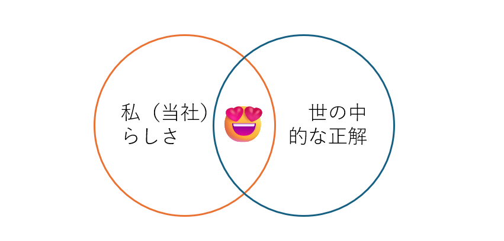
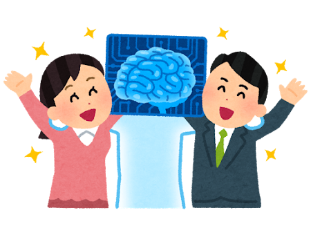
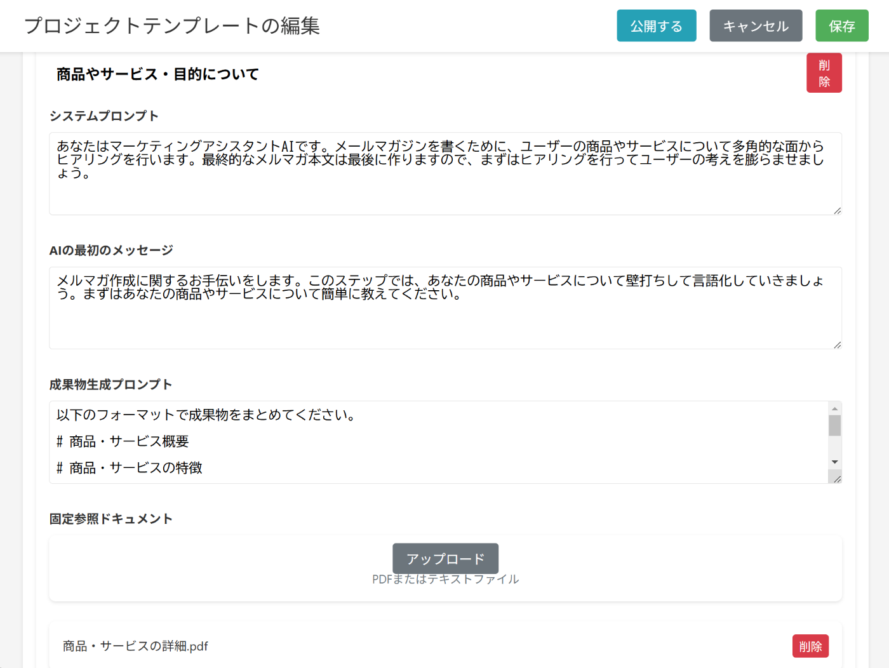
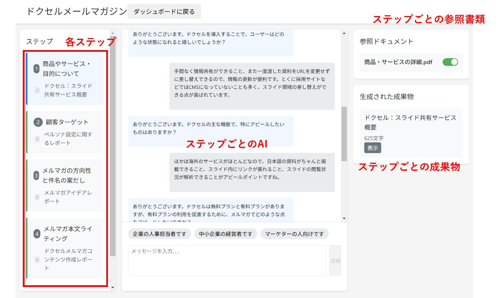
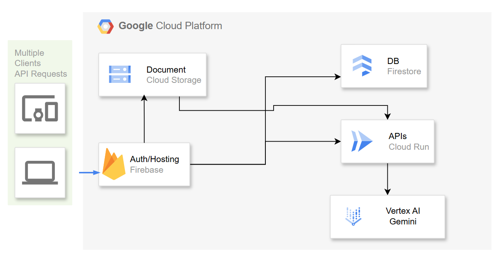

この記事は[AI Agent Hackathon with Google Cloud](https://zenn.dev/hackathons/2024-google-cloud-japan-ai-hackathon) の応募記事です。

さてみなさん、AIエージェントと聞いてどのようなものを期待しますか？私の仕事を代わりにやってくれたり、コンシェルジュみたいにレストランを予約してくれたり。夢のようですよね。私もそうでした。**実際にAIを仕事で活用するまでは** ・・・

#  AI君が出してくれる正解は私にとっての正解じゃないんだよ

毎日毎日AIのニュースがつぶやかれていて、ちょっと食傷気味ですよね。しかも、SNSで紹介されている実例を見ると、たしかに「AIの技術デモとしてはすごい」かもしれないんですがイマイチ自分が使うところが想像できないものが多くないですか？

今どの会社も人不足なので、やったことない仕事にチャレンジする機会が多いと思うのですが、AIにサポートしてもらおうと思っても、**なかなか「コレジャナイ」アウトプットが出ることが多い** のではないでしょうか。

たとえば、初めてメルマガを書こうと思って「いけてるメルマガを書いて」とか「新商品の良さを伝えるメルマガを書いて」などと指示をだしても、まったく仕事でつかえる気配のない、外国のメルマガサンプルを翻訳したような謎の文面が出てきたりしますよね。**たしかに理路整然としてて「いい感じ」感を出してるんだけど、私にとっては全然いい感じじゃないんだよ！と**

本当は当社の顧客をターゲットにして資料請求したくなるような、お困りごとに共感してもらったりその解決策を提示したりするメルマガが書きたいのに、そういうのは出力してくれない。

##  プロンプトエンジニアリングって本当に人類がやるべきことですか？

そういう不満を抱えてると、世の中のAIのすごい人たちはこう言います。「**AIにちゃんと指示を出さないとだめだよ** 」「**プロンプトはこう書くと効果的ですよ！** 」紹介されてる画面を見てみると、何十行ものプロンプトが書かれていました。

いや、こんだけ書けるならもうメルマガ書いたらええやん・・

AIを使える人類になるためには、AIに伝わるように業務マニュアルを作る必要があるみたいです。これって本当に人類の仕事ですかね？なんか頭がいい人たちだけでワイワイやってませんか？

百歩譲ってプロンプトを書くようにしましょう。メルマガを書いたことがない私が、AIを頼りたい私がAI向けに業務マニュアルを作ったとしましょう。本当にいい出力になりますかね。

##  ○○に詳しくない私が、AIが作った××を信じていいですか？

この「**私が知らない○○をAIとともに作る** 」問題は他にもあります。出てきたものの良しあしがわからないんです。メルマガくらいなら何となくわかりますが、利用規約だったらどうしましょう。

AI君はご丁寧に「**専門家に必ずレビューしてもらってください** 」といいます。じゃあ、AI君の仕事は何なんですか？結局専門家に聞くんだったら最初っから専門家に依頼したほうがよかったかもしれないですね。

法律じゃなくても翻訳だってそう。英語がぜんぜん分からない私が、海外向けにランディングページの英訳を任されたとして、いままでみたいに翻訳会社に頼んだらプロの意見をもらいながら進められたけど、AIは私がインプットした範囲でしか答えてくれないですよね。

#  もっと人間を、プロの仕事を大事にしてほしい！

AIって、もっと人間の役に立つものじゃないですか？**普通の人が普通に使って幸せになるもの** であってほしい。あとついでに言うとプロの仕事が簡単にできますよみたいな風を装わないでほしい。

そこで、The AI agent for the rest of us、**普通の人のためのちゃんと仕事でつかえるAIエージェントを作ってみました** 。

##  専門家が作った特化AIエージェントで仕事につかえる成果を生み出す

ようは、AIだけじゃなくて、**ユーザー、専門家、AIの３者が協働できるエージェント** です。たとえばメルマガ作成なら、マーケティングコンサルの人が自社商品の分析、ターゲットやペルソナ作成、KPI設計などの「仕事としてやるべきステップ」を定義して、エージェントAIを作り上げていきます。

  1. 専門家が長文プロンプトのかわりに、最終的に作りたいものを各ステップに作業分解する  

  2. 各ステップ専門のAIが出来上がり、ステップ間の連携ができる

  3. 最初は専門家自体がチャットの入力も全部やる。  

デモ動画をご覧ください。  
<https://www.youtube.com/watch?v=l4yGvmtDFco>

長文のプロンプトを作り上げるのは難しいけど、これなら適切にAIの能力をバンバン引き出して仕事でつかえるレベルのものを仕上げてくれます。

##  最初は専門家が操作してあげることでペアプロのような効果が出る

このツールのポイントは、作ったAIエージェントを、**まずは専門家が** ユーザーと対話しながら、AIと会話していきます。「ku-sukeさん、今回の新商品ってどういうやつなんですか？」「それっていままでのとどう違うんですか？」「ターゲットはじゃあスタートアップですかね、あーエンプラもですか」みたいな感じで雑談しながら自分でつくったAIに打ち込んでいきます。

それを横で見ているユーザーは、**ペアプロのようにこのAIをどう使えばいいかを学ぶことができます** 。まずは２回くらい通しで専門家と話しながらやってもらい、次の２回は専門家は横で見ているだけでユーザー自身が打ち込んで成果物を作り、そのあとはユーザーが一人で・・となります。

##  ユーザーもAIも成長できる「ダブル学習ループ」

**成長するのはユーザーだけではありません** 。AIも過去の成果物を読ませることにより、より少ない指示で「いつも通り」の成果を出すことができるようになります。これは単純にプロンプトにテキストを食わせているだけですが、Geminiは入力トークン数が大きくて安いので、より「私（たち）の正解」に近づけるよう成長することができるのです。

  * 人不足や時代の変化で不慣れなorやった事のない仕事を任される機会は増えている。
  * いままでは各分野のコンサルに支援してもらっていたがコストなど課題も多い。
  * AIをそのまま使うのは、AIのプロでないと使いこなせない課題がある。

このような中で、単純なツールではなく、AIも学習、人間も学習しながら相互に品質を上げていける、「ダブル学習ループ」を形成していけるのです。

##  専門家の立場も脅かさない、社内ノウハウの継承にも

よくAIが専門家を失業させるとかいう話題もありますが、このエージェントはAIの弱点を専門家が補うことでユーザーと専門家が最小の工数で成果を出すことができます。専門家側は少ない工数でコンサルティングを提供することができ、ユーザーは安価にコンサルティングを受けることができるようになります。

なお、専門家のノウハウは顧客との契約によりプロンプトを一部隠すこともできるため、ノウハウだけ提供して契約を切られるということもなく、定期的な品質チェックや新しい「型」を生み出すなど、メンテナンスで引き続き収入を得ることができますし、工数が圧倒的に削減されるので多くの顧客と契約することができます。

ちなみに、お気づきの人もいるかもしれませんが、これはコンサルのような専門家だけでなく、**社内の少数のベテランが、若手にノウハウを教えるときにも使えます** 。出版社の方にこの話をしたところ、「例えばベテランの書籍編集がこの仕組みを作って広告営業に教えれば、営業が編集AIを使って企画記事のたたき台を作れそうですね！」といっていました。

###  余談：GPTsと何が違うの？

カスタムプロンプトで成果物を作るって、なんかGPTsとかで見たような・・と思われるかもしれません。大きなポイントとしては２つあって、「私にとっての正解」と書いた通り、ユーザー組織ごとにワークスペースを発行することで、おなじプロンプト集を使っても蓄積する情報の違いでユーザーごとのアウトプットが出せるようになること。  
もう一つは専門家や職場のベテランがまずは書いて、そのチャット履歴を共有することで、思考の過程を共有してペアプロのような学習効果を出せることです。

#  システムについて

名前は「**Tuned AI** 」ちゅーんどAIです。驚き屋さん風に言うと「○○式AI」みたいなかんじで tanaka.tuned-ai（田中チューンドAI） / sato.tuned-ai（佐藤チューンドAI）みたいな感じを想定しています。

構成としてはシンプルです。基本的なWebアプリケーションをFirebase auth/hosting, firestoreで使い、ファイルの解析とAIチャット部分をCloudRunで実装しました。AIからのストリーミングレスポンスもCloudRunのHTTP/2 SSEで実装してみました。

今回はPoCなのでファイルの解析を簡易的にNodeJSでパースしましたが、画像などを扱う際はマルチモーダルで実装するほうがよさそうです。プロジェクトごとに20GB制限があるので、たくさんのユーザーが使う場合は想定していないのかもしれません。  
このシステムはパブリック版とは別に企業内にインストールして使うような使い方も考えているので、その場合は20GBで十分活用できるでしょう。

##  Geminiを使うときの工夫

今回はGeminiのFlash 2.0をメインで活用しましたが、下記の回答を生成する部分ではOutputの長さをあえて短く制限することで、ユーザー体験と出力の質をコントロールしてみました。やはりGeminiのいいところは速度とコンテキスト長で、**とにかく情報をぶっこめばいい** 。というのは開発していて使いやすかったです。

まえのステップの生成物も引き継いで次のステップに生かすというのは、コンテキスト長に余裕のあるGeminiを普段使いしていて発想に至ったポイントです。

##  AI時代のUXの工夫について

前述したように、AIを普通の人が使うときの課題は、やりたいことを事細かに言語化しなければならないということです。そこで、このツールでは２つの支援を提供しています。

ひとつ目は、たたき台機能です。本当はAIとの会話を通じて各ステップの成果物をつくりあげていくのですが、まったく思いつかないことってありますよね。そんなときのためにAIで事前に成果物の例を提示させています。

もう一つは、各やり取りの質問事項が思いつかない場合に、回答例を出力するようにしました。たとえば、ターゲットペルソナはどんな人ですか？と聞かれても思いつかないですよね。そこで「若手の女性企画職です」とかそういう回答サンプルを出力します。

人間は「ランチ何食べたい？」と聞かれるより「チキン南蛮」「インドカレー」「寿司」のなかで食べたいものある？のように聞かれた方がまだイメージがわいて答えやすいのです。

#  まとめ

AIの性能は毎月毎月向上していますが、それでも「私」が置かれている状況を適切に引き出して、正しい成果物として完成するまでには、まだ乗り越えるべきハードルがたくさんあります。が、それはAIの側だけでも人間の側だけでもありません。両者が適切にコラボレーションし、ともに学ぶことでよりよい未来が実現できると私は考えています。そのコンセプトを少しでもこのTuned AIで表現できていればうれしいなと思います。

リポジトリはこちらです！

<https://github.com/ku-suke/tuned-ai-hackathon>

##  今後の展開

プロンプトファイルに書いた通りハッカソンなのでユーザーロールの概念は実装しませんでしたが、本格的に作るのであれば専門家が各自サブドメインをもって自前のAI業務コレクションを公開できたり、ボタンだけ実装していますがAIテンプレートを公開でマーケットプレイスのようなことができるのもいいなと思っています。

また、社内でのベテランからジュニアへのOJT活用を行う場合であれば、このコードを社内にデプロイしてtVertex AI Searchと統合するのがよいとおもいます。

現状ではシンプルなテキストのアウトプットしかできませんが、各種MCPサービスでいろんな表現ができるようになれば、成果物の幅も広がるでしょう。

#  おまけ

##  結局専門家はプロンプトを書かなあかんのかい！

そうです。そうなんですが、この仕組みを使って、「Tuned AIのプロが設計した５つのステップでAIと会話しながらTuned AIの設定項目を仕上げる」というメタいことができます。ようはそういうことです。

##  システムはCLINEで書きました

今回のシステムはCLINEというコーディングエージェントを使って95%くらいのコードを書きました。そのエージェントへの指示文をcline_prompt.mdに入れこんでいるので、興味がある方は覗いてみてください（途中の返信など細かい指示は省いていますのであくまで雰囲気を見てください）。初めて使ったので設定をあまりしておらず素の状態で使っていましたが、それでも十分な性能が出ました。「**正解をわかっている私** 」が「**事細かにプロンプトを書く** 」条件下においては、巷のAIエージェントも十分素晴らしいものだと感じました。
