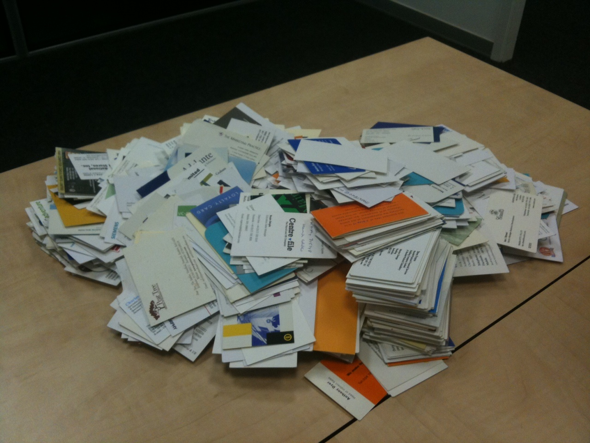
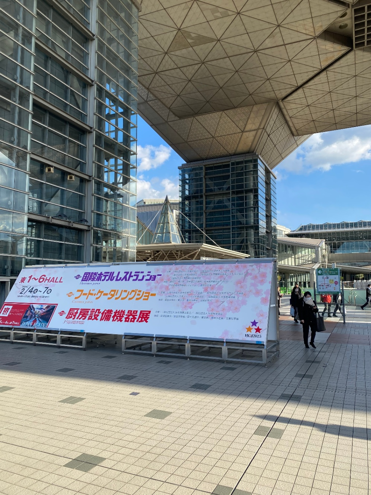
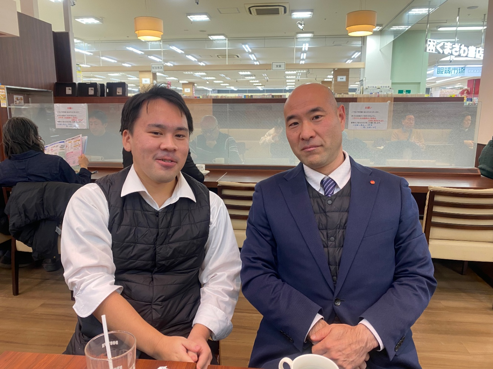
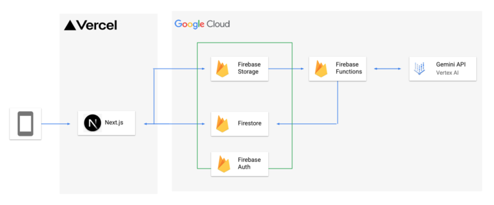
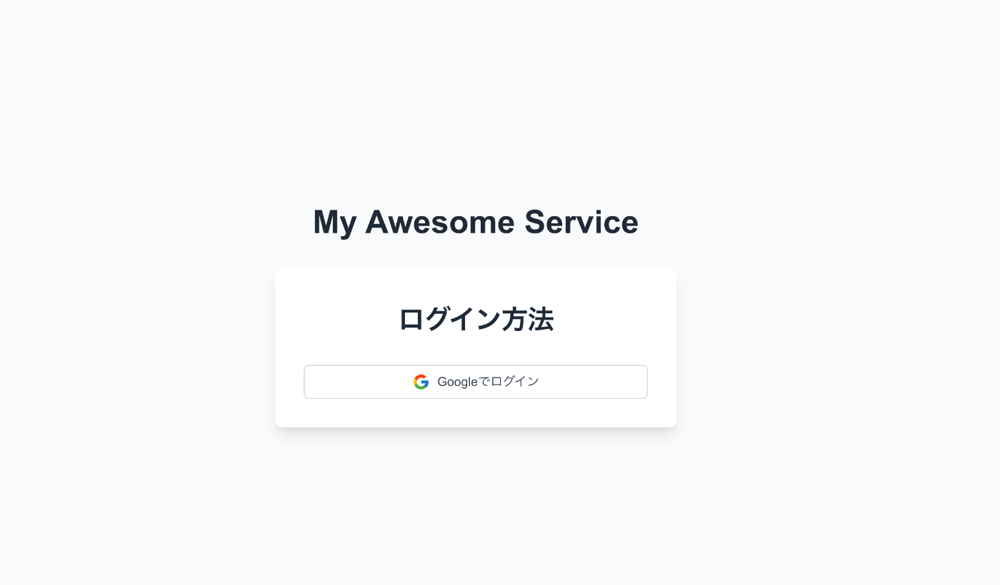
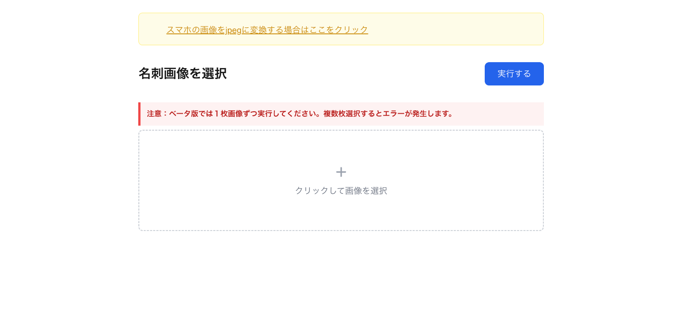
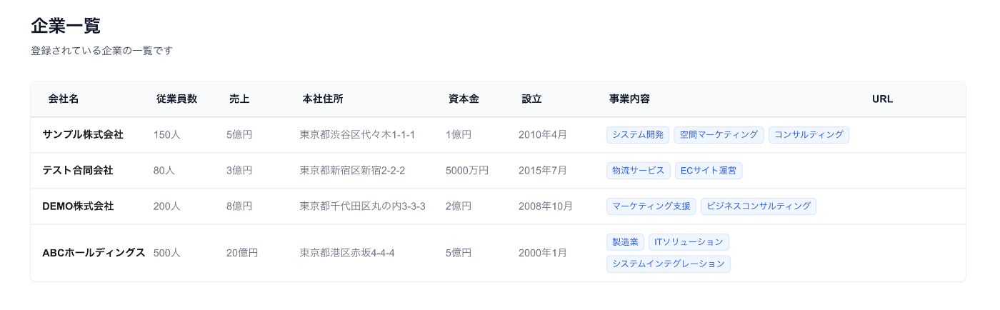
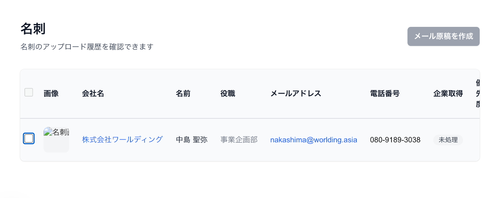

#  はじめに

展示会や勉強会、営業などで名刺整理が全くできていない人も少なくないのではないでしょうか?  
名刺交換をした直後に本当はメールを送信して、フォローアップしたいのに読み込み+メールの作成が面倒。。。  
  
僕もこの1年間でたくさんの名刺を交換してきましたが、データベース管理を怠っていたため、非常に苦労をしていました。名刺管理の効率化と連絡可能な企業の情報管理はビジネスを成功に導くための重要な要素になるので、今回紹介するアプリを作成しました。  
そして協力いただける企業様を探し、実際の費用対効果の検証までを対象としてプロジェクトを進行することにしました。

#  開発背景と課題

##  課題1. 展示会での名刺管理の課題

展示会に出店者として参加した後に「展示会終了後の大量の名刺管理とフォローアップ問題」に直面しました。  
展示会での名刺交換は1日あたり50枚 ~ 100枚ほどの名刺交換が発生してしまい、展示会終了後、フォローアップの優先順位づけは属人的な作業になってしまうことが課題だと感じました。  
特にフォローアップの優先順位づけでは、優先度の高い人（購買意欲がある人）は覚えているものの、それ以外の優先順位づけは不明瞭な判断に頼らざるをえない状況でした。  
その結果、将来的な商談機会につながる可能性のある、中程度の興味を示した見込み顧客の発掘が遅れてしまうこと、当初は重要度が低いと判断した企業でも、後から詳細な情報が得られるにつれて評価が覆るケースなどがあり、後からフォローアップの優先順位づけに問題があったと気づくことも課題として感じました。

##  課題2. 効果的なフォローアップの課題

展示会後のフォローアップにおいて、多くの企業はフォーマット化したメールを活用します。しかし、一律のメール送信だけでは効果的なフォローアップにはつながりにくく、いくつかの課題が生じます。

  1. 返信率が低い  
多くの見込み顧客は展示会後に大量のフォローアップメールを受け取るため、テンプレート化されたメールは埋もれやすく、開封すらされないことが多いです。また、関心の高い顧客であっても、画一的なメッセージでは心を動かされず、返信につながらないケースが発生します。
  2. 企業ごとの特性が考慮されていない  
フォーマット化したメールでは、業界や企業ごとの課題・ニーズが十分に反映されていないことが課題です。顧客が抱える具体的な悩みや関心ごとに触れないまま送信されるため、相手にとって「自分ごと」として受け取られにくく、関心を引くことができません。
  3. メッセージの内容が画一的  
フォローアップメールが定型文に依存すると、すべての顧客に対して同じ内容が送られることになり、結果として個別の関係性を築くことが難しくなります。顧客ごとの興味・関心に応じたパーソナライズが不足していると、印象に残らず、競合との差別化も難しくなります。

#  対象とするユーザー像

今回の開発アプリは、以下のようなユーザーを主なターゲットとして開発しました：

  * 名刺管理が下手な人 
    * 名刺を受け取ってから整理するまでに時間がかかる
    * 名刺の山から必要な連絡先を探すのに苦労する
    * 名刺の情報を正確にデジタル化する作業に時間がかかる
  * 展示会出展者 
    * 1日で50枚以上の名刺を受け取る
    * 展示会後のフォローアップに優先順位をつけたい
    * 効率的な営業活動のために名刺情報を活用したい
  * 名刺管理をDB化していないユーザー 
    * エクセルやスプレッドシートで管理している
    * 紙の名刺をファイリングして保管している
    * 既存の名刺管理サービスは機能過多で導入を躊躇している
  * 上記には該当しないが、1日で大量の名刺を交換する方

#  解決策

##  【課題1に対する解決策】 企業情報と名刺情報を利用したスコアリング機能

フォローアップの課題に対する解決策として、「企業のwebサイトを活用した情報」と「名刺から取得できる情報」の2点を用いてスコアリングを行い、効率的なフォローアップの優先順位け機能を作成し、実装を行いました。  
スコアリング方法は、従業員規模、事業内容、売上、資本金、設立年と来場者の肩書をもとに行い、「high」「mid」「low」と評価。  
アプリ利用者は、ここでフォローアップを行う優先度を客観的に分析することができるようになり、営業の期待値がそこそこの来場者に対して効率的にフォローアップを行うことができるようにしました。

##  【課題2に対する解決策】 企業ごとのカスタムメール送信機能

「名刺から取得した情報」「会社ホームページより取得した情報」の2点をもとに企業独自のカスタムメール作成機能を実装。

#  導入検証

2月6日に東京ビックサイトにてベータ版を検証していただける方を探しにいきました。  
  
本アプリを使用することでどのくらいの課題が解決できそうか？株式会社メディング様にご協力いただき、費用対効果の検証、インタビューにご協力いただきました。  

##  名刺入力業務における課題

話を聞かせていただくと、予想通り展示会における名刺管理は営業活動のボトルネックボトルネックになっていることがわかりました。  
**影響活動のボトルネックになっているのは以下2点でした。**

  * 現状は手作業で入力をしており、名刺１枚あたり5分、1日60枚の入力作業で、出店日数3日* 5時間の計15時間をエクセルへの入力作業に要していることが判明しました。
  * 展示会などで、外部スタッフが出展企業の手伝いをするケースがあります。名刺交換の際、手伝ってくれた方が接客した来場者の温度感が分からず、後日のフォローアップに困るケースがある。

##  本アプリで想定顧客の課題を解決できるのか？

実際の検証では1日に交換した約60枚の名刺を読み込んでもらうところまでを行っていただきました。  
以下、本アプリで実装したアプリのフィードバックになります。

###  企業情報と名刺情報を利用したスコアリング機能

スコアリング機能には需要はあるものの、現状のスコアリング算出方法には問題があるとのご意見をいただきました。  
実際の営業トークでは来場者との会話内容などの、名刺や会社サイト以外がフォローアップするかどうかの判断材料になる。  
具体的には大企業でなくとも、顧客の関心度がやや高そうであればフォローアップの対象とするべきである。一方で来場者の肩書がいくら意思決定に影響しそうでも、関心度が皆無であればフォローアップ対象とするべきではない。  
上記の結果から、本アプリで行いたかったスコアリングは問題点があることが判明しました。  
この点はネクストアクションとして、実装していきたいと思います！

###  企業ごとのカスタムメール送信機能

こちらの機能については、一定の費用対効果を実感していただくことができました。特に会社概要の内容を組み込むことで、フォーマット化されたメール感がなくなったと評価いただきました。  
この機能を利用することで、優先度が高い来場者へのフォローアップのみならず、「メールをわざわざ送る必要がない来場者」層へのアプローチも可能と評価いただきました。

###  付随で解決できた課題

名刺の入力業務を完全に自動化することができておりました。  
名刺の入力業務はカメラやスキャンで取り込むだけで自動データ化できるため、少なくとも1枚あたり4分の作業を削減できる効果が確認できました。  
その結果60枚5時間かかっていた入力作業を1時間程度まで削減することができました。また、geminiが読み取りを行なっている間は担当者も他の作業を行うため、実質数分程度で入力作業を完了することができました。

#  技術スタック概要

  * Next.js
  * LangChain / LangGraph / LangSmith
  * Gemini in VertexAI
  * OpenAI
  * Firebase
  * Firebase Authentication
  * Firebase Functions
  * Firebase Storage  

#  アプリの使用方法

  1. 初期画面からログイン 
     * Google認証に対応したログインシステム  

  2. 名刺をアップロード 
     * スマートフォンで撮影
     * PCからアップロード  

  3. 会社概要一覧画面 
     * 自動取得した企業情報の表示
     * 従業員人数、事業内容、売上の表示  

  4. 名刺一覧画面 
     * 優先度順の表示
     * 会社、氏名、肩書き、会社url、メールアドレス、電話番号の表示。  

  5. メール文章作成 
     * テンプレートの活用
     * 企業情報に基づくカスタマイズ

##  デモ動画

<https://youtu.be/NTiGnLDY4pQ>

#  まとめ

ハッカソンのアイデアとして、直近で最も課題に感じていた問題を解決するアプリを開発することができました。  
開発当初から掲げていた「実際の顧客に会いに行く」という目標を達成できた点は大きな収穫でした。一方で、実際のユーザーが抱える課題と提供した解決策との間にギャップがあることも実感し、多くの学びを得る機会となりました。  
今後も開発を継続できるのであれば、現状のシステムでは解決しきれていない、接客時の音声記録をもとにスコアリングを行う機能の実装にも取り組んでいきたいと考えています。  
最後に、本プロジェクトにご協力いただいた株式会社メディングの皆様には、心より感謝申し上げます。貴重なお時間を割いていただき、誠にありがとうございました。
