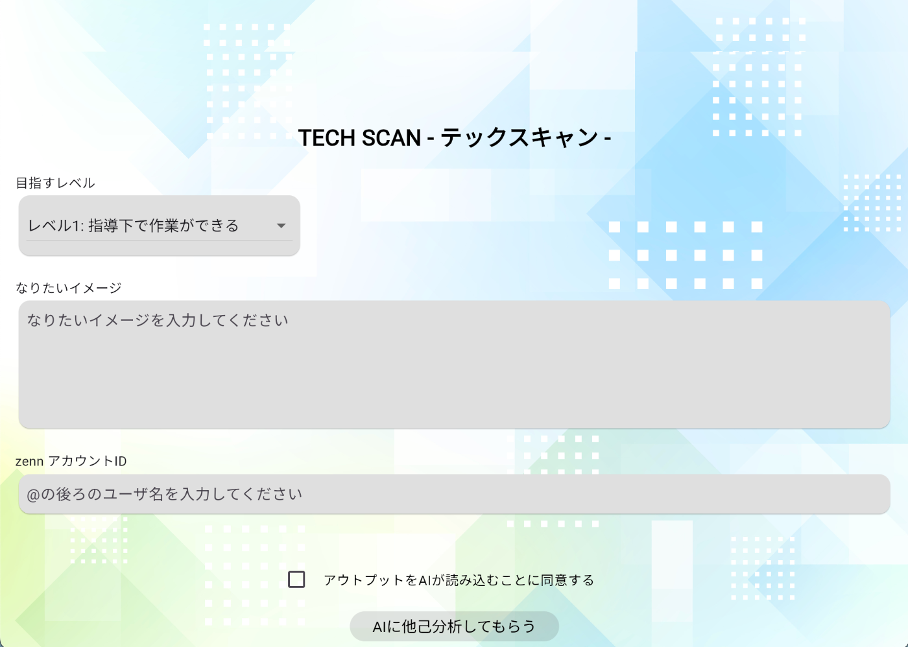
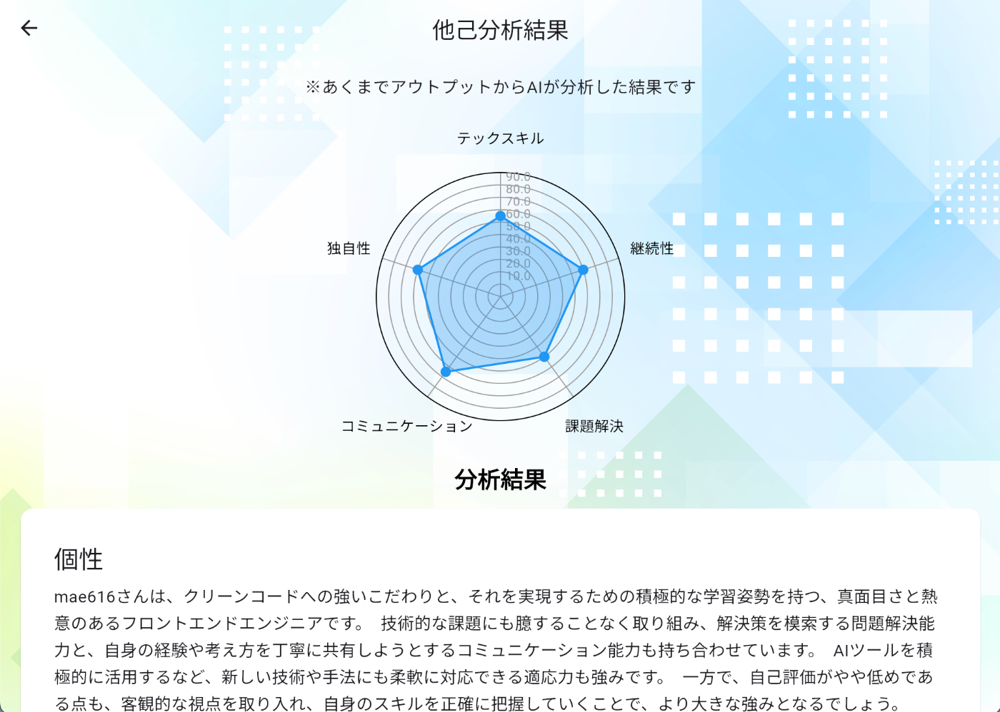
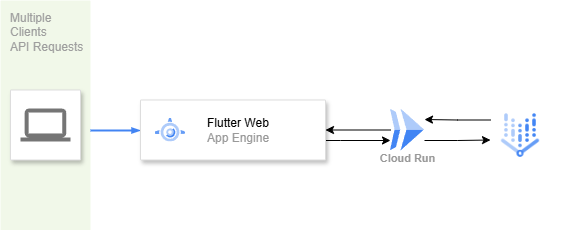

※ この記事は [AI Agent Hackathon with Google Cloud](https://zenn.dev/hackathons/2024-google-cloud-japan-ai-hackathon) の参加記事です。

<https://zenn.dev/hackathons/2024-google-cloud-japan-ai-hackathon>

#  制作アプリ

  * **アプリ名**  
テックスキャン 😎
  * **概要**  
エンジニアがブログで発信する情報から、技術レベルや個性をシンプルに把握できるツールを目指しました。

#  制作者

  * [ponyoxa](https://zenn.dev/ponyoxa)
  * [nekoniki](https://zenn.dev/nekoniki)
  * [mae616](https://zenn.dev/mae616)

#  制作背景

###  解決したい課題と背景

近年、作業のAI化や自動化が大きな話題になっています。  
「自分のしている職業の作業はAIで出来ること」「いつかAIに仕事を奪われる」「AIに聞けば解決するのに、人が技術記事やアウトプットをする価値のあるのか？」「この技術を人が勉強することに意味があるのか？」そんな内容の言葉がSNSなどで話題にされることも多くなりました。

「AIが色々なことができる時代に、人の価値とは何だろう？」「私の価値とは何だろう？」と、誰もがAIを使うようになった時に自分の個性を見失い始めています。

「人にしかできないこと（私にしかできないこと）」をAIに見つけてもらい自覚し伸ばすことで、人それぞれが専門性を持ち幸福感やQoLをあげ、より良いAIと共存する未来を模索することができるのではないか、そんな気持ちでプロダクトを作りました。

###  課題のソリューション(解決策）

現在SNSの投稿や技術記事などのアウトプットは、すでに膨大なビッグデータになっています。これを活用し、AIによる他己分析を行うことで、より客観的な自己理解を促進できるのではないかと考えました。

「他己分析」、就職活動の際行った方も多いのではないでしょうか？  
「人から見て私の長所はなんでしょう？」と周りの方に聞いていく分析方法です。  
けれど、人にはバイアスがあり言いにくいことや、聞かれた人自身が当たり前と思っていることは相手の長所とは挙げられないことも多いです。

では、AIに他己分析をしてもらうのはどうでしょう？  
アウトプットを分析してもらい、アウトプット上に現れているその人の長所や個性を出力してもらう。  
人間とは違い客観的な意見が出力されます。また、時には思いもがけない出力で自己肯定感が上がることもあります。

AIに他己分析をさせることで、客観的かつポジティブな自己理解を促進し、自己肯定感や成長意欲を引き出します。また、アウトプットを用いた自己ブランディングという側面もあり、Web上のアウトプットというものがよりポジティブなものになる未来を築くきっかけにもなります。

###  対象とするユーザー像

ターゲットユーザーは以下になります。

  * **エンジニア志望の学生や社会人**
    * 状況: 就職(または、未経験転職)活動での使用
    * ユースケース: 就活動前の自身のアピール項目の分析やアウトプット状況の分析、就職活動でネガティブな結果が続いた時冷静に自身を分析できる(分析結果をもとに、ポートフォリオの改善や面接の回答内容に活用可能)
  * **エンジニア職に既に従事している人**
    * 状況: スキルアップに使用
    * ユースケース: 自身の活動の分析と次のステップを知れる、コミュニティ活動や技術同人誌などさまざまな活動へのステップアップへ使用、周りに言われない自身の長所を知りキャリアの方向性を考えるデータにできる

#  制作アプリについて

###  主な機能

ユーザーに以下の入力をしてもらいます。

  * 目標とするレベル
  * なりたいイメージ
  * アウトプットのアカウント(ハッカソンで制作したプロトタイプではZennの記事)  
アウトプット内容を取得した後AIエージェントが分析し、長所や現状のスキルレベル、入力内容との差異を出力します。

<出力>

  * 長所
  * 個性
  * 次のステップ
  * エンジニアのレベル  
※ [IPAの資料](https://www.ipa.go.jp/jinzai/skill-standard/plus-it-ui/itssplus/about.html)の[ITSS+（プラス）: 共通レベル定義](https://www.ipa.go.jp/jinzai/skill-standard/plus-it-ui/itssplus/ps6vr70000001j6e-att/000065687.pdf)をもとに算出

<レーダーチャート>

  * テックスキル
  * 課題解決
  * コミュニケーション
  * 継続力
  * 独自性  
  

###  デモ動画

<https://youtu.be/EQtk0RFnskY>

###  類似アプリとの差異

現在、転職サービス系の機能で職務経歴書を読み込み添削する機能があります。また、同じく転職サービスの機能で執筆した技術記事をAIが評価してくれる機能があります。  
これらについては「企業側があるべき姿」を設定して、その像との差異を添削や評価してくれるものになります。

今回開発したアプリについては、「ユーザー自身のなりたい像」というのを重視しています。あくまでユーザー目線でなりたい像やアウトプットにより自己をどうブランディングしていくかを考える元となる出力を行います。

###  システムアーキテクチャ

###  開発のこだわり・苦労した点など

####  Flutter

デフォルトで多様なUI Widgetが揃っているのでレイアウト面ではあまり苦労はなかったですが、結果画面のレーダチャートで利用しているライブラリ(flutter-fl_chartのRadarChart)が思うような出力にならずに苦労しました。

例えば「チャートの目盛りがデータの入力に対して動的に決まってしまう」というのがデフォルトの挙動のようで、綺麗に0〜100までのスコアをプロットすることが難しかったです。※ [Issueにはなっているみたい](https://github.com/imaNNeo/fl_chart/issues/1090)ですが、いまだにopenのままでした...  
そういった箇所はクラスそのものをオーバーライドする形で対応しています。

####  GCサービス

gcloud コマンドを利用したデプロイは手軽でしたが、開発中の自動デプロイまで手が回らなかったのがくやまれます。

####  Geminiプロンプト

まずはみんなでざっくりプロンプトを作ってみて、Open AIの [Prompt engineering](https://platform.openai.com/docs/guides/prompt-engineering)をみて精度を高めました。基本的にはプログラミングやエンジニアリングと同じように「要件を明確に言葉にする」を意識してAIとの意思疎通をしようとしましたが、なかなか出力にばらつきがあったり、ネガティブプロンプトを書いてるのに出力されてしまったり苦労しました。AIと意思疎通に苦戦し「ユーザーの個性を大事にするアプリ」なのにユーザーにきつい内容の出力になってしまったり、メンバーに指摘されたり一人では苦しかったところは一緒に作ってもらったり助けられました。

##  使用するメリット

「自身のスキルがなぜ企業や周りに伝わらないのだろう？」と言うのを客観的に見れる情報になります。

また、制作者の一人がAIによる分析を使ってみたところ「今まで誰からもコミュニケーション能力について何も言われたことがなかったが、そういう分析が出力され自信が持てたことで、今までよりアウトプットなどを頑張るようになった」との話もありました。

このアプリで得られるメリット：

  * **自己理解の促進** : 強みや課題が客観的に見える。
  * **キャリア形成のサポート** : 次のステップが明確になる。
  * **多様性の促進** : バイアスの少ない自己分析が可能。

また、企業側にも多様な人材の活躍を支援するツールとして活用できます。

#  注意点

  * **プライバシー保護** : 同意を得たデータのみ分析。個人情報の管理も徹底します。
  * **透明性** : 分析のロジックはユーザーにわかりやすく提示。
  * **AIの限界** : あくまで「参考情報」であり、最終的な自己評価はユーザー自身が行うべきです。

#  発展性

###  アプリの発展性

今回は、Zennだけでしたが、Qiita、note、しずかなインターネットなどのブログ、X(Twitter)の投稿、職務経歴書のテキストを読み込ませることにより、より精度が上がりユーザーの必要としているアドバイスができるという出力も得られています。

<出力結果一例>  
  

アウトプットやSNSと連携してリアルタイムにフィードバックを提供できることにより、定期的な分析結果を基に、目標達成を支援するパーソナルなAIコーチング機能となることが期待されます。

また、分析結果をユーザーによってSNSや就職活動時のポートフォリオなどに投稿する機能を持つことで、ユーザーの個性を外部に発信でき、他者とのより良いコミュニケーションを築く一環となります。

###  課題

既存の知識でなく自己の考えを記事に記載した場合、「誤解した記述」と出力されてしまったため、プロンプトの調整やモデルのトレーニングが今後必要となっております。

###  アプリの手法を応用できる分野

下記の分野に応用できると考えております。

####  就活支援の分野

  * **企業側が求職者のアウトプットを分析できるプラットフォームとして活用**
    * 企業が履歴書や技術ブログをAIに分析させ、候補者のスキルや特性を評価。
    * 「この人はどんな特性を持っているのか？」を定量的に測ることで、採用のミスマッチを減らす。
  * **求職者向けのAIキャリアコーチ**
    * 履歴書や技術記事を分析し、「あなたは〇〇の分野に強みがあります」「このスキルを伸ばすとより良い評価を得られます」などのアドバイスを提供。

####  教育分野

  * **自己分析型の学習支援ツール**
    * 生徒のレポートやエッセイをAIが分析し、「論理的思考が強い」「創造的なアイデアが豊富」などの傾向を可視化。
    * 先生やキャリアアドバイザーが、生徒ごとの特性を見ながら指導できる。
  * **進路指導への応用**
    * 学生が過去に書いたレポートやアウトプットを基に、適性のある職種や分野をAIが推薦。
    * 例：「あなたの分析力と論理的思考が強いため、データサイエンスや経営分析に向いています」

####  カウンセリング・メンタルヘルス分野

  * **「自己肯定感を高めるフィードバックツール」**
    * SNSやブログの投稿を分析し、「あなたは〇〇な強みを持っています」とポジティブな自己認識を促す。
    * 例：「あなたは毎回一貫して論理的な説明をしており、分析力が高いですね！」
  * **オンラインカウンセリングとの連携**
    * 事前に自己分析レポートを作成し、カウンセラーがその人の強みや悩みの傾向を把握しやすくする。

また、購買分析の分野で「個性に基づくレコメンドエンジン」や「マーケティング活用」などにも応用が可能です。

#  最後に: 制作チームがハッカソンを通じて学んだこと

(ponyoxa)  
普段 Google Cloud のサービスを使う機会があまりなかったため、今回インフラを主に担当して、触ることができたのはいい機会になりました。プロンプトを試行錯誤するところでも、プロンプトエンジニアリングの奥深さを知りました。

(nekoniki)  
今回のハッカソンを通じて、Google CloudやFlutterといった未経験の技術に挑戦し、メンバーの支えもあって最後までやり遂げることができました。本当に感謝しています。開発の随所で生成AIを用いることで工数短縮に繋げられたのが大きかったと思います。  
また、GCPやFlutterのコミュニティは非常に活発で、多くの先行事例があったおかげで、技術的な課題にも対応することができました。こうした環境が整っているからこそ、未経験でも挑戦しやすく、学びの多い時間を過ごせたと感じています。今回得た経験を活かし、今後も新しい技術に積極的に挑戦していきたいと思います。

(mae616)  
Cloud RunやApp Engin、GeminiAPIなど日頃からAIに関して少しずつ試行錯誤して知識を取り入れようとしていましたが、いざ個人開発や使うとなると従量課金のサービスは使うことを躊躇してしまうところがあったので今回のハッカソンはいいきっかけになりました。  
また、インフラのことはあまり詳しくなかったのですが、メンバーが情報を共有してくれていたので今回をきっかけにもっと勉強してみます。いい経験になりました。

* * *

このアプリが、皆さんが自分らしい生き方を見つける一助になれば幸いです。
