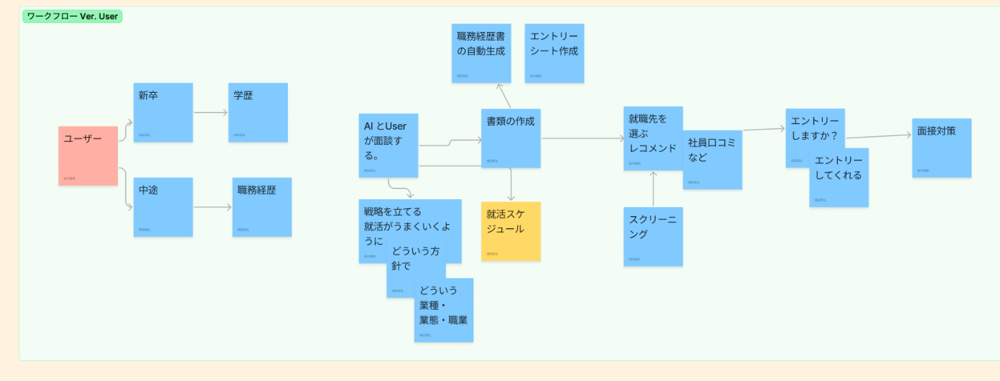
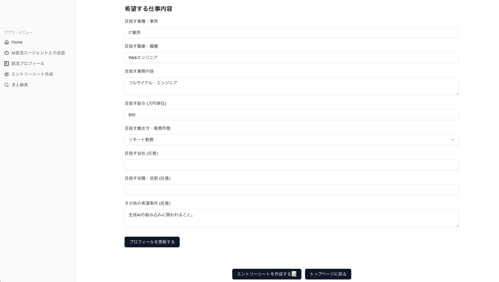
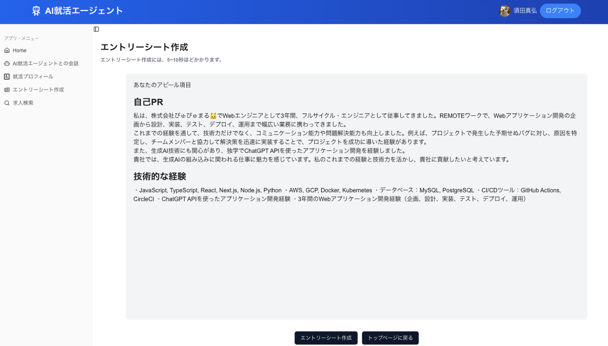
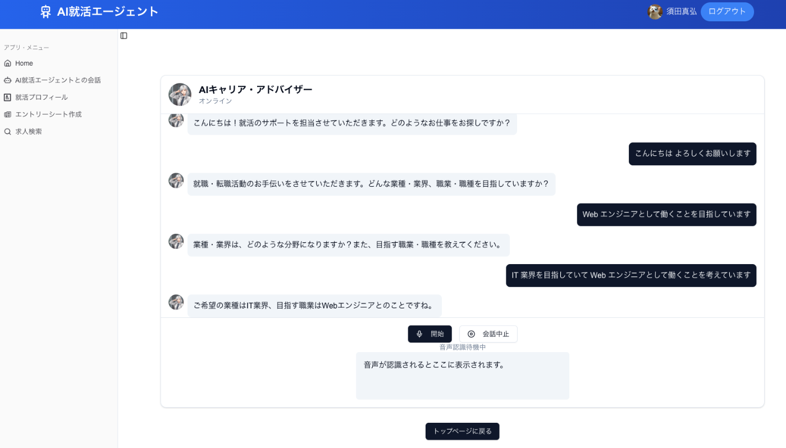
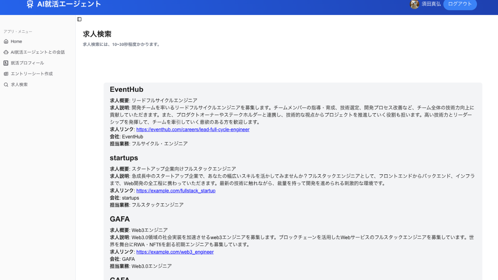
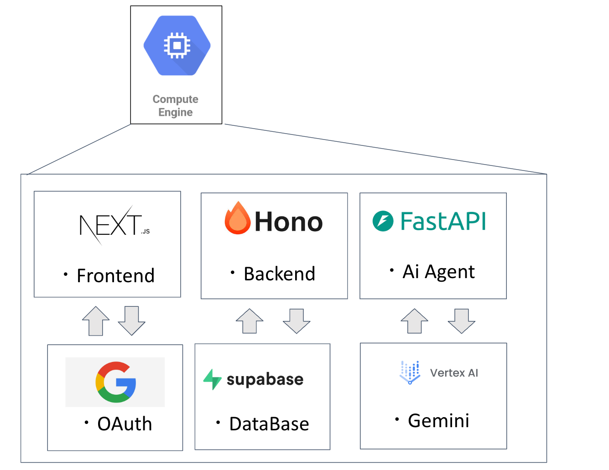

こんにちは、Webエンジニアのまさぴょんです！  
今回、[AI Agent Hackathon with Google Cloud](https://zenn.dev/hackathons/2024-google-cloud-japan-ai-hackathon)に参加して、  
就活・転職のサポートをしてくれるAI Agentを開発しましたので、ご紹介します🐱

<https://zenn.dev/hackathons/2024-google-cloud-japan-ai-hackathon>

##  ハッカソンのテーマは「生成AI」

[AI Agent Hackathon with Google Cloud](https://zenn.dev/hackathons/2024-google-cloud-japan-ai-hackathon)という名前から想像できるとおり、  
**テーマは「生成AI」** のハッカソンになります📝

また、開発プロジェクト条件として、

  1. Google Cloud のAIプロダクトのうち、少なくとも1つを使用
  2. Google Cloudコンピュート プロダクトのうち、少なくとも1つを使用

との条件があったので、そこも考慮しながら開発を進めました💪

##  「生成AI」で「就活・転職」の課題を解決する！

チームでブレストした結果、転職活動中のメンバーがいたり、私自身公務員からエンジニアに転職する際に苦労した経験などから、**時間のかかる就活・転職活動をAI Agentの力で自動化すること！**  
を開発テーマとして決めました！

!

###  「就活・転職」は時間がかかる！

  1. どういった方針で就活・転職活動すればいいのかなど、考えるのに時間がかかる。
  2. エントリーシート, 職務経歴書など書類作成に時間がかかる。
  3. 自分にマッチした求人を探すのに時間がかかる。

###  就活・転職者の課題を解決する機能の考案🤔

そして、テーマを軸に議論した結果、次のような機能を提供するような **「AI就活エージェント」** を考案しました🤔

  1. AI就活エージェントとユーザーが音声会話できる機能 
     * **できれば、WebSocket or WebRTCを使ったリアルタイムな音声会話**
  2. 就活戦略の立案, 就活スケジュールの作成機能
  3. 職務経歴書やエントリーシートの自動生成機能
  4. 就職先のレコメンド・求人を検索する機能 
     * ブラック度調査, 社員口コミ・チェックなどのスクリーニングも自動化したい！
  5. 面接練習機能

!

主に「就活・転職者」にとって、手間が多い作業をAIで自動化することを主眼におきました📝  
また、AIならではの相談・壁打ちや、面接練習相手になってほしいなどの需要もありそうなどと考えました。

画像は、MTG中にUser視点でのワークフローを整理したもの📝  

###  今回実現できた機能と、AI Agent

今回のハッカソンでは次の3つの機能と、そのAI Agentの開発まで進めることができました🙌

  1. **AI就活エージェントとユーザーが音声会話できる機能(会話AI Agent)**
     * 「SpeechToText -> LLMによる文章回答 -> TextToSpeech」の処理フローで実装
     * WebSocketを使ったリアルタイムな音声会話は実装で苦戦して見送り😭
  2. **エントリーシートを自動生成する機能(エントリーシート作成AI Agent)**
  3. **求人検索機能(求人検索AI Agent)**

!

###  AI活用の目的📝

  * 就活・転職活動の質の向上と工数(時間)削減が目的

##  『AI就活エージェント』のプロダクト紹介デモ動画

サービスの実際の動作をご覧いただくために、デモ動画を用意しました。以下のリンクからご覧ください👀✨

<https://youtu.be/5tg2Gb9gZ2k>

##  本番環境URL📝

<https://aisupporter.jobcon.info/>

!

SideBarのページ移動の挙動などはBugがありますが、それ以外は動きます🙏

##  『AI就活エージェント』の使い方

『AI就活エージェント』の使い方はシンプルで、  
**1\. GoogleLoginする。**  
**2\. 就活プロフィールを入力する。**

までしたら、

  * 求人検索機能
  * エントリーシート作成機能
  * AI就活エージェントとの会話機能

のどの機能でも使ってもらって構いません🙆‍♂️

!

就活プロフィールを入力しなくても他の機能は使えますが、LLMによる判定の精度が落ちてしまいます🙏

###  Topページ

Topページでは、 『AI就活エージェント』の可愛いお姉さんが微笑んでいます🥺

###  就活プロフィール入力ページ

就活プロフィール情報の入力ページでは、

  1. 現在の仕事内容
  2. 希望する仕事内容

について入力して、登録することができます。

!

入力された就活プロフィール情報は、  
AI就活エージェントとの会話, エントリーシート作成, 求人検索の3つで使われる情報になります📝

###  エントリーシート作成ページ

エントリーシート作成の実行ボタンを押すと、ユーザーのプロフィール情報をもとに、  
エントリーシートが自動生成されます📝

###  AI就活エージェントとの会話ページ

AI就活エージェントとは、音声入力で会話することができます📝  
ここは、「SpeechToText -> LLMによる文章回答 -> TextToSpeech」の処理フローで実装しました。

ちなみに、SpeechToTextはWeb標準の`SpeechRecognition`APIを使用しています！  
<https://developer.mozilla.org/ja/docs/Web/API/SpeechRecognition>

また、TextToSpeechには、VoiceVoxを利用しています！  
<https://github.com/VOICEVOX>

###  求人検索ページ

求人検索🔍ボタンを押すと、ユーザーのプロフィール情報をもとに、求人検索をすることができます！

##  参加メンバーと役割分担

今回は、次のような3人チームで挑みました💪🥺🔥

  1. 私：ハッカソン好きなWebエンジニア
  2. Nさん：AI周りが得意なデータサイエンティスト
  3. Mさん：FastAPI実装が得意なPython使い💪

###  役割分担📝

それぞれの経験を活かして、次のような役割分担をしました。

!

チーム・リーダー： 私  
FrontEnd：私  
BackEnd： Mさんと、私  
AI Agent：Nさんと、私  
Infra：Nさん

##  アーキテクチャと技術選定について

今回のプロダクトのアーキテクチャは、次のような構成になります👀

###  開発に使用した技術📝

開発に使用した技術は、以下のとおりです👀🌟

!

  * FE 
    * 言語：TypeScript
    * Framework：Next.js,React
    * CSS・UI周り：TailwindCSS, shadcn/ui
    * Form周り：zod, react-hook-form
    * State管理：zustand
    * Markdown表示：react-markdown, emark-gfm
  * API 
    * Hono: System全体のAPIであり、会話AIエージェントとのAPI 
      * 言語：TypeScript
      * ORM：Prisma
    * FastAPI: 求人検索, エントリーシート生成AI AgentのAPI 
      * 言語：Python
    * VOICEVOX: 会話AIエージェントからの回答文章の読み上げ(音声合成)API
  * 生成AI(LLM)系 
    * Vertex AI: 求人検索とエントリーシート作成AI AgentのLogicで使用。
    * Gemini & LangChain.js: 会話AI AgentのLogicで使用。
  * Auth 
    * Google OAuth ✖️ Supabase
  * DB 
    * Supabase(PostgreSQL)
  * Infra 
    * Google Compute Engine
    * Docker

###  GitHub Repository

<https://github.com/yukimura-manase/ai-employment-agent>

##  【まとめ】 ハッカソンを通しての学び・感想

最後に、3人のハッカソンを通しての学び・感想について記載します📝

###  私の参加してみての学び・感想

期間内に3つのAI Agentを搭載したプロダクトをリリースできてよかったです🎉  
ただ、プロダクトとしての改善点は多いため、その点を改修して世に出していけたらと思いました💪

また、AIとの会話の部分にWebSocketを使ったリアルタイムな音声会話を実装しようとしていましたが、Error解決などが難航したため断念しました、、、悔しかったです😭  
ただ、提出期限に間に合わせるには必要な決断だと思いました！

###  Nさんの参加してみての学び・感想

今回Gemini in VertexAIを使用して  
1)求人検索  
2)エントリーシート作成  
のAIエージェントを作成しましたが、高機能で実装が直感的に行えたのがとても印象的でした。

今回はGoogle検索をグラウンディングとして使用していますが、求人やそのURLまで取得することができており、LLMと検索を組み合わせることの価値が計り知れないと思いました。

またテキストを使用したチャットだけでなく、音声対話まで実装することによって、気軽に相談できるコンサルタントができたと思います。

###  Mさんの参加してみての学び・感想

本来なら会話履歴をすべて参照して、検索のカギとなるキーワードを何らかのロジックで抜粋し、リクエストに必要なフィールドは…、とAPI自体をソリッドに作らないと望んだ結果が得られなかったものに対しても、サマリーしておいた会話履歴をinputとして引っ張り出してくるだけで機能させられます。

さらにoutputを新たなサマリーにしてしまえばコンテキストも肥大化しません。  
outputのシンプルさや正確性も何よりですが、inputが非常にシンプルなAPIで済んでしまうことにLLMの強みを感じました。

##  参考・引用

<https://zenn.dev/hackathons/2024-google-cloud-japan-ai-hackathon>

<https://developer.mozilla.org/ja/docs/Web/API/SpeechRecognition>
