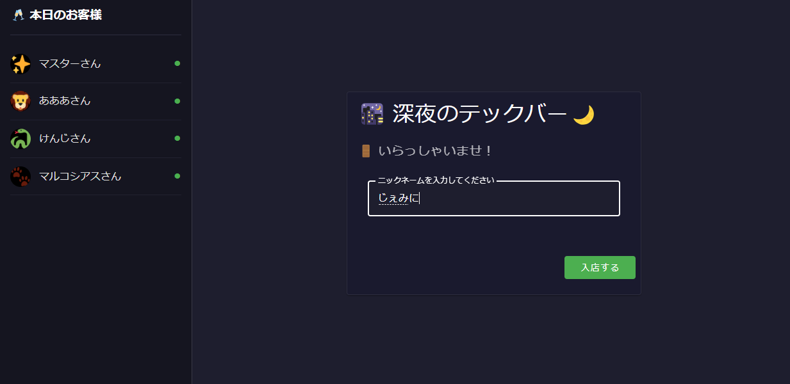

#  1\. はじめに

  
fig. 動物アバターで匿名チャット

**最近、本音で喋れていますか？**  
会社や学校などの社会や、近年はインターネットにおけるコミュニケーションですら、人間関係の煩わしさや実名性による制約などから気軽な会話が難しくなっていないでしょうか。

本プロジェクトでは、「深夜のテックバー」という仮想空間を通じて、以下のようなコンセプトでシステム開発を行いました

  * AI バーテンダーが会話を自然にファシリテート
  * 匿名で気軽に立ち寄れる交流スペース 
    * 今回はあくまでひとつのルームとして、「深夜のテックバー」という技術者の交流スペースを立ち上げる
  * 参加している間しか見られないチャット履歴でプレミア感を演出
  * 過去会話は AI バーテンダー経由でしか聞き出せない 
    * PostgresSQL Vector Search による過去の会話の自然な引用
    * あまり精度良く思い出せないのも人間らしくて良いよね

[AI Agent Hackathon with Google Cloud](https://zenn.dev/hackathons/2024-google-cloud-japan-ai-hackathon)への応募記事です！

#  2\. デモ

##  2.1 実際のアプリ

~~Cloud Run URL にアクセスすると試せます。  
ニックネーム入力で良いのでお気軽に！  
無料クレジットがたっぷりあるのでしばらく公開しています。~~ 公開終了しました。  
  
fig. 外観

##  2.2 動画

ブラウザを 4 画面開き、バーのマスターを含めた複数人チャットができるアプリであることを示しています。  
<https://youtu.be/GEXL9g_y5Vg>

#  3\. システム概要

##  3.1 基本設計方針

  1. シンプルなアーキテクチャ

     * フロントエンド（Vue.js）とバックエンド（FastAPI）の統合
     * 単一コンテナでのデプロイで CORS エラー回避
     * WebSocket による複数人リアルタイム通信
  2. 軽量なセッション管理

     * セッション ID のみによる匿名性の確保
     * 15 分の無活動タイムアウト
  3. 自然な会話の実現

     * Google Gemini API による応答生成
     * PostgreSQL の pg_vector 機能による関連会話検索
     * バーテンダーの適切な介入制御
  4. 親しみやすい UI

     * LINE のような一般的なチャットアプリを踏襲
     * Vue によるレスポンシブデザイン
     * 動物アバターによる親しみやすい雰囲気の演出 
       * ユーザー名をシード値として一意のアイコンを生成

##  3.2 技術スタック

  1. フロントエンド

     * Vue.js 3
     * Vuetify 3
     * vue-advanced-chat
     * WebSocket
  2. バックエンド

     * FastAPI
     * PostgreSQL + pg_vector
     * Google Cloud Gemini API
  3. インフラ

     * Google Cloud 
       * Cloud Run
       * Cloud SQL
     * Terraform

##  4.3 主要な機能

詳しくはリポジトリをご確認ください。  
[深夜のテックバー リポジトリ](https://github.com/marcosanyo/techbar)

###  4.3.1 会話制御

AI バーテンダーは単なる質問応答ボットではありません。店内の状況に応じて以下のような振る舞いを行います

**ポイント**

  * 直近の複数人分の会話をいくつか含めて入力する
  * ベクトル検索で抽出された過去の関連しそうな話題も含める

    
    
    def construct_prompt(current_message: str, display_name: str, context: dict) -> str:
        prompt = f"""
        あなたは'深夜のテックバー'のベテランバーテンダー（マスター）として振る舞ってください。
        技術者たちが仕事帰りに立ち寄る、アットホームな雰囲気のバーです。
        お酒ではなく、技術の話題を提供するバーテンダーです。
    
        現在の状況:
        - 店内のお客様: {', '.join(f'{user}さん' for user in context['current_users'])}
        - 店内の雰囲気: {'quiet' if len(context['current_users']) <= 2 else 'lively'}
        - 発言したお客様: {display_name}さん
    
        以下の方針で接客してください:
        1. フレンドリーな口調で、でも礼儀正しく
        2. 他のお客様がいる場合は、全体の会話の流れを意識
        3. 技術の話題については詳しく、でも堅苦しくならないように
        4. 簡潔に返答
        5. 過去の会話に関連する内容があれば、自然な形で会話に織り交ぜる
    
        {context.get('similar_context', '')}
    
        そのまま返信になるので、括弧「」は不要です。
        盛り上がっていたり、口を出すべきでないと判断したら '...' のみを返答してください。
    
        直近の会話:
        {chr(10).join(context['recent_messages'])}
        """
    
        logger.debug(f"Generated prompt: {prompt}")
        return prompt
    

###  4.3.2. Vector Search による関連会話検索

PostgreSQL の pg_vector 拡張を使用して、以下のような会話の類似性検索を実現しています
    
    
    WITH similarity_scores AS (
        SELECT
            cs.id,
            cs.session_key,
            cs.display_name,
            cs.combined_content,
            cs.created_at,
            cs.metadata,
            1 - (cs.embedding <=> %s::vector) as similarity_score
        FROM chat_sessions cs
        WHERE cs.embedding IS NOT NULL
        AND cs.is_active = true
        AND (%s::uuid IS NULL OR cs.id != %s::uuid)
    )
    SELECT *
    FROM similarity_scores
    WHERE similarity_score >= %s
    ORDER BY similarity_score DESC
    LIMIT %s
    

###  4.3.2. 数人リアルタイムチャット

FastAPI の WebSocket エンドポイントを使用して、以下のような双方向通信を実現：
    
    
    @app.websocket("/ws/{session_key}")
    async def websocket_endpoint(websocket: WebSocket, session_key: str):
        await websocket.accept()
        connected_users[session_key] = websocket
    
        try:
            while True:
                data = await websocket.receive_text()
                message = json.loads(data)
                await handle_websocket_message(message)
        except Exception as e:
            logger.error(f"WebSocket error: {e}")
        finally:
            del connected_users[session_key]
    

#  5\. アーキテクチャ

##  5.1 システム構成

##  5.2 インフラ構成

##  5.3 データフロー

  1. メッセージ送信時

     * クライアントからのメッセージを WebSocket で受信
     * Gemini API で類似度検索に使うベクトルを生成し、PostgreSQL に保存
     * 関連する過去の会話を Vector Search で検索
     * 関連会話のコンテキストを考慮して Gemini API で応答生成
     * クライアントに応答を返信
  2. セッション管理

     * クライアント接続時にセッションを作成
     * WebSocket で在店者をリアルタイム管理
     * 15 分の無活動でセッションを自動終了

#  6\. 今後の展望

##  6.1 機能拡張の方向性

  1. テーマ別ルームの実装

     * 技術以外のテーマ（趣味、キャリアなど）
     * プライベートルームの作成機能
     * 定期的なイベントルーム
  2. コミュニティ機能の強化

     * 常連システムの導入
     * テーマナイトの開催
     * バーテンダーの個性カスタマイズ
  3. UI/UX の改善

     * 会話の可視化機能
     * より豊かな表現手段の提供

##  6.2 技術的な改善

  1. パフォーマンス最適化

     * Vector Search のチューニング
     * キャッシュ戦略の導入
     * WebSocket 接続の安定性向上
  2. スケーラビリティ対応

     * マイクロサービス化の検討
     * 負荷分散の実装
     * データベースのシャーディング
  3. セキュリティ強化

     * メッセージの暗号化
     * レート制限の実装
     * 不適切な発言の検出

#  7\. まとめ

本プロジェクトでは、Google Cloud Platform のサービスとオープンソースのライブラリを組み合わせることで、シンプルながら拡張性のある匿名チャットシステムを実現しました。特に以下の点において、当初の目標を達成することができました：

  1. シンプルな実装

     * 単一コンテナでの運用
     * WebSocket による効率的な通信
     * 最小限のデータベース設計
  2. 自然な会話の実現

     * Gemini API による応答生成
     * Vector Search による関連会話の検索
     * バーテンダーの適切な介入制御
  3. 匿名性の確保

     * ニックネーム
     * 一時的な会話履歴

今後は、コミュニティ機能の強化やテーマ別ルームの実装を通じて、より多様な交流の場を提供していく予定です。

#  8\. 感想

  * ひとまず動くものが作れて達成感！
  * だけどめちゃくちゃ大変だった・・・ 
    * アイディアがあっても限られた時間でモノを開発するのは非常に難しい
  * フロントエンドで特に悩んだ時間が長かった 
    * 勉強になるしあまり経験ない React でいってみよう！
    * Chainlit いいじゃん！ 
      * 拡張性があまりなくて色々実現できない・・・
    * やっぱ Streamlit が便利だな！ 
      * 複数人のセッション共有ができないからリアルタイムチャットには向いていない・・・
    * もう時間ないし慣れている Vue で行こう！
  * あれもやりたいこれもやりたい、を入れきれなかったのが無念
  * とは言え、GoogleCloud についての知見が非常に深まった 
    * Cloud Run のシンプル差には感動
    * Gemini はひとまず長いプロンプトを突っ込んでも早く精度良く返してくれて優秀
    * 会社では AWS が標準だが、GoogleCloud も併用していきたい

