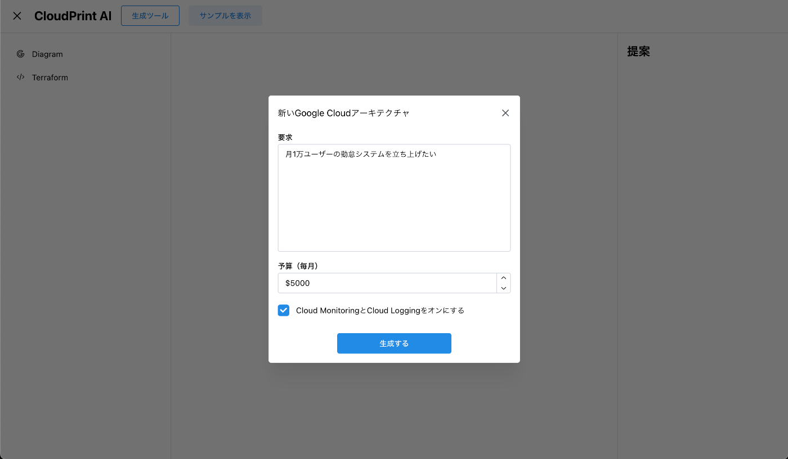
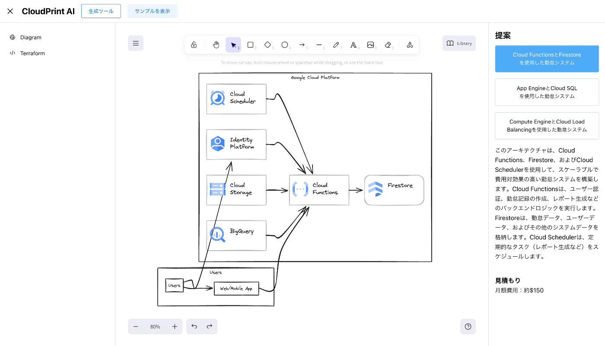
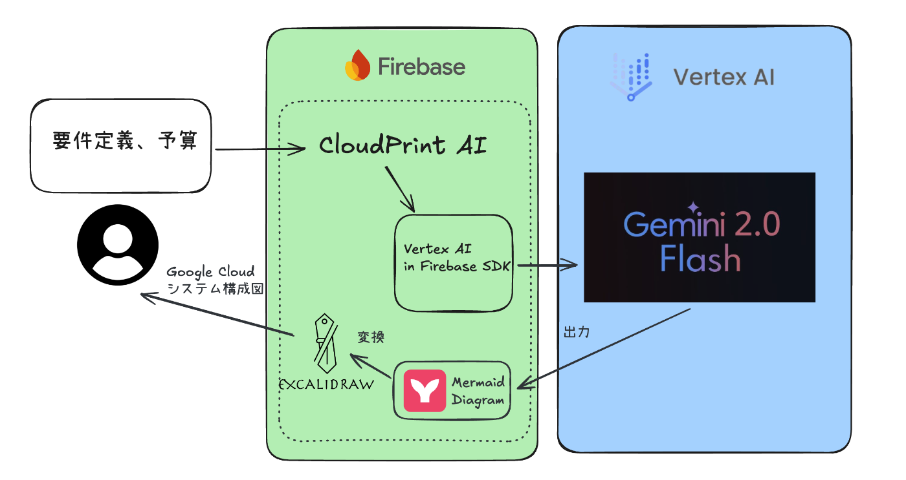
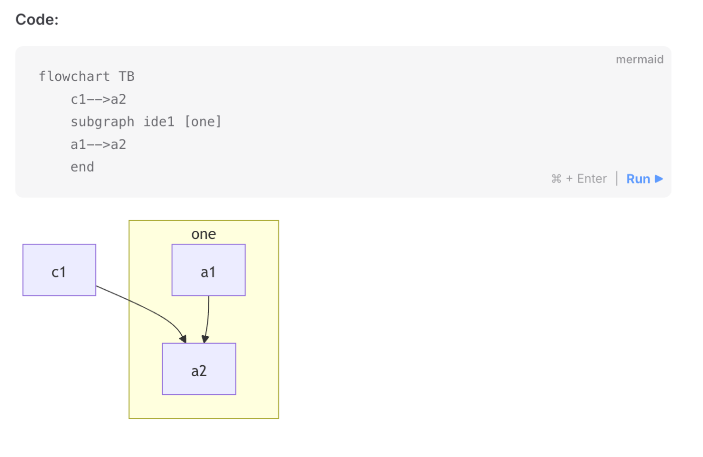
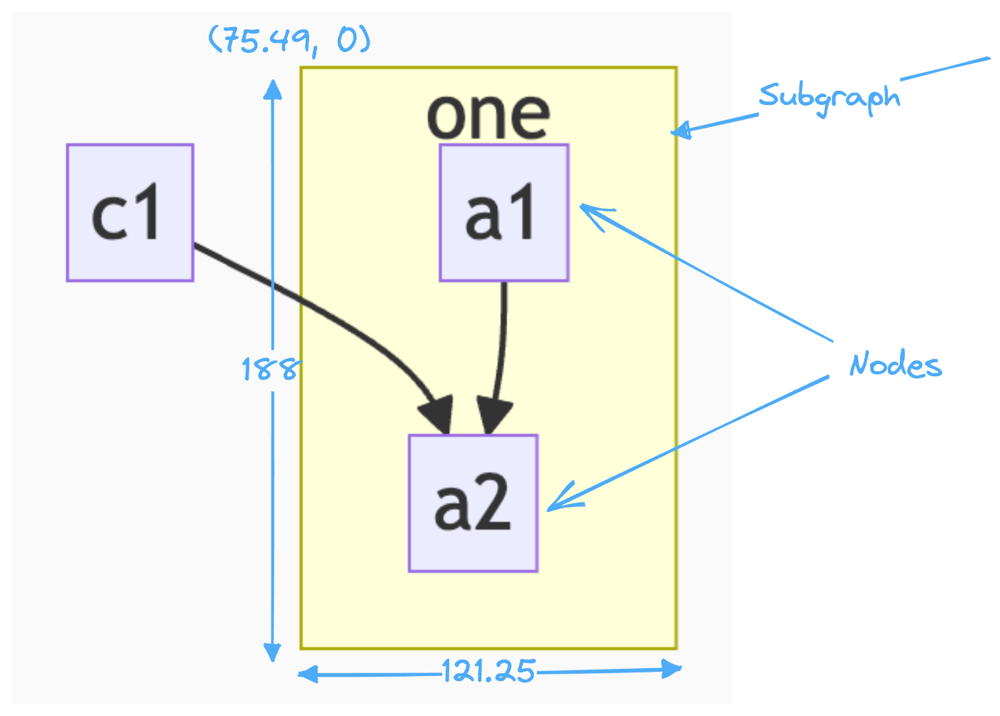

こちらの記事は[AI Agent Hackathon with Google Cloud](https://zenn.dev/hackathons/2024-google-cloud-japan-ai-hackathon)への応募記事です。

#  Cloud Print AI

Cloud Print AIとは、Google Cloudアーキテクチャ図を描いてもらう製図ツールです。

たった一行の要件を入力するだけで、美しいアーキテクチャ図を生成し、さらに推定運用コストやGoogle Cloudへのデプロイ用のサンプルTerraformコードも自動生成してもらいます。

  
_要求と予算を入力する_

  
_要件定義に沿ったアーキテクチャ図が生成してもらう_

  
_生成したTerraformコード_

##  デモ動画

<https://youtu.be/9f_dZm7CHs4>

#  課題

AWSよりGoogle Cloudの利用者が圧倒的に少ないため、Google Cloudの環境でシステムを構築する情報が少ないし、同僚に聞いてもわららない場合がよくあります。

日本では、自社で十分な数のエンジニアを雇用していない場合が多く、ある程度の規模のシステムを開発したくなった場合にいわゆるSIerと請負契約を結び、外注するケースが後をたたない。

請負契約を結ぶためには、構築するシステムがどのようなものかを明確に定義づけした上でイニシャルコストやランニングコストの見積もりが行われ、そこから顧客が費用対効果を勘案し、発注して初めてシステムが構築されます。

そのため、SIerは限られた時間で要件を整理し、そこから導き出されるシステムの全体像を把握する必要がありますが、経験がないと難しくそれなりの学習コストがかかります。

事前に全体像を把握する必要があるもののそれには経験が必要という、鶏が先か卵が先かという話になってしまい、Google Cloudの利用や普及がAWSに比べ進まない一因となっていることが推察される。  
PoC(Proof of Concept)やPoV(Proof of Value)などであれば、スモールスタートができるクラウドのメリットを活かし一定期間の委任契約を結んだ上で探索的アプローチを取るケースもありますが、以前根強い請負契約での利用にこぎつけるためには上述の課題を解決する必要があります。

#  システムアーキテクチャ

今回は、ごくシンプルなアーキテクチャを採用しています。フロントエンドはReactとViteで構築し、Firebase Hosting上にデプロイしています。ユーザーがシステム要件と予算を入力すると、ReactアプリはFirebase SDKのVertex AIを使用して、Vertex AIのGemini 2.0 Flashモデルにテキストプロンプトを送信します。

モデルには、Mermaid形式（テキスト）のダイアグラム、Terraformコード、推定運用コストを生成するようリクエストします。

その後、MermaidコードをExcalidraw形式に変換し、グラフとして表示します。こうすることで、ユーザーはExcalidrawを使って図をさらに編集できるようになります。

  
_Cloud Print AIのシステムアーキテクチャ_

#  ソリューション

利用しているツールは以下です。

  * [Excalidraw](https://github.com/excalidraw/excalidraw)
  * [Mermaid-to-Excalidraw](https://github.com/excalidraw/mermaid-to-excalidraw)
  * [Firebase](https://firebase.google.com/)
  * Vite, React, TypeScript

###  Vertex AI in Firebase SDK

####  プロンプト手法

プロンプトエンジニアリングでは、出力フォーマットを指定する際に、テキストとしてプロンプト内にフォーマットを記述する場合が多いです。しかし、これにより入力トークンが増えるし、LLMの出力が不安定になりやすいという問題があります。

Vertex AIでGeminiを使用する場合、出力のJSONスキーマを定義することで、一貫したフォーマットの出力を得ることができます。さらに、不要なテキストがモデルから返されないため、出力トークン数の削減にもつながります。
    
    
    const jsonSchema = Schema.object({
      properties: {
        proposals: Schema.array({
          items: Schema.object({
            properties: {
              title: Schema.string(),
              description: Schema.string(),
              diagram: Schema.string(),
              terraform: Schema.string(),
              runningCost: Schema.string(),
            },
          }),
        }),
      },
    });
    
    const model = getGenerativeModel(vertexAI, {
      model: "gemini-2.0-flash-001",
      generationConfig: {
        responseMimeType: "application/json",
        responseSchema: jsonSchema,
      },
    });
    

###  Mermaid to Excalidraw

Mermaidは、Markdown風のテキスト定義をグラフに変換できるオープンソースのグラフ作成ツールです。AIモデルにMermaid形式でグラフを生成させることで、幅、高さ、座標などの視覚的な要素を先に除いて、まずは要素と要素の関係性を生成します。

  
_[Mermaid形式](https://mermaid.js.org/syntax/flowchart.html#subgraphs)_

Mermaidのダイアグラムを取得した後、コミュニティツールの[Mermaid-to-Excalidraw](https://github.com/excalidraw/mermaid-to-excalidraw)を使用して、必要なExcalidrawコンポーネントを生成します。

このツールは、幾何学的アルゴリズムを用いて座標、高さ、幅、フォントサイズなどを計算し、綺麗なダイアグラムを作成できます。

  
_[座標を計算するアルゴリズム](https://docs.excalidraw.com/docs/@excalidraw/mermaid-to-excalidraw/codebase/parser/flowchart)_

Google Cloudのサービスアイコン（SVG）をアーキテクチャ図にマッピングするのは、単純にサービスコンポーネントのテキストをSVGに置き換えると、テキストコンテナに収まりきらないため、見た目がゴチャゴチャになります。

この問題を解決するために、ちょっと工夫しました。まずは、Mermaidテキストグラフ内のサービス名に追加のテキストや改行を挿入しました。その後、Mermaid-to-Excalidrawツールを使用して、大きくなったテキストグラフのサイズと座標を計算してもらいます。最後に、返したグラフデータからテキストラベルを削除し、その座標にSVGコンポーネントを配置してExcalidrawでレンダリングにしました。また、コンテナはRectangle、Ellipsis、Diamondなど何種類もあるので、各種類の座標も用意しないといけないです。

##  文献

  * [Vertex AI Firebase](https://developer.android.com/ai/vertex-ai-firebase)
  * [アーキテクチャ図だけ描いてTerraformはGoogle Cloud Developer Cheat Sheetに書いてもらおう](https://zenn.dev/cloud_ace/articles/developer_cheatsheet)
  * [Mermaid Flowcharts - Basic Syntax](https://mermaid.js.org/syntax/flowchart.html#subgraphs)
  * [Mermaid-to-Excalidraw Flowchart Parser](https://docs.excalidraw.com/docs/@excalidraw/mermaid-to-excalidraw/codebase/parser/flowchart)

