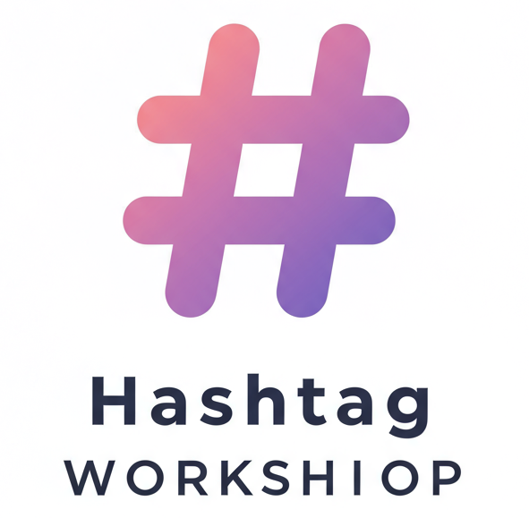
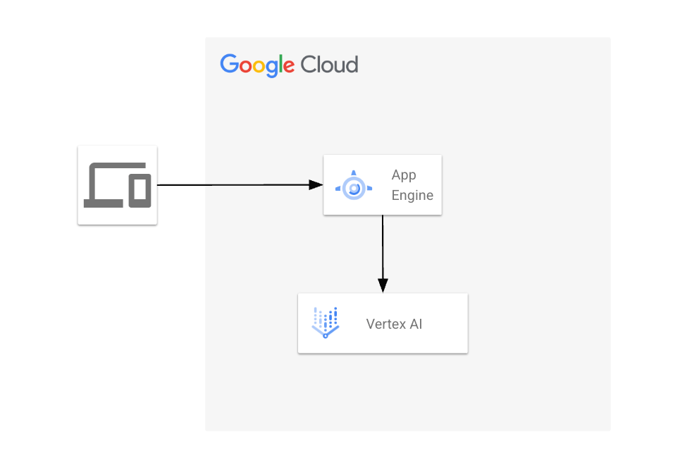
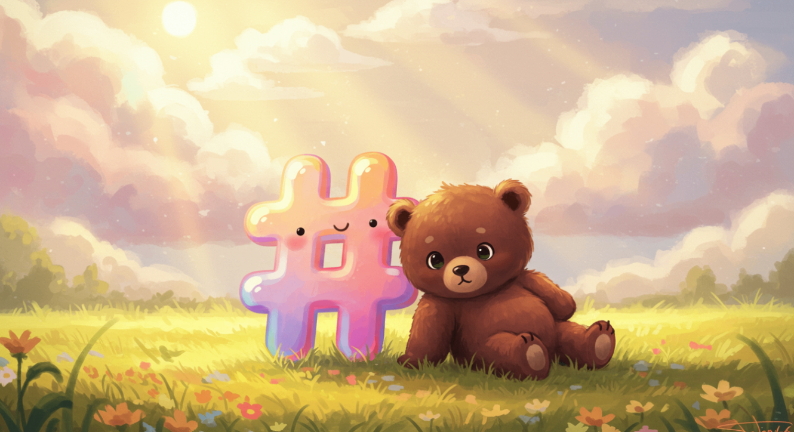

この記事は、[AI Agent Hackathon with Google Cloud](https://zenn.dev/hackathons/2024-google-cloud-japan-ai-hackathon)の提出用です。

#  はっしゅたぐ工房

SNSの存在が欠かせない今日。写真を撮ってSNS投稿する機会が増えてきました。  
せっかくならハッシュタグをつけて共有したいですよね？  
そんなときに、はっしゅたぐ工房で気軽にハッシュタグをつくりましょう。

##  思い

最近SNSに画像を頻繁に投稿しているのですが、ハッシュタグを必ずつけるようにしています。ハッシュタグをつけることで、世界中の人に知ってもらい、つながりをつくるきっかけになるからです。しかし、、投稿時にハッシュタグをつける作業が地味に面倒だなと感じることが多々あります。そこで、今回はっしゅたぐ工房の立ち上げに至りました。  
SNSはもはや国境を超えたコミュニケーションツールであり、投稿が一瞬で世界へと広がる時代です。「はっしゅたぐ工房」を通じて、誰もが簡単ににハッシュタグを選び、簡単に自分の思いを発信できる世界をつくることを目指しています。

##  機能

  * ✅画像をアップロードして、ワンタップでハッシュタグ作成
  * ✅投稿内容に合ったハッシュタグを自動提案
  * ✅英語・日本語対応で、海外向けの投稿もスムーズに
  * ✅ワンクリックで作成したハッシュタグをコピーし、投稿に貼り付け可能

##  使い方は簡単 5 Step

  1. 投稿したい画像をアップロード
  2. オプション選択(個数,言語,キャラクター)
  3. つくるボタンをタップ
  4. リストアップされたハッシュタグをボタンをタップしてコピー
  5. そのままSNSの投稿画面に貼り付けて、投稿！

<https://www.youtube.com/watch?v=9fSUtG447ds>

##  特徴

「はっしゅたぐ工房」は、ただのハッシュタグ生成ツールではありません！  
あなたの 好み・目的 に合わせて、ハッシュタグをカスタマイズできるのが最大の特徴です。

  * 🧸キャラクターを選んで、投稿の雰囲気を演出できます！  
どんな雰囲気の投稿にしたいかに合わせて、2つのキャラクターから選べます。

    * ✨キラキラ女子モード  
→ トレンド感満載！おしゃれで映えるハッシュタグを提案します  
例： #今日のコーデ #カフェ巡り #推し活

    * 🌱丁寧な暮らしモード  
→ 落ち着いたライフスタイル系のハッシュタグを提案します  
例： #暮らしを楽しむ #シンプルな暮らし #おうち時間

  * 🧸言語選択ができます！  
日本語・英語のハッシュタグを自由に選択可能です。英語話者は世界に10億人以上いると言われており、英語ハッシュタグを活用することで、より広い層に投稿を届けることができます。「日本向け」「海外向け」どちらのスタイルにも対応できるので、発信の幅がグッと広がります！

  * 🧸気に入らないハッシュタグは除外できます！  
自動生成されたハッシュタグの中から、気に入らないものをワンタップで除外できます！  
「このタグはいらないな…」と思ったら、削除するだけで、より理想に近いハッシュタグリストを作成可能です。

##  プロジェクトが対象とするユーザー像

はっしゅたぐ工房は、画像をSNSに投稿をする全ての人を対象としていますが、特に以下のようなユーザーを対象としています。

  * 日常的に画像を投稿する一般ユーザー 
    * 旅行や日常を切り取った写真を周りの人達に気軽に共有したい
    * 同じ趣味嗜好の人達と繋がりたい
    * 自分のなりたい雰囲気のハッシュタグをつけたい
  * 企業のSNS運用担当者、クリエイター 
    * 高頻度で画像をハッシュタグ付きで投稿したい
    * 日本から世界に向けて発信したい

##  背景にある課題

ユーザー様の背景にはこのような課題があると考えています。

  * 適切なハッシュタグは何かと悩む
  * ハッシュタグをたくさんつけたいが、入力に手間がある
  * 世界に発信したいが、英語がわからない

##  課題へのソリューション

はっしゅたぐ工房は、以下のソリューションを提供します。

  * 画像をアップロードするだけで最適なハッシュタグを提案します
  * キャラクターを選んで自分のなりたい雰囲気のハッシュタグを提案します
  * 提案されたハッシュタグをそのままコピペして投稿に使えるようにします
  * 多言語対応で海外向け投稿を円滑にします

##  システム アーキテクチャ図

###  App Engine

ハッカソンの開発プロジェクト条件を満たすために、今回始めて利用しました。Nuxt3で開発し、ビルドしたものを、静的ウェブサイトとしてホスティングしています。  
ローカル環境でdockerコンテナを利用していたので、コンテナイメージをそのままデプロイできる、Cloud Runと迷いましたが、今回は複雑なアプリではなくSSRでの処理などが必要なかったので、料金的にも作業的にも手軽に使えるApp Engineを使いました。

<https://cloud.google.com/appengine/docs/standard/hosting-a-static-website?hl=ja>

###  Vertex AI Gemini API

画像をもとにハッシュタグを作成させる部分の生成AIの処理で利用しました。当初Firebase Hostingを利用していたので、Vertex AI in Firebase (Gemini API)のSDKを利用しました。Vertex AI SDKの方が機能性は高いようなので、そちらを使っても良かったなと思っています。。  
モデルは、`gemini-1.5-flash-002`を利用しました。テキストだけではなく、画像をプロンプトとして入力できる点や、レスポンスをJSON構造で返せる点が良かったです。

<https://firebase.google.com/docs/vertex-ai?hl=ja>

###  プロンプト

以下がプロンプトになります。
    
    
    let setting = "";
    if(this.selectedCharacter?.length > 0) {
    const characterTextMap = {
      pokopoko: "20代女性、一人暮らし、彼氏持ち、女性らしい服を着る、自分の容姿やポジションをよく魅せたい人です。",
      teinei: "30代女性、既婚、毎日自炊をする、麻やリネンの服を着る、アロマオイルとか使いがちで、自分の生活が素敵だと魅せたい人です。",
    };
    setting = `あなたは${characterTextMap[this.selectedCharacter]}です。`;
    } else {
    setting = `あなたはSNS名人です。`;
    }
    
    let prompt = `
    ${setting}この${this.description}の画像の内容(テキスト、人物、風景、物)、
    SNS投稿時のハッシュタグ候補を${this.selectedQuantity}個出してください。 \
    <ルール> \
    - 次に示す言語で作成してください: ${this.selectedLanguages} \
    - # は含めないでください \
    - 年齢や性別は特定できないように \
    - 奇想天外な候補を1個以上含める \
    </ルール>`;
    

##  改善点

  * 手書きイラストへの対応  
一般的な風景や人物、物の写真であれば、AIでどのような内容の画像なのかを判別できましたが、手描きイラストでは困難でした。手書きのため、画風による影響があり、正確になんの画像化判別できません。ユーザーが手書きしたイラストと何を書いたのかの情報を学習させて、ユーザーの画風を加味して画像判別ができるようにしていきたいと思います。

  * 多言語対応  
当初韓国語も対応したいと考えていましたが、作成されたハッシュタグの整合性を確認する手間があり、諦めてしまいました。今後複数言語対応も考えていきます。

  * 人気のハッシュタグを優先するロジック  
すでに多くの人が使っており、インプレッションを集めることができるハッシュタグを優先するロジックが必要と考えています。X(旧Twitter)やInstagramのAPIを利用することも考えましたが、有料だったり、用途に合ったAPIが見つからなかったので、今回は断念しました。別の方法で実装できるよう考えていきたいです。

##  おわりに

今回のハッカソンを通して、自分が課題に感じていた問題を解決する一歩を踏み出せたと思っています。個人的にどんどん利用して、改善点を見つけて改善を続け、より利用しやすいサービスにしていきたいです。  
今まで生成AIやGoogle Cloudを利用したことがなかったので、特性を理解する良い機会になりました。今後も利用したいと思います。

##  リンク

###  コードリポジトリ

  * コードリポジトリ: <https://github.com/michan74/koduck>
  * YouTube: <https://www.youtube.com/shorts/9fSUtG447ds>

